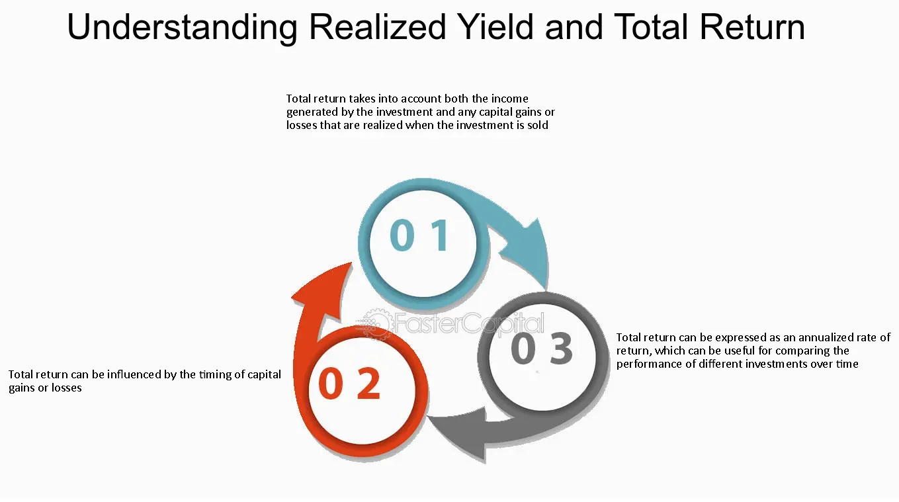

## Table of Contents

## What is yield in the context of investments?

Yield in the context of investments refers to the earnings generated and realized on an investment over a particular period of time. It is usually expressed as a percentage based on the investment's cost, current market value, or face value. Yield is a key measure for investors because it helps them understand the return they can expect from their investment, making it easier to compare different investment options.

For example, if you buy a bond for $1,000 that pays $50 in interest annually, the yield would be 5%. This percentage helps you see how much income the bond generates relative to its cost. Different types of investments, like stocks, bonds, and real estate, can have different ways of calculating yield, but the basic idea is the same: it's about measuring the income or profit an investment produces.

## What is total return and how is it calculated?

Total return is a way to measure how well an investment has done over time. It looks at all the money you've made from the investment, including any interest, dividends, and the increase in the investment's value. If you buy a stock for $100 and it goes up to $110, plus you get $5 in dividends, your total return would be the $10 increase in value plus the $5 dividend, which equals $15.

To calculate total return, you start with the investment's current value and add any income it has generated, like interest or dividends. Then, you subtract the original cost of the investment. After that, you divide this number by the original cost and multiply by 100 to get a percentage. Using the example from before, if you bought a stock for $100 and it's now worth $110 with $5 in dividends, your total return calculation would be (($110 + $5 - $100) / $100) * 100, which equals 15%. This percentage shows you the total growth of your investment, making it easy to see how much you've earned overall.

## How do yield and total return differ from each other?

Yield and total return are both important numbers that help you understand how well your investments are doing, but they measure different things. Yield tells you the income you get from an investment each year, usually as a percentage of what you paid for it or its current value. For example, if you buy a bond for $1,000 and it pays you $50 every year, the yield is 5%. Yield is good for seeing how much money you can expect to get back regularly from your investment, like interest from bonds or dividends from stocks.

Total return, on the other hand, looks at all the money you've made from an investment, not just the yearly income. It includes any increase in the investment's value, plus any interest or dividends you've received. Using the same bond example, if you sell it later for $1,100 and you've already gotten $50 in interest, your total return would be the $100 increase in value plus the $50 interest, which is $150. Total return gives you a complete picture of how much your investment has grown over time, showing both the income and any changes in the investment's price.

## Can you provide examples of investments where yield is more important than total return?

When you're living off the money your investments make, like if you're retired, you might care more about yield than total return. Imagine you have a bunch of bonds that pay you interest every year. That interest is what you use to pay your bills. You need that money to come in regularly, so you focus on the yield. The yield tells you how much money you'll get each year without selling your investments. So, for someone who needs a steady income, the yield is more important than how much the bonds might be worth if they sold them.

Another example is if you're investing in real estate to rent out. The rent you get every month is like the yield on your property. You might not plan to sell the property anytime soon, so you don't care as much about how much it could sell for (that's the total return). What matters more is the rent money coming in every month, which helps you cover costs and maybe even make a profit. So, for a landlord, the yield from the rent is more important than the potential total return from selling the property.

## In what scenarios might total return be more significant than yield?

If you're saving up for a big goal like buying a house or paying for college, you might care more about total return than yield. That's because you're looking at how much your money can grow over time, not just the little bits of money you get each year. For example, if you invest in stocks, you might not get much in dividends (that's like the yield), but the stock price could go up a lot. So, when it's time to buy that house, you'll look at how much your investment is worth overall, not just the small payments you got along the way.

Another time when total return matters more is if you're young and just starting to invest for the long term, like for retirement. You don't need the money right away, so you're okay with letting it grow over many years. You might invest in things like growth stocks or mutual funds that don't pay much in dividends but can increase a lot in value over time. When you finally retire, you'll look at how much all your investments are worth together, not just the little payments you got each year.

## How does reinvestment of dividends or interest impact total return?

When you reinvest dividends or interest, it means you're using the money you earn to buy more of the same investment. This can make your total return go up a lot over time. Imagine you own some stocks that pay dividends. Instead of spending that money, you use it to buy more stocks. Now, you'll get even more dividends next time because you own more stocks. This keeps happening, and your investment grows bigger and bigger. It's like a snowball rolling down a hill, getting larger as it goes.

Reinvesting can really boost your total return, especially over many years. Let's say you have a bond that pays interest every year. If you take that interest and buy more bonds with it, you'll get even more interest next year. This can make your investment grow much faster than if you just kept the interest in your pocket. So, if you're looking at how much your investment is worth in the end, reinvesting can make a big difference.

## What role do taxes play in comparing yield and total return?

Taxes can make a big difference when you're comparing yield and total return. When you get money from your investments, like interest or dividends, you might have to pay taxes on that money. This can make the yield seem lower because you don't get to keep all of it. For example, if you get $50 in interest but have to pay $10 in taxes, your real yield is only $40. So, when you're looking at yield, you need to think about how much you'll actually get to keep after taxes.

Taxes also affect total return, but in a different way. When you sell an investment for more than you paid for it, you might have to pay capital gains tax on the profit. This can make your total return smaller. For example, if you buy a stock for $100 and sell it for $150, your profit is $50. But if you have to pay $10 in taxes on that profit, your real total return goes down. So, when you're figuring out total return, you need to subtract any taxes you'll have to pay on the profit. Both yield and total return can be affected by taxes, but they impact them in different ways.

## How do market conditions affect the relative importance of yield versus total return?

Market conditions can change how important yield and total return are to investors. When the market is doing well and prices are going up, people might focus more on total return. They see their investments growing in value and think about how much money they could make if they sold them. For example, if stock prices are rising, investors might care more about how much their stocks could be worth in the future than the small dividends they get each year.

On the other hand, when the market is shaky or prices are falling, investors might pay more attention to yield. They want to know they'll get some money back regularly, even if the value of their investments goes down. For instance, during tough economic times, people might prefer bonds that pay steady interest because they need that income to live on, even if the bond's price drops. So, the state of the market can make investors switch their focus between yield and total return depending on what feels safer or more promising at the time.

## What are the common metrics used to compare yield and total return across different investments?

When comparing yield and total return across different investments, people often use a few common metrics. For yield, they look at the dividend yield, which is the annual dividend payment divided by the stock's price. For bonds, they use the yield to maturity, which shows the total interest you'll earn if you hold the bond until it matures. These metrics help investors see how much money they can expect to get each year from their investments, making it easier to compare things like stocks and bonds.

For total return, investors often look at the annualized total return, which shows the average yearly return over a period of time. This includes any price changes and dividends or interest. Another useful metric is the compound annual growth rate (CAGR), which tells you how much an investment has grown each year on average, taking into account the effect of reinvesting dividends or interest. These metrics give a complete picture of how well an investment has done over time, helping investors decide which investments have grown the most.

## How can an investor use yield and total return to assess the performance of a bond portfolio?

An investor can use yield to see how much money their bond portfolio is making each year. If you have a bunch of bonds, the yield tells you how much interest you're getting from them. You can figure out the yield by looking at the interest payments and dividing them by the price you paid for the bonds. This helps you know if your bonds are giving you enough money to live on or meet your goals. For example, if you need a certain amount of money every year, you can check if the yield from your bonds is enough.

Total return gives you a bigger picture of how well your bond portfolio is doing over time. It includes not just the interest you get but also any changes in the bond's price. If you buy a bond for $1,000 and sell it later for $1,100, plus you get $50 in interest, your total return is $150. This number helps you see how much your investment has grown overall. By looking at the total return, you can tell if your bond portfolio is growing enough to reach your long-term goals, like saving for retirement.

## What advanced strategies can be employed to optimize both yield and total return in a diversified investment portfolio?

To optimize both yield and total return in a diversified investment portfolio, one strategy is to use a laddering approach with bonds. This means you buy bonds that mature at different times. Some bonds will give you interest payments soon, which helps with your yield, while others will grow in value over time, helping with your total return. By spreading out when your bonds mature, you can get a steady stream of income and also take advantage of changes in interest rates. If rates go up, you can reinvest the money from the bonds that mature into new bonds with higher yields.

Another strategy is to use dividend reinvestment plans (DRIPs) with stocks. When you get dividends from your stocks, instead of spending that money, you use it to buy more shares of the same stock. This can help increase your total return over time because you'll own more shares, and those shares can grow in value. Plus, the more shares you own, the more dividends you'll get in the future, which can help boost your yield. By combining stocks that pay good dividends with this reinvestment strategy, you can work on improving both your yield and your total return.

A third approach is to use asset allocation to balance your investments between high-yield and growth-oriented assets. You might put some money into bonds or real estate investment trusts (REITs) that pay high dividends to increase your yield. At the same time, you can invest in growth stocks or mutual funds that might not pay much in dividends but have the potential to grow a lot in value, helping with your total return. By regularly reviewing and adjusting your asset allocation based on your goals and market conditions, you can keep working on optimizing both yield and total return in your portfolio.

## How do inflation and interest rate changes influence the comparison between yield and total return over time?

Inflation and changes in interest rates can really change how you think about yield and total return. When inflation goes up, the money you get from your investments might not be worth as much. If your bonds pay you 3% interest but inflation is 4%, you're actually losing money because the cost of things is going up faster than your income. So, when inflation is high, you might focus more on total return because you want your investments to grow faster than inflation. That way, your money keeps its value over time.

Interest rate changes also affect how you compare yield and total return. When interest rates go up, new bonds will pay more interest, making older bonds with lower rates less attractive. This can make the price of your older bonds go down, which hurts your total return. But if you're holding onto those bonds for the interest payments, your yield might still look good compared to new bonds. On the other hand, when interest rates go down, the price of your bonds might go up, boosting your total return. But the yield on new bonds will be lower, so you might decide to keep your old bonds for their higher yield. So, keeping an eye on interest rates can help you decide whether to focus more on yield or total return.

## What is the understanding of Yield and Total Return?

Yield and total return are fundamental concepts in the investment world, providing critical metrics for evaluating the performance of financial assets and portfolios. Understanding these concepts is essential for making informed investment decisions and optimizing financial strategies.

Yield refers to the income generated by an investment, usually expressed as a percentage of the investment's cost or current market value. It signifies the return on investment coming from dividends, interest, or other income types. Yield is an essential measure for investors seeking regular income from their investments. Key types of yield include:

1. **Dividend Yield**: This measures how much a company pays out in dividends each year relative to its stock price. It is calculated as:
$$
   \text{Dividend Yield} = \left( \frac{\text{Annual Dividends per Share}}{\text{Price per Share}} \right) \times 100

$$

   For example, if a company pays an annual dividend of $2 per share and the current stock price is $50, the dividend yield would be 4%.

2. **Bond Yield**: Typically refers to the interest income generated by a bond, expressed as a percentage. Different metrics include current yield, yield to maturity, and yield to call, each offering distinct insights into the bond’s returns based on its price, maturity, and coupon rate.

Total return encompasses all earnings from an investment over a specific period, including capital gains and any income received, such as dividends or interest. It provides a comprehensive view of an investment's performance. Total return is often favored by investors because it accounts for growth in investment value as well as income, offering a holistic measure of profitability. The formula for total return is:

$$
\text{Total Return} = \frac{\text{Ending Value of Investment} - \text{Beginning Value of Investment} + \text{Income Received}}{\text{Beginning Value of Investment}} \times 100
$$

Yield and total return are integral for evaluating investment performance. Yield provides insight into the cash flow generated from an investment, essential for income-focused investors seeking regular payouts. Conversely, total return offers a broader perspective by factoring in capital appreciation, pivotal for growth-oriented investors.

Consider an investor choosing between two assets: stock A with a high dividend yield but minimal price growth and stock B with significant capital appreciation but low yield. The decision may depend on the investor's objectives, such as prioritizing regular income or maximizing overall growth.

In conclusion, both yield and total return play crucial roles in investment analysis and decision-making. Yield is critical for measuring income potential, while total return offers a more comprehensive evaluation by including investment growth. Understanding these metrics aids investors in aligning their investment choices with their financial goals, be it income generation or capital growth.

 to Algorithmic Trading

Algorithmic trading refers to the use of computer programs to execute trading strategies based on a predefined set of rules or algorithms. This method of trading has significantly evolved within financial markets over the past few decades. Initially, it emerged as a means to automate routine trading tasks, such as executing large trades with minimal market impact. Today, it encompasses a wide range of sophisticated strategies that leverage the latest technological advancements to analyze market data, identify potential trading opportunities, and execute orders at speeds far superior to human capabilities.

At the core of [algorithmic trading](/wiki/algorithmic-trading) is the technology that drives it: computer algorithms and automation. Algorithms are essentially step-by-step procedures or formulas for solving a problem. In the context of trading, these algorithms process massive datasets to forecast market movements, optimize order placements, and determine the timing and quantity of trades. The automation aspect eliminates the need for manual intervention, enabling trades to be executed within milliseconds. This speed is crucial in high-frequency trading, a subset of algorithmic trading that takes advantage of minute market inefficiencies, typically holding positions for just fractions of a second.

The primary advantages of algorithmic trading include enhanced efficiency and speed. By minimizing human intervention, algo trading reduces the impact of emotions and human errors in trading decisions. Furthermore, algorithms can execute complex strategies across multiple markets and asset classes simultaneously, a task that would be daunting for human traders. The systematic nature of algorithmic strategies ensures consistent execution, potentially leading to better risk management and reduced transaction costs due to optimized execution.

Despite its advantages, algorithmic trading is not without challenges and risks. One significant risk is the potential for model inaccuracies; algorithms are only as good as the data and assumptions underpinning them. Inaccurate data inputs or faulty algorithm design can lead to substantial financial losses. Additionally, the fragmented and volatile nature of financial markets can pose risks. Sudden market changes may not be anticipated by trading algorithms, leading to unexpected outcomes. Furthermore, the reliance on technology introduces risks related to system failures or cyberattacks, which could disrupt trading operations.

These challenges necessitate rigorous testing, validation, and ongoing adaptation of algorithmic models to ensure they function as intended under various market conditions. As regulatory scrutiny increases, compliance requirements also pose a considerable challenge to algo traders, necessitating adherence to stringent trading regulations to prevent market abuse and ensure fair trading practices.

## References & Further Reading

[1]: Bergstra, J., Bardenet, R., Bengio, Y., & Kégl, B. (2011). ["Algorithms for Hyper-Parameter Optimization."](https://dl.acm.org/doi/10.5555/2986459.2986743) Advances in Neural Information Processing Systems 24.

[2]: ["Advances in Financial Machine Learning"](https://www.amazon.com/Advances-Financial-Machine-Learning-Marcos/dp/1119482089) by Marcos Lopez de Prado

[3]: ["Evidence-Based Technical Analysis: Applying the Scientific Method and Statistical Inference to Trading Signals"](https://www.amazon.com/Evidence-Based-Technical-Analysis-Scientific-Statistical/dp/0470008741) by David Aronson

[4]: ["Machine Learning for Algorithmic Trading"](https://github.com/stefan-jansen/machine-learning-for-trading) by Stefan Jansen

[5]: ["Quantitative Trading: How to Build Your Own Algorithmic Trading Business"](https://www.amazon.com/Quantitative-Trading-Build-Algorithmic-Business/dp/1119800064) by Ernest P. Chan