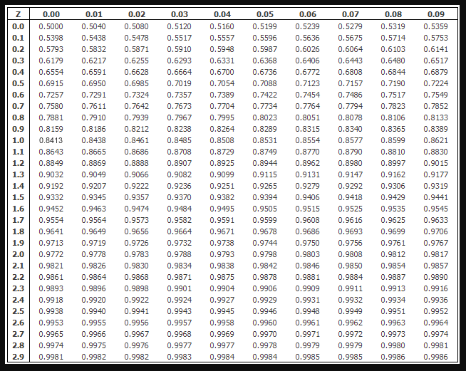

Algorithmic trading has become a fundamental component of modern financial markets, where computer algorithms execute trades at high speeds and frequencies that are impossible for human traders to achieve. This technology relies heavily on statistical tools to make informed and strategic decisions. Among these tools, Z-Score and standard deviation play pivotal roles in shaping trading strategies.

Z-Score and standard deviation are essential statistical measures used by traders to assess and respond to market conditions. The Z-Score, which quantifies how many standard deviations a data point is from the mean, provides a measure of data dispersion and is instrumental in identifying anomalies in price data. Traders frequently employ Z-Score to monitor market volatility, which is a key factor in evaluating market movements and potential reversals.



In parallel, standard deviation serves as a gauge for the variability or dispersion of a set of financial data points. It is critical for assessing the risk associated with an investment. In trading, a high standard deviation suggests greater volatility and, consequently, higher risk, whereas a low standard deviation implies relative stability. Traders use standard deviation to anticipate potential market performance and make decisions that align with their risk tolerance.

This article will explore the significance of these statistical measures in algorithmic trading. We will discuss how traders utilize them to manage risks effectively and identify trading opportunities in financial markets characterized by uncertainty and rapid changes. Through a detailed analysis of Z-Score and standard deviation, readers will gain insights into their proper application and the strategic advantages they offer in algorithmic trading.

## Table of Contents

## Understanding Z-Score

The Z-Score is a statistical measure that indicates the number of standard deviations a data point is from the mean of a data set. It is primarily used to assess the dispersion of data points, a critical [factor](/wiki/factor-investing) when analyzing financial data, particularly in algorithmic trading. The Z-Score formula is:

$$
Z = \frac{(X - \mu)}{\sigma}
$$

where $X$ represents the data point, $\mu$ is the mean of the data set, and $\sigma$ is the standard deviation. This calculation provides a standardized score that helps in comparing data points from different distributions.

Interpreting Z-Scores in financial data sets involves evaluating how far and in what direction a data point deviates from the average. A Z-Score of zero signifies that the data point is exactly at the mean, while positive Z-Scores indicate values above the mean, and negative Z-Scores indicate values below it. Z-Scores enable traders to quantify how unusual or typical a specific price movement is within the context of historical data.

In the context of [algorithmic trading](/wiki/algorithmic-trading), traders utilize Z-Scores to assess market [volatility](/wiki/volatility-trading-strategies) and identify anomalies. A high absolute Z-Score often signifies that a price movement is exceptional and might revert to the mean, which is a concept applied in mean-reversion strategies. Detecting such deviations from the norm can signal trading opportunities, suggesting potential buy or sell actions depending on whether the market is experiencing overbought or oversold conditions.

Moreover, traders use Z-Scores to monitor and control risk. By establishing thresholds, they can manage positions by setting stop-loss orders automatically when a security's Z-Score exceeds predefined limits. This approach helps minimize risk due to unexpected market shifts.

In applying these concepts practically, algorithmic traders may utilize programming tools such as Python to compute Z-Scores efficiently. Below is a simple Python code snippet for calculating Z-Scores:

```python
import numpy as np

def calculate_z_scores(prices):
    mean_price = np.mean(prices)
    std_deviation = np.std(prices)
    z_scores = [(p - mean_price) / std_deviation for p in prices]
    return z_scores

prices = [10, 12, 20, 21, 23, 7, 5, 10]
z_scores = calculate_z_scores(prices)
print(z_scores)
```

In this example, the function `calculate_z_scores` computes Z-Scores for a list of price data, allowing traders to quickly assess price [dispersion](/wiki/dispersion-trading) and potential anomalies. This capability underscores the utility of Z-Scores as a tool for traders aiming to enhance decision-making in dynamic financial environments.

## The Role of Standard Deviation

Standard deviation is a pivotal statistical tool that quantifies the extent of variation or dispersion in a set of values. In the context of financial markets, it serves as a barometer for measuring investment risk. A high standard deviation indicates a large dispersion around the mean, suggesting greater market volatility and, consequently, higher potential risk. Conversely, a low standard deviation signifies minimal variation, pointing to relative market stability.

The calculation of standard deviation involves a series of straightforward mathematical steps. The standard deviation of a set of data is computed by first determining the mean (average) of the data set. Each data point's deviation from the mean is then calculated, squared to eliminate negative differences, and averaged. The square root of this average provides the standard deviation:

$$

\sigma = \sqrt{\frac{1}{N}\sum_{i=1}^{N}(x_i - \mu)^2} 
$$

where $\sigma$ is the standard deviation, $N$ is the number of data points, $x_i$ represents each data point, and $\mu$ is the mean of the data set.

In trading, standard deviation is integral in predicting market performance. A high standard deviation could indicate a volatile market, which might be attractive to traders who thrive on uncertainty and seek high-reward opportunities. For example, [momentum](/wiki/momentum) traders may use high volatility to their advantage by capturing price movements within a short time frame. On the other hand, a low standard deviation might appeal to risk-averse investors focusing on stable investments with predictable returns.

In algorithmic trading, standard deviation forms the backbone of various strategies. Trend-following strategies may employ standard deviation to confirm signals by assessing whether current price movements fall within expected variances. Statistical [arbitrage](/wiki/arbitrage) strategies might rely on standard deviation to identify pricing inefficiencies, exploiting periods when prices diverge significantly from their historical averages.

Understanding and applying standard deviation allows traders to better navigate market dynamics, structure more effective trading strategies, and manage investment risks more proficiently. By evaluating market volatility through the lens of standard deviation, traders and analysts can make informed decisions that align with their financial goals and risk tolerance.

## Applications in Algorithmic Trading

In algorithmic trading, statistical measures like Z-Score and standard deviation are crucial for designing and implementing sophisticated trading strategies. These measures help traders assess risk, exploit mean reversion opportunities, and engage in [statistical arbitrage](/wiki/statistical-arbitrage).

**Risk Assessment**

In the domain of algorithmic trading, risk management is paramount. Standard deviation serves as a core component in this process by providing a measure of market volatility, enabling traders to understand the potential price variation of assets. A higher standard deviation indicates greater volatility, implying a higher risk, whereas a lower standard deviation suggests stability. Traders use standard deviation to set stop-loss limits and to determine position sizing, ensuring exposure to adverse price movements is minimized.

**Mean Reversion Strategies**

Mean reversion strategies are based on the hypothesis that prices and returns eventually move back towards the mean or average. The Z-Score is particularly effective in identifying deviations from the normal price patterns. When an asset’s current price deviates significantly from its historical mean, as indicated by a high absolute Z-Score, it may present a buying or selling opportunity. The Z-Score is calculated as follows:

$$
Z = \frac{(X - \mu)}{\sigma}
$$

where $X$ is the current price, $\mu$ is the mean of the price series, and $\sigma$ is the standard deviation. A high positive Z-Score suggests the asset is overvalued, while a low negative Z-Score indicates undervaluation.

**Statistical Arbitrage**

Statistical arbitrage involves identifying mispriced securities in the market, using statistical analysis to capture profits. By leveraging the Z-Score and standard deviation, traders can identify price discrepancies between correlated assets. For instance, if two historically correlated stocks diverge, a statistical arbitrage strategy might involve shorting the overvalued stock and taking a long position in the undervalued stock, banking on the prices converging over time.

**Implementation in Python**

Implementing Z-Score and standard deviation in trading algorithms is facilitated through programming languages like Python. Python's robust libraries such as NumPy and Pandas simplify these calculations. A basic implementation to compute the Z-Score for a series of prices can be executed as follows:

```python
import pandas as pd
import numpy as np

# Assume price_series is a pandas Series of asset prices
price_series = pd.Series([...])  # Replace [...] with actual data
mean = price_series.mean()
std_dev = price_series.std()

z_scores = (price_series - mean) / std_dev
```

This code snippet calculates the mean and standard deviation of a given price series and determines the Z-Score for each data point. By integrating these computations into an algorithmic trading system, traders can automate decision-making processes based on real-time data analysis.

In summary, the application of Z-Score and standard deviation in algorithmic trading is vast, offering tools for risk assessment, the exploitation of mean reversion, and the execution of statistical arbitrage. With the aid of programming languages like Python, traders can efficiently implement these statistical measures to enhance trading algorithms.

## Case Studies and Real-world Examples

Renaissance Technologies and Two Sigma are prominent figures in algorithmic trading, renowned for their sophisticated use of statistical tools like the Z-Score and standard deviation. These hedge funds capitalize on quantitative strategies, leveraging statistical measures to analyze vast amounts of market data for trading opportunities.

### Renaissance Technologies

Renaissance Technologies, founded by James Simons, utilizes intricate mathematical models to forecast price movements in financial markets. The firm's Medallion Fund, a flagship strategy, is known for its exceptional returns, achieved partly through statistical arbitrage. In this context, Z-Scores play a pivotal role in identifying discrepancies between the current price of securities and their historical mean. This approach helps traders pinpoint potential mean reversion opportunities where prices are expected to return to their historical averages.

For example, a basic Z-Score formula is:

$$
Z = \frac{(X - \mu)}{\sigma}
$$

Where $X$ is the current price, $\mu$ is the historical mean, and $\sigma$ is the standard deviation. A Z-Score greater than 2 or less than -2 might indicate overbought or oversold conditions, prompting trades based on expected reversions.

Renaissance's strategies often incorporate these calculations, adjusting positions dynamically as new data emerges. Their robust algorithms continuously back-test historical data and refine models, enhancing decision-making under varying market conditions.

### Two Sigma

Two Sigma, another quantitative giant, applies advanced statistical analyses and [machine learning](/wiki/machine-learning) to detect patterns in market behavior. The firm uses standard deviation as a measure of volatility, integral to risk management and strategy development. By assessing price fluctuations, Two Sigma's algorithms adjust leverage and asset allocations in response to changing market risks.

A high standard deviation implies greater price variability, often indicating higher risk. Conversely, a low standard deviation suggests stability, influencing strategy by allocating capital to assets with favorable risk-return profiles. Two Sigma's models balance these aspects, optimizing portfolios to protect against significant losses during turbulent periods.

Two Sigma also employs mean reversion strategies supported by Z-Scores, identifying when prices diverge significantly from their mean, presenting arbitrage opportunities. These strategies are continuously refined by integrating new data, ensuring adaptability to shifting market dynamics.

### Performance Improvements

By employing Z-Scores and standard deviation, both Renaissance Technologies and Two Sigma have achieved notable performance enhancements. Their data-driven approaches translate statistical insights into actionable trading decisions, contributing to their status as industry leaders. Such strategies have outperformed traditional methods, attributed to precise risk assessment and timely trade execution.

These case studies illustrate the power of these statistical measures in modern algorithmic trading, providing a foundation for aspiring traders to build upon. As markets evolve, the continued integration of statistical tools will be crucial in navigating financial complexities and capitalizing on market inefficiencies.

## Challenges and Considerations

Algorithmic trading strategies often depend on the precise application of statistical measures, such as the Z-Score. However, one primary challenge with using the Z-Score lies in its foundation on the assumption of normality in data distributions. In financial markets, assuming normality means expecting that market returns conform to a normal distribution, characterized by the symmetric bell curve. In reality, market returns frequently exhibit skewness and kurtosis, presenting heavier tails than those predicted by a normal distribution. This deviation can lead to underestimation or overestimation of risks and anomalies when relying on Z-Scores, as extremes in data (outliers) may not conform to expected ranges.

Additionally, the reliance on historical data in algorithmic trading poses significant challenges. While historical data can provide a useful basis for inferring future market behaviors, it carries the inherent risk of past performance not accurately reflecting future scenarios, particularly in volatile or shifting markets. For instance, the abrupt market changes observed during the 2008 financial crisis or the 2020 pandemic were not predictable through historical trends. Such anomalies can cause trading models heavily reliant on historical data to falter.

Another key consideration is the handling of outliers in financial data. Outliers can skew data analysis and result in faulty Z-Score calculations, leading to inaccurate signals for trading opportunities or risk assessment. When these outliers represent genuine, albeit rare, market events rather than data errors, excluding them might lead to a loss of valuable information, whereas including them indiscriminately could distort model outcomes.

Balancing the intricacies of complex statistical analysis with the inherent unpredictability of financial markets remains crucial. Sophisticated models can offer deep insights but may also become cumbersome and less adaptable to rapid market changes. Moreover, overreliance on statistical models can lead traders to ignore qualitative insights or emerging market trends not captured by quantitative data alone. Thus, the integration of a more holistic approach, leveraging both statistical rigor and market intuition, is often necessary to adapt to the fluid dynamics of modern financial markets.

In practice, traders and analysts may implement robust statistical techniques beyond the standard normality-based Z-Score, such as using robust [statistics](/wiki/bayesian-statistics) or non-parametric methods, to better handle anomalies and irregular data sets. Developing adaptive algorithms that can learn from new data or employing machine learning techniques may also provide a buffer against unforeseen market disruptions, allowing models to adjust and mitigate the limitations inherent in traditional statistical assumptions.

## Conclusion

In this article, we have examined the crucial role that Z-Score and standard deviation play in algorithmic trading. These statistical tools provide traders with essential insights into market dynamics, enhancing their ability to make informed decisions. Z-Score aids in the detection of anomalies and market volatility by quantifying how many standard deviations an element is from the mean, thus allowing traders to spot potential trading opportunities or risks. Standard deviation, on the other hand, offers a measure of data variability, providing a quantitative assessment of investment risk and guiding strategic decision-making.

Implementing these statistical measures within trading algorithms can improve predictions and optimize trading strategies. For example, statistical arbitrage and mean reversion strategies heavily rely on Z-Score and standard deviation to create effective models. Accurately calculating these metrics allows traders to predict price movement more reliably and adjust their strategies dynamically in response to market fluctuations.

For traders aiming to refine their trading strategies, a deeper understanding of these statistical measures is paramount. Practical application through programming languages like Python can significantly augment the precision and effectiveness of trading algorithms. Traders are encouraged to continually enhance their knowledge and application skills regarding these statistical analyses to maintain a competitive edge in the ever-evolving financial markets.

## References and Further Reading

1. **Primary Sources and Academic Papers**:
   - "Statistical Methods in Algorithmic Trading" by David Aronson provides an in-depth discussion of quantitative tools and their application to trading. It emphasizes the statistical foundation necessary for algorithmic strategy development.
   - "Quantitative Trading: How to Build Your Own Algorithmic Trading Business" by Ernest Chan offers insights into building trading models based on statistical metrics such as Z-Score and standard deviation.
   - "Algorithmic Trading and DMA: An Introduction to Direct Access Trading Strategies" by Barry Johnson provides foundational knowledge about direct market access and statistical techniques in trading strategies.

2. **Financial Articles**:
   - The Investopedia article on [Standard Deviation](https://www.investopedia.com/terms/s/standarddeviation.asp) provides a comprehensive overview of the concept and its significance in financial analytics.
   - The article "[Using Z-Score for Trading Systems](https://www.tradersinsightnews.com/traders-insight/securities/macro/using-a-z-score-to-trade-rsi/)" on Traders Insight explores practical applications of Z-Score in trading systems, enhancing operational understanding.

3. **Suggestions for Further Reading**:
   - "Advances in Financial Machine Learning" by Marcos López de Prado offers an advanced take on machine learning techniques applied to financial data, with emphasis on statistical measures like Z-Score.
   - "The Art of Computer Programming, Volume 2: Seminumerical Algorithms" by Donald Knuth, although more generalized, provides mathematical insights beneficial for algorithm development.

4. **Online Resources**:
   - [Khan Academy's Statistics and Probability section](https://www.khanacademy.org/math/statistics-probability) offers tutorials on fundamental statistical concepts.
   - Coursera's course on [Machine Learning and Statistical Analysis in R](https://www.coursera.org/specializations/statistics) provides a solid foundation in statistical analysis utilizing R, which can be parallelly implemented in Python for trading applications.

5. **Programming Tutorials and Code Libraries**:
   - The Python library [NumPy](https://numpy.org/) offers functionality for statistics, including functions to compute standard deviations and Z-Scores.
   - The book "Python for Finance" by Yves Hilpisch is an excellent resource for learning how to implement algorithmic trading strategies using Python, incorporating statistical tools.

These resources collectively form a knowledge base for those interested in integrating statistical measures like Z-Score and standard deviation into their trading strategies, enhancing both theoretical understanding and practical execution.

## References & Further Reading

[1]: Aronson, D. R. (2006). ["Evidence-Based Technical Analysis: Applying the Scientific Method and Statistical Inference to Trading Signals."](https://onlinelibrary.wiley.com/doi/book/10.1002/9781118268315) Wiley.

[2]: Chan, E. (2008). ["Quantitative Trading: How to Build Your Own Algorithmic Trading Business."](https://github.com/ftvision/quant_trading_echan_book) Wiley.

[3]: Johnson, B. (2010). ["Algorithmic Trading & DMA: An Introduction to Direct Access Trading Strategies."](https://archive.org/details/algorithmictradi0000john) 4Myeloma Press.

[4]: Investopedia. ["Standard Deviation."](https://www.investopedia.com/terms/s/standarddeviation.asp)

[5]: Traders Insight. ["Using Z-Score for Trading Systems."](https://www.quantifiedstrategies.com/z-score-trading-strategy/)

[6]: López de Prado, M. (2018). ["Advances in Financial Machine Learning."](https://www.amazon.com/Advances-Financial-Machine-Learning-Marcos/dp/1119482089) Wiley.