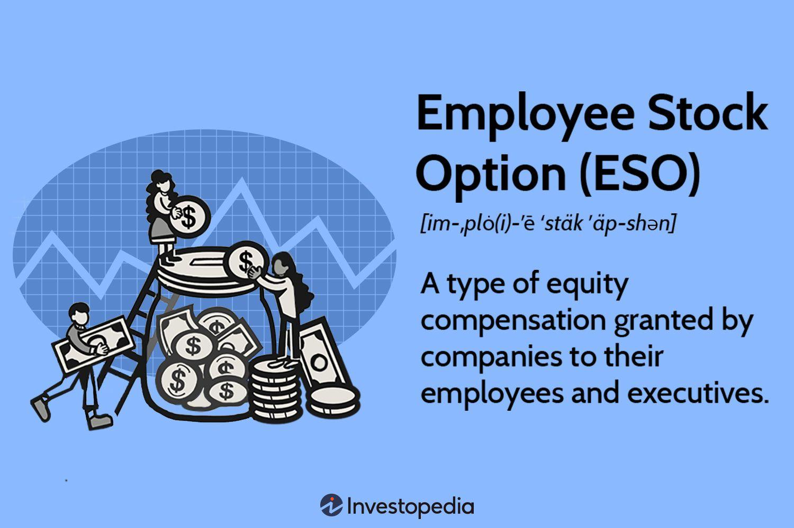

## Table of Contents

## What are stock options?

Stock options are a type of financial tool that companies give to their employees. They give the employee the right to buy a certain number of the company's shares at a set price, called the strike price, within a certain time period. This can be a good deal for employees if the company's stock price goes up, because they can buy the stock at the lower strike price and then sell it at the higher market price.

However, stock options also come with some risks. If the company's stock price doesn't go up or even goes down, the options might not be worth anything. Employees have to decide whether to buy the stock at the strike price, and if they do, they'll need money to do that. So, while stock options can be a way for employees to share in the company's success, they also need to understand the risks involved.

## How do stock options work as a form of employee compensation?

Stock options are a way for companies to reward their employees. Instead of just giving them money, the company gives them the chance to buy its stock at a special price, called the strike price. This can be a good deal for employees if the company does well and its stock price goes up. If that happens, employees can buy the stock at the lower strike price and then sell it at the higher market price, making a profit.

But there are risks too. If the company's stock price doesn't go up or even goes down, the options might not be worth anything. Employees have to decide if they want to buy the stock at the strike price, and if they do, they need to have the money to do it. So, while stock options can be a way for employees to share in the company's success, they also need to understand the risks and be ready to handle them.

## What is the difference between incentive stock options (ISOs) and non-qualified stock options (NSOs)?

Incentive Stock Options (ISOs) and Non-Qualified Stock Options (NSOs) are two types of stock options that companies offer to their employees, but they have some key differences. ISOs are special because they can give employees some tax benefits. If employees follow certain rules, like holding onto the stock for a certain amount of time, they might not have to pay regular income tax on the difference between the stock's market price and the price they paid for it. Instead, they might only have to pay a lower capital gains tax when they sell the stock.

On the other hand, NSOs don't come with those special tax benefits. When employees exercise NSOs, they have to pay regular income tax on the difference between the market price of the stock and the price they paid for it. This can make NSOs less attractive from a tax perspective, but they are often easier to get and can be given to a wider range of people, not just employees. Both types of options can be a good way for employees to share in the company's success, but the tax treatment and who can get them are important things to consider.

## What are the key benefits of offering stock options to employees?

Offering stock options to employees can be a big win for companies. It helps them attract and keep good workers. When employees have stock options, they feel more connected to the company's success. They work harder and stay longer because they know they can make money if the company does well. This can also save the company money, because instead of paying more in salaries, they can give stock options, which might not cost them anything right away.

Stock options also help employees share in the company's growth. If the company's stock price goes up, employees can buy the stock at a lower price and sell it for a profit. This can be a big boost to their income and make them feel like they are part of the company's success. It can also help employees save for the future, like for retirement, because they can turn their options into cash if they need to.

## What are the potential risks and downsides of stock options for employees?

Stock options can be risky for employees. If the company's stock price doesn't go up or even goes down, the options might not be worth anything. Employees could lose the chance to make money from them. Also, if employees decide to buy the stock at the strike price, they need to have the money to do it. If they don't have enough money, they might have to borrow it, which adds more risk.

Another risk is that stock options can make employees focus too much on the company's stock price instead of doing their job well. They might make choices that are good for the stock price in the short term but bad for the company in the long term. Also, the tax rules for stock options can be complicated. If employees don't understand them, they might end up paying more in taxes than they expected. This can be a big surprise and can make the options less valuable.

## How does the vesting schedule affect stock options?

A vesting schedule is like a timeline that says when you can actually use your stock options. It's set up by the company to make sure you stay with them for a while before you can take advantage of the options. Usually, you don't get all your options right away. Instead, they might give you a little bit at a time over a few years. For example, you might get 25% of your options after one year, and then more every year after that until you have them all.

This vesting schedule can be good for you because it encourages you to stay with the company longer. If you leave before your options vest, you might lose them. But it can also be tricky. If the company's stock price goes down while you're waiting for your options to vest, they might not be worth as much when you finally get them. So, the vesting schedule can affect how much you benefit from your stock options and when you can use them.

## What is the process for exercising stock options?

Exercising stock options means you are using your right to buy the company's stock at the special price they gave you, called the strike price. To do this, you first need to check if your options are vested, which means you can use them. If they are vested, you tell your company you want to exercise your options. You'll need to fill out some paperwork and maybe talk to the company's stock plan administrator.

Once you've told the company you want to exercise your options, you'll need to pay the strike price for the number of shares you want to buy. You can usually pay with cash, or sometimes you can use other ways like selling some of the shares you're buying right away to cover the cost. After you've paid, the company will give you the shares. You can then decide to keep the shares and hope the price goes up, or you can sell them right away if you want to turn them into cash.

## How are stock options taxed for employees?

When you exercise stock options, you might have to pay taxes. It depends on the type of options you have. If you have non-qualified stock options (NSOs), you'll have to pay regular income tax on the difference between the stock's market price and the price you paid for it when you exercise the options. This is called the "bargain element." You'll also have to pay payroll taxes on this amount. So, it's important to be ready for this tax bill when you decide to exercise your NSOs.

If you have incentive stock options (ISOs), the tax rules can be a bit different. When you exercise ISOs, you don't have to pay regular income tax right away. But, you might have to pay something called the alternative minimum tax (AMT) if the bargain element is big enough. If you hold onto the stock for at least one year after exercising the options and two years after the options were granted, you might only have to pay a lower capital gains tax when you sell the stock. This can be a good deal, but the tax rules can be tricky, so it's a good idea to talk to a tax advisor to make sure you understand them.

## What is the impact of stock options on a company's financial statements?

When a company gives stock options to its employees, it can affect the company's financial statements. One way it does this is through something called "stock-based compensation expense." This is a cost that the company has to show on its income statement. It's like saying, "We gave our employees stock options, and this is how much it cost us." The company figures out this cost using a special way of calculating called the "fair value method." This method looks at things like how long the options last, how much the stock price might go up and down, and other stuff to decide how much the options are worth.

Another way stock options can affect the financial statements is through the balance sheet. When the company gives out stock options, it doesn't give away actual money right away, but it does have to show that it might have to give money in the future if the employees use their options. This is called a "liability" on the balance sheet. Also, if employees exercise their options, the company might have to issue new shares. This can change the total number of shares the company has, which can affect things like "earnings per share" on the income statement. So, stock options can make a company's financial statements look different in a few ways.

## How can employees value their stock options accurately?

To value their stock options accurately, employees need to think about a few things. One big thing is the current price of the company's stock and how much they think it might go up or down in the future. They also need to know the strike price, which is the special price they can buy the stock at. If the stock price is higher than the strike price, the options are worth something. If it's lower, they might not be worth anything. Employees can use a special way of calculating called the "Black-Scholes model" to figure out the value of their options. This model looks at things like how long the options last, how much the stock price might change, and how much they can earn from other places.

Another thing to consider is the vesting schedule. This tells employees when they can actually use their options. If the options don't vest for a long time, there's more risk that the stock price might go down before they can use them. Employees should also think about any taxes they might have to pay when they exercise their options. For non-qualified stock options (NSOs), they'll have to pay regular income tax on the difference between the stock's market price and the strike price. For incentive stock options (ISOs), they might have to pay the alternative minimum tax (AMT) when they exercise, and later, capital gains tax when they sell the stock. Understanding all these things can help employees figure out how much their stock options are really worth.

## What are the best practices for companies when implementing a stock option plan?

When companies want to start a stock option plan, they should make sure it's clear and fair for everyone. They need to set up rules about how the options will be given out, how long people have to wait before they can use them, and what happens if someone leaves the company. It's also important to make sure everyone understands how the options work and what they could be worth. Companies should talk to their employees about the plan and maybe even have meetings to explain everything. This way, people know what they're getting and can make good choices about their options.

Companies also need to think about the tax rules for stock options. They should help their employees understand how taxes work with the options, maybe by giving them information or letting them talk to tax experts. It's also a good idea for companies to check the plan every now and then to make sure it's still working well and making people happy. If things change, like the company's stock price or the way the business is doing, they might need to change the plan a bit. By doing these things, companies can make sure their stock option plan is a good deal for everyone.

## How do regulatory changes affect stock option compensation strategies?

When rules about stock options change, companies have to think about how to keep their stock option plans working well. For example, if the government changes tax laws, it might make some kinds of options more expensive for employees. Companies might need to switch from non-qualified stock options (NSOs) to incentive stock options (ISOs) or the other way around, depending on what's best for their employees. They also need to keep up with rules from places like the Securities and Exchange Commission (SEC) to make sure they're doing everything right. If they don't follow the rules, they could get in trouble, so it's important to stay on top of any changes.

Changes in rules can also affect how companies give out stock options. For example, new rules might say companies have to tell everyone more about their stock option plans. This could mean more paperwork and explaining things to employees. Companies might need to change how they talk to their employees about options or even change the way they give them out. Keeping up with these changes helps companies make sure their stock option plans are still a good way to reward their employees and keep them happy.

## What is Understanding Employee Compensation?

Employee compensation encompasses a blend of monetary and non-monetary rewards that employers use to remunerate their workforce for their efforts and contributions. Traditionally, the primary components of employee compensation have been base salary, bonuses, and benefits. The base salary serves as the fixed periodic payment agreed upon by both employer and employee, usually expressed as an annual figure. Bonuses, which can be discretionary or performance-based, provide additional financial incentives for meeting specific targets or objectives. Benefits typically cover health insurance, retirement plans, and other supplemental amenities, enhancing the overall compensation package.

In the modern employment landscape, compensation structures are evolving to include stock options and equity incentives. Stock options grant employees the opportunity to purchase company shares at a specified price, known as the exercise price or strike price, after a predetermined period, often referred to as the vesting period. These options are designed to enhance retention by aligning the employee's financial interests with long-term company success. For example, if a company's stock price rises, employees with stock options can potentially buy shares at the lower strike price, sell them at the market rate, and realize a profit. Mathematically, the potential gain from stock options can be expressed as:

$$
\text{Profit} = (\text{Market Price} - \text{Strike Price}) \times \text{Number of Shares}
$$

Equity incentives, including instruments like Restricted Stock Units (RSUs), further integrate employees into the company's trajectory by directly granting shares at no upfront cost. These shares often vest over time, providing employees with a tangible interest in the company's fortunes and encouraging a focus on sustainable growth.

These innovative compensation strategies are particularly significant in industries characterized by high levels of competition and rapid innovation, such as technology and finance. By offering stock options and equity incentives, companies can attract a skilled workforce driven by the potential for shared success. This approach not only incentivizes employees to contribute to the company’s prosperity but also establishes a collective interest matching their objectives with those of the organization. Consequently, firms adopting these modern compensation strategies may experience enhanced employee engagement, reduced attrition, and ultimately, improved performance.

## References & Further Reading

[1]: Bergstra, J., Bardenet, R., Bengio, Y., & Kégl, B. (2011). ["Algorithms for Hyper-Parameter Optimization."](https://papers.nips.cc/paper/4443-algorithms-for-hyper-parameter-optimization) Advances in Neural Information Processing Systems 24.

[2]: ["Advances in Financial Machine Learning"](https://www.amazon.com/Advances-Financial-Machine-Learning-Marcos/dp/1119482089) by Marcos Lopez de Prado

[3]: Hall, B. J. (2000). ["What you need to know about stock options."](https://hbr.org/2000/03/what-you-need-to-know-about-stock-options) Harvard Business Review.

[4]: Murphy, K. J. (2013). ["Executive Compensation: Where We Are, and How We Got There."](https://www.sciencedirect.com/science/article/pii/B9780444535948000045) Handbook of the Economics of Finance.

[5]: Chiang, C. (2020). ["The Use of Equity Incentives and Long-Term Performance Goals in Executive Compensation."](https://www.sciencedirect.com/science/article/pii/S1544612323009649) Journal of Corporate Finance.

[6]: ["Quantitative Trading: How to Build Your Own Algorithmic Trading Business"](https://books.google.com/books/about/Quantitative_Trading.html?id=j70yEAAAQBAJ) by Ernest P. Chan

[7]: O'Neil, W.J. (2009). ["How to Make Money in Stocks."](https://www.amazon.com/How-Make-Money-Stocks-Winning/dp/0071614133) McGraw-Hill Education.

[8]: Hull, J. C. (2018). ["Options, Futures, and Other Derivatives."](https://www.semanticscholar.org/paper/Options%2C-Futures%2C-and-Other-Derivatives-Hull/89bdee500c8623864fc9eb7a471546aa713acc44) Pearson.