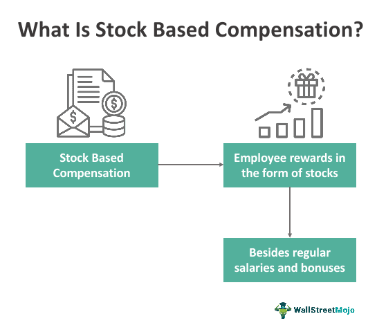

In the fast-paced world of modern finance and technology, employee compensation has evolved beyond traditional salary structures. Companies today are increasingly incorporating stock options and equity incentives as pivotal components of their compensation packages. This strategic move is particularly notable in sectors such as technology and finance, where continuous innovation is essential, and the retention of highly skilled employees is a top priority. These industries, facing fierce competition for talent, have recognized the value of offering compensation that ties employee rewards to the company's performance and growth.

Algorithmic trading, or algo trading, is an emerging field within finance that exemplifies this trend. By leveraging complex algorithms and automated systems to execute trades at high speed and volume, algo trading firms are at the forefront of integrating innovative compensation strategies. To attract and retain top talent, such as mathematicians, software engineers, and data scientists, these firms offer competitive compensation packages that often include stock options and equity incentives. These incentives are designed to align the interests of employees with the long-term success and stability of the company, thus fostering a motivated and loyal workforce.



This article investigates how stock options, equity incentives, and the rise of algo trading collectively shape today's dynamic employment landscape. By exploring these interactions, we gain insight into how companies can sustain a competitive edge and drive innovation through tailored compensation strategies. Understanding these evolving practices is crucial for organizations and employees as they navigate the complexities of modern employment environments.

## Table of Contents

## Understanding Employee Compensation

Employee compensation encompasses a blend of monetary and non-monetary rewards that employers use to remunerate their workforce for their efforts and contributions. Traditionally, the primary components of employee compensation have been base salary, bonuses, and benefits. The base salary serves as the fixed periodic payment agreed upon by both employer and employee, usually expressed as an annual figure. Bonuses, which can be discretionary or performance-based, provide additional financial incentives for meeting specific targets or objectives. Benefits typically cover health insurance, retirement plans, and other supplemental amenities, enhancing the overall compensation package.

In the modern employment landscape, compensation structures are evolving to include stock options and equity incentives. Stock options grant employees the opportunity to purchase company shares at a specified price, known as the exercise price or strike price, after a predetermined period, often referred to as the vesting period. These options are designed to enhance retention by aligning the employee's financial interests with long-term company success. For example, if a company's stock price rises, employees with stock options can potentially buy shares at the lower strike price, sell them at the market rate, and realize a profit. Mathematically, the potential gain from stock options can be expressed as:

$$
\text{Profit} = (\text{Market Price} - \text{Strike Price}) \times \text{Number of Shares}
$$

Equity incentives, including instruments like Restricted Stock Units (RSUs), further integrate employees into the company's trajectory by directly granting shares at no upfront cost. These shares often vest over time, providing employees with a tangible interest in the company's fortunes and encouraging a focus on sustainable growth.

These innovative compensation strategies are particularly significant in industries characterized by high levels of competition and rapid innovation, such as technology and finance. By offering stock options and equity incentives, companies can attract a skilled workforce driven by the potential for shared success. This approach not only incentivizes employees to contribute to the company’s prosperity but also establishes a collective interest matching their objectives with those of the organization. Consequently, firms adopting these modern compensation strategies may experience enhanced employee engagement, reduced attrition, and ultimately, improved performance.

## The Rise of Stock Options and Equity Incentives

Stock options and equity incentives have become integral to modern compensation strategies, particularly in sectors such as technology and finance. These tools are designed to align the interests of employees with those of the company, fostering a culture of shared success and long-term growth.

Stock options are contractual agreements that grant employees the right, but not the obligation, to purchase a specific number of company shares at a predetermined exercise price. This price is typically set at or below the market value at the time of issuance. The vesting period—a specified period employees must wait before they can exercise the options—encourages them to remain with the company and contribute to its growth over the long run. If the company's stock price rises above the exercise price, employees can purchase shares at a discount, potentially realizing significant financial gain.

Equity incentives go beyond stock options, encompassing a variety of structures, including restricted stock units (RSUs). RSUs are promises from an employer to grant shares to an employee after a vesting period. Unlike stock options, which require the employee to purchase shares, RSUs are typically awarded outright, serving as a tangible reflection of the company's commitment to its workforce.

Both stock options and RSUs act as retention tools by tying employee rewards to the company's performance. A well-designed equity incentive plan can motivate employees to prioritize projects and initiatives that they believe will enhance the company’s stock value. Consequently, employees are more likely to focus on strategic goals that promote sustainable growth, knowing that their financial rewards are directly connected to the company's success.

Moreover, equity incentives are an effective means of attracting talent in competitive markets. Companies offering substantial equity stakes can differentiate themselves as employers of choice, particularly in sectors where innovation and specialized skills are in high demand. Tech giants such as Google, Amazon, and Facebook have popularized the use of these incentives, successfully attracting top-tier talent with the promise of equity participation.

In summary, stock options and equity incentives have risen to prominence as key components of employee compensation packages. By offering employees a stake in the company's future, these incentives align individual motivations with corporate objectives, fostering a sense of ownership and commitment that benefits both the employee and the employer.

## Equity Incentives in Tech Companies

Tech companies are increasingly relying on equity incentives as a strategic tool to attract and retain talent in a highly competitive market. As sectors like technology experience rapid growth and innovation, these incentives are designed to align the interests of employees with the long-term objectives of the company. This alignment is achieved by granting employees ownership stakes in the firm, generally through stock options or restricted stock units (RSUs), which appreciate in value as the company grows.

Equity incentives such as stock options allow employees to purchase company stock at a pre-set price, typically lower than the market value, after a specified period or upon meeting certain performance benchmarks. Alternatively, RSUs grant employees actual shares in the company, often with vesting schedules that condition ownership on continued employment or achievement of certain performance goals. Both mechanisms aim to foster a sense of ownership and investment in the company's success, motivating employees to contribute to its long-term growth.

Leading tech firms have pioneered innovative approaches in structuring these compensation strategies. For instance, Google, known for its '20% time' policy, complements it with generous stock options and RSUs to incentivize creativity and dedication among its employees. Similarly, Facebook's equity programs offer substantial RSUs to ensure employee efforts align with company performance goals. By observing best practices in these tech giants, such as offering transparent communication about how equity incentives work and their potential value, other companies can design effective compensation packages that meet their specific strategic needs.

Ultimately, equity incentives act as a powerful tool for tech companies, providing significant financial rewards tied to performance while promoting employee loyalty and retention. They also align personal success with technological and business advancements, cultivating a workforce motivated by both personal and organizational achievements. As competition for top talent intensifies, the evolution of equity compensation strategies will likely continue to play a pivotal role in the tech industry.

## The Intersection of Algo Trading and Compensation

Algorithmic trading, commonly known as algo trading, utilizes computer algorithms to execute financial trades at high speed and frequency. Given the mathematically intensive and technologically sophisticated nature of this field, firms competing in algo trading are perpetually on the lookout for top talents, such as mathematicians, engineers, and data scientists. The competitive labor market for these skilled professionals necessitates robust compensation strategies, prominently featuring stock options and equity incentives.

Algo trading firms use stock options as a critical part of their compensation packages. Stock options allow employees to purchase company shares at a predetermined price, potentially offering significant financial gains if the company's stock value appreciates. Alongside providing a means for wealth creation, these options create a sense of ownership and commitment among employees by tying their financial rewards directly to the firm's performance.

Equity incentives, which may include restricted stock units (RSUs) and performance shares, are another tool employed by these firms. These incentives provide employees with company shares as part of their compensation, usually vesting over time or upon reaching specific performance targets. Such incentives not only reward past contributions but also motivate future performance and loyalty by aligning employee goals with the firm's strategic objectives.

The integration of stock options and equity incentives in algo trading presents a notable attraction for talent. It fosters a shared interest in the company's success, aligning the objectives of the firm with those of its employees. This alignment is critical in a field where innovation and rapid adaptation to market changes are essential for maintaining a competitive edge. 

Moreover, the use of such compensation strategies has shown to improve overall company performance. By incentivizing employees to contribute to the long-term success of the company, firms can enhance productivity and spur innovation. The potential for significant financial rewards can drive employees to develop proprietary algorithms that deliver superior trading performance.

The adoption of these compensation policies in algo trading firms reflects broader industry trends. As firms across various sectors increasingly recognize the value of human capital, offering competitive and compelling compensation packages becomes crucial for attracting, motivating, and retaining top talent. Understanding the intersection of such compensation models and company performance in algo trading can provide insights into effective human resource strategies that may offer a blueprint for other industries aiming to harness the full potential of their workforce.

## Benefits and Challenges of Stock Options and Equity Incentives

Stock options and equity incentives are important components of modern compensation strategies, offering both significant benefits and notable challenges. 

Stock options, which grant employees the right to purchase company stock at a predetermined price, can be highly lucrative if the company's stock value appreciates. This potential for financial gain not only incentivizes employees to contribute positively to the company's performance but also serves as a tool for attracting talented individuals who are willing to invest in the company's future success. Due to their nature, stock options often motivate employees to think and act like shareholders, aligning their personal goals with the company’s objectives.

Equity incentives, such as restricted stock units (RSUs), directly reward employees with the company’s stock. Unlike stock options, RSUs reduce the need for employees to invest personal capital since they are granted as shares without a purchasing requirement. These incentives can foster a sense of ownership among employees, encouraging them to focus on long-term growth and innovation. By tying compensation to company performance, equity incentives can build loyalty and reduce turnover, especially in competitive industries like technology and finance.

However, stock options and equity incentives come with complexities. Valuing stock options accurately can be challenging due to the influence of market [volatility](/wiki/volatility-trading-strategies) and future predictions about the company's performance. Using the Black-Scholes model, companies can estimate the theoretical value of stock options based on variables such as current stock price, strike price, time to expiration, and volatility. 

Below is a simple Python implementation to calculate the price of a European call option using the Black-Scholes formula:

```python
from math import log, sqrt, exp
from scipy.stats import norm

def black_scholes_call(S, K, T, r, sigma):
    d1 = (log(S / K) + (r + sigma**2 / 2) * T) / (sigma * sqrt(T))
    d2 = d1 - sigma * sqrt(T)
    call_price = S * norm.cdf(d1) - K * exp(-r * T) * norm.cdf(d2)
    return call_price

# Example values
S = 100  # Current stock price
K = 100  # Strike price
T = 1    # Time to expiration in years
r = 0.05  # Risk-free interest rate
sigma = 0.2  # Stock price volatility

call_price = black_scholes_call(S, K, T, r, sigma)
print(f"The call option price is: {call_price:.2f}")
```

Besides valuation challenges, regulatory considerations also add a layer of complexity. Different jurisdictions have varying rules regarding taxation and reporting of equity-based compensation, requiring companies to navigate these legal requirements carefully. Moreover, the risk of stock price depreciation can result in options or incentives losing their value, potentially demotivating employees who might see their expected rewards diminish.

In summary, while stock options and equity incentives are powerful instruments for aligning employee and company interests, driving innovation, and retaining top talent, companies must skillfully address the challenges of valuation, risk management, and regulation to effectively leverage these tools.

## The Future of Compensation in Algo Trading and Beyond

The landscape of compensation in algo trading and beyond continues to evolve, driven by advancements in technology and shifts in workplace dynamics. As companies strive to attract and retain talent in competitive sectors, innovative compensation models that reflect individual contributions are becoming more prevalent.

One significant trend is the personalization of compensation strategies. With advancements in data analytics and [machine learning](/wiki/machine-learning), firms can now tailor compensation packages to align with an individual's impact and performance. This approach not only incentivizes employees but also provides a transparent framework that underscores merit-based rewards. For example, firms can analyze performance data to dynamically adjust stock options or bonuses, aligning incentives with the actual contributions of each employee.

Python code can be utilized to develop algorithms for evaluating employee performance in conjunction with market data, which could involve:

```python
def calculate_bonus(employee_performance, market_growth, base_salary):
    performance_factor = employee_performance / 100  # Assuming performance is a percentage
    market_factor = market_growth / 100  # Assuming market growth is a percentage
    bonus = base_salary * performance_factor * market_factor
    return bonus

# Example usage
employee_performance = 85  # 85%
market_growth = 10  # 10%
base_salary = 100000  # $100,000
bonus = calculate_bonus(employee_performance, market_growth, base_salary)
print(f"The calculated bonus is: ${bonus:.2f}")
```

Emerging trends also indicate a shift towards integrating non-traditional benefits into compensation packages. Incorporating elements such as work-life balance options, mental health support, and opportunities for professional development complements financial incentives and reflects a holistic approach to employee well-being.

As technology continues to advance, we may see the advent of decentralized compensation systems, augmented by blockchain technology. Such systems could offer transparency and security in managing equity distribution, ensuring all stakeholders have an accurate account of their contributions and rewards.

In addition to these specific trends, the broader pattern indicates a movement towards flexible and adaptive compensation strategies. These strategies must account for diverse workforce needs and evolving economic conditions. Companies focusing on [algorithmic trading](/wiki/algorithmic-trading) need to remain agile, ensuring their compensation models not only meet current demands but also anticipate future shifts, thereby sustaining their competitive advantage in attracting top-tier talent.

## Conclusion

The integration of stock options and equity incentives in employee compensation embodies a strategic shift in how businesses attract and retain talent. This evolution in compensation structures is not merely a trend but a defining characteristic of modern employment strategies, especially within sectors that emphasize innovation and rapid technological advancement, such as algorithmic trading. In these competitive arenas, stock options and equity incentives serve as powerful tools to maintain a competitive edge and foster a culture of innovation. By granting employees a stake in the company's success, these incentives effectively align their interests with long-term business objectives, encouraging dedication and loyalty.

In the specialized field of algorithmic trading, where skilled mathematicians, engineers, and data scientists are imperative for success, the incorporation of these advanced compensation strategies plays a crucial role. These incentives allow firms to attract top-tier talent essential for developing sophisticated trading algorithms and maintaining industry leadership. Competitive compensation packages that include equity incentives can significantly impact recruitment efforts, aiding in the acquisition and retention of skilled professionals necessary for sustaining innovation and driving growth.

As industries continue to evolve, keeping pace with the expectations of a dynamic workforce and the growing demand for personalized, performance-driven compensation becomes integral. Companies must remain vigilant and adaptable, ensuring that compensation models not only incentivize current employees but also appeal to future talent pools. This requires a comprehensive understanding of the changing landscape and a willingness to implement innovative strategies that reflect the organization's values and objectives. For businesses and employees, continuously navigating these trends will be crucial for securing a prosperous and adaptive future in an ever-evolving market.

## References & Further Reading

[1]: Bergstra, J., Bardenet, R., Bengio, Y., & Kégl, B. (2011). ["Algorithms for Hyper-Parameter Optimization."](https://papers.nips.cc/paper/4443-algorithms-for-hyper-parameter-optimization) Advances in Neural Information Processing Systems 24.

[2]: ["Advances in Financial Machine Learning"](https://www.amazon.com/Advances-Financial-Machine-Learning-Marcos/dp/1119482089) by Marcos Lopez de Prado

[3]: Hall, B. J. (2000). ["What you need to know about stock options."](https://hbr.org/2000/03/what-you-need-to-know-about-stock-options) Harvard Business Review.

[4]: Murphy, K. J. (2013). ["Executive Compensation: Where We Are, and How We Got There."](https://www.sciencedirect.com/science/article/pii/B9780444535948000045) Handbook of the Economics of Finance.

[5]: Chiang, C. (2020). ["The Use of Equity Incentives and Long-Term Performance Goals in Executive Compensation."](https://www.sciencedirect.com/science/article/pii/S1544612323009649) Journal of Corporate Finance.

[6]: ["Quantitative Trading: How to Build Your Own Algorithmic Trading Business"](https://books.google.com/books/about/Quantitative_Trading.html?id=j70yEAAAQBAJ) by Ernest P. Chan

[7]: O'Neil, W.J. (2009). ["How to Make Money in Stocks."](https://www.amazon.com/How-Make-Money-Stocks-Winning/dp/0071614133) McGraw-Hill Education.

[8]: Hull, J. C. (2018). ["Options, Futures, and Other Derivatives."](https://www.semanticscholar.org/paper/Options%2C-Futures%2C-and-Other-Derivatives-Hull/89bdee500c8623864fc9eb7a471546aa713acc44) Pearson.