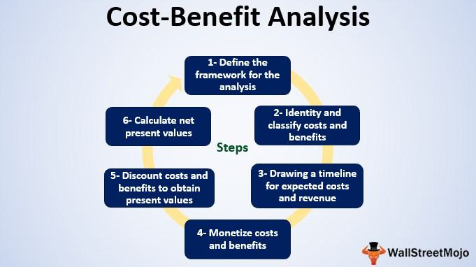

The real estate industry is experiencing transformative changes driven by technological advancements and evolving compensation strategies. Traditionally, real estate agents have relied on commission-based earnings, where their income is a percentage of the property sale price. This model, deeply entrenched in the industry, incentivizes agents to prioritize successful transactions, thereby aligning their financial goals with those of their clients. However, this structure also presents challenges, including fluctuating incomes and a high dependence on a constant flow of transactions. Recent economic and regulatory shifts have prompted agents to explore alternative compensation models that provide more stability and transparency. 

Simultaneously, the concept of algorithmic trading, well-established in financial markets, is being adapted for real estate, offering professionals new methods for improving operational efficiency and profitability. These tools utilize data analytics and automated processes, which could revolutionize decision-making in real estate by enabling faster and more data-driven responses to market changes. This article examines the changing landscape of real estate agent compensation alongside the integration of algorithmic trading technologies. By analyzing both traditional and innovative compensation structures, we identify potential benefits and challenges within these models. Moreover, we explore how real estate professionals are increasingly employing algorithmic trading tools to optimize their market strategies, thereby maximizing opportunities and enhancing client satisfaction. As the sector continues to evolve, these elements could play critical roles in shaping its future dynamics.

## Table of Contents

## Traditional Real Estate Commission Structures

Real estate agents have long been compensated through commission-based structures, where their earnings are a percentage of the property's selling price. Typically, the standard commission for real estate transactions in the United States ranges from 5% to 6% of the sale price, but this can vary depending on the location and property. The commission is usually split between the listing agent, who represents the seller, and the buyer's agent, who represents the buyer. Additionally, each agent's broker usually takes a share of this commission, further splitting the total amount. For example, on a property sold for $300,000 with a 6% commission, $18,000 would be shared among the agents and brokers. Assuming an equal split, each side would receive $9,000, which is then divided between the agent and broker based on their agreement.

The commission model is designed to motivate agents, aligning their interests with those of their clients by incentivizing successful transaction completions. This alignment can lead to a more dedicated service, as agents are directly rewarded for their efforts to sell properties at competitive prices.

However, the traditional commission structure poses several challenges. A significant issue for agents is the variability in income, as their earnings depend directly on the successful closure of transactions. This reliance on high-volume transactions means that during slower real estate markets, agents may experience periods of reduced income or financial instability. Furthermore, because commissions are based on sale prices, agents might face pressure to prioritize selling higher-priced properties to maximize their earnings, potentially skewing the representation of lower-value properties.

Legal scrutiny has also highlighted some drawbacks of commission-based compensation. Recently, discussions have intensified regarding the potential reduction of commission rates to enhance consumer protection and promote fair market practices. Notably, the antitrust actions pursued by the Department of Justice (DOJ) in 2024 have initiated changes in commission structures across the United States. These actions seek to foster competition, aiming to reduce the financial burden on consumers and address anti-competitive behaviors previously protected by existing commission arrangements. Such regulatory shifts are shaping a more equitable real estate landscape, compelling agents to adapt to a more consumer-friendly approach while exploring alternative compensation models.

## Emerging Compensation Models for Real Estate Agents

Alternative compensation models for real estate [agents](/wiki/agents) are becoming more prevalent as the industry adapts to shifting market demands and regulatory changes. These models aim to provide both clients and agents with greater predictability, fairness, and transparency.

One prominent model is the fixed-fee structure, which charges clients a predetermined fee for services rendered, regardless of the property's selling price. This model contrasts with traditional commission-based systems and is attractive to clients who prefer cost certainty. The fixed-fee approach can increase transparency, as clients know upfront what they will pay, potentially leading to greater trust and satisfaction.

Another emerging model is the salary plus bonus structure, adopted by companies such as Redfin. This model combines a base salary with performance-based bonuses, offering real estate agents financial stability while still providing incentives for high performance. For example, a real estate agent might earn a base salary of $50,000 plus a 10% bonus on sales exceeding a predefined target. By integrating salary and commission elements, this model can align agent motivation with company goals and client success.

Referral fee arrangements also offer agents opportunities to earn income outside direct property transactions. In these arrangements, an agent receives a fee for referring clients to other real estate professionals or related service providers, such as mortgage brokers or home inspectors. This model allows agents to leverage their networks and expertise for additional revenue streams, typically [earning](/wiki/earning-announcement) around 20-35% of the commission on referred deals.

The real estate industry's adaptation to consumer expectations has also spurred the development of these models. Clients increasingly demand flexible, transparent pricing structures, prompting firms to innovate beyond traditional methods. As companies respond to these expectations, agents can benefit from compensation models that better reflect their contributions and market conditions, fostering a more balanced and equitable real estate market.

## Algorithmic Trading in Real Estate

Algorithmic trading, a practice historically associated with stock markets, is increasingly being adopted within the real estate sector. This innovative approach leverages real-time data analytics and automated trading capabilities, aiming to revolutionize how real estate transactions are executed. At its core, [algorithmic trading](/wiki/algorithmic-trading) in real estate seeks to streamline investment decisions by rapidly processing extensive datasets, thereby providing a strategic advantage to both agents and investors.

Key to the efficiency of algorithmic trading is its ability to analyze and interpret comprehensive datasets with remarkable speed. This capability enables stakeholders to make informed investment decisions based on current market data, trends, and predictive analytics. For example, algorithms can assess numerous factors such as property location, historical price trends, and economic indicators swiftly, offering a robust foundation for decision-making processes. These data-driven insights are not only more precise but also allow for a quicker response to market fluctuations.

Several algorithmic tools have emerged that are specifically tailored for the nuances of real estate. Predictive analytics, in particular, shows great promise in pricing and risk assessment. By utilizing [machine learning](/wiki/machine-learning) models, these tools can forecast property prices with high accuracy, accounting for various risk factors and potential returns. Additionally, risk assessment algorithms can evaluate the probability of investment outcomes, thus providing a comprehensive view of potential financial performance.

The integration of algorithmic trading into real estate promises to enhance profitability by minimizing human error and optimizing transaction timing. For instance, predictive models can identify ideal times to buy or sell properties based on market conditions, thus maximizing returns for investors. By mitigating the risk associated with emotional decision-making and human biases, algorithmic trading paves the way for more rational and profitable investment strategies.

Despite these advantages, algorithmic trading in real estate does present several challenges and limitations. The initial setup cost of algorithmic systems can be substantial, potentially deterring smaller firms from adopting such technologies. Moreover, the successful implementation of algorithmic trading necessitates a robust technological infrastructure, including high-speed data processing capabilities and secure networks to protect sensitive data. Additionally, expertise in both real estate and advanced technologies is crucial, often requiring a steep learning curve for traditional real estate professionals.

In summary, while still an emerging trend, algorithmic trading holds significant potential to transform real estate transactions by enhancing data-driven decision-making and operational efficiency. As the field evolves, overcoming the associated challenges will be essential to enable broader adoption and fully realize the benefits of this technological advancement.

## The Future of Real Estate Agent Compensation and Trading

The future dynamics of real estate agent compensation and trading are set to undergo significant transformation, driven by a confluence of legal, economic, and technological shifts. As these new trends emerge, real estate professionals must strategically adapt to maintain their footing in the competitive marketplace.

Agent compensation models are evolving away from traditional commission-based structures. Factors contributing to this shift include heightened scrutiny from regulatory bodies and changing consumer expectations. Legal actions, such as the antitrust investigations by the Department of Justice, aim to promote transparency and reduce commission rates, directly influencing how agents structure their earnings [1]. Moreover, in a market increasingly demanding efficiency and cost-effectiveness, alternative compensation approaches, such as fixed-fee and salary-plus-bonus models, are gaining traction.

Algorithmic trading stands at the forefront of technological innovations poised to redefine real estate transactions. By leveraging real-time data analytics, these systems can significantly enhance decision-making processes, optimizing transaction timing and outcomes. This model promises increased efficiency by minimizing human error and swiftly analyzing large datasets—capabilities that traditional methods struggle to match.

Professionals who adopt these emerging technologies may reap substantial market advantages and foster stronger client relationships. The integration of sophisticated algorithmic tools can not only enhance profitability but also ensure that agents can provide clients with data-driven insights, thus establishing trust and credibility.

Continuous education and mastery of advanced technologies will be critical for agents intent on remaining competitive. As technological proficiency becomes essential, agents must engage in ongoing learning to harness and apply these tools effectively. Tech developers and real estate professionals collaborating could spearhead innovative solutions that remodel business practices.

In conclusion, the future of real estate agent compensation and trading seems poised to embrace a more integrated, technology-driven approach. Market participants open to these advancements will likely position themselves advantageously in a rapidly evolving industry, leading to innovative compensation solutions and enhanced transactional efficiencies. 

References:
[1] U.S. Department of Justice, Antitrust Division, “Real Estate Competition and Commission Structure.”

## Conclusion

Real estate agent compensation is currently at a pivotal stage, driven by evolving market demands and technological advancements. Traditional commission-based models are increasingly being supplemented or replaced by innovative frameworks that promise greater transparency and efficiency. These shifts underscore a broader trend towards more flexible and consumer-friendly pricing structures in the real estate sector.

Algorithmic trading represents a significant opportunity for enhancing the effectiveness of real estate transactions. By leveraging real-time data analytics and automated trading capabilities, real estate professionals can make more informed investment decisions, minimize human error, and optimize transaction timing. These technologies have the potential to significantly enhance the performance and profitability of real estate agents and brokers.

For agents and brokers, staying informed and adaptable is crucial. As the industry continues to transform, adopting new strategies and integrating advanced technologies will be necessary to remain competitive. This requires a commitment to ongoing education and skill development, particularly in understanding and utilizing complex technological tools.

Looking ahead, the real estate sector is poised for greater integration with technology, reshaping the roles and compensation of agents. The adoption of algorithmic trading tools and other advanced technologies will likely lead to more efficient and data-driven processes, ultimately benefiting both industry professionals and their clients. By embracing these changes, real estate agents can secure a competitive edge and contribute to a more innovative and dynamic marketplace.

## References & Further Reading

[1]: Bergstra, J., Bardenet, R., Bengio, Y., & Kégl, B. (2011). ["Algorithms for Hyper-Parameter Optimization."](https://papers.nips.cc/paper/4443-algorithms-for-hyper-parameter-optimization) Advances in Neural Information Processing Systems 24.

[2]: ["Advances in Financial Machine Learning"](https://www.amazon.com/Advances-Financial-Machine-Learning-Marcos/dp/1119482089) by Marcos Lopez de Prado

[3]: ["Evidence-Based Technical Analysis: Applying the Scientific Method and Statistical Inference to Trading Signals"](https://www.amazon.com/Evidence-Based-Technical-Analysis-Scientific-Statistical/dp/0470008741) by David Aronson

[4]: ["Machine Learning for Algorithmic Trading"](https://github.com/PacktPublishing/Machine-Learning-for-Algorithmic-Trading-Second-Edition) by Stefan Jansen

[5]: ["Quantitative Trading: How to Build Your Own Algorithmic Trading Business"](https://books.google.com/books/about/Quantitative_Trading.html?id=j70yEAAAQBAJ) by Ernest P. Chan

[6]: U.S. Department of Justice, Antitrust Division, "Real Estate Competition and Commission Structure."