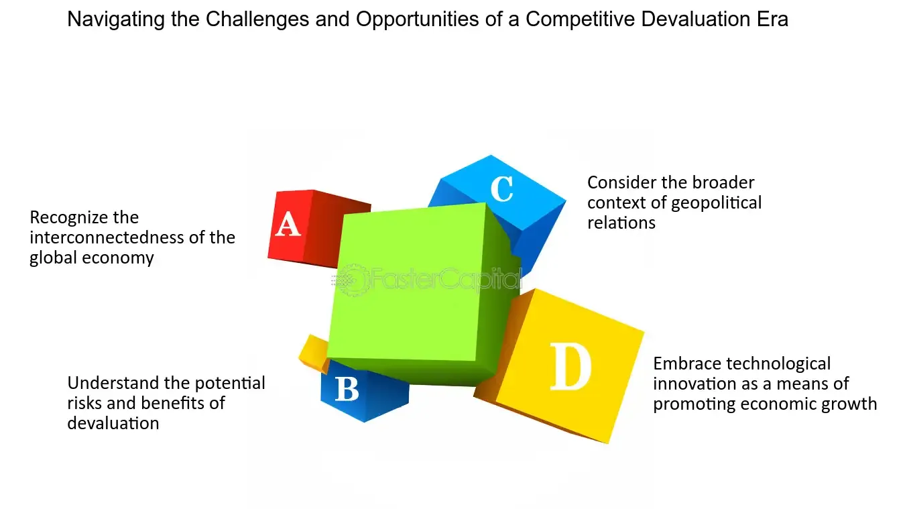

## Table of Contents

## What is competitive devaluation?

Competitive devaluation is when countries lower the value of their money on purpose. They do this to make their exports cheaper and more attractive to other countries. When a country's money is worth less, its products cost less in other countries. This can help the country sell more things abroad and make more money.

However, competitive devaluation can lead to problems. If many countries start devaluing their money at the same time, it can turn into a race to the bottom. Each country tries to make its money worth less than the others. This can cause chaos in the world economy and make it hard for countries to trade with each other. It's like a game where everyone loses in the end.

## How does competitive devaluation affect a country's currency?

When a country does competitive devaluation, it makes its own money worth less on purpose. This means that the country's currency becomes weaker compared to other countries' money. If you have money from that country, it won't buy as much stuff from other places as it used to. For example, if you want to buy something from another country, you'll need more of your country's money to get it.

This can be good for the country in some ways. When the country's money is worth less, its products become cheaper for people in other countries to buy. This can help the country sell more things abroad and make more money from exports. But it can also cause problems. If other countries start doing the same thing, it can lead to a situation where everyone's money is worth less and less. This can make it hard for people to know how much their money is really worth and can cause big problems in the world's economy.

## What are the primary goals of engaging in competitive devaluation?

The main goal of competitive devaluation is to make a country's exports cheaper and more attractive to buyers in other countries. When a country lowers the value of its money, its products cost less in foreign markets. This can help the country sell more goods abroad, which can lead to more jobs and more money coming into the country. For example, if a country makes cars, and it makes its money worth less, those cars will be cheaper for people in other countries to buy. This can help the car company sell more cars and make more money.

However, competitive devaluation is not just about selling more stuff. It's also about trying to get an edge over other countries in the global market. When a country devalues its currency, it can make its products more competitive compared to products from other countries. This can help the country gain a bigger share of the world market. But it can also start a chain reaction where other countries do the same thing, leading to a situation where everyone's money is worth less and less. This can cause big problems in the world economy and make it hard for countries to trade with each other.

## Can you explain the process of how a country might implement competitive devaluation?

To implement competitive devaluation, a country's central bank or government might decide to lower the value of its currency on purpose. They can do this in a few ways. One way is by increasing the supply of money in the economy. This can be done by printing more money or by lowering interest rates, which makes it cheaper to borrow money. When there's more money around, each unit of the currency becomes worth less. Another way is by directly intervening in the foreign exchange market. The central bank can sell its own currency and buy foreign currencies, which makes the value of its own currency go down compared to others.

Once the currency is devalued, the country's products become cheaper for people in other countries to buy. This can help the country sell more things abroad and make more money from exports. For example, if a country makes toys and it devalues its currency, those toys will cost less for people in other countries, so they might buy more of them. However, this strategy can lead to problems if other countries start doing the same thing. It can turn into a race where everyone tries to make their money worth less and less, which can cause big problems in the world economy and make it hard for countries to trade with each other.

## What are the potential benefits of competitive devaluation for a country's economy?

Competitive devaluation can help a country's economy by making its products cheaper for people in other countries to buy. When a country lowers the value of its money, its exports become more attractive in the global market. This can lead to more sales abroad, which means more money coming into the country. For example, if a country makes shoes and it devalues its currency, those shoes will cost less for people in other countries. This can help the shoe company sell more shoes and make more money, which can lead to more jobs and a stronger economy.

However, the benefits of competitive devaluation don't stop at just selling more stuff. It can also help a country gain a bigger share of the world market. When a country's products are cheaper, they can compete better against products from other countries. This can help the country grow its economy and become more important in the global market. But it's important to remember that these benefits can come with risks, especially if other countries start doing the same thing and it leads to problems in the world economy.

## What are the risks and challenges associated with competitive devaluation?

Competitive devaluation can lead to big problems if many countries start doing it at the same time. It can turn into a race where everyone tries to make their money worth less and less. This can cause chaos in the world economy and make it hard for countries to trade with each other. If everyone's money is worth less, it can be tough to know how much things really cost. This can make it hard for businesses to plan and for people to save money.

Another risk is that other countries might not like it when one country devalues its money. They might see it as unfair and start putting up barriers to trade, like tariffs or quotas. This can make it hard for the country that devalued its money to sell things abroad. It can also lead to tension and disagreements between countries, which can hurt the global economy even more.

Lastly, competitive devaluation can lead to inflation at home. When a country's money is worth less, it can make things from other countries more expensive. This can make prices go up in the country, which can hurt people who live there. If prices keep going up, it can make it hard for people to afford things they need. This can slow down the economy and make it hard for the country to grow.

## How does competitive devaluation impact international trade?

Competitive devaluation makes a country's exports cheaper for other countries to buy. When a country lowers the value of its money, its products cost less in foreign markets. This can help the country sell more things abroad and make more money. For example, if a country makes toys and it devalues its currency, those toys will be cheaper for people in other countries, so they might buy more of them. This can lead to more jobs and a stronger economy in the country that devalued its currency.

However, competitive devaluation can cause problems in international trade if many countries start doing it at the same time. It can turn into a race where everyone tries to make their money worth less and less. This can make it hard for countries to know how much things really cost and can cause chaos in the world economy. Other countries might not like it and could put up barriers to trade, like tariffs or quotas, which can make it hard for the country that devalued its money to sell things abroad. This can lead to tension and disagreements between countries, hurting the global economy.

## What role does the exchange rate play in competitive devaluation strategies?

The exchange rate is really important when a country uses competitive devaluation. It's the price of one country's money compared to another country's money. When a country wants to make its exports cheaper, it lowers the value of its own money. This means the exchange rate changes so that it takes more of the country's money to buy foreign money. For example, if a country makes cars and it lowers its exchange rate, those cars will cost less for people in other countries. This can help the car company sell more cars and make more money.

But changing the exchange rate can cause problems too. If lots of countries start lowering their exchange rates at the same time, it can turn into a race to the bottom. Everyone's money becomes worth less and less, which can make it hard for people to know how much things really cost. This can cause big problems in the world economy and make it hard for countries to trade with each other. It's like a game where everyone loses in the end.

## Can you discuss a historical case study where competitive devaluation was used, and what were the outcomes?

A famous example of competitive devaluation happened during the 1930s, in the time of the Great Depression. Many countries were struggling and wanted to help their economies by selling more things to other countries. One of the biggest events was when the United Kingdom left the gold standard in 1931 and let its money, the pound, become worth less. This made British products cheaper for other countries to buy. Other countries, like the United States and Japan, did the same thing. They all wanted to make their products cheaper and sell more of them.

This led to a big problem called the "currency war." Countries kept making their money worth less and less, trying to get an advantage over each other. It made things very confusing and hard for countries to trade with each other. In the end, it didn't really help the world economy get better. It just made things more chaotic. This showed that competitive devaluation can lead to big problems if many countries do it at the same time. It's like a game where everyone loses in the end.

## How do global economic policies and international agreements influence the effectiveness of competitive devaluation?

Global economic policies and international agreements can make competitive devaluation harder for a country to do. These rules are set up to keep things fair and stop countries from trying to cheat by making their money worth less. For example, countries in the World Trade Organization (WTO) have to follow certain rules about how they handle their money. If a country tries to devalue its currency too much, other countries might complain and say it's not fair. This can lead to disagreements and even punishments, like tariffs or trade barriers, which can make the country's products harder to sell abroad.

Also, international agreements like the ones made by the International Monetary Fund (IMF) can affect how well competitive devaluation works. The IMF tries to keep the world economy stable by watching how countries handle their money. If a country starts devaluing its currency in a way that could hurt the world economy, the IMF might step in and tell the country to stop. This means that countries have to think carefully about the rules and agreements they've signed before they try to make their money worth less. These global policies and agreements can stop competitive devaluation from being as effective as a country might hope.

## What are the ethical considerations and international criticisms of using competitive devaluation?

Using competitive devaluation can be seen as unfair by other countries. When a country makes its money worth less on purpose, it can hurt other countries that are trying to sell their own products. This can lead to tension and disagreements between countries. Some people think it's not right to try to get an advantage in this way, because it can make the world economy less stable. It's like trying to win a race by cheating, which can make other countries angry and lead to trade fights.

International criticism of competitive devaluation often focuses on how it can hurt global trade. When many countries start devaluing their money at the same time, it can turn into a race to the bottom. This can cause big problems for everyone, making it hard to know how much things really cost and leading to chaos in the world economy. Countries that follow the rules might feel cheated and could start putting up barriers to trade, like tariffs or quotas, which can make things even worse. This is why many people think competitive devaluation is a bad idea that can hurt everyone in the long run.

## How can countries mitigate the negative effects of competitive devaluation while maximizing its benefits?

To lessen the bad effects of competitive devaluation and make the most of its good sides, countries can work together and talk to each other. By sharing information and working on common goals, countries can avoid starting a race to make their money worth less and less. They can agree on rules and ways to keep the world economy stable. For example, countries can use groups like the World Trade Organization (WTO) or the International Monetary Fund (IMF) to make sure everyone plays fair. This can help stop big problems and keep trade going smoothly.

Another way to handle competitive devaluation is by focusing on other ways to grow the economy. Instead of just making their money worth less, countries can invest in things like education, technology, and new ways of making things. This can help them make better products that people want to buy, even if the money isn't as cheap. By doing this, countries can sell more things abroad without causing problems with other countries. It's a way to grow the economy that's good for everyone in the long run.

## References & Further Reading

[1]: Kazanas, P., & Thomaidis, N. S. (2013). ["Algorithmic trading and volatility: A rigorous data-driven examination"](https://ieeexplore.ieee.org/document/9177735). The Journal of Economic Asymmetries.

[2]: Froot, K. A., & Thaler, R. H. (1990). ["Foreign exchange"](https://www.aeaweb.org/articles?id=10.1257/jep.4.3.179). The Journal of Financial Economics.

[3]: Obstfeld, M. (1993). ["International Currency Experience: New Lessons and Old"](https://www.brookings.edu/wp-content/uploads/1995/01/1995a_bpea_obstfeld_dornbusch_mckinnon.pdf). Brookings Papers on Economic Activity.

[4]: Lopez de Prado, M. (2018). ["Advances in Financial Machine Learning"](https://www.amazon.com/Advances-Financial-Machine-Learning-Marcos/dp/1119482089). John Wiley & Sons.

[5]: O'Brien, R., & Cummins, M. (2015). ["Currency Wars and the Global Balance of Payments"](https://ijicc.net/images/Vol2iss1/Obrien_and_murray_May_2015.pdf). Routledge.