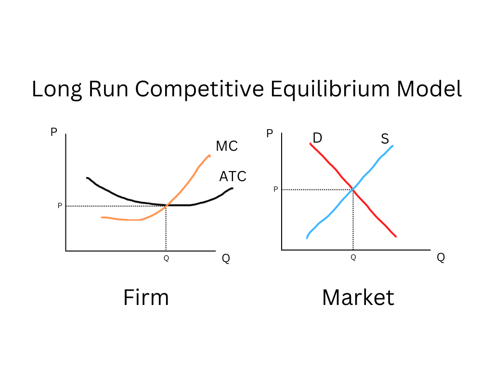

## Table of Contents

## What is competitive equilibrium in economics?

Competitive equilibrium is a concept in economics that describes a state where the market is balanced. It happens when the supply of goods matches the demand for those goods. In this state, the price of the goods is stable, and everyone is happy with the amount they are buying or selling. This balance is important because it helps the economy run smoothly.

To reach a competitive equilibrium, many buyers and sellers must be in the market. They all compete with each other, which helps set the right price. If the price is too high, fewer people will buy the goods, and sellers will have to lower their prices. If the price is too low, more people will want to buy, and sellers might raise their prices. This back-and-forth continues until the market finds the perfect balance, where the amount people want to buy equals the amount sellers want to sell.

## How does competitive equilibrium occur in a market?

Competitive equilibrium happens in a market when the amount of goods people want to buy is the same as the amount sellers want to sell. This balance is reached through a lot of buying and selling. Imagine a big market where many people are trying to buy things, and many others are trying to sell them. Everyone is competing with each other. Buyers want to get the best deal, and sellers want to make the most money. This competition helps set the right price for the goods.

When the price is too high, fewer people will want to buy, so sellers will have to lower their prices to sell their goods. On the other hand, if the price is too low, more people will want to buy, and sellers might raise their prices because they know people will still buy. This back-and-forth continues until the market finds the perfect balance. At this point, the price is just right, and the amount people want to buy matches the amount sellers want to sell. This is what we call a competitive equilibrium, where everyone is satisfied with the price and the amount they are buying or selling.

## What are the basic conditions required for a competitive equilibrium?

For a competitive equilibrium to happen, there need to be many buyers and sellers in the market. This is important because when there are lots of people buying and selling, they all compete with each other. This competition helps set the right price for the goods. If there were only a few buyers or sellers, they could control the market and set prices that might not be fair.

Another condition is that everyone in the market needs to have good information. Buyers should know about the goods they want to buy, and sellers should know about the demand for their goods. When everyone has good information, they can make smart choices about buying and selling. This helps the market find the right balance where the amount people want to buy matches the amount sellers want to sell.

Lastly, the goods being sold should be similar. If all the goods are pretty much the same, it's easier for the market to find a balance. If the goods are very different, it might be hard to set a price that everyone agrees on. When the goods are similar, buyers can easily compare prices and make choices, and sellers can adjust their prices to match what people are willing to pay.

## Can you explain the concept of supply and demand in relation to competitive equilibrium?

Supply and demand are key to understanding how competitive equilibrium works in a market. Supply is about how much of a product sellers are willing to sell. Demand is about how much of that product buyers want to buy. When the supply and demand are equal, the market reaches a competitive equilibrium. This means that the price of the product is just right, and everyone is happy with how much they are buying or selling.

In a market, the price of a product changes based on supply and demand. If the price is too high, fewer people will want to buy the product, so the demand goes down. Sellers will then lower their prices to sell more of their goods. If the price is too low, more people will want to buy, and the demand goes up. Sellers might raise their prices because they know people will still buy. This back-and-forth continues until the supply matches the demand, and the market finds the perfect balance. At this point, the market is in a competitive equilibrium, where the price is stable, and everyone is satisfied.

## What role do prices play in achieving competitive equilibrium?

Prices are super important for reaching a competitive equilibrium. They act like a guide for both buyers and sellers. When prices are high, fewer people want to buy, so the demand goes down. This tells sellers that they need to lower their prices if they want to sell more of their goods. On the other hand, if prices are low, more people will want to buy, so the demand goes up. This tells sellers that they can raise their prices a bit because people will still buy their goods.

This back-and-forth with prices keeps happening until the market finds the perfect balance. When the price is just right, the amount people want to buy matches the amount sellers want to sell. This is the competitive equilibrium, where everyone is happy with the price and the amount they are buying or selling. Prices help the market find this balance by sending signals to buyers and sellers about what they should do next.

## How does the concept of Pareto efficiency relate to competitive equilibrium?

Pareto efficiency is a concept that means you can't make someone better off without making someone else worse off. In a market, this idea connects to competitive equilibrium because when the market reaches a competitive equilibrium, it often leads to a situation that is close to Pareto efficient. At this point, the amount of goods people want to buy matches the amount sellers want to sell, and the price is just right. This balance means that resources are being used in the best way possible, and it's hard to make one person better off without hurting someone else.

However, just because a market is in a competitive equilibrium doesn't mean it's always Pareto efficient. There can be other factors, like taxes or rules, that stop the market from being perfectly efficient. But in a perfect world, where there are no such barriers, a competitive equilibrium would lead to a Pareto efficient outcome. This is why economists often talk about competitive equilibrium and Pareto efficiency together – they both help us understand how well a market is working and how resources are being shared among people.

## What are some common misconceptions about competitive equilibrium?

One common misconception about competitive equilibrium is that it always leads to a perfect and fair outcome for everyone. While competitive equilibrium means the market is balanced and the amount people want to buy matches the amount sellers want to sell, it doesn't mean everyone is happy. Some people might still want to buy more but can't afford it, or sellers might not be making as much profit as they hoped. It's a balance, but not necessarily a perfect one.

Another misconception is that competitive equilibrium happens quickly and easily. In reality, it can take a lot of time and many changes in prices before the market finds the right balance. Prices go up and down as buyers and sellers figure out what works. It's like a dance where everyone is trying to find the right steps, and it can be messy and slow.

Lastly, some people think that competitive equilibrium means the market is always stable. But even when a market reaches a competitive equilibrium, things can change. New products might come out, or people's tastes might change, which can throw the market out of balance again. So, competitive equilibrium is more like a temporary state that the market is always working to reach, not a permanent solution.

## How do externalities affect the occurrence of competitive equilibrium?

Externalities are things that affect other people but aren't part of the buying and selling in the market. They can mess up the competitive equilibrium because they change how much people want to buy or sell. For example, if a factory pollutes the air, it's an externality. The factory might not care about the pollution because they don't have to pay for it, but people living nearby might not want to buy things from that factory because of the pollution. This means the demand for the factory's goods might be lower than it should be, and the market can't reach a competitive equilibrium easily.

Because of externalities, the price of goods might not show their true cost to society. If the factory had to pay for the pollution, the price of their goods would be higher. This higher price would make people buy less, and the market would find a new balance. But without considering the externality, the market might think it's in a competitive equilibrium when it's really not. So, externalities can make it hard for the market to find the right balance where supply matches demand and everyone is happy with the price.

## What are the limitations of the competitive equilibrium model in real-world scenarios?

The competitive equilibrium model works well in theory, but it has some problems when we look at real life. One big problem is that it assumes everyone has perfect information. In the real world, people often don't know everything about the goods they want to buy or the demand for the goods they want to sell. This can make it hard for the market to find the right balance. Another issue is that the model assumes there are many buyers and sellers, all competing with each other. But in many markets, there might be only a few big companies, which can control prices and stop the market from reaching a true competitive equilibrium.

Externalities are another thing that can mess up the competitive equilibrium. These are costs or benefits that affect other people but aren't part of the buying and selling in the market. For example, pollution from a factory can make people not want to buy from that factory, even if the price is right. This means the demand might be lower than it should be, and the market can't reach a true equilibrium. Also, the model assumes that goods are similar, but in real life, products can be very different, which can make it hard to set a price that everyone agrees on.

Lastly, the competitive equilibrium model doesn't always account for things like taxes, regulations, and other government policies. These can change how much people want to buy or sell and can stop the market from finding the right balance. Even when a market seems to be in equilibrium, new products or changes in people's tastes can throw it off balance again. So, while the competitive equilibrium model is useful for understanding how markets work, it has limitations that make it less perfect in real-world situations.

## How can government policies influence or disrupt competitive equilibrium?

Government policies can really change how a market works and affect its competitive equilibrium. For example, if the government puts a tax on a product, it makes the product more expensive. This can make people buy less of it, which means the demand goes down. Sellers might then have to lower their prices to sell their goods, which can throw the market out of balance. On the other hand, if the government gives money to people to buy certain things, like subsidies for electric cars, it can make the demand go up. This might make sellers raise their prices because they know people will buy more. Either way, these policies can stop the market from finding the right balance where supply matches demand.

Regulations are another way the government can mess with competitive equilibrium. If the government makes new rules about how products can be made or sold, it can change how much people want to buy or sell. For example, if there's a new rule that makes it harder for companies to pollute, it might make their products more expensive. This can make people buy less, and the market might not reach a true equilibrium. Also, if the government sets a minimum price for something, like a minimum wage, it can make it hard for the market to find the right price where everyone is happy. These policies can make the market less efficient and stop it from reaching a competitive equilibrium easily.

## What advanced mathematical models are used to analyze competitive equilibrium?

To understand competitive equilibrium better, economists use advanced mathematical models. One popular model is called the general equilibrium model. This model looks at how different markets in an economy are connected. It uses a lot of equations to show how prices and amounts of goods change in many markets at the same time. The goal is to find a set of prices where all markets are in balance. This model can be hard to solve because it involves so many different parts of the economy, but it helps economists see how changes in one market can affect others.

Another important model is the Arrow-Debreu model, named after the economists who made it. This model is a bit like the general equilibrium model but focuses more on how people make choices based on their preferences and the resources they have. It uses math to show how everyone's choices come together to create a competitive equilibrium. The Arrow-Debreu model is useful because it can show how markets work in a perfect world, where everyone has all the information they need and there are no externalities. Even though real life is more complicated, this model helps economists understand the basic ideas behind competitive equilibrium.

## How does the theory of general equilibrium extend the concept of competitive equilibrium?

The theory of general equilibrium takes the idea of competitive equilibrium and makes it bigger. It looks at how all the different markets in an economy work together. In a competitive equilibrium, one market is balanced when the supply of a good matches the demand for that good. But in the real world, many markets are connected. For example, if the price of wheat goes up, it can affect the price of bread, and then the price of sandwiches. The general equilibrium model uses a lot of math to show how prices and amounts of goods change in all these markets at the same time. It helps economists see how changes in one market can affect others and find a set of prices where all markets are in balance.

The general equilibrium model can be really hard to solve because it involves so many different parts of the economy. But it's a powerful tool for understanding how an economy works as a whole. By looking at all the markets together, economists can see how things like taxes, new technology, or changes in people's tastes can throw the whole economy out of balance. This model helps them figure out how to make the economy more efficient and fair. Even though it's based on a lot of math and assumptions that might not be true in real life, the general equilibrium model gives economists a way to think about the big picture and how all the parts of an economy fit together.

## What is Understanding Market Equilibrium?

Market equilibrium is a fundamental concept in economics that occurs when the quantity of a good or service supplied equals the quantity demanded at a particular price level. This state ensures that there are no shortages or surpluses in the market, allowing for stable and predictable economic transactions. It reflects a situation where the intentions of buyers and sellers are perfectly aligned, and all market participants are satisfied with the current price and quantity. 

The dynamics of market equilibrium can be understood through the interaction of supply and demand curves. The demand curve typically slopes downward, illustrating that as the price of a good decreases, the quantity demanded increases, and vice versa. This negative relationship is rooted in the concept of marginal utility, where consumers derive less satisfaction from each additional unit consumed, thereby requiring lower prices for higher quantities.

Conversely, the supply curve generally slopes upward, indicating that as the price increases, the quantity supplied also increases. This relationship reflects producers' motivations to increase production at higher prices, which lead to higher potential profits. The intersection of the supply and demand curves represents the equilibrium point, where the market price and quantity are established.

To express this mathematically, consider the demand function $Q_d = f(P)$ and the supply function $Q_s = g(P)$, where $Q_d$ and $Q_s$ are the quantities demanded and supplied, respectively, and $P$ is the price. Market equilibrium is achieved when:

$$
f(P) = g(P)
$$

At equilibrium, the market is cleared—no excess supply or demand exists. This balance promotes efficiency, where resources are optimally allocated, producing neither waste nor unmet demand.

Competition plays a critical role in maintaining market equilibrium. It ensures that prices remain fair and reflect the true cost of goods and services. In competitive markets, producers are incentivized to innovate and improve their offerings to capture consumer interest. Consumers, on the other hand, benefit from a variety of choices and competitive pricing, maximizing their value from expenditures.

The interaction of these forces in achieving equilibrium is essential for the smooth functioning of economies. Market signals, in the form of price adjustments, ensure that any deviations from equilibrium are corrected. For instance, if a surplus occurs (where $Q_s > Q_d$), prices tend to fall, reducing the quantity supplied and increasing the quantity demanded until equilibrium is restored. Conversely, a shortage (where $Q_d > Q_s$) leads to rising prices, which encourages greater supply and reduces demand, again guiding the market back to equilibrium.

This fundamental interplay of supply and demand forms the backbone of market economies, facilitating decision-making by businesses and consumers alike. Understanding these dynamics is crucial for predicting market behavior and crafting economic policies that aim to enhance market efficiency and welfare.

## What is Competitive Equilibrium in Economic Theory?

Competitive equilibrium serves as a foundational concept in economic theory, signifying an optimal allocation of resources within a market. It describes a state where supply equals demand, and market prices are such that both producers and consumers maximize their utilities. In a fully competitive market, this equilibrium is reached through the decentralized decisions of numerous market participants.

The essence of competitive equilibrium relies on several theoretical assumptions. One critical assumption is the presence of perfect information—both buyers and sellers are fully informed about prices and products, allowing them to make rational choices. Another assumption is zero transaction costs, implying no expenditure is incurred in making exchanges within the marketplace. These conditions facilitate the flow of information and resources, ensuring that markets operate efficiently.

However, these assumptions often do not hold in practical scenarios. Markets are typically characterized by information asymmetries, where either the buyer or the seller holds more information than the other, and transaction costs are rarely negligible. Despite these discrepancies, competitive equilibrium is still valued as a benchmark for theoretical analysis. 

Theoretical models define competitive equilibrium through a set of equations that represent the behavior of consumers and producers. Such models typically rely on the equilibrium conditions of demand and supply functions. Mathematically, this can be represented as:

$$
Q_d(p) = Q_s(p)
$$

where $Q_d(p)$ is the quantity demanded at price $p$ and $Q_s(p)$ is the quantity supplied at price $p$. The equilibrium price is found where these two functions intersect.

In welfare economics, competitive equilibrium is instrumental since it leads to Pareto efficiency, a state where no individual can be made better off without making someone else worse off. This concept is crucial because it provides a normative benchmark to evaluate the efficiency of economic outcomes.

The First and Second Welfare Theorems play a significant role in connecting competitive equilibrium with welfare outcomes. The First Welfare Theorem posits that any competitive equilibrium leads to a Pareto efficient allocation of resources. Conversely, the Second Welfare Theorem states that any Pareto efficient allocation can be achieved through a competitive equilibrium given some redistribution of initial endowments.

Despite its limitations, competitive equilibrium remains a vital tool in economic analysis, offering insights into how idealized market conditions lead to optimal resource allocation. Its implications extend to welfare economics, emphasizing the importance of competitive markets in enhancing social welfare.

## References & Further Reading

[1]: Varian, H. R. (1992). ["Microeconomic Analysis"](https://archive.org/details/microeconomicana0000vari_g1b1) (3rd ed.). W.W. Norton & Company.

[2]: Debreu, G. (1959). ["Theory of Value: An Axiomatic Analysis of Economic Equilibrium."](https://archive.org/details/theoryofvalueaxi0000debr) Yale University Press.

[3]: Fama, E. F. (1970). ["Efficient Capital Markets: A Review of Theory and Empirical Work."](https://www.jstor.org/stable/2325486) The Journal of Finance, 25(2), 383-417.

[4]: Friedman, M., & Savage, L. J. (1948). ["The Utility Analysis of Choices Involving Risk."](https://www.journals.uchicago.edu/doi/10.1086/256692) Journal of Political Economy, 56(4), 279-304.

[5]: Harris, L. (2003). ["Trading and Exchanges: Market Microstructure for Practitioners."](https://www.amazon.com/Trading-Exchanges-Market-Microstructure-Practitioners/dp/0195144708) Oxford University Press.

[6]: Hasbrouck, J. (1995). ["One Security, Many Markets: Determining the Contributions to Price Discovery."](https://www.bauer.uh.edu/rsusmel/phd/hasbrouck95.pdf) The Journal of Finance, 50(4), 1175-1199.

[7]: Easley, D., & O'Hara, M. (1992). ["Time and the Process of Security Price Adjustment."](https://onlinelibrary.wiley.com/doi/abs/10.1111/j.1540-6261.1992.tb04402.x) The Journal of Finance, 47(2), 577-606.