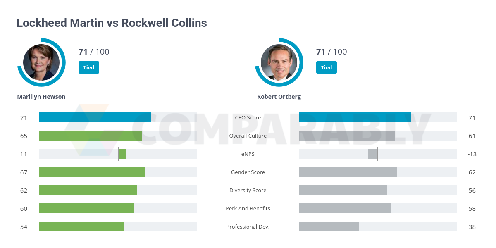

## Table of Contents

## What is Lockheed Martin Corporation known for?

Lockheed Martin Corporation is a big company that makes things for the military and space. They are known for making airplanes, helicopters, and satellites. They also work on defense systems to keep countries safe. People often hear about Lockheed Martin because they help with space missions and make important equipment for the military.

The company started a long time ago and has grown to be very important in the United States. They have worked on famous projects like the F-35 fighter jet and the Orion spacecraft. Lockheed Martin also helps with technology for space exploration, like missions to Mars. Many countries and governments trust Lockheed Martin to provide them with advanced technology and equipment.

## Who are the main competitors of Lockheed Martin in the aerospace industry?

Lockheed Martin has several big competitors in the aerospace industry. One of the main ones is Boeing. Boeing is known for making airplanes, both for regular people to fly on and for the military. They also work on space projects, like the International Space Station. Another important competitor is Northrop Grumman. They make military planes, drones, and satellites. They are also involved in space technology and work on projects for NASA.

Another competitor is Raytheon Technologies. They focus on making defense systems, like missiles and radars. They also work on jet engines and other aerospace technologies. Airbus is another big player, mostly known for making commercial airplanes, but they also have a defense and space division that competes with Lockheed Martin.

These companies all try to get big contracts from governments and military groups around the world. They compete to make the best technology and products in areas like defense, space exploration, and commercial aviation. Each company has its own strengths and areas where they focus their efforts.

## How does Lockheed Martin compare to Boeing in terms of market share?

Lockheed Martin and Boeing are both big in the aerospace industry, but they focus on different things. Lockheed Martin is known more for making things for the military and space, like fighter jets and satellites. Boeing, on the other hand, makes a lot of airplanes for regular people to fly on, like the 737 and 787, but they also make military stuff. Because of this, their market shares can be different depending on what part of the industry you look at.

In the military and defense part of the industry, Lockheed Martin often has a bigger share because they focus a lot on that. They make things like the F-35 jet, which many countries buy. Boeing also has a good share in defense, but they are more known for their commercial airplanes. So, if you look at the whole aerospace industry, Boeing might have a bigger overall market share because they sell a lot of commercial planes. But in defense and space, Lockheed Martin is usually stronger.

## What are the key products offered by Northrop Grumman that compete with Lockheed Martin?

Northrop Grumman makes several things that compete with Lockheed Martin. One of their big products is the B-2 Spirit stealth bomber. This is a special plane that can fly without being easily seen by radar, and it's used by the U.S. military. They also make the RQ-4 Global Hawk, which is a drone that can fly high and take pictures and gather information from far away. These products are in the same category as some of Lockheed Martin's planes and drones, so they compete for the same customers.

Another key product from Northrop Grumman is the James Webb Space Telescope, which they helped build with other companies. This competes with Lockheed Martin's work in space technology, like the Orion spacecraft. Northrop Grumman also makes satellites, like the ones used for communication and spying. These satellites go head-to-head with Lockheed Martin's satellite offerings. Both companies try to win contracts from governments and military groups for these high-tech products.

## How do the defense contracting strategies of Lockheed Martin and Raytheon Technologies differ?

Lockheed Martin and Raytheon Technologies have different ways of getting defense contracts. Lockheed Martin often focuses on making whole systems, like fighter jets or spacecraft. They work on big projects that need a lot of planning and technology, like the F-35 jet or the Orion spacecraft. They try to be the main company that governments and militaries go to for these big, important projects. They also invest a lot in research and development to keep making new and better technology.

Raytheon Technologies, on the other hand, focuses more on making parts of defense systems, like missiles, radars, and jet engines. They often work with other companies to put their parts into bigger systems. For example, Raytheon might make the missiles for a jet that another company builds. They try to be experts in specific areas and sell their parts to many different customers. This way, they can work on lots of projects at the same time and spread their business around.

## What role does General Dynamics play in competing with Lockheed Martin in the military sector?

General Dynamics is another big company that competes with Lockheed Martin in the military sector. They make a lot of different things for the military, like tanks, submarines, and ships. One of their famous products is the M1 Abrams tank, which many countries use. General Dynamics also makes weapons and other equipment that soldiers use. This means they compete with Lockheed Martin in areas where Lockheed Martin makes similar products, like military vehicles and equipment.

Even though Lockheed Martin focuses more on planes and space technology, General Dynamics still plays a big role in the military industry. They try to win contracts from the government and military groups by showing that their products are strong and reliable. Both companies want to be the ones that the military trusts to give them the best equipment. So, General Dynamics is an important competitor to Lockheed Martin, especially when it comes to things like tanks and ships.

## How has the competition between Lockheed Martin and Airbus evolved in recent years?

In recent years, the competition between Lockheed Martin and Airbus has grown in the area of military and defense. Lockheed Martin is known for making fighter jets and other military planes, while Airbus has been working on its own military projects. Airbus has a division called Airbus Defence and Space, which makes things like the A400M military transport plane. This plane competes with Lockheed Martin's C-130 Hercules, which is also used to move troops and supplies. Both companies are trying to get big contracts from different countries' militaries, so they are always trying to make their products better and more appealing.

The competition has also spread to the space industry. Lockheed Martin works on big space projects like the Orion spacecraft, which is meant to take people to the Moon and Mars. Airbus, on the other hand, is involved in projects like the European Service Module for the Orion spacecraft and the Ariane rocket. Both companies want to be leaders in space technology, so they are always trying to come up with new ideas and technology. As space exploration becomes more important, the competition between Lockheed Martin and Airbus in this area is likely to keep growing.

## What technological innovations are BAE Systems developing that challenge Lockheed Martin's position?

BAE Systems is working on new technology that could challenge Lockheed Martin's position in the military industry. One big area they are focusing on is electronic warfare. This means they are making new systems to help military planes and ships avoid being detected by enemy radars. BAE Systems is also developing new kinds of weapons, like smart missiles that can hit targets more accurately. These innovations could make BAE Systems a bigger competitor to Lockheed Martin, especially in the areas of defense and security.

Another area where BAE Systems is innovating is in cyber security. They are creating new ways to protect military and government computer systems from being hacked. This is important because more and more military operations rely on technology and digital communication. BAE Systems' work in cyber security could help them win more contracts and challenge Lockheed Martin, who also works on similar technologies. By focusing on these new areas, BAE Systems is trying to stay ahead and compete with Lockheed Martin in the fast-changing world of defense technology.

## How do the financial performances of Lockheed Martin and its competitors like L3Harris Technologies stack up?

Lockheed Martin and L3Harris Technologies both do well in the defense industry, but their financial performances can be different. Lockheed Martin is a big company with a lot of money coming in every year. They make a lot of money from selling things like fighter jets and satellites to the military and governments. In recent years, Lockheed Martin has had strong sales and profits because they have big, long-term contracts. This makes their financial performance stable and reliable, which is good for investors who like steady growth.

L3Harris Technologies is also a strong company, but it's a bit smaller than Lockheed Martin. They focus on making things like communication systems, electronic equipment, and space technology. L3Harris has been growing its business by buying other companies and expanding what they can offer. Their financial performance has been good, with increasing sales and profits. However, because they are smaller, their growth can sometimes be faster than Lockheed Martin's, but it can also be less stable because they don't have as many big, long-term contracts.

## What are the global market implications of the competition between Lockheed Martin and Thales Group?

The competition between Lockheed Martin and Thales Group has big effects on the global market. Lockheed Martin is a big American company that makes a lot of things for the military and space. Thales Group is a big company from France that also works on defense and security, but they focus a lot on things like communication systems and cybersecurity. When these two companies compete, it can change what products countries buy and how much they pay. Countries might choose Lockheed Martin if they want big systems like fighter jets, or they might go with Thales for more specialized technology. This competition can make prices go down because each company wants to offer the best deal.

The rivalry also pushes both companies to keep coming up with new ideas and better technology. Lockheed Martin might make a new kind of satellite, and then Thales Group might come up with a new way to protect it from being hacked. This back-and-forth makes the whole industry better because it encourages new inventions and improvements. It can also affect where companies set up their factories and offices, as they try to be closer to big customers in different countries. Overall, the competition between Lockheed Martin and Thales Group makes the global defense and technology market more exciting and innovative.

## How do emerging companies like SpaceX pose a competitive threat to Lockheed Martin?

Emerging companies like SpaceX are shaking things up for big companies like Lockheed Martin. SpaceX, started by Elon Musk, is known for making rockets and spacecraft that can be used over and over again. This means they can do space missions for less money than before. Lockheed Martin also works on space projects, like the Orion spacecraft, but they haven't made reusable rockets yet. So, SpaceX can offer cheaper services, which might make some customers choose them over Lockheed Martin. This competition is pushing Lockheed Martin to think about new ways to save money and improve their technology.

SpaceX is also working on other things that could challenge Lockheed Martin. For example, they are trying to send people to Mars and are building a big satellite system called Starlink for internet around the world. These projects could take business away from Lockheed Martin, who also wants to be a leader in space exploration and satellite technology. As SpaceX keeps growing and trying new things, Lockheed Martin has to keep up by coming up with their own new ideas and working hard to stay ahead in the space race.

## What future trends might impact the competitive landscape for Lockheed Martin and its rivals?

In the future, more countries might want to spend money on their own space programs. This could mean more competition for Lockheed Martin because other countries might want to buy from new companies that can make space technology cheaper. Also, as technology keeps getting better, things like drones and robots might become more important in the military. Lockheed Martin and its rivals will need to keep up with these new technologies to stay ahead. If they don't, new companies that focus on drones and robots could take away their business.

Another big trend could be more focus on cybersecurity. As more military equipment uses computers and the internet, keeping these systems safe from hackers will be very important. Companies like Lockheed Martin will need to work on new ways to protect their products. If they do this well, they can stay strong in the market. But if other companies come up with better cybersecurity solutions first, they might start to do better than Lockheed Martin. So, keeping up with trends in space, new military tech, and cybersecurity will be key for Lockheed Martin and its competitors.

## References & Further Reading

[1]: Kaplan, M. E. (2002). ["Lockheed Martin's Competitive Edge."](https://www.lockheedmartin.com/content/dam/lockheed-martin/eo/documents/annual-reports/2002-annual-report.pdf) Lockheed Martin Corporation.

[2]: Birkler, J., Garfinkle, S., & Lehman, L. (2001). ["Assessing Competitive Strategies for the Defense Industrial Base."](https://www.semanticscholar.org/paper/Assessing-Competitive-Strategies-for-the-Joint-and-Birkler-Graser/53a3e25c4ffc6d3f8facbbc788959f82111479e8) RAND Corporation.

[3]: ["The Pentagon's Wars: The Military's Undeclared War Against America's Presidents"](https://www.amazon.com/Pentagons-Wars-Militarys-Undeclared-Presidents/dp/0465079717) by Mark Perry

[4]: Gilli, M., & Schumann, E. (2019). ["Financial Signal Processing and Machine Learning."](https://ieeexplore.ieee.org/book/7470479) Mathematics MDPI.

[5]: ["Strategic Market Management"](https://books.google.com/books/about/Strategic_Market_Management.html?id=_TDaEAAAQBAJ) by David A. Aaker