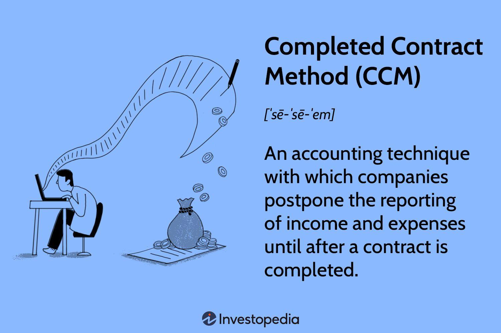

## Table of Contents

## What is the Completed Contract Method in accounting?

The Completed Contract Method is a way of accounting that businesses use when they work on long projects, like building a house or a bridge. Instead of recording income and expenses as the project goes along, the company waits until the whole project is finished. This means they only record the total profit or loss after everything is done. It's useful for projects where it's hard to tell how much money you'll make until the end.

This method can be helpful because it keeps the company's financial statements from showing big changes in income while the project is still going on. If something goes wrong or costs more than expected, the company doesn't have to show a loss until the project is over. But, it can also make it hard to see how the business is doing while the project is happening, because you won't see any income from that project until it's finished.

## How does the Completed Contract Method differ from the Percentage of Completion Method?

The Completed Contract Method and the Percentage of Completion Method are two different ways businesses can account for long-term projects. With the Completed Contract Method, a company waits until the entire project is finished before recording any income or expenses. This means they only report the total profit or loss at the end of the project. It's like saving up all the financial news about the project and only sharing it once everything is done. This method is useful when it's hard to predict the project's outcome until it's complete, and it helps keep the company's financial statements stable during the project.

On the other hand, the Percentage of Completion Method involves recording income and expenses as the project progresses. This method estimates the project's completion percentage and recognizes revenue and costs based on that estimate. For example, if a project is 50% done, the company would report half of the expected total profit. This approach gives a more current view of the company's financial health during the project but can lead to changes in reported income if estimates change or if the project faces unexpected issues.

In summary, the key difference lies in when the financial impact of the project is recognized. The Completed Contract Method waits until the end, providing a clear but delayed picture of the project's financial outcome. The Percentage of Completion Method, however, offers ongoing updates but can be less certain due to the need for regular estimates and adjustments.

## In which situations is the Completed Contract Method most appropriate?

The Completed Contract Method is most appropriate for projects where it's hard to guess the final cost or profit until everything is finished. For example, if a company is building a house and they don't know how much the final costs will be until the last brick is laid, this method helps. It's also good for smaller companies that might not have the resources to keep track of detailed records all the time. They can wait until the project is done to figure out their profit or loss.

Another situation where the Completed Contract Method works well is when a project has a lot of uncertainty. If things keep changing, like the design of a building or the materials needed, it's better to wait until the end to report the financial results. This method keeps the company's financial statements from swinging up and down while the project is going on, which can be helpful for showing a stable financial picture to investors or banks.

## What are the advantages of using the Completed Contract Method?

Using the Completed Contract Method has some big advantages. One of the main ones is that it keeps a company's financial statements from changing a lot while a project is going on. If a project has a lot of ups and downs, like unexpected costs or delays, this method lets the company wait until everything is done before showing any profit or loss. This can make the company look more stable to people like investors or banks, who like to see steady numbers.

Another advantage is that it's easier to use, especially for smaller companies. Instead of keeping track of how much of the project is done and guessing how much profit there will be along the way, they can wait until the end. This means less work on keeping detailed records all the time. It's also good for projects where it's really hard to tell how much money you'll make until the very end. By waiting, the company can give a clear and final picture of the project's financial outcome.

## What are the disadvantages of using the Completed Contract Method?

One big problem with the Completed Contract Method is that it can hide how a company is really doing while a project is going on. If a company is working on a long project, like building a bridge, they won't show any money coming in from that project until it's all done. This can make it hard for people, like investors, to see if the company is doing well or not. They might think the company isn't making any money when it's really just waiting to finish the project.

Another disadvantage is that it can mess up how a company plans its money. If a company only counts the money at the end of a project, they might not have a good idea of how much cash they need while the project is happening. This can lead to problems if they need money to keep the project going but can't show any income from it yet. It can also make it harder to compare how the company is doing from one year to the next, because big projects might finish in different years, making the company's profits look uneven.

## How is revenue recognized under the Completed Contract Method?

Under the Completed Contract Method, a company waits until the whole project is finished before it records any money coming in. So, if a company is building a house, they won't show any income from that project until the house is completely done. This means they only write down the total money they made from the project at the very end, after everything is finished.

This way of recognizing revenue can be good for projects where it's hard to tell how much money the company will make until the end. It keeps the company's financial reports from changing a lot while the project is going on. But it can also make it tough for people looking at the company's money situation to see how well the company is doing during the project, because they won't see any income from that project until it's over.

## Can you explain the impact of the Completed Contract Method on financial statements?

The Completed Contract Method can make a company's financial statements look different than if they used another method. When a company uses this method, they don't show any money coming in from a project until it's all done. This means their income statement might look like they're not making any money while the project is going on, even if they are working hard on it. It can make the company seem like it's not doing well, even though they might be waiting to finish a big project.

This method can also affect the balance sheet. Since the company doesn't record any income until the project is finished, their cash flow might look lower than it really is. They might need money to keep the project going, but because they can't show any income yet, it can be hard to plan for that. It can also make the company's profits look uneven from year to year, because big projects might finish in different years, causing big jumps in income when they do.

## What types of businesses typically use the Completed Contract Method?

The Completed Contract Method is often used by businesses that work on long projects, like construction companies. These companies might build houses, bridges, or other big things that take a long time to finish. They like this method because it's hard to know exactly how much money they'll make until the project is done. It helps them keep their financial reports steady while the project is going on, which can be good for showing investors and banks that they are stable.

Small businesses also use the Completed Contract Method a lot. They might not have the resources to keep detailed records all the time, so waiting until the end of a project to figure out their profit or loss is easier for them. This method is also good for any business working on projects where things keep changing, like the design or the materials needed. By waiting until the end to report the financial results, these businesses can give a clear picture of how the project turned out.

## How does the Completed Contract Method affect tax reporting?

The Completed Contract Method can change how a business reports its taxes. When a company uses this method, they don't report any income from a project until it's all done. This means they might not have to pay taxes on that income until the project is finished, which can help with cash flow. If a project takes a few years, the company can delay paying taxes on the money they make from it until the end.

However, this method can also make a company's taxes look uneven from year to year. If a big project finishes in one year, the company might have a lot more income to report in that year, which could mean a bigger tax bill. This can make it harder to plan for taxes, because the company won't know exactly how much they'll owe until the project is done. It's important for businesses to think about how this method might affect their tax planning and cash flow.

## What are the key criteria that must be met for a contract to qualify for the Completed Contract Method?

For a contract to qualify for the Completed Contract Method, it usually needs to be a long-term project where it's hard to guess the final cost or profit until everything is finished. This could be something like building a house or a bridge, where the costs might change a lot before the project is done. The method is good for projects where there's a lot of uncertainty, so waiting until the end to report the financial results makes sense.

Another important thing is that the business using this method should be okay with not showing any income from the project until it's all done. This means they need to be able to handle their money well while the project is going on, without counting on the income from that project. It's also important that the business can explain to investors and banks why they're using this method, and how it might make their financial statements look different until the project is finished.

## How do changes in estimates affect the Completed Contract Method?

Changes in estimates don't affect the Completed Contract Method much while the project is going on. That's because this method waits until the whole project is done before recording any income or expenses. If the company thinks the costs will be higher or lower, or if they think they'll make more or less money, they don't change their financial reports until the project is finished. This keeps their financial statements steady during the project, even if their guesses about the project change.

But, when the project is done, any changes in estimates will show up in the final numbers. If the company guessed wrong about how much the project would cost or how much money they'd make, they'll see the real profit or loss at the end. This means their financial statements might look very different at the end of the project than they did while it was going on, because all the changes in estimates will be counted at once.

## What are the regulatory and compliance considerations when using the Completed Contract Method?

When a company uses the Completed Contract Method, they need to follow certain rules set by accounting and tax authorities. In the United States, the Internal Revenue Service (IRS) has specific rules about when businesses can use this method for tax purposes. For example, the IRS might allow small construction companies to use it, but bigger companies might need to use another method. The company also needs to make sure they're following the rules set by the Financial Accounting Standards Board (FASB), which helps make sure financial statements are clear and fair.

Using the Completed Contract Method can also affect how a company reports its financials to investors and other people who look at their money situation. Companies need to explain why they're using this method and how it might make their financial statements look different until the project is finished. They also need to be careful about how this method might affect their taxes, because waiting until the end of a project to report income could change when they have to pay taxes. It's important for companies to talk to their accountants and tax advisors to make sure they're doing everything right.

## How does the Completed Contract Method work?

The Completed Contract Method (CCM) operates by deferring the recognition of both revenue and expenses associated with a project until the project is fully completed. Contrary to methods that recognize income incrementally as projects progress, CCM records all costs incurred during the project as Work-In-Progress (WIP). This WIP is essentially a balance sheet asset that accumulates costs until project completion. Upon completion, these accumulated costs are transferred from WIP as an expense recognized against the total revenue from the project.

For example, consider a construction company undertaking a $1 million project with a projected cost of $800,000. As the project progresses, this company records costs such as materials, labor, and overheads into the WIP account. Only upon the project's completion are the full $1 million in revenues recognized, and the $800,000 in costs reclassified from WIP to expenses, effectively calculating a profit of $200,000 in that final period. The equation capturing this transition from WIP to recognized profit can be expressed as follows:

$$
\text{Profit} = \text{Total Revenue} - \text{Total Costs}
$$

The use of CCM can result in significant financial statement fluctuations. This is especially evident when multiple projects conclude within the same accounting period, which may lead to irregular spikes in both revenue and expenses, and subsequently, in profit or loss. This variability is due to the simultaneous recognition of income and expenditures at the time of project completion. Therefore, while CCM provides a straightforward approach to revenue recognition, particularly in scenarios where project progress is difficult to measure accurately, it requires careful management to avoid misleading portrayals of a company's financial health.

## How does the CCM compare with the Percentage of Completion Method?

The Percentage of Completion Method (PCM) and the Completed Contract Method (CCM) are two distinct approaches to recognizing revenue and expenses on long-term contracts. Each method has its advantages and is suited for particular types of projects, based on how progress can be measured and the predictability of project outcomes.

PCM allows for revenue and expenses to be recorded in proportion to the project's progression. This proportional recognition provides a more consistent and realistic depiction of a company’s operational performance over time. It is particularly applicable in scenarios where reliable and continuous measurement of project progress is feasible. For instance, this method is beneficial in industries like construction where the completion and costs incurred can be evaluated at regular intervals. Under PCM, the percentage of project completion can be determined using various methods such as cost-to-cost, units-of-delivery, or efforts expended. The formula for PCM using the cost-to-cost method is:

$$
\text{Percentage\ of\ Completion} = \frac{\text{Costs\ Incurred\ to\ Date}}{\text{Total\ Estimated\ Costs}}
$$

Using PCM, companies can smooth out earnings over the duration of a project, reducing the impact of revenue and expense recognition to fluctuations in accounting periods.

In contrast, CCM is simpler but defers all revenue and expense recognition until project completion. This can cause significant [volatility](/wiki/volatility-trading-strategies) in financial statements as revenues and costs are recognized in a single period, potentially creating misalignments in financial health portrayed to stakeholders. For instance, if a company completes multiple projects in one period, it could show an abrupt spike in revenue and profit, followed by periods with no revenue recognition. This might not accurately reflect the company's steady operational progress and can mislead investors who are evaluating the company's performance trends.

In summary, while PCM offers a systematic and incremental approach, capturing ongoing business activity and performance, CCM provides simplicity by postponing financial recognition until project delivery but risks increasing periodic financial variance. Companies should choose between PCM and CCM by considering project types, the reliability of progress measurements, and strategic financial reporting objectives.

## References & Further Reading

[1]: Revenue Recognition Guide 2023 by Cognizant Business Consulting - This guide offers comprehensive information on various revenue recognition methods, including the Completed Contract Method.

[2]: ["Financial Accounting Standards Board (FASB) - Revenue Recognition."](https://fasb.org/page/PageContent?pageId=/projects/recentlycompleted/revenue-recognition-summary.html) The FASB website provides detailed guidelines on revenue recognition standards and methodologies.

[3]: ["International Financial Reporting Standards (IFRS) - Revenue from Contracts with Customers."](https://www.ifrs.org/issued-standards/list-of-standards/ifrs-15-revenue-from-contracts-with-customers/) This standard outlines the international approach to revenue recognition, including contrasts to CCM.

[4]: ["Construction Accounting & Financial Management"](https://www.pearson.com/en-us/pearsonplus/p/9780137526604) by Steven J. Peterson, a resource on accounting practices in the construction industry, covering methods like CCM and PCM. 

[5]: ["Intermediate Accounting"](https://www.wileyplus.com/accounting/intermediate-accounting-19th-edition-eprof23641/) by Donald E. Kieso, Jerry J. Weygandt, Terry D. Warfield, which includes sections discussing different accounting methods for contracts.

[6]: "Algorithmic Trading and DMA: An introduction to direct access trading strategies" by Barry Johnson, for understanding the application of accounting methods in algorithmic trading.