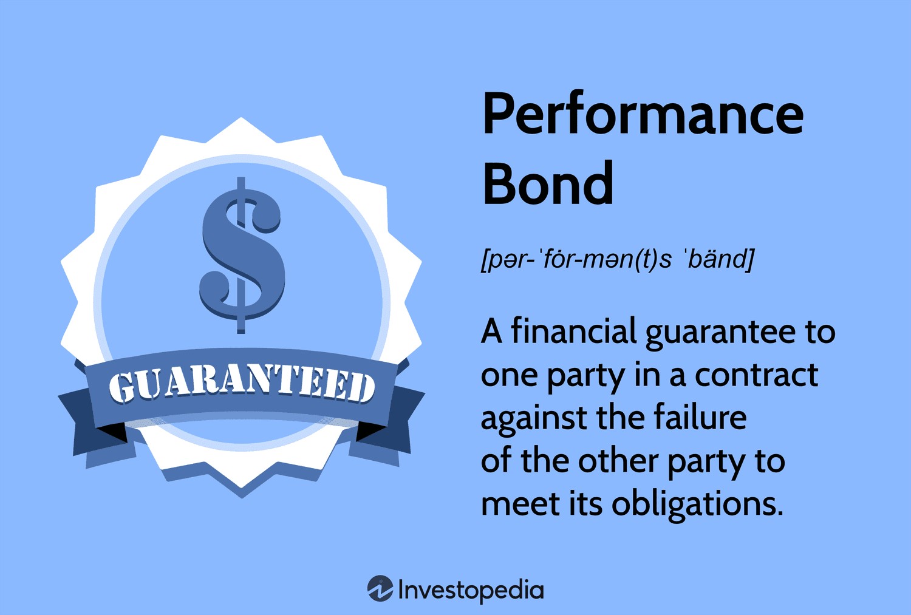

## Table of Contents

## What is a completion bond?

A completion bond is a type of insurance that movie producers use. It makes sure that a film will be finished on time and within the budget. If something goes wrong, like the director quits or the money runs out, the bond company steps in to help finish the movie.

This bond is important because it protects the people who invest money in the film. If the movie is not completed, the investors could lose a lot of money. The bond company makes sure that the film gets done, so the investors feel safer about putting their money into the project.

## Why is a completion bond important in film and construction industries?

A completion bond is important in both the film and construction industries because it helps manage risks. In the film industry, making a movie can be risky because it involves a lot of money and many things can go wrong. A completion bond makes sure that if something unexpected happens, like the director leaving or the budget running out, the movie will still be finished. This is important for investors who put money into the film, as it protects their investment and gives them confidence that the project will be completed.

In the construction industry, a completion bond works similarly. Building projects are expensive and can face many delays or problems, like bad weather or running out of money. A completion bond ensures that the construction project will be finished even if these issues arise. This is crucial for the people who are paying for the construction, as it guarantees that they will get what they paid for, and it helps keep the project on track.

Overall, completion bonds play a key role in both industries by providing a safety net that helps manage financial risks and ensures that projects are completed as planned.

## How does a completion bond work?

A completion bond is like a promise that a project, like a movie or a building, will be finished on time and within the budget. When someone wants to make a movie or build something, they can buy a completion bond from a special company. This company checks the project to make sure it's a good plan and that the people in charge know what they're doing. If everything looks okay, the company agrees to help finish the project if something goes wrong.

If problems happen during the project, like the director quits or the construction money runs out, the completion bond company steps in. They might find a new director or give more money to keep the project going. This way, the people who invested in the project don't lose their money. The bond company makes sure the project gets done, so everyone feels safer about putting their money into it.

## Who typically purchases a completion bond?

In the film industry, it's usually the movie producers who buy a completion bond. They do this to make sure that if anything goes wrong while making the movie, like the director leaving or running out of money, the film will still be finished. This helps them keep the investors happy and safe, because the investors put a lot of money into the film and want to see it completed.

In the construction industry, it's often the people who are paying for the building project, like developers or property owners, who buy a completion bond. They want to make sure that the building gets finished even if there are problems like bad weather or the construction company running out of money. This way, they can be sure that they will get the building they paid for, and their investment is protected.

## What are the costs associated with obtaining a completion bond?

The cost of getting a completion bond can change a lot depending on things like how big the project is, how risky it seems, and what the bond company thinks about the people in charge. Usually, the cost is a percentage of the total budget for the project. This percentage can be anywhere from 2% to 5% or even more if the project looks very risky. So, if a movie or building project costs $10 million, the bond might cost between $200,000 and $500,000.

Besides the main cost of the bond, there might be other fees to pay. These can include things like the cost of the bond company checking the project to make sure it's a good plan, and maybe some ongoing fees while the project is happening. All these costs together can add up, but they help make sure the project gets finished and keeps the investors happy and safe.

## What are the key elements that a completion bond covers?

A completion bond covers a few main things. First, it makes sure that the project, whether it's a movie or a building, gets finished even if something bad happens. This means if the director quits or the construction company runs out of money, the bond company steps in to help finish the job. This is really important because it protects the people who put money into the project from losing everything if it doesn't get done.

Second, the bond also covers the cost of fixing any problems that come up during the project. If the movie goes over budget or the building project faces unexpected delays, the bond company can provide more money or find new people to keep things moving. This way, the project stays on track and the investors feel safer knowing their money is protected.

## Can you provide an example of a completion bond in the film industry?

Imagine a movie called "The Big Adventure" that costs $20 million to make. The producers want to make sure the movie gets finished, so they buy a completion bond from a company called BondGuard. BondGuard checks the movie plan and agrees to help if anything goes wrong. The bond costs them 3% of the budget, which is $600,000. Now, the investors feel safer because they know the movie will be completed even if there are problems.

Halfway through making the movie, the director suddenly leaves to work on another project. This could be a big problem, but because of the completion bond, BondGuard steps in. They find a new director quickly and give more money to keep the movie going. Thanks to the bond, "The Big Adventure" gets finished on time and the investors are happy because they didn't lose their money.

## What happens if a project fails to complete under a completion bond?

If a project doesn't get finished even with a completion bond, the bond company steps in to fix the problem. They might give more money or find new people to help finish the project. The goal is to make sure the movie or building gets done, so the investors don't lose their money.

Sometimes, even with the bond company's help, the project can't be finished. In this case, the bond company might have to pay back the investors some of their money. This is to make up for the project not being completed, and it's part of what the bond company promised when they sold the bond.

## How does the underwriting process for a completion bond work?

When someone wants to get a completion bond, the bond company starts by checking the project carefully. This is called underwriting. They look at the project's budget, the plan for making the movie or building, and the people who will be in charge. They want to make sure the project looks like it will be finished on time and within the budget. If everything looks good, the bond company decides how much the bond will cost and agrees to help if things go wrong.

If the bond company sees any big risks, they might ask for changes to the project plan or even say no to the bond. They might want the people in charge to have more experience or ask for a bigger budget to cover possible problems. This helps them feel more sure that they can help finish the project if needed. Once everything is agreed on, the bond is bought, and the project can start with the safety net of the completion bond in place.

## What are the differences between a completion bond and other types of surety bonds?

A completion bond is a special kind of surety bond that is used mostly in the film and construction industries. It makes sure that a project, like a movie or a building, gets finished even if something goes wrong. The bond company checks the project and agrees to help if there are problems, like the director quitting or the construction company running out of money. This bond is important for investors because it protects their money and makes sure the project gets done.

Other types of surety bonds can be used for different things. For example, a performance bond makes sure that a contractor does their job right, while a payment bond makes sure that workers and suppliers get paid. These bonds are often used in construction, but they focus on different risks. Unlike a completion bond, which is all about making sure the whole project gets finished, these other bonds deal with specific parts of the project, like the quality of work or paying bills on time.

## How can a completion bond impact the financing of a project?

A completion bond can make it easier for a project to get money. When people want to invest in a movie or a building, they feel safer if there's a completion bond. The bond shows that a special company believes the project will be finished, even if problems happen. This makes investors more willing to give money because they know their investment is protected. So, having a completion bond can help a project get the money it needs to start and finish.

But, the completion bond itself costs money. The people making the movie or building have to pay for the bond, which can be a big part of their budget. This cost might make the project more expensive overall. Still, many people think the bond is worth it because it helps them get the money they need and keeps their investors happy. In the end, a completion bond can be a good thing for a project's financing, even if it adds to the cost.

## What are some case studies or notable examples where completion bonds played a critical role?

One famous example where a completion bond played a big role is the movie "Apocalypse Now" from 1979. This film had a lot of problems during filming, like the director Francis Ford Coppola getting sick and the budget going way over what was planned. The completion bond company had to step in and help finish the movie. Without the bond, the investors might have lost a lot of money, but the bond made sure the movie was completed and released, even though it took much longer and cost a lot more than expected.

Another example is the movie "Waterworld" from 1995. This film was very expensive to make, and it ran into many problems, like bad weather and the budget getting out of control. The completion bond company helped by giving more money and making sure the movie was finished. Even though "Waterworld" ended up costing a lot more than planned, the bond made sure it got done, and it was a big hit at the box office. This shows how important a completion bond can be for keeping a project on track and protecting the people who invest in it.

## References & Further Reading

Explore the following resources to gain a deeper understanding of the interplay between bond insurance, construction finance, and [algorithmic trading](/wiki/algorithmic-trading) within the financial markets:

1. **Books and Publications**:
   - *"Financial Markets and Institutions"* by Frederic S. Mishkin: This book provides a comprehensive overview of financial markets, including details on bond markets and financial instruments.
   - *"The Basics of Algorithmic Trading"* by Michael L. Todinov: This text is ideal for those looking to advance their understanding of algorithmic trading techniques and their applications in bond markets.

2. **Research Papers**:
   - "The Role of Algorithmic Trading in Bond Markets" from the Journal of Financial Economics examines the influence of high-frequency trading algorithms in bond markets, highlighting its effects on market liquidity and efficiency.
   - "Completion Bonds and Financial Stability in Construction Projects" published in the Construction Management and Economics journal provides an in-depth analysis of completion bonds' role in mitigating financial risks in large-scale construction projects.

3. **Industry Reports**:
   - A report by the International Swaps and Derivatives Association (ISDA) on risk mitigation products in financial markets, including the application of completion and performance bonds.
   - The World Economic Forum's report on fintech innovations discusses algorithmic trading advancements and their implications for the future of bond trading.

4. **Online Courses and Lectures**:
   - Coursera offers an "Introduction to Financial Markets" course, covering essential topics on bonds and algorithms suitable for both beginners and experienced professionals.
   - Khan Academy’s webinars on "Fixed Income Securities" and "Algorithmic Trading" providing accessible resources to understand foundational concepts.

5. **Professional Journals and Magazines**:
   - Regularly consult the *Harvard Business Review* and *Bloomberg Markets* for articles on emerging trends in finance, including articles on the synergy between financial guarantees and automated trading.

Staying informed about the latest developments in bond insurance and algorithmic trading is crucial for professionals and investors aiming to navigate the evolving financial landscape effectively.

