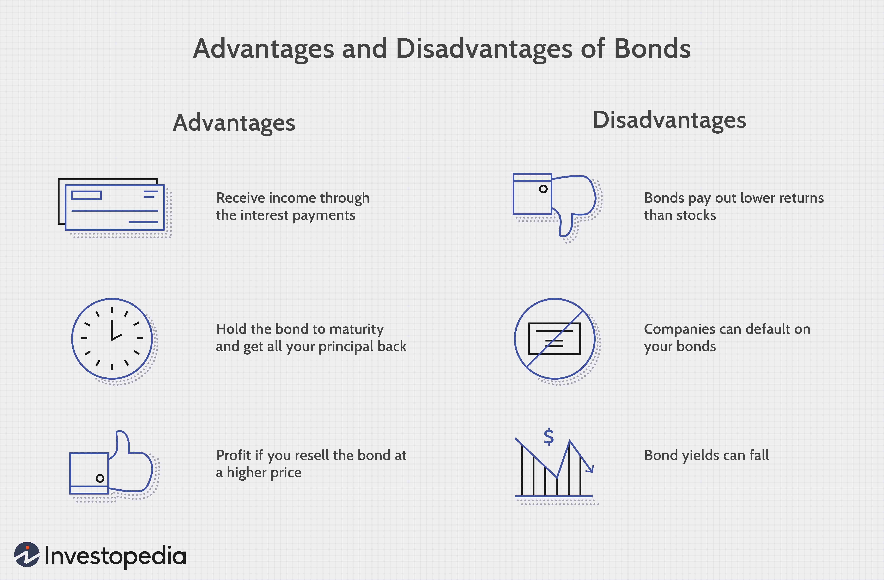

Bond insurance, encompassing completion bonds and performance bonds, serves as a critical mechanism for mitigating financial risks associated with construction and infrastructure projects. These financial instruments provide a safety net by guaranteeing that contractors will fulfill their obligations as specified in construction contracts, thereby protecting project owners, investors, and lenders from potential financial losses due to project delays or failures. Completion bonds, in particular, ensure that projects are both completed on time and within budget, offering assurances of financial protection and project deliverability.

Simultaneously, the integration of algorithmic trading is fundamentally transforming the bond trading landscape. By utilizing advanced algorithms and computational power, algorithmic trading facilitates the execution of large volumes of trades at unprecedented speed and efficiency. This technological advancement enhances liquidity and reduces transaction costs, enabling market participants to respond swiftly to market movements and optimize their trading strategies.



This article examines the interplay between bond insurance and algorithmic trading, specifically within the context of construction finance and bond market operations. By highlighting their respective roles and impacts, it underscores the importance of these elements in shaping efficient and resilient financial landscapes.

## Table of Contents

## Understanding Bond Insurance

Bond insurance serves as a crucial financial mechanism aimed at providing assurance against potential breaches in the fulfillment of contractual obligations. By underwriting guarantees, bond insurers facilitate the protection against the possibility of default or failure to complete projects, thereby playing a vital role, particularly in the execution of large-scale infrastructure and construction projects.

Among the various forms of bond insurance, surety bonds and completion bonds are of paramount importance. Surety bonds function as a tripartite agreement involving the obligee, the principal, and the surety. The obligee is the entity requiring the bond, the principal is the party whose performance is being assured, and the surety is the insurer guaranteeing the principal's obligations. In this arrangement, the surety provides a financial guarantee that the principal will execute the contract in accordance with its terms. Should the principal default, the surety is obligated to compensate for losses or secure the completion of the contract.

Completion bonds, on the other hand, are specifically tailored to ensure the successful and timely conclusion of a project. These bonds provide a safety net for investors and lenders, mitigating the financial risks associated with potential project delays or failures to reach completion. By guaranteeing that projects are completed on time and within budget, completion bonds protect the financial interests of investors, offering them a layer of security against unforeseen setbacks that could lead to monetary losses. The assurance provided by completion bonds can often be crucial in securing project financing, as they enhance lenders' confidence in the project's viability and risk profile.

In summary, bond insurance, through mechanisms such as surety bonds and completion bonds, plays an essential role in the financial architecture of large-scale projects. By guaranteeing contractual fulfillment and project completion, bond insurance not only safeguards investors and lenders but also facilitates the mobilization of capital necessary for significant developments, thereby underpinning economic growth and stability.

## Completion Bonds in Construction Finance

Completion bonds play a vital role in construction finance by providing a financial guarantee that ensures projects are completed as stipulated in agreements. These bonds are essential for securing financing, as they assure lenders and investors that their funds are protected against potential losses due to project delays or failures. By offering a commitment that monetary compensation will be available if a project is not completed as planned, completion bonds mitigate risks associated with construction ventures.

At their core, completion bonds provide a safety net for project owners, shielding their investments from uncertainties that could hinder project completion. This coverage is crucial, especially in large-scale construction projects where financial stakes are high. In scenarios where a contractor fails to deliver a project on time or within budget, these bonds ensure that funds are available to cover the additional costs required to complete the project.

The mechanism of completion bonds involves a tripartite agreement between the obligee (project owner), the principal (contractor), and the surety (the bond issuer). The surety guarantees performance by the principal to the obligee. Should the principal default on the contractual obligations, the surety is liable to provide financial compensation up to the bond's face value, thus ensuring project continuity.

In summary, completion bonds are indispensable tools in construction finance, fostering confidence among stakeholders by guaranteeing that projects are executed to the agreed standards and timelines. This security mechanism not only protects financial interests but also facilitates smoother project execution by preempting potential risks associated with construction delays or non-completion.

## Performance Bonds vs. Completion Bonds

Performance bonds and completion bonds serve as critical financial instruments in the construction industry, yet they address distinct aspects of project risk and assurance. Performance bonds are designed to ensure that contractors fulfill their contractual obligations concerning the quality and scope of the work. Essentially, they act as a guarantee that the contracted project will meet specific performance criteria, as set out in the contractual agreement. If the contractor fails to deliver to these standards, the bond issuer compensates the project owner, thereby protecting the investment.

Completion bonds, conversely, offer a more comprehensive guarantee by ensuring that a project is completed in its entirety. Unlike performance bonds, which focus predominantly on performance metrics, completion bonds encompass broader aspects of the project timeline and budget. This type of bond assures investors and stakeholders that despite potential setbacks, such as contractor defaults or unforeseen financial issues, the project will reach completion. If the project experiences delays or is not completed, the bond furnishes financial coverage to mitigate these deficiencies.

The choice between performance bonds and completion bonds hinges significantly on the level of risk a project owner is willing to accept and the specific assurances they require. For projects where there is a heightened risk of contractor non-performance, a performance bond might suffice. However, when the completion of the entire project is at stake, a completion bond provides more robust protection. In selecting the appropriate bond, stakeholders must evaluate the specific risks associated with the scope, complexity, and financial implications of their construction project. By understanding these distinctions, stakeholders can better align their financial security measures with their project objectives and risk management strategies.

## Algorithmic Trading in the Bond Market

Algorithmic trading in the bond market employs sophisticated algorithms to execute trades at high speeds, significantly enhancing both the efficiency and speed of transactions. These algorithms utilize vast amounts of market data to make real-time decisions, reducing human error and improving the precision of trading activities. By automating the trading process, [algorithmic trading](/wiki/algorithmic-trading) minimizes transaction costs, which is advantageous for both institutional and individual investors. One of the key benefits of this technology is the enhancement of market [liquidity](/wiki/liquidity-risk-premium), allowing traders to buy and sell bonds quickly, thereby maintaining the fluidity of market operations.

The integration of algorithmic trading in bond markets enables predictive analysis, which plays a crucial role in formulating investment strategies. By analyzing historical data and leveraging [machine learning](/wiki/machine-learning) techniques, algorithms can predict market trends and movements. This ability allows traders to develop strategies that are responsive to market fluctuations, optimizing their investment portfolios. For instance, algorithms can be trained to identify patterns and correlations within vast datasets, facilitating the construction of models that predict bond price movements.

Python, one of the preferred languages for implementing algorithmic trading strategies, offers libraries such as NumPy and pandas, which are integral for handling and analyzing large datasets. Additionally, machine learning libraries like scikit-learn provide tools for developing predictive models which can enhance trading strategies.

```python
import numpy as np
import pandas as pd
from sklearn.linear_model import LinearRegression

# Example: Predictive Analysis of Bond Prices
data = pd.read_csv('bond_prices.csv')
features = data[['feature1', 'feature2']]  # Example features
target = data['bond_price']

# Train a simple linear regression model
model = LinearRegression()
model.fit(features, target)

# Predict future bond prices
predicted_prices = model.predict(features)
```

Algorithmic systems also incorporate risk management tools that adjust the parameters of trading activities in real-time, assisting in the mitigation of potential losses. Such systems can evaluate the credit risks associated with different bonds, ensuring that trades are executed under optimal conditions.

As bond markets evolve, the synergy between algorithmic trading and traditional bond trading strategies underscores a transformative shift. This integration ensures that trading becomes more efficient and market responses are increasingly dynamic, fostering an environment where investors can capitalize on opportunities with greater precision and speed.

## Synergy Between Bonds and Algorithmic Trading

The convergence of bond insurance and algorithmic trading represents a pivotal fusion in contemporary financial markets, enhancing both market efficiency and stability. Bond insurance, which offers a layer of security by guaranteeing the payment of interest and principal on bonds in the case of issuer default, serves as an essential instrument for mitigating financial risks. When integrated with algorithmic trading—characterized by the use of sophisticated algorithms and high-speed data processing—these secure bonds become even more strategically valuable in trading paradigms.

Trading strategies incorporating insights from bond guarantees offer optimized outcomes through improved risk management. By understanding the explicit credit risks associated with bond guarantees, traders can employ algorithmic models to adjust their strategies dynamically, thereby aligning investment objectives with real-time risk assessments. For instance, algorithms can be programmed to incorporate credit ratings and bond insurance conditions, allowing for adjustments based on fluctuations in creditworthiness indicators.

In addition, algorithmic models are enhanced by the predictive capabilities that stem from data on bond guarantees. These models can be calibrated to detect and respond to shifts in market conditions with greater precision, effectively managing portfolios to optimize returns while controlling exposure to risk. This is facilitated by incorporating quantitative measures of credit risk into algorithmic strategies. For example, evaluating the probability of default and loss given default can be mathematically represented and routinely updated within an algorithm using statistical methods such as logistic regression or Monte Carlo simulations.

Python code exemplifying such an implementation might include data handling and statistical computations, enabling traders to swiftly adjust their positions:

```python
import numpy as np
from sklearn.linear_model import LogisticRegression

# Sample data for bond issuers: features can include financial ratios, economic indicators
X = np.array([[1.5, 2.3, 3.2], [0.9, 1.9, 2.5], [1.1, 1.6, 3.0]])
# Binary target indicating default (1) or no default (0)
y = np.array([0, 1, 0])

# Logistic regression model to estimate default probability
model = LogisticRegression()
model.fit(X, y)

# Predict default probability for new data
new_data = np.array([[1.2, 2.1, 3.1]])
default_probability = model.predict_proba(new_data)[0][1]
print(f"Predicted default probability: {default_probability}")
```

In this setup, algorithmic trading systems can seamlessly integrate with bond insurance data, leading to a comprehensive trading framework that not only improves decision-making processes but also stabilizes bond markets. This synergy benefits market participants by providing robust mechanisms to better manage the [volatility](/wiki/volatility-trading-strategies) inherent in financial markets, ultimately fostering an environment of trust and reliability.

## Conclusion

Bonds, particularly those used in construction finance, are pivotal for ensuring economic stability and fostering growth. These financial instruments serve as vital components in the ecosystem of infrastructure development, offering necessary protection against financial risks. The assurance provided by construction bonds like completion and performance bonds not only safeguards investments but also encourages the participation of investors and lenders in large-scale projects by ensuring projects are completed to specification.

Algorithmic trading has significantly improved the landscape of the bond market. By employing sophisticated algorithms, trading activities become faster and more efficient, reducing transaction costs and enhancing liquidity. The use of algorithmic trading enables market participants to react promptly to price fluctuations, optimizing their strategies for better outcomes. The integration of algorithmic trading mechanisms with bond insurance and guarantees brings about a new level of precision in predicting and managing market risks.

The combination of bond insurance and algorithmic trading represents a transformative shift in both construction finance and broader financial markets. This integration leads to heightened efficiency and stability, fostering an environment of sustainable economic growth and commercial innovation. As these fields continue to evolve, the adoption of advanced technologies and financial instruments will likely shape further advancements, underscoring their critical role in the ongoing transformation of financial and construction sectors.

## References & Further Reading

Explore the following resources to gain a deeper understanding of the interplay between bond insurance, construction finance, and algorithmic trading within the financial markets:

1. **Books and Publications**:
   - *"Financial Markets and Institutions"* by Frederic S. Mishkin: This book provides a comprehensive overview of financial markets, including details on bond markets and financial instruments.
   - *"The Basics of Algorithmic Trading"* by Michael L. Todinov: This text is ideal for those looking to advance their understanding of algorithmic trading techniques and their applications in bond markets.

2. **Research Papers**:
   - "The Role of Algorithmic Trading in Bond Markets" from the Journal of Financial Economics examines the influence of high-frequency trading algorithms in bond markets, highlighting its effects on market liquidity and efficiency.
   - "Completion Bonds and Financial Stability in Construction Projects" published in the Construction Management and Economics journal provides an in-depth analysis of completion bonds' role in mitigating financial risks in large-scale construction projects.

3. **Industry Reports**:
   - A report by the International Swaps and Derivatives Association (ISDA) on risk mitigation products in financial markets, including the application of completion and performance bonds.
   - The World Economic Forum's report on fintech innovations discusses algorithmic trading advancements and their implications for the future of bond trading.

4. **Online Courses and Lectures**:
   - Coursera offers an "Introduction to Financial Markets" course, covering essential topics on bonds and algorithms suitable for both beginners and experienced professionals.
   - Khan Academy’s webinars on "Fixed Income Securities" and "Algorithmic Trading" providing accessible resources to understand foundational concepts.

5. **Professional Journals and Magazines**:
   - Regularly consult the *Harvard Business Review* and *Bloomberg Markets* for articles on emerging trends in finance, including articles on the synergy between financial guarantees and automated trading.

Staying informed about the latest developments in bond insurance and algorithmic trading is crucial for professionals and investors aiming to navigate the evolving financial landscape effectively.

