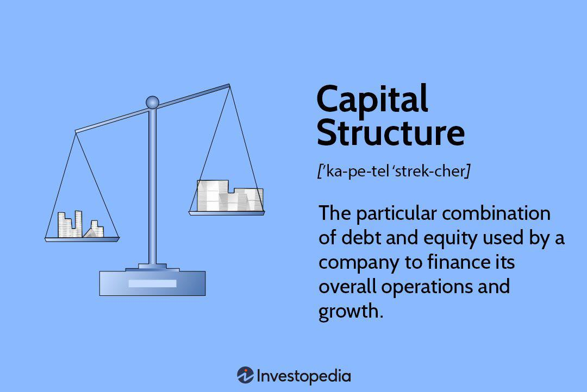

Corporate finance is characterized by its continuous evolution, marked by growing complexity, particularly in managing capital structures and trading strategies. This article focuses on exploring the complex relationships between corporate capital structure, financial leverage, and algorithmic trading. These components are increasingly interlinked, and businesses can potentially improve their financial performance by adopting and integrating algorithmic trading practices. Unlike conventional financial models, algorithmic trading strategies can provide innovative pathways to optimize financial outcomes through enhanced data analysis and real-time market responses.

Understanding these interconnections is essential as companies operate within rapidly changing financial environments and strive for sustainable growth. Financial landscapes are often volatile and challenging, requiring astute decision-making supported by comprehensive data insights. The interplay between corporate capital structure, financial leverage, and algorithmic trading can significantly impact a company’s ability to manage risk, allocate resources, and achieve desired financial objectives. Therefore, our article aims to offer valuable insights into how these financial elements can collectively align to facilitate better decision-making within the sphere of corporate finance. By doing so, firms can bolster their economic resilience and maintain a competitive edge.



## Table of Contents

## Understanding Corporate Capital Structure

Corporate capital structure refers to the specific blend of equity, debt, and hybrid securities that a company utilizes to fund its operations and expansion objectives. A well-structured capital base can significantly impact a company's risk profile and influence strategic financial decision-making. The composition of a firm’s capital structure is pivotal in determining its valuation and the overall cost of capital.

In general, equity and debt are the primary components of capital structure. Equity represents ownership interest in the firm, typically through common and preferred shares, while debt involves obligations the firm must repay over time, usually with interest. Hybrid securities, such as convertible bonds, possess characteristics of both debt and equity and offer flexibility in capital structure management.

The firm value, $V$, in simplified terms, can be expressed as: 

$$
V = E + D
$$

where $E$ represents equity and $D$ represents debt. The optimal capital structure balances these elements to minimize the weighted average cost of capital (WACC), which is critical for enhancing the firm’s value:

$$
\text{WACC} = \frac{E}{V} \cdot r_e + \frac{D}{V} \cdot r_d \cdot (1 - T)
$$

Here, $r_e$ is the cost of equity, $r_d$ is the cost of debt, and $T$ represents the corporate tax rate. 

Several factors dictate capital structure decisions, including tax implications, market conditions, and company-specific strategies. For instance, the tax-deductibility of interest payments makes debt a potentially attractive choice. Market conditions, such as the prevailing interest rates and investor appetite for risk, also affect decisions. Furthermore, internal factors like the firm's growth strategy, profitability, and risk tolerance guide capital structuring, ensuring cost minimization and maximization of value.

Strategically optimizing the balance between debt, equity, and hybrid instruments is essential to minimize capital costs and enhance firm value. By assessing these factors carefully, companies can achieve financial robustness and strategically align their capital structure with business objectives.

## Financial Leverage and Its Implications

Financial leverage involves using borrowed funds to enhance the potential return on equity. This approach is predicated on the principle that the cost of borrowed capital is outweighed by the returns generated from its investment, potentially leading to amplified earnings. However, the use of leverage comes with inherent financial risks. The primary advantage of leverage is its ability to boost profitability; for example, if the return on investment exceeds the cost of debt, the excess return benefits the shareholders, increasing the equity return.

Yet, the associated risks must not be overlooked. During economic downturns, firms with high leverage may struggle to meet their debt obligations, leading to possible financial distress or even bankruptcy. This is due to fixed debt servicing costs that remain liabilities irrespective of the company’s revenue fluctuations. Therefore, the relationship between leverage, risk, and profitability needs careful assessment to ensure that the enhanced potential returns do not jeopardize the firm’s financial stability.

Financial leverage also offers tax benefits, particularly through the tax-deductibility of interest expenses. This can effectively reduce the company's taxable income, thus lowering the overall tax liability. Despite this benefit, firms must consider the implications of extensive borrowing on future capital accessibility. Excessive leverage can diminish creditworthiness and limit access to additional financing when needed, pressing the company against borrowing constraints.

Various industries provide insights into the strategic use of leverage to balance growth and risk. In the real estate sector, companies routinely employ leverage to finance property acquisitions, betting on real estate appreciation to outpace interest costs and deliver higher returns. In technology, firms might use leverage to expedite research and development efforts, investing in innovation with the expectation of significant future cash flows that will comfortably cover the initial borrowing costs.

Ultimately, the application of financial leverage is a strategic decision that requires balancing the pursuit of higher returns with the associated risks. To manage leverage effectively, firms often employ quantitative models to forecast and analyze potential outcomes, ensuring that the use of debt aligns with their broader financial strategy and market conditions. These strategic considerations are essential to leverage management and optimizing firm value over time.

## The Role of Algorithmic Trading in Financial Strategy

Algorithmic trading, often referred to as algo-trading, utilizes advanced computer algorithms to execute trades with remarkable speed and efficiency, aiming to optimize market efficiency. This trading approach capitalizes on the ability of algorithms to process extensive and complex datasets at speeds unmatched by human traders, thereby enhancing decision-making processes. The algorithms analyze market trends, price movements, and other predictive metrics in real-time, allowing firms to execute trades with precision and agility.

One of the primary advantages of [algorithmic trading](/wiki/algorithmic-trading) is its potential to improve market [liquidity](/wiki/liquidity-risk-premium). By facilitating a higher [volume](/wiki/volume-trading-strategy) of trades, algo-trading helps to narrow bid-ask spreads, ensuring that markets function more smoothly. Improved liquidity not only benefits individual traders but also contributes to the overall stability and efficiency of financial markets.

Moreover, algorithmic trading plays a pivotal role in enabling firms to adjust their capital structures and manage financial risks effectively. By leveraging data-driven insights, firms can make more informed decisions about their debt-equity balance, optimizing their financial leverage. Enhanced market predictions derived from algorithmic analysis allow corporations to anticipate changes in market conditions, adjust their financial strategies accordingly, and thereby sustain financial health.

Firms such as Renaissance Technologies exemplify the successful use of algorithmic trading strategies to gain competitive advantages. These organizations utilize sophisticated algorithms to analyze vast amounts of financial data, identifying patterns and opportunities that might be invisible to the human eye. The use of these advanced strategies has allowed such firms to achieve notable success in trading, setting benchmarks for others in the industry.

The influence of algo-trading extends beyond mere trade execution; it fundamentally alters how corporations manage their capital and financial leverage. For instance, by integrating algorithmic strategies, firms can better allocate their capital resources, ensuring optimal use and minimizing wasted expenditures. This strategic allocation supports more effective leverage management, allowing firms to maximize returns while mitigating potential risks associated with financial [volatility](/wiki/volatility-trading-strategies).

In conclusion, the incorporation of algorithmic trading within financial strategies offers significant benefits, including enhanced decision-making capabilities, improved market liquidity, and optimized capital structure management. This integration not only reshapes traditional financial strategies but also drives innovation in modern corporate finance, offering new avenues for sustained financial growth and stability.

## Interlinking Capital Structure, Financial Leverage, and Algorithmic Trading

Algorithmic trading significantly impacts corporate financial strategies by providing deep insights into market trends and dynamics through data analysis, enabling firms to make informed capital structure decisions. This section outlines the convergence of algorithmic trading with capital structure management and financial leverage.

Algorithmic trading employs sophisticated algorithms and [machine learning](/wiki/machine-learning) techniques to forecast market conditions with greater accuracy. These technologies analyze vast amounts of financial data, identifying patterns and trends that guide corporate decision-makers in optimizing their capital structures. By leveraging such insights, corporations can strategically balance debt and equity, enhancing their financial robustness amid dynamic market environments.

A crucial advantage of integrating algorithms is the precision they offer in capital allocation. Algorithms can evaluate a firm's capital requirements against market conditions, ensuring optimal utilization of financial resources. For instance, firms can dynamically adjust their equity-debt ratio by predicting [interest rate](/wiki/interest-rate-trading-strategies) trends and assessing their risk tolerance. This digital approach to financial leverage management enables corporations to reduce financing costs while maximizing shareholder value.

Some of the best examples illustrating these synergies include leading finance firms such as Renaissance Technologies. By harnessing algorithmic trading, these firms optimize their capital management strategies, aligning their financial leverage with market fluctuations to maintain competitive advantage. Such examples highlight the potential of algorithmic trading not only in operational trading efficiencies but also in strategic capital management.

The integration of algorithmic trading into corporate finance strategies offers avenues for innovation beyond traditional financial models. It reshapes strategic planning by considering real-time data and predictive analytics, which enhances decision-making accuracy, reduces risk, and enables firms to pursue ambitious financial strategies reliably. Consequently, this evolution promotes more resilient financial structures capable of withstanding market volatility while seizing growth opportunities in competitive financial markets.

## Challenges and Considerations in Implementing Integrated Strategies

Integrating financial leverage with algorithmic trading strategies presents a series of regulatory, technological, and operational challenges. The adherence to regulations such as the Markets in Financial Instruments Directive (MiFID II) and the Dodd-Frank Wall Street Reform and Consumer Protection Act is crucial for maintaining market stability. MiFID II, aimed at increasing transparency and reducing systemic risk in the European Union's financial markets, imposes stringent reporting requirements that influence how algorithmic trading is executed. Similarly, the Dodd-Frank Act in the United States mandates more comprehensive risk management strategies, which can affect the financial leverage of institutions.

On the technological front, firms are required to establish advanced infrastructure to handle massive data volumes effectively. This infrastructure must emphasize both reliability and cybersecurity, as the rapid pace of data processing and real-time trade execution inherent in algorithmic trading increases the potential for data breaches and system failures. Consequently, firms must stay abreast of technological advancements and integrate robust IT security protocols to protect sensitive financial information.

Operational challenges in this integration necessitate the implementation of comprehensive risk management frameworks. These frameworks are designed to continuously assess and mitigate risks associated with leveraging and trading activities. The unpredictability of algorithmic trading outcomes underscores the need for ongoing evaluation and adjustment of financial models. Risk management can be bolstered by employing predictive analytics and machine learning algorithms, which can identify potential market anomalies and avert systemic risks.

Strategic foresight and adaptability are indispensable as the financial landscape evolves. Successful integration of financial leverage and algorithmic trading requires anticipating shifts in market conditions and regulatory environments. Firms must cultivate a culture of agility, allowing them to adjust their strategies in response to new regulatory requirements or technological innovations. This adaptability ensures sustained competitive advantage and resilience in fluctuating market circumstances.

To illustrate, consider a Python-based model to assess risk in algorithmic trading strategies, which can be used to simulate various market scenarios and evaluate the stability of financial leverage:

```python
import numpy as np

# Simulate market returns
np.random.seed(42)
market_returns = np.random.normal(0.001, 0.02, 1000)

# Calculate leverage
initial_capital = 1_000_000  # 1 million
borrowed_funds = 500_000  # 500 thousand

# Calculate returns with leverage
def calculate_leveraged_return(market_returns, initial_capital, borrowed_funds, interest_rate=0.05):
    total_capital = initial_capital + borrowed_funds
    interest_cost = borrowed_funds * interest_rate
    net_returns = (market_returns * total_capital - interest_cost) / initial_capital
    return net_returns

leveraged_returns = calculate_leveraged_return(market_returns, initial_capital, borrowed_funds)

# Risk analysis
risk_level = np.percentile(leveraged_returns, 5)  # 5th percentile as a measure of risk
print(f"Risk Level (5th percentile return): {risk_level:.4f}")
```

This code snippet models the potential returns and risks associated with leveraging in an algorithmic trading context. By simulating market conditions, firms can identify high-risk scenarios and adjust their capital allocation strategies accordingly, thereby fostering informed decision-making and risk mitigation.

## Conclusion

Capital structure, financial leverage, and algorithmic trading are essential components of modern corporate finance, each playing a pivotal role in determining a firm's financial strategy. By strategically aligning these elements, organizations can maximize their value and maintain financial health in an ever-competitive landscape.

A well-optimized capital structure effectively minimizes the cost of capital and enhances the company’s ability to manage financial risks. Financial leverage, when used judiciously, not only boosts potential returns on equity but also leverages tax benefits. These components, when integrated with sophisticated algorithmic trading strategies, allow firms to make more informed and strategic financial decisions.

Algorithmic trading, with its capacity for rapid data processing and execution of trades, presents a transformative opportunity for managing financial leverage and capital structures. Its continuous innovation is likely to redefine the dynamics of financial management, reshaping traditional paradigms of how firms allocate capital and manage debt.

Furthermore, as the corporate financial environment becomes increasingly complex, the role of technology and data analytics becomes indispensable. Firms that effectively leverage these advancements will be better positioned to optimize their financial strategies. For future research, exploring deeper synergies between algorithmic trading, capital structure optimization, and financial leverage could unlock substantial potential. This exploration will not only enhance financial strategies but will also empower firms to navigate highly competitive markets more effectively. By fostering innovation and strategic foresight, companies can thus ensure sustainable growth and resilience.

## References & Further Reading

Explore the work of Hendershott, Jones, and Menkveld, which offers insights into how algorithmic trading affects market liquidity. Their research provides empirical evidence that algorithmic trading improves liquidity by narrowing bid-ask spreads and enhancing market efficiency. Readers interested in the quantitative and qualitative impacts of algorithmic trading should consider these studies as foundational references.

For those seeking to understand the theoretical underpinnings of corporate capital structure, the Modigliani and Miller propositions are essential reading. Their groundbreaking work, introducing concepts such as the irrelevance of capital structure in a perfect market and the impact of tax on capital cost, remains influential in financial economics. Modigliani and Miller's capital structure theories provide a framework through which modern corporate finance strategies are often evaluated.

Reviewing case studies from leading firms like Renaissance Technologies and Citadel Securities can provide practical insights into successful algorithmic trading integration. Renaissance Technologies, known for its [quantitative trading](/wiki/quantitative-trading) strategies and data-driven approaches, exemplifies the competitive advantages achievable through sophisticated algorithmic applications. Similarly, Citadel Securities leverages advanced algorithms and technology to maintain a dominant position in market-making and proprietary trading. These case studies offer valuable lessons for firms aiming to enhance their trading strategies and market positions.

Understanding regulatory frameworks is crucial for integrating financial leverage with algorithmic trading. Frameworks like the Markets in Financial Instruments Directive II (MiFID II) in the European Union offer a comprehensive view of compliance challenges associated with transparency, investor protection, and market integrity. Companies should study such regulations to ensure adherence and avoid potential legal pitfalls.

Further exploration of advanced financial models and machine learning applications is recommended for traders and financial engineers seeking to enhance their strategies. Machine learning techniques, such as [reinforcement learning](/wiki/reinforcement-learning) and [deep learning](/wiki/deep-learning), are increasingly applied in algorithmic trading to predict market movements and optimize trade execution. Literature in this field can guide the development of cutting-edge trading algorithms that incorporate complex patterns and behaviors not easily captured by traditional models.

