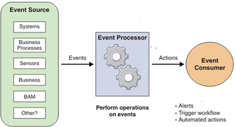

## Table of Contents

## What is Complex Event Processing (CEP)?

Complex Event Processing (CEP) is a technology that helps computers understand and respond to events happening in real time. Imagine you have a lot of information coming in from different places, like sensors, social media, or stock market data. CEP helps you make sense of this information by looking for patterns and important events. It can then trigger actions based on what it finds, like sending an alert or starting a process.

For example, in a factory, CEP can monitor machines and detect when something might break down. It uses rules to decide if an event is important. If a machine starts to overheat, CEP can quickly tell someone to fix it before it causes a bigger problem. This way, CEP helps businesses react faster and make better decisions by understanding what's happening right now.

## How does CEP differ from traditional event processing?

CEP and traditional event processing both deal with events, but they work differently. Traditional event processing looks at each event one by one. It's like checking each piece of mail as it arrives. If you're waiting for a specific letter, you check each one to see if it's the one you need. This method is simple and works well when you just need to react to single events.

CEP, on the other hand, is like looking at the whole pile of mail to find patterns or important combinations of letters. It can see many events at once and figure out if something important is happening. For example, if three different machines start to show problems at the same time, CEP can notice this and warn you that there might be a bigger issue. This makes CEP more powerful for understanding complex situations and reacting to them quickly.

## What are the main components of a CEP system?

A CEP system has several important parts that work together to understand and react to events. The first part is the event source, which is where the events come from. These can be things like sensors, social media posts, or stock market data. The events are then collected by the event collector, which gathers all the information and gets it ready for processing. The event processor is the heart of the system. It uses rules and patterns to look at the events and figure out if something important is happening.

Once the event processor finds an important pattern, it sends the information to the event consumer. The event consumer can be a person or another computer system that needs to know about the event. The event consumer might then take action, like sending an alert or starting a process. To make sure everything works smoothly, there's also a management and monitoring part. This part keeps an eye on the system and makes sure it's working correctly. It can also change the rules or settings if needed.

## Can you explain the concept of event correlation in CEP?

Event correlation in CEP is like connecting the dots between different events to see the bigger picture. Imagine you're watching a soccer game and you see a player get a yellow card, then another player gets a yellow card, and soon after, a goal is scored. By itself, each event might not seem very important, but when you connect them, you might realize that the team with the yellow cards was playing more aggressively, which led to the goal. Event correlation helps CEP systems do the same thing, but with lots of data coming in from different places.

In a CEP system, event correlation means looking for patterns or relationships between events. For example, in a factory, if a sensor shows that a machine is getting too hot and another sensor shows that the room temperature is rising, the CEP system can connect these events to understand that there might be a bigger problem. By correlating these events, the system can warn someone to check the machines before they break down. This way, CEP helps businesses make smarter decisions by understanding how different events are related.

## What are some common use cases for CEP?

One common use case for CEP is in the financial industry. Banks and trading firms use CEP to monitor stock prices and other market data in real time. If they see a certain pattern, like a stock price dropping quickly, CEP can alert traders to buy or sell. This helps them make fast decisions and can save a lot of money or make big profits. CEP can also watch for signs of fraud, like someone trying to use a credit card in two different places at the same time, and stop it before it happens.

Another use case is in healthcare. Hospitals use CEP to keep track of patient data from different machines and sensors. If a patient's heart rate and blood pressure start to change in a dangerous way, CEP can alert doctors right away. This can help save lives by getting help to the patient faster. CEP can also help manage hospital resources better by predicting when more staff or equipment will be needed based on current trends.

In the field of smart cities, CEP helps manage traffic and public safety. By analyzing data from traffic cameras, sensors, and social media, CEP can spot traffic jams or accidents and change traffic light timings to ease congestion. It can also detect unusual activity that might be a sign of a security threat and alert the right people. This makes cities safer and more efficient for everyone living there.

## How does CEP handle real-time data processing?

CEP handles real-time data processing by quickly looking at events as they happen. Imagine you're watching a live sports game and you need to know when certain things happen, like a player scoring a goal. CEP does this by constantly checking incoming data from different sources, like sensors or social media, and using rules to decide if something important is happening. If it finds an important event or pattern, it can react right away, like sending an alert or starting a process. This is why CEP is good at dealing with real-time data - it's always on the lookout and ready to act.

For example, in a factory, CEP can keep an eye on machines and sensors to make sure everything is working right. If a machine starts to overheat, CEP can see this happening in real time and tell someone to fix it before it breaks down. This helps the factory keep running smoothly without big problems. By handling data as it comes in, CEP helps businesses and organizations react faster and make better decisions based on what's happening right now.

## What programming languages and tools are commonly used in CEP?

In CEP, people often use programming languages like Java and Python because they are good at handling lots of data quickly. Java is popular because it's fast and has tools like Esper and Apache Flink that are made just for CEP. These tools help you set up rules and patterns to find important events in real time. Python is also used a lot because it's easy to learn and has libraries like Streamz and Faust that can process events as they come in.

Besides programming languages, there are special tools and platforms that make CEP easier. For example, Apache Kafka is often used to collect and send events to the CEP system. Another tool, Apache Storm, can process these events in real time. These tools work together to help businesses and organizations understand what's happening now and react quickly. By using these languages and tools, people can build CEP systems that keep an eye on everything and make smart decisions based on what they see.

## What are the challenges in implementing a CEP system?

One big challenge in setting up a CEP system is handling all the data that comes in. There can be so much information coming from different places, like sensors or social media, that it's hard to keep up. The system needs to be fast and smart enough to look at all this data in real time and find important patterns. If the system is too slow, it might miss something important, which could cause problems. Also, making sure the system can grow to handle more data as a business gets bigger is tough. You need to plan for the future and make sure the system can keep working well even when there's a lot more data.

Another challenge is setting up the right rules and patterns for the CEP system to use. It's not easy to decide what events are important and how they should be connected. If the rules are too simple, the system might miss important events. But if they're too complicated, the system might get confused or slow down. It takes a lot of time and testing to get the rules just right. Plus, you need people who understand both the business and the technology to make sure the system works well and helps the business make good decisions.

## How does CEP integrate with other data processing technologies like stream processing?

CEP and stream processing work together like best friends. Stream processing is like a fast river of data that keeps flowing all the time. It takes in data and processes it as it comes in, without stopping. CEP uses this fast-moving data to look for important patterns and events. When CEP finds something important, it can use the stream processing system to send alerts or start actions right away. This way, CEP can react quickly to what's happening now, and stream processing helps by keeping the data moving smoothly.

For example, imagine a busy airport where planes are landing and taking off all the time. Stream processing keeps track of all the flight data coming in, like when planes are landing or taking off. CEP looks at this data and can spot if there's a delay or a problem, like if a plane is late and it might affect other flights. By working together, stream processing and CEP help the airport manage everything better, making sure flights run on time and passengers are happy.

## What are the best practices for designing efficient CEP queries?

When designing efficient CEP queries, it's important to keep them simple and focused. Think of it like looking for a specific toy in a big toy box. If you have too many rules or patterns to check, it's like trying to find the toy while also looking for other things at the same time. It's better to have clear, simple rules that the system can check quickly. This way, the CEP system can find important events faster and not get slowed down by too much work.

Another good practice is to test and tune your queries often. Imagine you're playing a game where you need to catch falling apples. At first, you might miss a lot, but as you practice, you get better at catching them. The same goes for CEP queries. By testing them with real data and seeing how they perform, you can make them better over time. This means checking if they are finding the right events and if they are fast enough. By doing this, you can make sure your CEP system is working as well as it can.

## How can CEP be used to enhance decision-making processes in businesses?

CEP can help businesses make better decisions by keeping an eye on what's happening right now. Imagine you run a store and you want to know when to restock certain items. CEP can watch the sales data and tell you when items are selling fast. This way, you can make sure you always have enough stock without guessing. It's like having a smart helper that tells you exactly when to act, so you can make quick and smart decisions.

Another way CEP helps is by spotting problems before they get big. For example, in a factory, CEP can look at data from machines and see if something might break soon. If it notices a pattern that shows a machine is getting too hot, it can warn someone to fix it before it stops working. This means less downtime and fewer surprises, which makes running the business smoother. By using CEP, businesses can react faster and make choices based on real data, not just guesses.

## What are the future trends and developments expected in the field of CEP?

In the future, CEP is expected to become even smarter and faster. One big trend is the use of artificial intelligence and machine learning with CEP. These technologies can help CEP systems learn from past events and get better at finding important patterns. Imagine a CEP system that not only looks for patterns you tell it to find but also learns to spot new ones on its own. This could make businesses react even quicker to changes and make smarter decisions based on what's happening right now.

Another trend is the growth of the Internet of Things (IoT). More and more devices, like smart home gadgets and industrial sensors, are connected and sending data all the time. CEP systems will need to handle this huge amount of data and find useful information from it. As IoT grows, CEP will become more important for things like smart cities and factories, helping them run better and more efficiently. By working with IoT, CEP can help businesses understand and react to what's happening in real time, making everything work smoother.

## References & Further Reading

[1]: Luckham, D. C. (2002). ["The Power of Events: An Introduction to Complex Event Processing in Distributed Enterprise Systems"](https://archive.org/details/powerofeventsint0000luck_c9r9) Addison-Wesley Professional.

[2]: Gualtieri, M., & Curran, R. (2016). ["The Forrester Wave™: Big Data Streaming Analytics, Q1 2016"](https://www.forrester.com/report/The-Forrester-Wave-Big-Data-Hadoop-Distributions-Q1-2016/RES121574).

[3]: Etzion, O., & Niblett, P. (2010). ["Event Processing in Action"](https://www.manning.com/books/event-processing-in-action) Manning Publications.

[4]: Baldoni, R., Beraldi, R., Ciullo, D., Querzoni, L., & Virgillito, A. (2008). ["The Evolution of Publish/Subscribe Communication Systems."](https://www.semanticscholar.org/paper/A-Self-Organizing-Crash-Resilient-Topology-System-Baldoni-Beraldi/ff7843fed80fb2265a2ae4af6696178444da999f) Springer.

[5]: Zhou, J., Chen, S., Luo, P., & Zheng, Q. (2006). ["Event-driven service-oriented architecture: A practical experience."](https://pubs.acs.org/doi/10.1021/acs.langmuir.4c04556) IEEE International Conference on Services Computing.