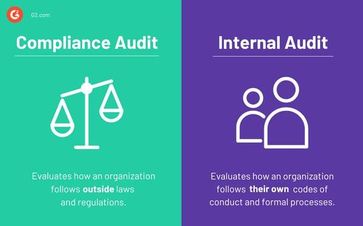

## Table of Contents

## What is a compliance audit?

A compliance audit is a process where a company checks if it is following all the rules and laws that apply to its business. These rules can come from the government, industry standards, or internal policies. The goal is to make sure the company is doing things the right way and avoiding any legal problems or fines.

During a compliance audit, auditors look at the company's records, processes, and practices. They compare what they find to the rules that the company needs to follow. If they find any issues, they will report these to the company's management. The company can then fix these problems to stay compliant and keep running smoothly.

## Why is a compliance audit important for businesses?

A compliance audit is important for businesses because it helps them follow the rules and laws that apply to their work. If a business does not follow these rules, it could get into big trouble, like having to pay fines or even having to close down. By doing a compliance audit, a business can find out if it is doing anything wrong and fix it before it becomes a big problem.

Compliance audits also help businesses keep their good name. If customers and partners know that a business follows all the rules, they will trust it more. This can make the business more successful because people like to work with companies they can trust. Plus, regular audits show that the business cares about doing things the right way, which can make employees feel proud to work there.

## What are the common types of compliance audits?

There are several common types of compliance audits that businesses might need to do. One type is a financial compliance audit, which checks if a company is following the rules about money, like tax laws and accounting standards. This helps make sure the company's financial reports are correct and honest. Another type is an environmental compliance audit, which looks at how a company affects the environment. It checks if the company is following laws about pollution, waste, and other environmental issues.

Another common type of compliance audit is a health and safety audit, which makes sure a company is keeping its workers safe and healthy. This type of audit checks if the company follows rules about workplace safety, like having the right equipment and training for employees. There is also an information security compliance audit, which focuses on how a company protects its data. This audit checks if the company follows rules about keeping data safe from hackers and other risks.

Lastly, there are industry-specific compliance audits. For example, in the healthcare industry, there are audits to make sure that patient information is kept private and secure, following laws like HIPAA. In the finance industry, audits might focus on anti-money laundering laws to prevent illegal financial activities. Each type of compliance audit helps businesses stay in line with the specific rules that apply to them.

## Who typically conducts a compliance audit?

A compliance audit is usually done by people called auditors. These auditors can work for the company itself, as part of an internal audit team. Internal auditors know a lot about the company and can check if it is following its own rules and the laws that apply to it. Sometimes, the company hires external auditors from another company. These external auditors are good because they can look at the company with a fresh set of eyes and might find things that internal auditors could miss.

Both internal and external auditors have to be very careful and detailed in their work. They look at the company's records, talk to employees, and check if everything is being done the right way. Sometimes, government agencies or industry groups might also do compliance audits to make sure companies are following the rules. No matter who does the audit, the goal is the same: to make sure the company is doing things correctly and legally.

## How often should a compliance audit be performed?

A compliance audit should be done often enough to keep a business safe and following the rules. How often it needs to be done can depend on the type of business, the rules it has to follow, and what the business leaders think is best. Some businesses might need to do audits every year because the laws they have to follow change a lot or because they work in a field where being very careful is important, like in healthcare or finance.

Other businesses might do audits every few years if they are in a field where things do not change as much. It's also a good idea to do an audit if something big happens, like if the business starts doing something new or if there are new laws that affect the business. Doing regular audits helps the business stay on track and avoid problems.

## What are the key steps in preparing for a compliance audit?

Preparing for a compliance audit starts with understanding the rules that apply to your business. You need to know all the laws, regulations, and standards that your company must follow. This means looking at federal, state, and local laws, as well as any industry-specific rules. Once you know the rules, you can start gathering all the important documents like financial records, policies, and procedures. These documents will show the auditors how your business is doing things.

Next, it's a good idea to do a self-check or a pre-audit. This means going through your business practices and records to see if there are any problems before the real audit happens. If you find any issues, you can fix them ahead of time. It's also helpful to train your employees about the audit process so they know what to expect and how to help. They should understand the importance of following the rules and be ready to answer any questions the auditors might have. By doing these things, your business will be well-prepared for the compliance audit.

## What documents and records are typically reviewed during a compliance audit?

During a compliance audit, auditors look at many types of documents and records. They start with financial records like bank statements, invoices, and tax returns to make sure the company is following money rules. They also check employee records, which include payroll, time sheets, and training logs to see if the company is treating workers right and following labor laws. Policies and procedures are important too, so auditors will look at the company's rule [books](/wiki/algo-trading-books) and how these rules are being followed in the workplace.

In addition to these, auditors might review contracts and agreements with customers, suppliers, and partners to make sure everything is legal and fair. They also look at safety records, like accident reports and safety training materials, to check if the company is keeping everyone safe. Lastly, auditors might go through emails, memos, and other communication to see if the company is following rules about data privacy and security. All these documents help auditors understand if the company is doing things the right way.

## How can a company ensure it is compliant before an audit?

A company can make sure it is following the rules before an audit by first understanding all the laws and rules it needs to follow. This means looking at federal, state, and local laws, and any special rules for their type of business. Once they know the rules, they should check their own records and practices to see if they are doing everything right. This can be done by having an internal team go through everything and fix any problems they find. They should also train their employees on the rules and how to follow them so everyone knows what to do.

Another good way to stay compliant is to keep good records and update them regularly. This includes financial records, employee files, safety reports, and any other documents that show the company is following the rules. It's also important to have clear policies and procedures that everyone follows. By doing these things and maybe even having a pre-audit to catch any issues early, a company can be ready for a compliance audit and avoid any surprises or problems.

## What are the potential consequences of failing a compliance audit?

Failing a compliance audit can lead to big problems for a company. If a company does not follow the rules, it might have to pay fines. These fines can be very expensive and can hurt the company's money. Sometimes, the company might even have to stop some of its work or close down parts of its business. This can make it hard for the company to keep going and can cause it to lose money and customers.

Another problem is that failing an audit can hurt the company's reputation. If people find out that the company did not follow the rules, they might not trust it anymore. Customers might stop buying from the company, and partners might not want to work with it. This can make it hard for the company to do business and grow. It can also make employees feel bad about working there, which can lead to more problems like people leaving their jobs.

## How can technology assist in managing compliance audits?

Technology can make it easier for a company to handle compliance audits. Special software can keep track of all the rules and laws the company needs to follow. This software can send reminders about important dates and deadlines, so the company does not miss anything. It can also store all the important documents in one place, making it easy for auditors to find what they need. This way, the company can be ready for an audit and show that it is following the rules.

Another way technology helps is by doing some of the checking itself. Some programs can go through the company's records and find any problems or mistakes. This can save time and make sure nothing is missed. Technology can also help with training employees. Online courses and apps can teach workers about the rules and how to follow them, so everyone knows what to do. By using technology, a company can stay on top of compliance and be ready for any audit.

## What are the best practices for conducting an effective compliance audit?

To conduct an effective compliance audit, start by planning carefully. Know exactly what rules and laws the company needs to follow. Make a clear plan of what to check and who will do the checking. Gather all the important documents like financial records, employee files, and safety reports. It's good to do a practice audit first to find any problems and fix them before the real audit. Make sure to talk to employees and explain the audit process so they know what to expect and can help out.

During the audit, be thorough and detailed. Look at everything carefully and compare it to the rules. Keep good notes and record any problems you find. It's important to be honest and fair, even if you find something wrong. After the audit, write a clear report that explains what you found and what needs to be fixed. Share this report with the company leaders so they can make changes and stay compliant. By following these steps, the audit will be effective and help the company follow the rules.

## How do international regulations affect compliance audits for global companies?

International regulations can make compliance audits more complicated for global companies. When a company works in different countries, it has to follow the rules of each place. This means the company needs to know about all the different laws and make sure it follows them all. For example, data privacy laws might be different in Europe compared to the United States. So, the company has to keep track of these differences and make sure its practices fit each country's rules. This can be hard and might need more work and resources to do right.

Because of these international rules, global companies often need to do more audits or have special audits just for certain countries. They might need to hire experts who know the laws of each country to help with the audits. This can make the audits take longer and cost more money. But, if the company does not follow the rules in each country, it could face big fines or even have to stop working in that country. So, understanding and following international regulations is very important for global companies to keep running smoothly and avoid problems.

## References & Further Reading

[1]: Bone, J.-E. (2011). ["The Impact of High-Frequency Trading: Manipulation, Distortion or a Better-Functioning Market?"](https://knowledge.wharton.upenn.edu/podcast/knowledge-at-wharton-podcast/the-impact-of-high-frequency-trading-manipulation-distortion-or-a-better-functioning-market/) University of Cambridge Working Paper.

[2]: Cartea, Á., Jaimungal, S., & Penalva, J. (2015). ["Algorithmic and High-Frequency Trading."](https://assets.cambridge.org/97811070/91146/frontmatter/9781107091146_frontmatter.pdf) Cambridge University Press.

[3]: Vayanos, D., & Woolley, P. (2010). ["An Institutional Theory of Momentum and Reversal."](https://www.jstor.org/stable/23470044) The Review of Financial Studies, 25(4), 1331–1369.

[4]: U.S. Securities and Exchange Commission. (n.d.). ["SEC.gov | Rules and Regulations For the Securities And Exchange Commission and Major Securities Laws."](https://www.sec.gov/rules-regulations/statutes-regulations/rules-regulations-securities-exchange-commission-major-securities-laws)

[5]: Financial Industry Regulatory Authority. (n.d.). ["FINRA Rules."](https://www.finra.org/rules-guidance)

[6]: Narang, R. K. (2009). ["Inside the Black Box: The Simple Truth About Quantitative Trading."](https://www.amazon.com/Inside-Black-Box-Quantitative-Trading/dp/0470432063) Wiley Trading Series.