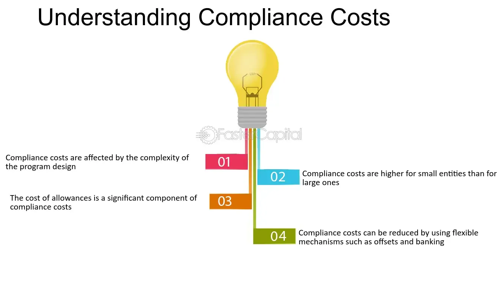

## Table of Contents

## What are compliance costs?

Compliance costs are the expenses that businesses have to pay to follow laws and regulations. These costs can include things like hiring special staff, buying new equipment, or spending time on paperwork. For example, a company might need to hire a compliance officer to make sure they are following all the rules, or they might need to buy software to keep track of their records.

These costs can be a big deal for businesses, especially small ones. They can make it harder for companies to make money and grow. Sometimes, the costs of following the rules can be so high that businesses decide not to do certain things or even move to a different country where the rules are easier to follow. But, following the rules is important because it helps protect people, the environment, and the economy.

## Why are compliance costs important for businesses?

Compliance costs are important for businesses because they have to spend money and time to follow the rules set by the government. These costs can include hiring people to make sure the business follows the rules, buying special equipment, or spending time on paperwork. If a business doesn't follow the rules, they can get in big trouble, like getting fined a lot of money or even having to close down. So, it's really important for businesses to know about and manage these costs.

These costs can affect how well a business does. For small businesses, the costs can be really tough because they might not have a lot of money to spend on following the rules. Sometimes, the costs can be so high that a business decides not to do certain things or even move to a different country where the rules are easier to follow. But, following the rules is good because it helps keep people safe, protects the environment, and makes sure the economy is fair for everyone.

## What are the main types of compliance costs?

Compliance costs can be split into different types, like direct costs and indirect costs. Direct costs are the clear, easy-to-see expenses that a business has to pay to follow the rules. These can include things like hiring people to make sure the business follows the rules, buying special equipment or software, and paying for training or audits. For example, a company might need to hire a compliance officer or buy software to keep track of their records.

Indirect costs are a bit harder to see because they are not as clear as direct costs. These costs can include the time and effort that employees spend on following the rules, like filling out paperwork or going to meetings. Indirect costs can also include lost opportunities, like when a business decides not to do something because the cost of following the rules is too high. For example, a company might decide not to start a new project because the compliance costs would be too expensive.

Both direct and indirect costs are important for businesses to think about. They can affect how much money a business makes and how well it does. It's important for businesses to manage these costs carefully so they can follow the rules and still do well.

## How do compliance costs vary by industry?

Compliance costs can be very different depending on what kind of business you have. For example, in the banking and finance industry, there are a lot of rules about how to handle money and protect customers' information. This means banks have to spend a lot of money on things like hiring special staff, buying expensive software, and doing regular checks to make sure they are following the rules. On the other hand, a small retail store might not have as many rules to follow, so their compliance costs are usually lower. They might just need to keep track of their sales and make sure they are paying the right taxes.

In the healthcare industry, compliance costs can be really high too. There are a lot of rules about patient safety, privacy, and how to handle medicines. Hospitals and clinics need to hire people to make sure they are following these rules, and they also need to buy special equipment and spend time on training their staff. This can be a big expense for them. But, in the construction industry, while there are also many safety rules to follow, the costs might be different. Construction companies need to spend money on safety equipment and training, but they might not need as many special staff or software as banks or hospitals do.

## What are some common mechanisms used to manage compliance costs?

Businesses use different ways to manage compliance costs. One common way is to use technology, like special software, to help them keep track of rules and make sure they are following them. This can save time and money because the software can do a lot of the work that people used to have to do. Another way is to hire experts, like compliance officers, who know a lot about the rules and can help the business follow them. These experts can also help find ways to save money on compliance costs.

Another approach is to train employees so they know the rules and can help the business follow them. This can reduce the need for a big compliance team and can make the whole business more aware of the rules. Some businesses also work together with other businesses to share the costs of following the rules. For example, a group of small businesses might hire one compliance officer to help them all, instead of each business hiring their own. This can make the costs lower for everyone.

Overall, managing compliance costs is about finding smart ways to follow the rules without spending too much money. Businesses need to think carefully about how to use technology, hire experts, train their staff, and work with others to keep their compliance costs down. This helps them stay out of trouble and still make money.

## How can a business assess its compliance costs effectively?

To assess compliance costs effectively, a business should start by listing all the direct costs, like money spent on hiring compliance officers, buying special software, or paying for training and audits. They should also think about indirect costs, which are harder to see, like the time employees spend on following the rules or the opportunities they miss because compliance costs are too high. By looking at both direct and indirect costs, a business can get a full picture of how much it spends on compliance.

Once a business knows its compliance costs, it can compare them to other costs and see how they affect the business's overall performance. They can use tools like cost-benefit analysis to see if the money spent on compliance is worth it. For example, if the costs are too high, the business might look for ways to save money, like using technology to automate some tasks or working with other businesses to share costs. By regularly checking and managing compliance costs, a business can make sure it follows the rules without spending too much money.

## What role do regulations play in determining compliance costs?

Regulations are the rules that businesses have to follow, and they play a big role in determining compliance costs. When there are a lot of rules, or when the rules are very strict, businesses have to spend more money to make sure they are following them. For example, if a new law says that all businesses have to use special software to keep track of their records, then every business has to buy that software, which costs money. The more rules there are, the more time and money businesses have to spend to follow them.

Different industries have different regulations, which means compliance costs can be very different from one industry to another. For example, the healthcare industry has a lot of rules about patient safety and privacy, so hospitals and clinics have to spend a lot of money to follow these rules. On the other hand, a small retail store might not have as many rules to follow, so their compliance costs are usually lower. By understanding the regulations that apply to their industry, businesses can better manage their compliance costs and make sure they are following the rules without spending too much money.

## How do international compliance requirements affect compliance costs?

International compliance requirements can make compliance costs go up a lot for businesses that work in different countries. Each country has its own rules, and businesses have to follow all of them. For example, a company that sells things in the United States and Europe has to follow the rules in both places. This means they might need to hire more people to make sure they are following all the rules, or they might need to buy special software that works in different countries. All of this can be expensive and can make it harder for the business to make money.

Sometimes, the rules in different countries can be different or even opposite, which can make things even harder. A business might need to change how it does things to follow the rules in one country, but then those changes might not work in another country. This can lead to more costs because the business has to keep changing how it works to follow all the rules. But, following the rules is important because it helps keep people safe and makes sure the business is doing things the right way everywhere it works.

## What strategies can businesses use to minimize compliance costs?

Businesses can use technology to help lower their compliance costs. Special software can do a lot of the work that people used to have to do, like keeping track of records or making sure the business is following the rules. This can save time and money. Businesses can also hire experts, like compliance officers, who know a lot about the rules and can help the business follow them without spending too much. These experts can find smart ways to save money on compliance costs.

Another way to minimize compliance costs is to train employees so they know the rules and can help the business follow them. This can reduce the need for a big compliance team and can make the whole business more aware of the rules. Some businesses also work together with other businesses to share the costs of following the rules. For example, a group of small businesses might hire one compliance officer to help them all, instead of each business hiring their own. This can make the costs lower for everyone.

## How do technological tools help in managing compliance costs?

Technological tools can help businesses manage compliance costs by automating many of the tasks that used to take a lot of time and effort. For example, special software can keep track of records, make sure the business is following the rules, and even do regular checks to see if everything is okay. This means businesses don't have to hire as many people to do these jobs, which saves them money. The software can also make sure that the business is following the rules in different countries, which can be really helpful for companies that work in many places.

Using technology also helps businesses stay up to date with new rules and changes to old ones. Many software programs can be updated quickly to match new regulations, so businesses don't have to spend a lot of time and money figuring out how to follow them. This can make it easier for businesses to manage their compliance costs and make sure they are always following the rules without spending too much. By using these tools, businesses can focus more on growing and making money, instead of worrying about compliance costs.

## What are the long-term impacts of compliance costs on business strategy?

Compliance costs can have a big effect on a business's long-term plans. When a business has to spend a lot of money to follow the rules, it might have less money to spend on other important things, like growing the business or making new products. This can make it harder for the business to compete with other companies. For example, a small business might decide not to start a new project because the compliance costs would be too high. Over time, this can slow down the business's growth and make it harder for them to reach their goals.

On the other hand, managing compliance costs well can help a business in the long run. If a business can find smart ways to follow the rules without spending too much money, it can have more money to spend on other things. This can help the business grow and be more successful. For example, using technology to automate compliance tasks can save money and time, which can then be used to improve the business. By thinking carefully about compliance costs and finding ways to manage them, a business can make better long-term plans and be more successful.

## How can businesses balance compliance costs with ethical considerations?

Balancing compliance costs with ethical considerations can be tricky for businesses. They need to follow the rules, but they also want to do what's right. Sometimes, the cheapest way to follow the rules might not be the most ethical way. For example, a company might find a way to cut compliance costs by not doing enough to protect the environment or treat their workers fairly. But, if they choose to do things the right way, even if it costs more, they can build a good reputation and keep people happy. This can be good for the business in the long run, even if it means spending more money on compliance.

Businesses can find a balance by thinking about their values and the impact they want to have. They can use technology and smart strategies to manage compliance costs without cutting corners on ethics. For example, they might use software to keep track of their compliance tasks, which can save money and time. They can also train their employees to understand the importance of following the rules and doing things the right way. By focusing on both compliance and ethics, businesses can make sure they are doing well financially and also doing the right thing for their employees, customers, and the world around them.

## References & Further Reading

[1]: ["Advances in Financial Machine Learning"](https://www.amazon.com/Advances-Financial-Machine-Learning-Marcos/dp/1119482089) by Marcos Lopez de Prado

[2]: ["Machine Learning for Algorithmic Trading"](https://www.amazon.com/Machine-Learning-Algorithmic-Trading-alternative/dp/1839217715) by Stefan Jansen

[3]: ["Quantitative Trading: How to Build Your Own Algorithmic Trading Business"](https://www.amazon.com/Quantitative-Trading-Build-Algorithmic-Business/dp/1119800064) by Ernest P. Chan

[4]: Stent, W. (2018). ["Algorithmic Trading and Market Microstructure"](https://www.researchgate.net/publication/254419103_Optimal_algorithmic_trading_and_market_microstructure). Springer.

[5]: Securities and Exchange Commission. ["Market Access Rule: Rule 15c3-5"]. Available at https://www.sec.gov/rules/final/2010/34-63241.pdf

[6]: Commodity Futures Trading Commission. ["Regulation Automated Trading"](https://www.cftc.gov/PressRoom/PressReleases/7283-15)

[7]: Aldridge, Irene. ["High-Frequency Trading: A Practical Guide to Algorithmic Strategies and Trading Systems"](https://www.amazon.com/High-Frequency-Trading-Practical-Algorithmic-Strategies/dp/1118343506) by Irene Aldridge