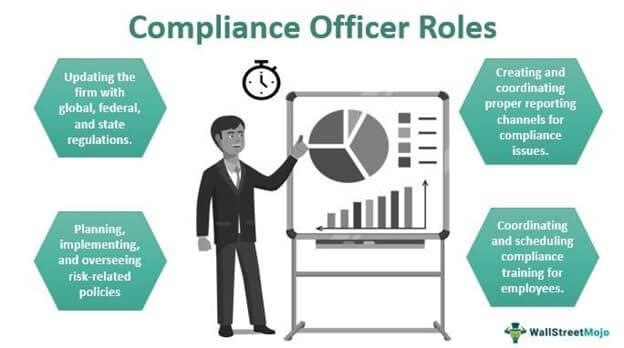

The fast-paced evolution of financial markets has brought algorithmic trading to the forefront, significantly transforming traditional trading practices. This form of trading, which leverages sophisticated algorithms to execute orders at speeds and frequencies that human traders cannot match, offers both opportunities and challenges within the financial sector. At its core, algorithmic trading relies on pre-defined criteria and quantitative analysis, executing trades at a rapid pace across markets.

A critical aspect of this transformation is the complex ecosystem of compliance that ensures these trading operations adhere to established laws and ethical standards. Compliance departments play a pivotal role in this environment by monitoring and guiding algorithmic trading strategies to align with regulatory requirements. They act as a safeguard, ensuring practices meet both internal guidelines and external legislative mandates.

Given the rapid advancements in trading technologies, understanding compliance requirements is essential. These requirements ensure the integrity, transparency, and fairness of markets, thereby protecting investors and maintaining overall market stability. Algorithmic trading poses specific risks, such as market manipulation and systemic failures, which require robust compliance frameworks to mitigate.

The compliance framework concerning algorithmic trading comprises a detailed set of regulations, roles, and responsibilities. These elements are designed to manage and minimize the risks associated with high-speed trading environments. As compliance departments navigate these challenges, they contribute to safeguarding investor interests and preserving financial system stability. The dual nature of algorithmic trading presents both advantages, such as increased efficiency and liquidity, and challenges, necessitating vigilant compliance oversight to balance these aspects effectively.

## Table of Contents

## Role of the Compliance Department

The compliance department is tasked with ensuring that an organization's financial activities conform to both internal guidelines and external regulations. This role is pivotal in reducing potential risks and safeguarding the organization from potential breaches that could lead to financial or reputational damage. The core functions of a compliance department encompass several key responsibilities: identification, prevention, monitoring, detection, and resolution of risks, as well as providing advisory services.

Identification involves recognizing potential areas of compliance risk within the organization. This proactive step is crucial, as it allows the department to address issues before they become systemic problems. Prevention focuses on developing policies and training programs to avert non-compliance events. These preventative strategies ensure that employees understand regulatory requirements and adhere to established protocols.

Monitoring and detection activities involve the continuous review and auditing of organizational processes to ensure adherence to regulatory standards. This ongoing vigilance helps in identifying any deviations from the set norms. For instance, automated tools and data analytics can be employed to analyze trading patterns, thereby highlighting any irregularities that require further investigation.

Resolution processes are initiated once a compliance issue is detected. This typically involves comprehensive investigations followed by actionable steps to rectify the situation and prevent recurrence. The compliance department is also responsible for documenting these incidents and the measures taken to resolve them, ensuring a clear audit trail.

The advisory function of the compliance department is critical. It involves collaborating with management and staff across various levels to ensure that the company's operations align with both legal obligations and ethical standards. By doing so, the compliance team not only helps mitigate risks but also contributes to fostering a culture of integrity within the organization. This advisory role may also extend to interpreting new laws and regulations, assessing their impact on the organization's operations, and providing strategic guidance on necessary adjustments. 

In summary, compliance departments are indispensable to preserving the integrity and sustainability of financial institutions. Through their comprehensive framework that covers risk identification, prevention, detection, and resolution, along with their advisory capacity, these departments help organizations navigate complex regulatory landscapes and maintain ethical business practices.

## Understanding Compliance in Algorithmic Trading

Algorithmic trading, characterized by the use of sophisticated algorithms and high-speed data processing, has become integral to modern financial markets. This technology-driven approach enables the rapid execution of trading orders, leveraging advanced mathematical models and computational techniques. However, it introduces distinctive challenges and risks from a compliance perspective, necessitating vigilant oversight.

Compliance teams play a critical role in ensuring that [algorithmic trading](/wiki/algorithmic-trading) practices do not facilitate market manipulation or create systemic risks. The complexity of these trading strategies, often involving large volumes of transactions executed in milliseconds, requires robust systems to monitor and regulate trading activities. Regulators have underscored the importance of ensuring that algorithmic trading systems operate within the bounds of fair and transparent market practices. This involves the implementation of safeguards to prevent abusive trading behaviors, such as spoofing, layering, or quote stuffing, which can disrupt market equilibrium.

Risk management through pre and post-trade risk controls is paramount in algorithmic trading. Pre-trade risk controls involve assessing the potential impact of a trade before it is executed, ensuring it does not breach risk parameters. This may include checks on order size, price limits, and credit exposure. Post-trade risk controls are equally crucial, entailing the monitoring and analysis of executed trades to detect anomalies or trends that might indicate misconduct or systemic vulnerabilities.

Traditionally, the role of compliance in financial institutions focused primarily on advisory functions—providing guidance on regulatory requirements and ethical standards. However, with the advent of algorithmic trading, compliance functions have evolved. Today, compliance officers are not only advisors but active participants in risk management efforts. Their duties include the continuous evaluation of trading algorithms, assessing potential risks associated with algorithmic strategies, and ensuring alignment with legal and regulatory standards.

Financial services organizations are experiencing heightened scrutiny regarding their algorithmic trading practices. Regulatory bodies are keenly aware of the potential risks posed by these technologies and have mandated stringent compliance frameworks. These frameworks demand comprehensive documentation of trading algorithms, rigorous testing procedures, and transparent reporting mechanisms. Organizations must exhibit proactive engagement in managing and mitigating the risks associated with algorithmic trading to comply with these evolving regulatory expectations.

In summary, as algorithmic trading continues to shape the dynamics of financial markets, compliance teams are instrumental in safeguarding market integrity. Their expanded role, encompassing both risk management and compliance assurance, is crucial in mitigating the unique challenges presented by algorithmic trading and ensuring adherence to regulatory requirements.

## Regulatory Framework for Algorithmic Trading

The regulatory framework governing algorithmic trading is structured to ensure the stability, integrity, and transparency of financial markets. Key regulatory bodies, such as the Securities and Exchange Commission (SEC) and the Commodity Futures Trading Commission (CFTC), play pivotal roles in establishing and enforcing rules and guidelines that govern algorithmic trading activities.

The Securities and Exchange Commission (SEC) introduced the Market Access Rule (Rule 15c3-5) as part of its regulatory oversight to mitigate risks associated with algorithmic trading. This rule mandates that broker-dealers implement pre-trade risk controls to prevent erroneous orders, ensure compliance with regulatory requirements, and manage financial exposure. Broker-dealers must also conduct continuous post-trade monitoring to detect potential violations or system failures promptly. This twofold approach helps maintain order in securities markets and curtails the transmission of erroneous trades that could lead to broader market disruptions.

Similarly, the Commodity Futures Trading Commission (CFTC) has proposed Regulation Automated Trading (Reg AT) to enhance accountability and security in futures markets. Reg AT requires firms involved in algorithmic trading to register with the CFTC, submit to risk control standards, and maintain comprehensive records of their trading activities. The regulation emphasizes pre-trade risk assessments, such as checking for market disruptions and ensuring systems are equipped with kill switches to immediately halt trading if necessary. The recordkeeping obligations facilitate audits and investigations, assisting the CFTC in understanding trading operations and ensuring compliance with existing laws.

The regulatory landscape for algorithmic trading is subject to continuous updates to accommodate evolving market practices and technological advancements. Regulatory bodies regularly assess the effectiveness of current rules and introduce amendments, if necessary, to address new challenges posed by innovative trading technologies. This dynamic approach aims to safeguard market integrity and prevent malpractices, such as market manipulation and systemic risks.

Compliance departments within financial institutions are instrumental in aligning operational practices with regulatory frameworks set by bodies like the SEC and CFTC. They ensure that algorithmic trading strategies adhere to established guidelines, thus avoiding legal penalties and maintaining confidence in market operations. By fostering a culture of compliance, these departments enable financial institutions to conduct algorithmic trading ethically and responsibly, supporting the overarching goal of market stability and fairness.

## The Role of Compliance Officers

Compliance officers are instrumental in navigating financial institutions through the complex regulatory environment of algorithmic trading. Their primary responsibility is to ensure that an organization’s trading strategies adhere to applicable laws and that internal controls are both robust and effective. By doing so, compliance officers help maintain the integrity of trading operations and shield the organization from legal and financial repercussions.

One of the most critical functions of compliance officers is to collaborate with management and technical teams to ensure that trading algorithms conform to compliance requirements. This collaboration often involves reviewing algorithmic models, identifying potential risk areas, and ensuring alignment with regulations such as those issued by bodies like the Securities and Exchange Commission (SEC) and the Commodity Futures Trading Commission (CFTC). This practice ensures that algorithmic strategies do not inadvertently breach any regulatory standards.

Beyond mere compliance with rules, compliance officers must foster a culture of adherence to ethical standards and regulatory mandates within the organization. This involves establishing and promoting codes of conduct, setting clear organizational policies, and ensuring that all employees understand the importance of compliance as an integral part of daily operations. By instilling a compliance-oriented culture, organizations can better guard against violations that could compromise both their reputation and operational capabilities.

Additionally, compliance officers are responsible for offering ongoing training and oversight to mitigate risks associated with algorithmic trading. This includes educating employees about the latest regulatory updates, potential technological vulnerabilities, and best practices for risk management. For instance, a comprehensive training program may address scenarios in algorithmic trading that could introduce market manipulation risks, thus enabling staff to recognize and prevent such occurrences.

In order to ensure strategies remain effective and aligned with ever-changing regulations, continuous monitoring and evaluation of trading practices are essential. Compliance officers often employ technologies and analytics to track algorithmic performance and identify deviations from expected outcomes. These tools can be crucial in preempting issues before they evolve into significant compliance breaches.

In summary, the role of compliance officers in algorithmic trading extends beyond traditional oversight to active engagement in regulatory compliance and risk mitigation. By collaborating with various departments, fostering an organizational culture of compliance, and providing comprehensive training and monitoring, compliance officers help navigate the intricacies of algorithmic trading, ensuring legal adherence and ethical integrity.

## Risk Management and Compliance Strategies

Implementing robust risk management strategies is imperative for effectively addressing the complexities inherent in algorithmic trading. Compliance departments are critically involved in this endeavor through the execution of regular audits, diligent monitoring, and the continual updating of risk management controls. These activities ensure that financial institutions adhere to relevant regulatory standards while minimizing the potential for adverse outcomes.

Pre-trade risk controls are essential as they serve as the first line of defense against potential market disruptions. These controls work by scrutinizing trades before they are executed, thereby reducing the risk of financial loss and ensuring compliance with regulatory requirements. An essential component of this is the use of automated trading system kill switches, which can immediately halt trading activities if anomalies or irregularities are detected. This swift action can prevent significant financial ramifications from system failures or trading errors.

Surveillance systems form another crucial element in managing algorithmic trading risks. These systems are designed to detect and flag suspicious or anomalous trading patterns that could indicate market manipulation or other irregular activities. By being proactive in identifying these threats, financial institutions can safeguard market integrity and mitigate systemic risks.

Managing a financial institution’s risk exposure also involves ensuring resilience against market [volatility](/wiki/volatility-trading-strategies) and systemic challenges. This resilience is achieved through comprehensive stress testing and scenario analysis, allowing institutions to evaluate the impact of extreme market conditions on their trading portfolios. By understanding these potential risks, organizations can implement strategies to buffer against significant market downturns.

Continual assessment and adjustment of risk management strategies are vital to maintaining compliance and achieving competitive advantage. Financial institutions must regularly review and refine their risk frameworks to adapt to the evolving market conditions and regulatory landscape. This ongoing process ensures that they remain aligned with best practices and regulatory expectations while also capitalizing on opportunities inherent in algorithmic trading.

Overall, the implementation of strong risk management and compliance frameworks enables financial institutions to navigate the complexities of algorithmic trading effectively, safeguarding not only their interests but also contributing to broader market stability.

## Conclusion

Algorithmic trading has markedly reshaped the financial sector by improving operational efficiency and enhancing market [liquidity](/wiki/liquidity-risk-premium). The automation of trading activities ensures quicker execution of transactions and reduces the likelihood of human error, which also contributes to tighter spreads and increased market depth. Nevertheless, these benefits come with the imperative for rigorous compliance practices to mitigate risks and uphold market integrity. 

Compliance departments are indispensable in traversing the elaborate regulatory framework governing algorithmic trading. They ensure that organizations not only abide by laws but also uphold fair trading practices. These departments play a crucial role in identifying, monitoring, and managing risks to prevent market manipulation and systemic threats. By reinforcing the roles and practices within compliance departments, firms can effectively mitigate associated risks, thereby maximizing the advantages offered by algorithmic trading.

Staying well-informed and proactive about compliance is vital for financial institutions aiming to remain competitive and ethical. As regulations evolve alongside technological advancements, continuous education and adaptation are required to maintain adherence and prevent potential breaches. This diligence allows organizations to maintain market confidence and harness the full potential offered by algorithmic trading strategies.

## References & Further Reading

[1]: Aldridge, I. (2013). ["High-Frequency Trading: A Practical Guide to Algorithmic Strategies and Trading Systems"](https://www.amazon.com/High-Frequency-Trading-Practical-Algorithmic-Strategies/dp/1118343506). Wiley.

[2]: Johnson, B. (2015). ["Algorithmic Trading & DMA: An introduction to direct access trading strategies"](https://www.amazon.com/Algorithmic-Trading-DMA-introduction-strategies/dp/0956399207). 4Myeloma Press.

[3]: Cartea, Á., Jaimungal, S., & Penalva, J. (2015). ["Algorithmic and High-Frequency Trading"](https://assets.cambridge.org/97811070/91146/frontmatter/9781107091146_frontmatter.pdf). Cambridge University Press.

[4]: Narang, R. K. (2013). ["Inside the Black Box: A Simple Guide to Quantitative and High-Frequency Trading"](https://onlinelibrary.wiley.com/doi/book/10.1002/9781118662717). Wiley.

[5]: Securities and Exchange Commission (2010). ["Risk Management Controls for Brokers or Dealers with Market Access"](https://www.sec.gov/files/rules/final/2010/34-63241.pdf). Market Access Rule 15c3-5.

[6]: Commodities Futures Trading Commission. ["Regulation Automated Trading"](https://www.cftc.gov/PressRoom/PressReleases/7283-15). 

[7]: Gola, C., & Roselli, A. (Eds.). (2017). ["The UK Financial System: Theory and Practice"](https://books.google.com/books/about/The_UK_Banking_System_and_its_Regulatory.html?id=KLKADAAAQBAJ). Palgrave Macmillan.

[8]: Basu, S. (2023). ["Algorithmic Trading and DMA: An introduction to direct access trading strategies"](https://www.semanticscholar.org/paper/Algorithmic-trading-%26-DMA-%3A-an-introduction-to-Johnson/aa5de1ab883d5e23b6651faa7c1807586d688e4b). Springer.

