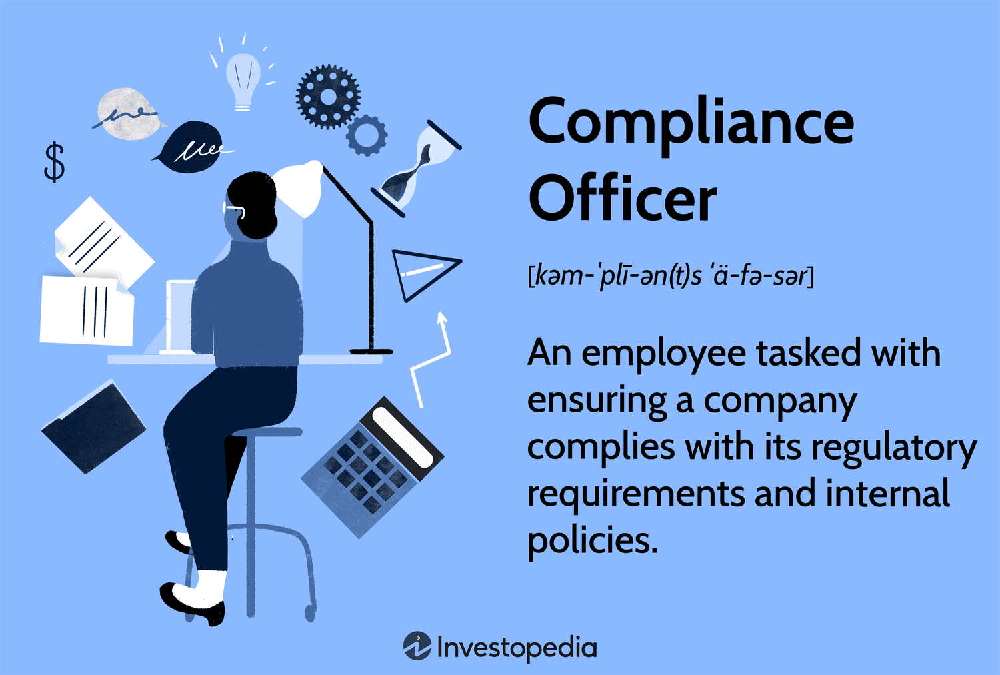

## Table of Contents

## What is a compliance department?

A compliance department is a part of a company that makes sure the company follows all the rules and laws. These rules can come from the government, industry standards, or the company's own policies. The compliance department helps the company avoid fines, legal problems, and damage to its reputation by making sure everyone does things the right way.

People in the compliance department often check the company's activities, train employees on the rules, and keep up with any changes in laws or regulations. They also create and update policies to make sure the company stays compliant. This helps the company run smoothly and ethically, which is good for business and the people it serves.

## Why is a compliance department important in an organization?

A compliance department is important in an organization because it helps make sure the company follows all the rules and laws. This is important because if a company breaks the rules, it could get fined, have legal problems, or get a bad reputation. The compliance department works to prevent these problems by checking the company's actions, training employees, and keeping up with any changes in laws or rules.

Having a compliance department also helps the company run in an honest and fair way. This builds trust with customers, partners, and the community. When people trust a company, they are more likely to do business with it, which is good for the company's success. So, the compliance department not only keeps the company out of trouble but also helps it do well by making sure everyone plays by the rules.

## What are the primary roles of a compliance department?

The primary roles of a compliance department include making sure the company follows all the rules and laws. They do this by checking the company's activities regularly to see if everything is being done correctly. If they find any problems, they work to fix them quickly. They also keep an eye on any changes in laws or regulations, so the company can adjust its practices to stay compliant.

Another important role is training employees. The compliance department teaches workers about the rules they need to follow and how to do their jobs the right way. This helps prevent mistakes that could lead to legal problems. They also create and update the company's policies to make sure they match the current laws and standards. This way, everyone in the company knows what is expected of them and can work together to keep the company compliant.

Lastly, the compliance department helps protect the company's reputation. By making sure the company follows the rules, they help avoid bad publicity or legal issues that could harm the company's image. This builds trust with customers, partners, and the community, which is important for the company's long-term success.

## Who typically leads a compliance department?

A compliance department is usually led by a Chief Compliance Officer (CCO) or a similar title like Director of Compliance. This person is in charge of making sure the whole company follows the rules and laws. They work with other leaders in the company to make plans and check that everything is being done correctly.

The CCO often reports to the company's top boss, like the CEO, or to the board of directors. They need to know a lot about the rules that affect the company and be good at leading a team. The CCO's job is important because they help keep the company out of trouble and make sure it runs in an honest way.

## How does a compliance department interact with other departments?

A compliance department works closely with other departments to make sure the whole company follows the rules. They talk with departments like human resources, finance, and operations to check if everyone is doing things the right way. For example, they might work with human resources to make sure new employees get trained on the company's rules. They also work with finance to check if the company's money practices are correct and follow the law.

The compliance department also helps other departments when there are changes in the rules or laws. They tell other teams about these changes and help them understand what they need to do differently. This way, everyone in the company can stay compliant. By working together, the compliance department and other departments help keep the company out of trouble and running smoothly.

## What are the key responsibilities of a compliance officer?

A compliance officer makes sure the company follows all the rules and laws. They check the company's activities regularly to see if everything is being done correctly. If they find any problems, they work to fix them quickly. They also keep an eye on any changes in laws or regulations, so the company can adjust its practices to stay compliant. This helps the company avoid fines, legal problems, and a bad reputation.

Another important job of a compliance officer is to train employees. They teach workers about the rules they need to follow and how to do their jobs the right way. This helps prevent mistakes that could lead to legal problems. They also create and update the company's policies to make sure they match the current laws and standards. This way, everyone in the company knows what is expected of them and can work together to keep the company compliant.

Lastly, a compliance officer helps protect the company's reputation. By making sure the company follows the rules, they help avoid bad publicity or legal issues that could harm the company's image. This builds trust with customers, partners, and the community, which is important for the company's long-term success. The compliance officer works closely with other departments to make sure everyone is on the same page and following the rules.

## What types of regulations does a compliance department typically monitor?

A compliance department keeps an eye on many different rules that a company needs to follow. These rules can come from the government, like laws about how to handle money or treat employees. They also watch industry rules, which are special standards set by the type of business the company is in, like rules for banks or healthcare companies. These rules make sure companies do things in a fair and safe way.

The compliance department also checks if the company follows its own rules. These are called internal policies, and they help set expectations for how employees should behave and work. By watching all these different rules, the compliance department helps the company stay out of trouble and keep a good reputation. This way, the company can focus on doing its job well and serving its customers the right way.

## How does a compliance department ensure adherence to legal standards?

A compliance department makes sure a company follows the law by checking what the company does all the time. They look at how the company handles money, treats employees, and follows rules set by the government and their own industry. If they see anything wrong, they fix it quickly. They also keep up with changes in the law, so the company can change how it does things to stay legal.

The compliance department also trains employees to know the rules. They teach workers how to do their jobs the right way and what to watch out for. This helps stop mistakes that could get the company in trouble. By working with other parts of the company, the compliance department helps everyone follow the rules and keeps the company's reputation good.

## What are the common challenges faced by compliance departments?

Compliance departments face many challenges. One big problem is keeping up with all the changes in laws and rules. Laws can change often, and it's hard for the compliance team to know about every change right away. They have to read a lot and go to meetings to stay updated. If they miss something, the company could break the law without even knowing it.

Another challenge is training all the employees. The compliance department needs to make sure everyone in the company knows the rules and follows them. But, it's hard to teach a lot of people and make sure they understand everything. Sometimes employees might forget the rules or not take the training seriously. This can lead to mistakes that cause big problems for the company.

Lastly, compliance departments often have to work with many other parts of the company. They need to check what everyone is doing and make sure it's all legal. But, other departments might not like being checked all the time. They might think the compliance team is just slowing them down. This can make it hard for the compliance department to do their job well and keep the company safe.

## How does technology assist compliance departments in their duties?

Technology helps compliance departments a lot. It makes it easier for them to keep track of all the rules and laws. There are special software programs that can look at what the company is doing and see if it's following the rules. These programs can also send alerts if they find any problems. This way, the compliance team can fix things quickly before they become big issues. Technology also helps them keep records of everything they do, so they can show that the company is trying to follow the law.

Another way technology helps is by making training easier. Compliance departments can use online courses and videos to teach employees about the rules. This is better than having to do everything in person, which can take a lot of time. With technology, employees can learn at their own pace and go back to the training if they forget something. This helps make sure everyone understands the rules and follows them. Overall, technology makes the job of the compliance department easier and helps keep the company out of trouble.

## What are the best practices for developing a compliance program?

Developing a good compliance program starts with knowing all the rules the company needs to follow. This means looking at laws from the government, rules from the industry, and the company's own policies. Once you know the rules, you can make a plan to make sure everyone follows them. This plan should include regular checks to see if the company is doing things right, and quick fixes if there are any problems. It's also important to keep an eye on changes in the laws and update the plan as needed.

Another key part of a strong compliance program is training. Everyone in the company needs to know the rules and how to follow them. This can be done through regular training sessions, which can be online or in person. The training should be easy to understand and cover all the important rules. It's also a good idea to have a way for employees to ask questions or report any problems they see. By training employees well and keeping the compliance plan up to date, the company can stay out of trouble and keep a good reputation.

## How can a compliance department measure its effectiveness?

A compliance department can measure its effectiveness by looking at how well the company follows the rules. They can do regular checks to see if there are any problems and fix them quickly. If the company keeps passing these checks without many issues, it's a good sign that the compliance department is doing a good job. They can also keep track of how many times the company gets in trouble for breaking the rules. If this number stays low or goes down over time, it shows that the compliance program is working well.

Another way to measure effectiveness is by looking at how employees understand and follow the rules. The compliance department can do surveys or tests to see if employees know the rules and if they are following them. If most employees do well on these tests, it means the training is working. Also, the compliance department can check if employees are reporting problems when they see them. If more people are speaking up about issues, it shows that they trust the compliance program and feel safe to report problems. This helps the company stay compliant and keep a good reputation.

## References & Further Reading

[1]: Aldridge, I. (2013). ["High-Frequency Trading: A Practical Guide to Algorithmic Strategies and Trading Systems"](https://www.amazon.com/High-Frequency-Trading-Practical-Algorithmic-Strategies/dp/1118343506). Wiley.

[2]: Johnson, B. (2015). ["Algorithmic Trading & DMA: An introduction to direct access trading strategies"](https://www.amazon.com/Algorithmic-Trading-DMA-introduction-strategies/dp/0956399207). 4Myeloma Press.

[3]: Cartea, Á., Jaimungal, S., & Penalva, J. (2015). ["Algorithmic and High-Frequency Trading"](https://assets.cambridge.org/97811070/91146/frontmatter/9781107091146_frontmatter.pdf). Cambridge University Press.

[4]: Narang, R. K. (2013). ["Inside the Black Box: A Simple Guide to Quantitative and High-Frequency Trading"](https://onlinelibrary.wiley.com/doi/book/10.1002/9781118662717). Wiley.

[5]: Securities and Exchange Commission (2010). ["Risk Management Controls for Brokers or Dealers with Market Access"](https://www.sec.gov/files/rules/final/2010/34-63241.pdf). Market Access Rule 15c3-5.

[6]: Commodities Futures Trading Commission. ["Regulation Automated Trading"](https://www.cftc.gov/PressRoom/PressReleases/7283-15). 

[7]: Gola, C., & Roselli, A. (Eds.). (2017). ["The UK Financial System: Theory and Practice"](https://books.google.com/books/about/The_UK_Banking_System_and_its_Regulatory.html?id=KLKADAAAQBAJ). Palgrave Macmillan.

[8]: Basu, S. (2023). ["Algorithmic Trading and DMA: An introduction to direct access trading strategies"](https://www.semanticscholar.org/paper/Algorithmic-trading-%26-DMA-%3A-an-introduction-to-Johnson/aa5de1ab883d5e23b6651faa7c1807586d688e4b). Springer.

