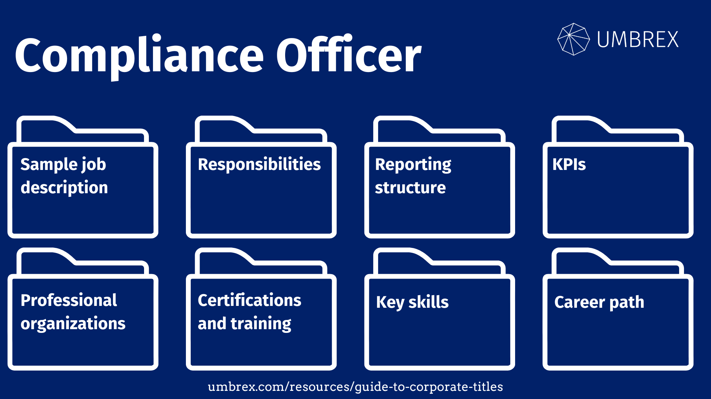

## Table of Contents

## What is a compliance officer?

A compliance officer is a person who works in a company to make sure that the company follows all the rules and laws. These rules can come from the government or from the company's own policies. The compliance officer's job is to check that everyone in the company is doing things the right way.

They often create training programs to teach employees about the rules. They also keep an eye on the company's activities to spot any problems early. If they find something wrong, they help fix it and make sure it doesn't happen again. This helps the company avoid fines and other troubles.

## What are the primary responsibilities of a compliance officer?

A compliance officer's main job is to make sure a company follows all the rules and laws that apply to it. This means they have to know a lot about the laws and keep up with any changes. They also need to understand the company's own rules. They check that everyone in the company is doing things the right way by looking at how the company works and what it does.

Another big part of their job is to teach employees about the rules. They create training programs and materials to help everyone understand what they need to do. If they find any problems or if someone breaks a rule, they work to fix it quickly. They also try to stop the same problem from happening again. This helps keep the company out of trouble and makes sure it runs smoothly.

## What qualifications are needed to become a compliance officer?

To become a compliance officer, you usually need a bachelor's degree in a related field like business, finance, law, or accounting. Some companies might want you to have a master's degree or a special certification like a Certified Compliance and Ethics Professional (CCEP). It's also important to have experience working in a similar job or in the industry you want to work in. This experience helps you understand the rules and how to make sure people follow them.

Apart from education and experience, you need certain skills to be a good compliance officer. You should be good at paying attention to details because you need to spot problems. You also need to be able to talk to people well, so you can teach them about the rules and help them follow them. Being able to solve problems and think critically is important too, because you have to find solutions when things go wrong. Being honest and ethical is also key, as you are responsible for making sure the company does the right thing.

## How does a compliance officer ensure regulatory compliance?

A compliance officer ensures regulatory compliance by keeping a close watch on the company's activities. They regularly check that everyone in the company is following the rules. This includes looking at how the company does its work, its financial records, and its reports. If they find anything that doesn't meet the rules, they quickly work to fix it. They also make sure the company has good policies and procedures in place to help everyone follow the rules.

Another way a compliance officer ensures compliance is by training employees. They create programs and materials to teach everyone about the laws and the company's own rules. This helps employees understand what they need to do to stay compliant. The compliance officer also keeps up with any changes in the laws and updates the training and policies as needed. By doing all these things, the compliance officer helps the company avoid fines and other problems, and makes sure it runs smoothly and honestly.

## What industries typically employ compliance officers?

Compliance officers work in many different industries. They are often found in big companies like banks and other financial businesses. These companies have a lot of rules to follow, so they need compliance officers to make sure everyone is doing things the right way. Insurance companies also need compliance officers because they have to follow a lot of rules about how they sell their products and handle money.

Compliance officers are also important in healthcare. Hospitals, clinics, and other health services have to follow strict rules about patient care and privacy. Compliance officers help make sure these rules are followed. In manufacturing, compliance officers check that the company is following safety and environmental rules. This helps keep workers safe and protects the environment.

Other industries that often employ compliance officers include energy, where they ensure companies follow rules about how they produce and use energy, and technology, where they make sure companies follow rules about data protection and privacy. No matter the industry, the goal is the same: to make sure the company follows the rules and stays out of trouble.

## What is the typical career path for a compliance officer?

The typical career path for a compliance officer often starts with a bachelor's degree in a field like business, finance, law, or accounting. After getting their degree, many people start working in entry-level jobs in their chosen industry. These jobs might be in areas like auditing, finance, or legal departments. This early experience helps them learn about the rules and regulations that the company has to follow. As they gain more experience, they might move into roles that focus more on compliance, like a compliance analyst or a junior compliance officer.

After a few years of working in these roles, someone might be ready to become a full compliance officer. They might need to get a special certification, like the Certified Compliance and Ethics Professional (CCEP), to show they know a lot about compliance. As a compliance officer, they will keep learning and growing in their job. With more experience, they could become a senior compliance officer or a chief compliance officer. Some might even move into other leadership roles, like a director of compliance or a vice president of compliance. The key is to keep learning and staying up-to-date with the rules and how to make sure the company follows them.

## How does a compliance officer handle risk management?

A compliance officer handles risk management by first figuring out what risks the company might face. These risks could be things like breaking the law, getting fined, or losing the trust of customers. The compliance officer looks at the company's activities and checks for any problems that could cause these risks. They might use tools like risk assessments and audits to find out where the risks are. Once they know what the risks are, they can plan how to stop them from happening or make them less harmful.

After figuring out the risks, the compliance officer works on ways to manage them. They might create rules and guidelines for the company to follow, so everyone knows how to do things the right way. They also set up checks and balances to make sure these rules are followed. If a risk turns into a real problem, the compliance officer helps fix it quickly. They might need to report the problem to the bosses or even to the government. By doing all these things, the compliance officer helps keep the company safe and out of trouble.

## What are the key skills required for a successful compliance officer?

A successful compliance officer needs to be good at paying attention to details. They have to spot problems and make sure everyone follows the rules. Being able to think critically and solve problems is also important. They need to figure out what could go wrong and find ways to fix it. They should also be good at talking to people. This helps them teach employees about the rules and explain what needs to be done.

Another key skill is being able to keep up with changes in laws and rules. Compliance officers need to learn new things all the time to make sure their company stays on the right path. They also need to be honest and ethical. People trust them to do the right thing and make sure the company does the same. By having these skills, a compliance officer can help their company avoid trouble and run smoothly.

## How do compliance officers stay updated with changing regulations?

Compliance officers stay updated with changing regulations by regularly checking for new laws and rules. They read newsletters, attend webinars, and join professional groups that share information about changes in their industry. They also use special services that send alerts about new regulations. By doing these things, they make sure they know about any new rules as soon as they come out.

Once they learn about new regulations, compliance officers update the company's policies and training programs. They teach employees about the changes so everyone knows what to do. They might also hold meetings to talk about the new rules and answer any questions. By staying informed and sharing that information, compliance officers help their company follow the new rules and stay out of trouble.

## What challenges do compliance officers face in their roles?

Compliance officers face many challenges in their jobs. One big challenge is keeping up with all the rules and laws. These rules can change a lot, and the compliance officer has to know about these changes quickly. They need to read a lot and go to meetings to stay updated. It can be hard to keep track of everything and make sure the company follows the new rules.

Another challenge is dealing with people. Compliance officers have to teach employees about the rules and make sure they follow them. Sometimes, employees might not want to listen or might not understand the rules. The compliance officer has to be good at talking to people and helping them learn. They also have to be ready to fix problems if someone breaks a rule, which can be stressful.

Lastly, compliance officers need to balance their work with the company's goals. The company wants to make money and grow, but the compliance officer has to make sure they do it the right way. This can be tough because they might have to say no to some ideas that could make money but break the rules. It takes a lot of skill to keep the company safe and successful at the same time.

## How does technology impact the role of a compliance officer?

Technology makes the job of a compliance officer easier in many ways. They can use special software to keep track of all the rules and laws. This software can send them alerts when there are changes, so they don't miss anything important. They can also use tools to check the company's work and find problems faster. For example, they might use programs to look at financial records or reports. This helps them make sure the company is following the rules without having to do everything by hand.

On the other hand, technology also brings new challenges. Compliance officers have to learn how to use all these new tools and keep up with new technology. They also have to make sure the company follows rules about using technology, like rules about keeping data safe. This can be hard because technology changes quickly. But if they use technology the right way, it can help them do their job better and keep the company out of trouble.

## What advanced strategies can compliance officers use to enhance organizational compliance?

Compliance officers can use advanced strategies like data analytics to improve how the company follows rules. They can use special software to look at a lot of information quickly. This helps them find problems and patterns that they might not see otherwise. For example, they might use data to see if there are any areas in the company where people are breaking rules more often. By finding these patterns, they can focus on fixing those areas and stop problems before they get big. They can also use technology to keep track of what's happening in the company all the time, so they can act fast if something goes wrong.

Another strategy is to work closely with other parts of the company. Compliance officers can talk to people in different departments, like finance or human resources, to make sure everyone understands the rules. They can also set up teams that work together to solve compliance problems. This teamwork helps make sure that everyone in the company is on the same page about following the rules. By building good relationships and working together, compliance officers can make sure the whole company stays compliant and runs smoothly.

## References & Further Reading

[1]: Jens, Haas. (2018). ["Algorithmic Trading and DMA: An introduction to direct access trading strategies."](https://www.amazon.com/Algorithmic-Trading-DMA-introduction-strategies/dp/0956399207) 4Myeloma Press.

[2]: Marcos, Lopez de Prado. (2018). ["Advances in Financial Machine Learning."](https://www.amazon.com/Advances-Financial-Machine-Learning-Marcos/dp/1119482089) Wiley.

[3]: Thomas, J., Mosebach, M., & Haas, S. (2013). ["High-Frequency Trading: Price Dynamics Models and Market Making Strategies."](https://www2.eecs.berkeley.edu/Pubs/TechRpts/2012/EECS-2012-144.pdf) 

[4]: Murphy, M. J. (2004). ["Evidence-Based Technical Analysis: Applying the Scientific Method and Statistical Inference to Trading Signals."](https://www.amazon.com/Evidence-Based-Technical-Analysis-Scientific-Statistical/dp/0470008741) Wiley.

[5]: Stefan, Jansen. (2020). ["Machine Learning for Algorithmic Trading: Predictive models to extract signals from market and alternative data for systematic trading strategies with Python."](https://www.amazon.com/Machine-Learning-Algorithmic-Trading-alternative/dp/1839217715) Packt Publishing.