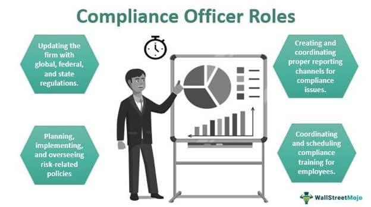

In today’s financial landscape, the role of a compliance officer has become increasingly vital, particularly within the dynamic and evolving field of algorithmic trading. As financial markets continue to integrate advanced technologies, these professionals are responsible for ensuring that firms align with both legal mandates and ethical practices. This responsibility involves overseeing the implementation of sophisticated trading systems and ensuring robust compliance frameworks to prevent breaches and financial misconduct.

Compliance officers play a critical role in maintaining the integrity of markets, which is essential for both protecting investors and ensuring stable economic environments. Their duties include monitoring trading activities to prevent unethical practices, advising firms on regulatory requirements, and adapting policies to fit the rapidly changing technological environment. Algorithmic trading, which involves the use of complex algorithms and high-speed decision-making, presents unique challenges that require compliance officers to not only understand the intricate mechanisms of these technologies but also anticipate and mitigate associated risks.

The confluence of compliance and algorithmic trading requires an in-depth understanding of both financial regulations and technological innovations. Failure to meet compliance standards can result in severe repercussions, including financial penalties and reputational damage. Therefore, the role of a compliance officer is indispensable, contributing significantly to both individual firm security and the broader financial system's health. This field offers professionals an opportunity to engage with cutting-edge technology while ensuring ethical and lawful conduct in the fast-paced environment of automated trading. Understanding these aspects is crucial for those interested in pursuing a career as a compliance officer in this high-stakes domain.

## Table of Contents

## What is a Compliance Officer?

A compliance officer is primarily responsible for ensuring that an organization adheres to regulatory and internal policies. This role is becoming increasingly critical in today's complex financial environments. Compliance officers are tasked with identifying and managing regulatory risks within an organization, helping to protect it from both legal and reputational harm.

The responsibilities of a compliance officer are multifaceted. They provide essential guidance to ensure that all business operations are conducted in a manner that upholds both legal and ethical standards. This involves closely monitoring the organization's activities and operations, regularly liaising with various departments to ensure compliance protocols are understood and executed throughout the organization.

Additionally, compliance officers often work alongside management teams to create and implement robust policies aimed at mitigating compliance risks. These policies are designed to ensure that the organization not only meets current regulatory requirements but is also prepared to adapt to any changes. This requires a forward-thinking approach and an understanding of both the industry and the regulatory landscape.

In carrying out these duties, compliance officers must remain vigilant and proactive, constantly updating their knowledge to stay ahead of emerging regulatory developments. This often involves conducting training sessions for employees at different levels, ensuring that everyone is aware of their responsibilities concerning regulatory compliance.

Overall, the role of a compliance officer is integral to fostering a culture of compliance and ethics within an organization, ensuring market stability and protecting the organization from potential non-compliance risks.

## Key Responsibilities of Compliance Officers in Algorithmic Trading

In [algorithmic trading](/wiki/algorithmic-trading), compliance officers hold significant responsibilities to ensure that trading activities adhere to legal and regulatory standards. One of their primary tasks is to monitor trading activities to ensure compliance with applicable laws. This involves keeping a vigilant eye on all trading operations to identify and prevent any violations of securities regulations. By doing so, compliance officers help maintain legal adherence while also fostering ethical standards in trading behaviors.

Developing risk management strategies is another crucial responsibility. Given the complexity and speed of algorithmic trading operations, compliance officers must devise comprehensive strategies to mitigate potential risks. This requires a deep understanding of both the trading algorithms and the regulatory environment to identify possible vulnerabilities and implement safeguards.

Regular training and education are integral in promoting a culture of compliance within trading firms. Compliance officers organize sessions for traders and developers, ensuring that they are up-to-date on regulatory requirements and best practices. This continuous education helps in minimizing inadvertent non-compliance due to a lack of knowledge or awareness among employees.

The implementation of advanced monitoring systems is essential for identifying and responding to anomalous trading patterns quickly. These systems can use algorithms and [machine learning](/wiki/machine-learning) models to analyze trading data in real time, providing compliance officers with insights into suspicious activities that may indicate regulatory breaches or unethical practices.

Additionally, compliance officers are responsible for preparing detailed reports for both internal and external stakeholders. These reports cover the compliance status and any incidents or irregularities that have been detected. Such transparency is critical in demonstrating due diligence and accountability, enhancing trust among stakeholders.

Overall, the role of a compliance officer in algorithmic trading is multifaceted, requiring a blend of regulatory knowledge, technical acumen, and proactive risk management to ensure the integrity and compliance of trading activities.

## The Importance of Compliance in Algorithmic Trading

In the context of algorithmic trading, compliance is a fundamental component that upholds market integrity by preventing unethical trading practices. Algorithmic trading, characterized by high-frequency and automated decision-making processes, presents unique challenges that necessitate robust compliance measures. Ensuring compliance mitigates the risk of irregular market activities, such as insider trading and market manipulation, which can severely disrupt financial markets.

Proper compliance frameworks are indispensable in avoiding significant financial and reputational damage. Financial institutions engaged in algorithmic trading must adopt comprehensive policies and technologies to monitor and control trading activities. These frameworks enable institutions to identify and address potential violations promptly, thereby safeguarding their reputation and financial standing. The latent risks associated with algorithm failures or misconfigurations further accentuate the necessity of strong compliance protocols that include regular audits and failsafes to preempt breakdowns in trading logic.

Adherence to evolving regulations offers legal protection to firms, allowing them to navigate the complex regulatory landscape effectively. Regulatory bodies, including the Securities and Exchange Commission (SEC) and other international counterparts, continuously update regulations to keep pace with the rapid advancements in trading technologies. Compliance officers are tasked with interpreting and implementing these regulations within their organizations, ensuring that trading systems and strategies align with legal requirements. This proactive compliance stance not only mitigates legal risks but also positions firms favorably in the face of regulatory scrutiny.

Maintaining investor confidence and market stability is another critical aspect of compliance in algorithmic trading. Investors rely on the integrity and transparency of financial markets to make informed decisions. Compliance functions assure investors that firms adhere to the highest ethical standards and regulatory requirements, fostering a trustworthy trading environment. This trust is pivotal in attracting and retaining investment capital, which is crucial for market [liquidity](/wiki/liquidity-risk-premium) and stability.

In conclusion, compliance in algorithmic trading serves as a linchpin in securing market integrity, averting financial and reputational risks, ensuring legal adherence, and sustaining investor confidence. The dynamic nature of algorithmic trading demands that compliance frameworks evolve concurrently to adequately address the emerging challenges and complexities of this trading domain.

## Challenges Faced by Compliance Officers

Compliance officers in algorithmic trading encounter several challenges, primarily due to the rapid technological evolution and the intricate regulatory landscape. Staying ahead of technological advancements in trading algorithms and tools is a significant hurdle. Algorithms are becoming increasingly sophisticated, requiring compliance officers to continually update their technical knowledge to effectively monitor trading activities. This constant evolution makes it difficult for compliance officers to keep abreast of the latest trading technologies, tools, and practices, which are crucial for identifying potential compliance issues.

Navigating a complex and frequently changing regulatory environment presents another formidable challenge. Financial markets are subject to stringent regulatory standards, which are continually evolving to address emerging risks and technologies. Compliance officers must interpret and implement these regulations within their organizations, ensuring that every aspect of trading activities aligns with legal requirements. This requires them to be highly adaptable and possess a keen understanding of both domestic and international regulatory frameworks.

Managing vast amounts of trading data is another critical challenge. Algorithmic trading generates huge volumes of data daily, and compliance officers must analyze this data to detect potentially illicit activities. The sheer [volume](/wiki/volume-trading-strategy) of data can be overwhelming, necessitating high-level data analysis skills and the use of advanced monitoring systems to identify unusual trading patterns that might indicate compliance breaches or fraudulent activities.

Balancing the need for quick deployment of trading technologies while maintaining thorough compliance oversight is another significant issue. In the fast-paced world of algorithmic trading, there is immense pressure to roll out new technologies swiftly to gain competitive advantages. However, hasty deployments can lead to inadequate compliance checks, increasing the risk of regulatory infractions. Compliance officers must, therefore, work closely with technology developers and trading teams to ensure that new technologies are compliant from the outset without impeding their timely implementation.

These challenges underscore the critical need for compliance officers to be both highly knowledgeable in current technological trends and adept at regulatory interpretation and application, thus ensuring the adherence to and the integrity of financial markets.

## Strategies for Effective Compliance

Effective compliance strategies are crucial for ensuring adherence to legal and ethical standards in algorithmic trading. A multifaceted approach is necessary to address the dynamic and complex nature of this field.

Implementing comprehensive training programs is vital for keeping all staff members, including traders and developers, well-informed about the latest compliance obligations. Regular education sessions help employees understand regulatory changes and the importance of adhering to these rules. By fostering a culture of compliance, firms can significantly reduce the risk of regulatory breaches and associated penalties.

Utilizing AI-driven monitoring systems is another key strategy. These systems offer real-time analysis of trading activities, enabling rapid detection of unusual patterns that may indicate non-compliant behavior. Advanced algorithms can be employed to filter and analyze vast datasets, ensuring higher accuracy in spotting irregularities. For instance, machine learning models can be trained to recognize patterns associated with illegal trading activities such as spoofing or layering, thereby enabling compliance officers to act swiftly.

Interdepartmental collaboration is essential for a unified approach to compliance. By fostering communication between compliance officers, IT specialists, traders, and management, firms can ensure that compliance considerations are integrated into all aspects of trading operations. This collaboration ensures that compliance oversight is comprehensive and adapts to the needs of various departments, reducing the likelihood of oversight gaps.

Conducting regular audits and reviews of internal policies is also fundamental. These reviews should aim to assess the efficacy of current compliance frameworks and identify areas for improvement. By systematically evaluating policies and procedures, firms can ensure they remain aligned with the latest regulatory requirements and industry best practices.

In summary, effective compliance in algorithmic trading necessitates a multifactorial strategy encompassing comprehensive training, advanced monitoring systems, interdepartmental collaboration, and ongoing policy assessments. These measures collectively help safeguard market integrity and protect firms from legal and reputational risks.

## Real-World Applications: Case Studies

The integration of advanced technologies in trading has made financial markets more efficient yet challenging to regulate. Historical incidents like the Flash Crash of 2010 and the Barclays Dark Pool scandal shed light on the importance of robust compliance mechanisms in algorithmic trading.

The Flash Crash of May 6, 2010, represents a significant event in financial market history where rapid trading led to the DJIA (Dow Jones Industrial Average) dropping nearly 1,000 points within minutes, only to recover shortly thereafter. This incident highlighted limitations in market structures and the complexities introduced by high-frequency trading ([HFT](/wiki/high-frequency-trading-strategies)) algorithms. Regulators found that a large sell order executed via algorithm on the E-mini S&P 500 futures contracts triggered a chain reaction of selling orders across equity markets. This event underscores the importance of compliance officers in monitoring algorithms and ensuring that risk management strategies are enforced to prevent such sudden and severe market disruptions. Compliance failures in algorithm oversight and inadequately configured risk controls were pivotal in enabling the crash. This event emphasized the need for compliance officers to be vigilant in implementing controls to detect and mitigate abnormal trading activities.

The Barclays Dark Pool scandal further illuminates the necessity of transparency in algorithmic trading. Dark pools are private exchanges where large blocks of shares are traded to minimize market impact and avoid price slippage. However, the lack of transparency can lead to significant regulatory scrutiny. In 2014, Barclays faced allegations of misleading investors about the level of misconduct protection within their dark pool, LX. The New York Attorney General alleged that Barclays misrepresented how much high-frequency traders were present in their dark pool, and failed to properly disclose how trades were conducted, which resulted in a $70 million fine. This case highlights the crucial role compliance officers play in ensuring transparency and accurate reporting in trading activities. Proper compliance protocols and ethical standards must be maintained to safeguard market integrity and foster trust among investors.

These incidents illustrate the critical role compliance officers play in maintaining market integrity. By ensuring compliance with regulations and ethical standards, they help prevent similar events that can erode investor confidence and destabilize financial markets.

## Conclusion

In the rapidly evolving landscape of algorithmic trading, the role of compliance officers has become indispensable. These professionals are essential in ensuring that legal and ethical standards are adhered to, thus maintaining the stability and fairness of financial markets. Compliance officers operate at the intersection of technology and regulation, ensuring that the sophisticated algorithms driving modern trading adhere to existing laws and ethical norms.

The importance of compliance officers extends beyond the protection of individual firms. By safeguarding against potential legal violations and financial misconduct, they play a critical role in upholding the integrity of the entire financial ecosystem. Their work supports economic health by preventing systemic risks and enhancing market transparency and accountability. They ensure that trading activities align with legislative requirements, mitigating risks associated with legal liabilities and financial penalties. This protective layer helps firms avoid reputational damage and fosters trust among investors, which is crucial for the efficient functioning of financial markets.

For individuals pursuing a career in compliance within the trading sector, the opportunities are highly rewarding. The job offers a unique blend of challenges that require both a solid understanding of financial regulations and an ability to navigate complex trading technologies. As markets continue to evolve, compliance officers will remain at the forefront, adapting to new regulatory landscapes and technological advancements. This career path not only offers the satisfaction of contributing to market integrity but also provides a chance to be part of the cutting-edge developments in the trading industry.

## References & Further Reading

[1]: Jens, Haas. (2018). ["Algorithmic Trading and DMA: An introduction to direct access trading strategies."](https://www.amazon.com/Algorithmic-Trading-DMA-introduction-strategies/dp/0956399207) 4Myeloma Press.

[2]: Marcos, Lopez de Prado. (2018). ["Advances in Financial Machine Learning."](https://www.amazon.com/Advances-Financial-Machine-Learning-Marcos/dp/1119482089) Wiley.

[3]: Thomas, J., Mosebach, M., & Haas, S. (2013). ["High-Frequency Trading: Price Dynamics Models and Market Making Strategies."](https://www2.eecs.berkeley.edu/Pubs/TechRpts/2012/EECS-2012-144.pdf) 

[4]: Murphy, M. J. (2004). ["Evidence-Based Technical Analysis: Applying the Scientific Method and Statistical Inference to Trading Signals."](https://www.amazon.com/Evidence-Based-Technical-Analysis-Scientific-Statistical/dp/0470008741) Wiley.

[5]: Stefan, Jansen. (2020). ["Machine Learning for Algorithmic Trading: Predictive models to extract signals from market and alternative data for systematic trading strategies with Python."](https://www.amazon.com/Machine-Learning-Algorithmic-Trading-alternative/dp/1839217715) Packt Publishing.