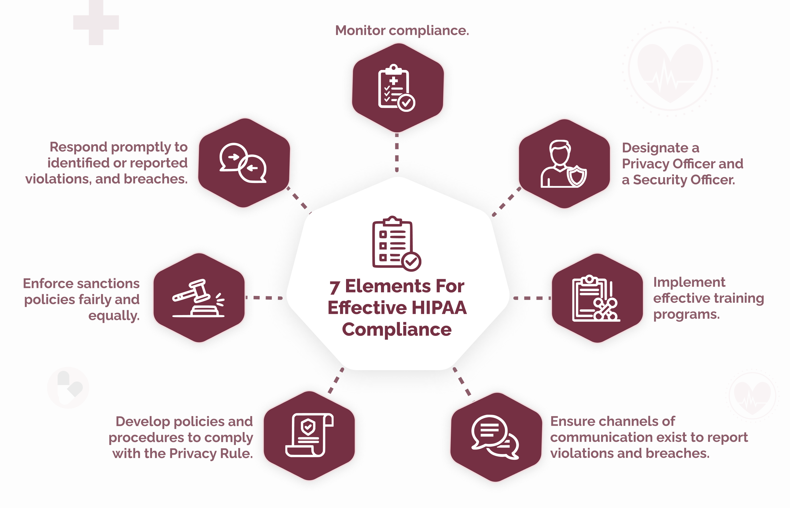

## Table of Contents

## What is a compliance program?

A compliance program is a set of rules and procedures that a company follows to make sure it obeys the law and behaves ethically. It helps the company avoid breaking laws, like those about the environment, finance, or how employees should be treated. The program includes training for employees, ways to report problems, and checks to make sure everyone is following the rules.

Having a good compliance program is important because it can prevent legal trouble and fines. It also helps build trust with customers, employees, and the community. By showing that the company cares about doing the right thing, it can improve its reputation and avoid the costs and damage that come from breaking the law.

## Why is it important to develop a compliance program?

Developing a compliance program is important because it helps a company follow the law and act ethically. When a company has a good compliance program, it can avoid getting in trouble with the law. This means not having to pay big fines or deal with legal problems that can hurt the business. A compliance program also helps make sure everyone in the company knows the rules and follows them, which can prevent mistakes or bad behavior.

Another reason a compliance program is important is that it builds trust. When customers, employees, and the community see that a company cares about doing the right thing, they feel more confident in the company. This can make people more likely to buy from the company, work for it, or support it in other ways. A strong compliance program can also improve the company's reputation, which is very important for long-term success.

## What are the basic components of a compliance program?

A compliance program has several key parts that help a company follow the law and act ethically. One important part is having clear rules and policies that everyone in the company understands. These rules explain what is expected of employees and how they should behave. Another part is training. Companies need to teach their employees about the rules and how to follow them. This helps everyone know what to do and avoid mistakes.

Another essential part of a compliance program is having a way for people to report problems or concerns. This could be a hotline or a person in the company that employees can talk to if they see something wrong. It's also important to have regular checks to make sure the rules are being followed. These checks, called audits, help find any issues before they become big problems. 

Lastly, a compliance program needs strong leadership support. The people at the top of the company need to show that they care about following the rules and doing the right thing. This sets a good example for everyone else. By having all these parts working together, a compliance program can help a company stay out of trouble and build trust with others.

## How do you assess the need for a compliance program in an organization?

To assess the need for a compliance program in an organization, you first need to look at the laws and rules that apply to the company. Different industries have different rules they need to follow, like safety rules for factories or financial rules for banks. You should also think about where the company does business, because different countries or states might have different laws. If the company works in many places, it might need a strong compliance program to make sure it follows all the different rules.

Another way to assess the need for a compliance program is to look at the company's past and its culture. If the company has had problems with breaking the law before, it probably needs a good compliance program to prevent more issues. Also, if the people in the company don't seem to care about following the rules, a compliance program can help change that. By looking at these things, you can decide if a compliance program is needed and how strong it should be.

## What are the steps involved in developing a compliance program?

To develop a compliance program, you first need to understand the laws and rules that apply to your company. This means looking at the industry you're in and where you do business. For example, if you run a factory, you need to know about safety rules. If you work in many countries, you have to follow the rules in each place. Once you know the rules, you can write clear policies that explain what employees need to do to follow them. These policies should be easy to understand so everyone knows what is expected.

Next, you need to train your employees on these policies. Training helps everyone learn the rules and how to follow them. It's also important to set up a way for people to report problems or concerns. This could be a hotline or someone they can talk to if they see something wrong. Regular checks, called audits, should be done to make sure the rules are being followed. If there are any issues, they can be fixed before they become big problems. Finally, the leaders of the company need to support the compliance program and show that they care about following the rules. This helps set a good example for everyone else.

## How can a compliance program be tailored to meet specific industry regulations?

To tailor a compliance program to meet specific industry regulations, you first need to understand the rules that apply to your industry. For example, if you work in healthcare, you need to know about patient privacy laws like HIPAA. If you are in finance, you need to follow rules about how money is handled and reported. Once you know these rules, you can create policies that fit your industry. These policies should be clear and easy for everyone in your company to understand and follow. 

After setting up the policies, you should train your employees on these industry-specific rules. Training helps make sure everyone knows what to do to stay compliant. You also need to set up a way for people to report any problems or concerns they see. This could be a special phone line or a person they can talk to. Regular checks, or audits, should be done to make sure everyone is following the rules. If there are any issues, you can fix them before they become big problems. By doing these things, you can make sure your compliance program meets the specific needs of your industry.

## What role does leadership play in the implementation of a compliance program?

Leadership plays a very important role in making a compliance program work. The people at the top of the company need to show that they care about following the rules and doing the right thing. When leaders set a good example, it helps everyone else in the company understand that compliance is important. Leaders can do this by talking about the compliance program often and making sure it is a big part of the company's culture. They also need to make sure there are enough resources, like money and time, to keep the program going strong.

Leaders also help by making sure the compliance program fits the company's needs. They need to know the laws and rules that apply to their industry and make sure the program follows them. Leaders should also listen to feedback from employees about the program and make changes if needed. By being involved and supportive, leaders can help the compliance program succeed and keep the company out of trouble.

## How do you measure the effectiveness of a compliance program?

To measure the effectiveness of a compliance program, you need to look at different things. One way is to see if the company is following the rules. This can be checked by doing audits, which are like tests to see if everyone is doing what they are supposed to do. Another way is to see if employees know about the rules and how to follow them. You can do this by giving them tests or surveys to see what they know. If the company is not getting in trouble with the law and employees understand the rules, that shows the compliance program is working well.

Another important thing to look at is how often people report problems or concerns. If there are a lot of reports, it might mean the program is working because people feel safe to speak up. But if there are very few reports, it could mean people are scared to say anything or don't know how to report issues. Also, it's good to see if the company is fixing problems quickly when they are found. If the company is quick to fix issues and learn from them, that's a sign of a strong compliance program. By looking at all these things, you can tell if the compliance program is doing its job and helping the company stay on the right track.

## What are common challenges faced during the development of a compliance program?

One common challenge in developing a compliance program is making sure it fits the specific needs of the company. Every company is different, and the rules they need to follow can be different too. This means the compliance program has to be changed to fit the company's industry, where it does business, and its culture. It can be hard to figure out all the rules and make sure the program covers everything the company needs.

Another challenge is getting everyone in the company to care about the compliance program. Sometimes employees might not see why it's important, or they might think it's just more work. Leaders need to show that they care about the program and make sure employees understand why it matters. This can be tough, especially if the company has not had a strong focus on following rules in the past. 

Lastly, keeping the compliance program up to date can be difficult. Laws and rules change all the time, so the program needs to change too. This means the company has to keep checking the rules and updating the program. It can be a lot of work to keep everything current and make sure the program stays effective.

## How should a compliance program be updated or revised over time?

A compliance program should be updated or revised regularly to make sure it keeps working well. One way to do this is by staying on top of new laws and rules that might affect the company. As these laws change, the compliance program needs to change too. This means looking at the policies and making sure they still fit the new rules. It's also a good idea to do regular checks, or audits, to see if the program is doing its job. If the audits show any problems, the program can be fixed to make it better.

Another important part of updating a compliance program is listening to feedback from employees. They might see things that need to be changed or have ideas on how to make the program better. By asking for their thoughts and making changes based on what they say, the program can stay relevant and effective. It's also helpful to keep training employees on the updated rules and policies so everyone knows what to do. By keeping the compliance program fresh and up to date, the company can avoid trouble and keep doing the right thing.

## What advanced strategies can be employed to enhance a compliance program?

To make a compliance program even better, companies can use technology to help. Special software can keep track of who is following the rules and who isn't. This software can also help with training by giving employees online lessons they can do anytime. Using data from the software, the company can see where problems are happening and fix them quickly. Another smart thing to do is to use artificial intelligence, or AI. AI can look at a lot of information and find patterns that might show where the company could be breaking the law. By using technology and AI, the compliance program can work better and catch problems before they get big.

Another advanced strategy is to make the compliance program part of the company's culture. This means making sure everyone, from the top bosses to new employees, knows that following the rules is important. Leaders can do this by talking about compliance a lot and rewarding people who do a good job following the rules. It's also a good idea to have a group of people from different parts of the company who help with the compliance program. This group can share ideas and make sure the program fits all parts of the business. By making compliance a big part of the company's culture, everyone will care more about doing the right thing.

## How does a compliance program integrate with an organization's overall risk management strategy?

A compliance program is a big part of an organization's overall risk management strategy. It helps the company follow the law and avoid getting in trouble, which is a big risk for any business. By having clear rules and training employees on them, the compliance program makes sure everyone knows what to do to stay out of trouble. It also includes ways for people to report problems, which helps the company find and fix issues before they become big risks. Regular checks, or audits, make sure the company is always following the rules and can spot any new risks that come up.

The compliance program works hand in hand with other parts of the risk management strategy, like safety plans and financial controls. For example, if the company has rules about how to handle money safely, the compliance program makes sure everyone follows those rules. This helps lower the risk of money problems. Leaders need to support both the compliance program and the risk management strategy to make sure they work together well. By doing this, the company can keep risks low and stay on the right side of the law.

## References & Further Reading

[1]: Bergstra, J., Bardenet, R., Bengio, Y., & Kégl, B. (2011). ["Algorithms for Hyper-Parameter Optimization."](https://dl.acm.org/doi/10.5555/2986459.2986743) Advances in Neural Information Processing Systems 24.

[2]: ["Advances in Financial Machine Learning"](https://www.amazon.com/Advances-Financial-Machine-Learning-Marcos/dp/1119482089) by Marcos Lopez de Prado

[3]: ["Evidence-Based Technical Analysis: Applying the Scientific Method and Statistical Inference to Trading Signals"](https://www.amazon.com/Evidence-Based-Technical-Analysis-Scientific-Statistical/dp/0470008741) by David Aronson

[4]: ["Machine Learning for Algorithmic Trading"](https://github.com/stefan-jansen/machine-learning-for-trading) by Stefan Jansen

[5]: ["Quantitative Trading: How to Build Your Own Algorithmic Trading Business"](https://github.com/LucindaYa/quant-resources/blob/master/Quantitative%20Trading%20How%20to%20Build%20Your%20Own%20Algorithmic%20Trading%20Business.pdf) by Ernest P. Chan