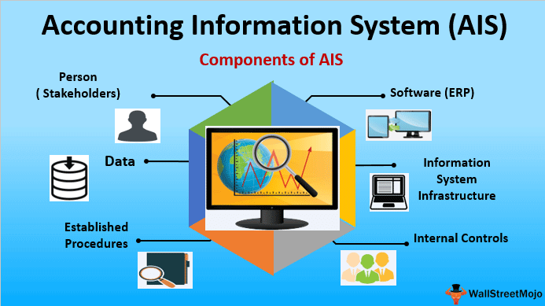

In the digital age, accounting information systems (AIS) have become pivotal for businesses in managing their financial data. These systems are not just limited to the realms of accountants; they have become indispensable tools for business analysts, Chief Financial Officers (CFOs), and numerous other professionals involved in strategic decision-making processes. By automating the collection, storage, and processing of financial information, AIS improve the accuracy and efficiency of financial data management, allowing professionals to focus on analysis and strategic tasks.

The significance of AIS is growing as companies increasingly adopt automated solutions. These systems link various financial components and facilitate seamless integration of tasks across departments. Understanding the components of AIS is crucial for effectively harnessing their capabilities. This knowledge aids businesses in customizing the system to meet their specific needs and enhance operational efficiency.



Moreover, the integration of AIS with algorithms and trading systems is revolutionizing modern financial strategies. Automated trading relies on accurate, timely data inputs provided by AIS to make swift and informed trading decisions. This synergy between AIS and algorithmic trading not only optimizes investment outcomes but also allows for the implementation of complex trading strategies that would be challenging to execute manually. Such integration highlights the evolving role of AIS in the finance industry, transitioning from mere data management tools to strategic assets that influence financial decision making.

## Table of Contents

## Understanding AIS and Its Components

An Accounting Information System (AIS) is a comprehensive framework that encompasses various tools and processes for managing financial data, ensuring such data is collected, stored, processed, and reported accurately and efficiently. The effectiveness of an AIS is reliant on six critical components: people, procedures and instructions, data, software, IT infrastructure, and internal controls. 

The people involved in AIS are integral, as they range from end-users like accountants and auditors to systems designers and IT specialists. They facilitate the operation, customization, and maintenance of the system, ensuring that the AIS aligns with business needs and regulatory requirements. Proper training and system design are essential to harness the full potential of the AIS, as skilled users can effectively manage and analyze the financial data provided by the system.

Procedures and instructions are the standardized methods by which financial data is handled. These guidelines dictate how data is collected and processed, whether through manual entry or automated processes. Clear and well-documented procedures are crucial for maintaining consistency and accuracy in financial reporting, avoiding errors, and ensuring compliance with rules and regulations. Regular training ensures that personnel are adept at following these procedures, thereby upholding data integrity.

Data is at the heart of an AIS, comprising various financial elements like sales orders, invoices, payroll, and inventory [statistics](/wiki/bayesian-statistics). The system must be capable of efficiently storing and retrieving this data to support informed decision-making. The accuracy and completeness of this data are vital for generating reliable financial reports and analyses, which form the basis for strategic business decisions.

Software acts as the backbone of an AIS, providing the necessary tools for processing and analyzing financial data. The software must be robust, reliable, and user-friendly to accommodate the needs of different businesses, from small enterprises to large multinational corporations. Customization of AIS software enables it to meet the specific requirements of an organization, thereby enhancing productivity and facilitating smooth financial operations.

IT infrastructure comprises the hardware that supports the AIS software. This includes computers, servers, and mobile devices, which must be compatible with the software to function effectively. Regular maintenance and upgrades of the IT infrastructure are necessary to ensure the operational efficiency and scalability of the AIS, allowing it to adapt to evolving technological advancements and business demands.

Internal controls are mechanisms designed to safeguard sensitive financial data within the AIS. These controls include measures like password protection, encryption, and biometric authentication, which prevent unauthorized access and ensure data confidentiality. Additionally, internal controls must protect against external threats such as cyberattacks or natural disasters, thereby ensuring the resilience and security of the financial data managed within the system. 

In summary, each component of an AIS plays a vital role in the management and safeguarding of financial data. Their seamless integration ensures the accuracy, efficiency, and security of financial operations within a business.

## Role of People in AIS

Accounting Information Systems (AIS) function through collaboration and the adept handling of financial data, making the role of people a cornerstone for their effective operation. The diversity of AIS users spans from accountants and managers to auditors and consultants, each contributing to the system's utility by providing specialized expertise and contextual analysis for financial data.

The ability of AIS to facilitate collaboration across various departments is one of its most significant advantages. By centralizing financial data, AIS offers a unified platform that allows multiple departments to access and share vital information effortlessly. This capability not only enhances operational efficiency but also ensures that financial information is consistent and up-to-date across all business units. The integration of data from different sources into a singular system helps develop a coherent strategy, streamlines processes, and aids in making informed decisions backed by comprehensive data sets.

However, to fully leverage the benefits of AIS, effective user training and robust system design are paramount. User training ensures that all stakeholders know how to navigate the system effectively, input data correctly, and extract pertinent information when required. Training programs should be tailored to address the specific needs of different user groups to facilitate their adept use and ensure that they can troubleshoot commonly encountered issues independently. 

In terms of system design, ensuring that the AIS is user-friendly and logically structured is crucial. A poorly designed system can result in user errors, inefficiencies, and data inaccuracies. Therefore, the input from actual users often proves invaluable in the design phase, as it helps developers create an interface and functionalities that match the users’ practical needs and workflows.

Moreover, user feedback is essential for ongoing system improvements and updates. Continuous interaction with users helps in identifying potential system improvements, which can drive upgrades that enhance system functionality and user satisfaction.

In conclusion, the involvement of people in AIS is critical, influencing how efficiently these systems can function and deliver value across organizations. Proper user training and thoughtful system design are key elements that ensure the smooth operation of AIS, facilitating the comprehensive use of financial data for strategic decision-making.

## Procedures and Instructions in AIS

Procedures and instructions within Accounting Information Systems (AIS) are critical as they define the methods for handling financial data, integrating both manual and automated processes to ensure accuracy and efficiency. These procedures provide a framework for consistent data collection, processing, and reporting, thereby reducing the risk of errors and enhancing the reliability of financial information.

Manual processes within AIS often involve initial data entry, reconciliation, and validation tasks that require human oversight. For instance, while inputting sales transactions, employees must verify data accuracy before it enters the system, ensuring two-[factor](/wiki/factor-investing) verification such as cross-referencing with purchase orders or receipts. Automated processes, on the other hand, include tasks that are repetitive and rule-based, leveraging specialized software to perform calculations, generate reports, or trigger financial alerts without human intervention. For example, inventory management systems can automatically update stock levels and reorder products based on pre-defined thresholds, optimizing supply chain efficiencies.

Clear and detailed documentation serves as the backbone of these procedures. Documentation encompasses guidelines on system operations, data input formats, processing methods, and output requirements. It acts as a comprehensive reference, guiding employees through each step of their duties and ensuring they adhere to standardized practices. Regular updates to documentation are necessary to reflect changes in business processes, regulatory requirements, or software upgrades, thereby maintaining AIS relevance and effectiveness.

Employee training complements documentation by equipping users with practical skills necessary to interact with the AIS efficiently. Training sessions should cover various aspects of AIS operations, including data entry techniques, report generation, and adherence to internal controls. Interactive training modules, role-playing scenarios, and periodic assessments can enhance learning outcomes, ensuring employees not only understand the theoretical underpinnings of the AIS but can also apply them in real-world scenarios.

By establishing robust procedures and fostering an environment of continuous employee training, organizations can uphold data integrity within their AIS, facilitating reliable financial reporting and informed decision-making. Properly executed, these practices form the cornerstone of a well-functioning AIS, contributing to the broader objectives of organizational efficiency and compliance.

## Data Management in AIS

An Accounting Information System (AIS) is integral for the proficient management of financial data, playing a vital role in decision-making processes within a business. The effective operation of an AIS revolves around its capability to accurately store, retrieve, and manage diverse types of financial data, ensuring the reliability and efficacy of financial reporting and analysis.

Financial data within an AIS encompasses several core types, including sales orders, billing statements, and inventory data. Sales orders provide detailed information about customer transactions, such as product quantities, agreed prices, and delivery schedules. This data is critical for revenue recognition and forecasting. Billing statements, on the other hand, represent the financial obligations of customers, summarizing amounts owed and payment histories, which are crucial for cash flow management. Inventory data tracks stock levels, costs, and turnover rates, thus enabling efficient inventory control and planning.

The precision and completeness of financial data in an AIS are prerequisites for effective decision-making. Ensuring data accuracy involves validating data inputs against established business rules and performing regular reconciliations. Completeness, meanwhile, necessitates the facilitation of comprehensive data capture processes that encompass all pertinent transactions and events within the business cycle.

To manage such data efficiently, businesses often employ a range of technological tools and methodologies. Techniques like data normalization are employed to minimize redundancy and ensure logical data organization, which facilitates easy access and manipulation. For example, data normalization in a relational database might involve structuring tables such that each data point is stored only once, reducing inconsistencies.

In addition, businesses implement advanced algorithms for data analysis, enabled by programming languages such as Python. A simple Python script could be used to automate data verification processes as follows:

```python
import pandas as pd

def verify_sales_data(sales_df):
    # Check for missing values
    if sales_df.isnull().sum().sum() > 0:
        print("Data verification failed: Missing values detected.")
        return False

    # Validate data types
    if not all(isinstance(x, (int, float)) for x in sales_df['Amount']):
        print("Data verification failed: Incorrect data types.")
        return False

    print("Data verification successful.")
    return True

# Sample DataFrame
sales_data = pd.DataFrame({'OrderID': [1, 2, 3],
                           'Amount': [250.50, 130.75, 85.00]})

# Verify the sales data
verify_sales_data(sales_data)
```

This sample script checks for missing values and validates data types within a sales data dataset, ensuring the data's integrity before further processing or analysis.

The overarching goal of data management in an AIS is to generate accurate and comprehensive financial information that serves as a foundation for strategic decisions. By ensuring precision and completeness, businesses can enhance their financial analysis capabilities, mitigate risks associated with erroneous data, and ultimately achieve more informed and successful financial outcomes.

## Software: The Backbone of AIS

Accounting Information Systems (AIS) rely heavily on software, which serves as the backbone of these systems by facilitating the collection, processing, and reporting of financial data. The landscape of AIS software is diverse, catering to a variety of organizational needs ranging from small businesses employing basic financial applications to large enterprises utilizing complex Enterprise Resource Planning (ERP) systems. ERP systems integrate various business processes and functions into a single comprehensive solution, often encompassing accounting, human resources, supply chain, and customer relationship management modules.

Customization is a significant advantage of AIS software, allowing businesses to tailor applications to meet industry-specific requirements and operational nuances. This adaptability ensures that the software not only aligns with existing business processes but also enhances efficiency and accuracy in financial reporting. Customizable features might include user-defined financial reports, bespoke data entry screens, and the integration of specialized compliance protocols.

The effectiveness of AIS software is contingent upon three critical factors: security, reliability, and user-friendliness. Robust security measures are imperative to protect sensitive financial data from unauthorized access and cyber threats. Common security features include encryption protocols, multi-factor authentication, and regular security audits. The reliability of AIS software is equally important, as businesses cannot afford system downtime or data discrepancies in financial records. Reliable software solutions incorporate rigorous testing, regular updates, and dependable backup and recovery systems to ensure continuous operation and data integrity.

User-friendliness is essential to maximize user adoption and effectiveness. Intuitive interfaces and straightforward navigation reduce the learning curve for users and minimize the risk of errors during data entry and analysis. Effective AIS software often includes training modules and user support systems to assist in the transition and ongoing use of the system.

To illustrate, consider a small business using basic accounting software, such as QuickBooks or Xero, which provides essential functionalities such as invoicing, expense tracking, and financial reporting. In contrast, a multinational corporation might implement a sophisticated ERP system like SAP or Oracle, offering extensive customization capabilities and supporting a wide array of financial and operational activities.

In conclusion, the selection and implementation of appropriate AIS software is crucial for achieving organizational goals related to financial management. The software's versatility through customization, coupled with its focus on security, reliability, and user-friendliness, underscores its central role in supporting efficient and accurate financial operations within an organization.

## IT Infrastructure Understanding

The hardware supporting an Accounting Information System (AIS) plays a crucial role in ensuring compatibility with its corresponding software, thereby facilitating effective business operations. The core components of this hardware include computers, servers, and mobile devices, all of which must be selected to align with the specific AIS software requirements for optimal performance. 

Computers, serving as the primary interface for users, must possess adequate processing power, memory, and storage capabilities to handle the complex data processing tasks inherent in AIS operations. Servers, on the other hand, provide the necessary backend support for data storage and retrieval, enabling centralized data management and ensuring that financial data is readily accessible while maintaining integrity and security. Mobile devices have become increasingly significant due to the growing need for mobility and real-time data access, allowing users such as accountants and financial managers to engage with AIS on-the-go.

The ongoing maintenance and regular upgrading of IT infrastructure are essential to support the smooth operation of an AIS. Technological advancements rapidly render older hardware obsolete, often leading to compatibility issues with newer software versions. Regular upgrades ensure that the hardware remains capable of supporting updates to AIS software, which may include enhancements for improved data processing speed and security features.

Additionally, maintaining IT infrastructure involves implementing preventative measures to safeguard against potential hardware failures. This includes regular hardware health checks, ensuring adequate cooling systems to prevent overheating, and implementation of redundancy protocols to safeguard data integrity and continuity in the event of hardware malfunctions.

The integration of cutting-edge hardware solutions, such as cloud computing and virtualization technologies, can further elevate the efficiency of AIS operations. These technologies enable scalable storage solutions, enhanced data processing capabilities, and contribute to lower operational costs by reducing the dependency on physical hardware. 

In summary, the hardware supporting an AIS must not only be compatible and robust but also dynamic enough to accommodate technological advancements to ensure smooth, secure, and efficient operations.

## Internal Controls and Security in AIS

Internal controls and security within Accounting Information Systems (AIS) are critical elements that ensure the protection of sensitive financial data from unauthorized access and potential threats. These controls are composed of various mechanisms aimed at safeguarding data integrity and confidentiality, thereby maintaining the reliability of financial information.

Password protection forms the first line of defense, serving as a fundamental control measure within AIS. This involves the use of strong, unique passwords for system access to ensure that only authorized personnel can retrieve or modify data. A typical strong password may include a combination of uppercase and lowercase letters, numbers, and special characters. Regular updates and complexity requirements can significantly enhance security.

Encryption is another essential control, which converts financial data into a coded format that is readable only by those holding the decryption key. This method is particularly effective in protecting data transmitted over networks. The encryption process involves mathematical algorithms such as Advanced Encryption Standard (AES), which utilizes a symmetric key algorithm to encrypt and decrypt data efficiently and securely.

Biometric identification adds an additional layer of security by utilizing unique physical characteristics of users, such as fingerprints or retinal patterns, to authenticate access. This method reduces the risk of impersonation and provides a robust security framework for AIS.

In addition to these controls, there must be provisions for safeguarding against external threats, such as cyberattacks. Systems should incorporate firewalls, intrusion detection systems, and antivirus software to protect against malware and unauthorized network access. Regular security audits and system updates are necessary to address vulnerabilities and ensure compliance with the latest security protocols.

Natural disasters pose another threat, and organizations must have contingency plans in place, such as off-site data backups and disaster recovery plans, to ensure data availability and continuity of operations. These preparations help mitigate data loss and operational disruptions in the event of unforeseen events.

Overall, effective internal controls and security measures in AIS fortify an organization's financial data against internal and external threats, enabling the secure execution of business processes and safeguarding the organization's financial health.

## AIS Integration with Algorithmic Trading

The integration of Accounting Information Systems (AIS) with [algorithmic trading](/wiki/algorithmic-trading) platforms has revolutionized financial strategy execution by enhancing the capabilities of automated trading systems. Algorithmic trading, which utilizes computer algorithms to execute trades at optimal prices, depends heavily on the availability of accurate and timely financial data. AIS serves as a foundational pillar by providing necessary data inputs such as market prices, financial statements, and economic indicators.

Algorithmic trading systems leverage complex mathematical models and algorithms to analyze market data and identify trading opportunities. These systems require AIS to supply precise and updated data streams, which are essential to making effective trade decisions. The integration ensures that trading algorithms have access to real-time data, enabling them to respond swiftly to market changes and capitalize on transient opportunities.

This synergy between AIS and algorithmic trading optimizes investment outcomes by reducing transaction costs, increasing trading speed, and enhancing decision-making accuracy. For instance, algorithmic strategies such as high-frequency trading ([HFT](/wiki/high-frequency-trading-strategies)) rely on data input from AIS to perform thousands of trades within seconds, exploiting tiny price movements that are imperceptible to human traders.

Moreover, AIS contributes to enhanced risk management in algorithmic trading. By ensuring the accuracy and comprehensiveness of financial data, AIS aids in modeling market risks and developing strategies to mitigate them. This reduces the potential for financial discrepancies and ensures regulatory compliance, thereby safeguarding the trading operations.

In summary, the integration of AIS with algorithmic trading is a symbiotic relationship that maximizes the efficacy of financial strategies. Through the provision of accurate data and robust risk management frameworks, AIS plays a crucial role in the successful implementation and execution of algorithmic trading strategies, ultimately improving investment performance and financial outcomes.

## Case Studies: Lessons from AIS Implementation

The implementation of Accounting Information Systems (AIS) plays a crucial role in ensuring financial integrity and compliance within organizations. Two notable cases, WorldCom and Lehman Brothers, provide significant lessons in the design and utilization of AIS, underscoring its importance in complex financial environments.

### WorldCom
WorldCom, once a leading telecommunications company, collapsed due to one of the largest accounting frauds in U.S. history. This scandal involved the misstatement of financial information, where expenses were improperly classified as capital investments, inflating the company's financial position. The failure was partly attributed to a poorly structured AIS that allowed significant manipulation of financial data without adequate checks and balances. The absence of robust internal controls within its AIS meant discrepancies were not detected promptly, leading to $3.8 billion in fraudulent accounting entries.

From WorldCom's downfall, a critical takeaway is that a well-implemented AIS should incorporate comprehensive internal controls, including regular audits, cross-verification processes, and automated alerts for unusual transactions. Additionally, it underscores the necessity for transparent reporting mechanisms that ensure data integrity and accuracy. This case exemplifies how AIS, when inadequately designed, can fail to prevent financial misconduct and result in devastating consequences.

### Lehman Brothers
Lehman Brothers, a global financial services firm, filed for bankruptcy in 2008, marking one of the largest failures during the financial crisis. The firm's collapse highlighted several deficiencies in its AIS, such as its inability to manage complex mortgage-backed securities and derivatives adequately. The system's limitations in risk management and financial reporting contributed to its downfall. While not fraud-related like WorldCom, the operational inefficiencies within its AIS exacerbated Lehman's financial mismanagement.

Lessons from Lehman Brothers emphasize the importance of an AIS that supports dynamic risk assessment and real-time data analysis, essential for navigating volatile financial markets. Effective AIS should be equipped to handle complex financial instruments and integrate risk management tools that evaluate financial exposure continuously. This capability allows firms to respond swiftly to market changes and regulatory requirements, ensuring financial stability.

### Conclusion
The cases of WorldCom and Lehman Brothers clearly demonstrate that a robustly structured AIS is vital for preventing financial discrepancies and supporting regulatory compliance. These examples highlight the importance of incorporating advanced internal controls and real-time financial analysis capabilities in AIS design. For modern businesses, leveraging an effective AIS is critical to safeguarding against financial mismanagement and achieving long-term success.

## Conclusion

Accounting Information Systems (AIS) are indispensable in today’s business landscape, where digital integration and data-driven decision-making are paramount. As businesses grapple with expanding datasets and the complexity of financial operations, AIS emerge as key facilitators in managing and leveraging these resources effectively. The fundamental components of AIS, including data management, software, IT infrastructure, and internal controls, form a cohesive framework that supports financial reporting, compliance, and strategic planning. 

Understanding these components is essential, especially as AIS are increasingly interconnected with algorithmic trading systems. Such integration enables real-time processing and precise decision-making, which are critical for effective financial strategy execution. As algorithmic trading relies heavily on accurate and timely data, the synergy between AIS and these systems enhances investment outcomes and operational efficiency.

To fully harness the advantages of AIS, continuous education and adaptation to new technological advancements are imperative. The business environment is rapidly evolving, with emerging technologies consistently reshaping traditional practices. Professionals utilizing AIS must stay informed about new software innovations, IT infrastructure upgrades, and enhanced security measures to maintain robust and resilient financial systems. By embracing ongoing learning and adapting to technological progress, businesses can ensure that their AIS remain a driving force for competitive advantage and sustained growth.

## References & Further Reading

[1]: Gelinas, U., Dull, R. B., Wheeler, P. R., & Hill, M. C. (2015). ["Accounting Information Systems."](https://books.google.com/books/about/Accounting_Information_Systems.html?id=5_HWtwEACAAJ) Cengage Learning.

[2]: Romney, M. B., & Steinbart, P. J. (2020). ["Accounting Information Systems."](https://www.pearson.com/en-us/subject-catalog/p/accounting-information-systems/P200000006039/9780137540914) Pearson Education.

[3]: Lo, A. W. (2016). ["Adaptive Markets: Financial Evolution at the Speed of Thought."](https://www.jstor.org/stable/j.ctvc77k3n) Princeton University Press.

[4]: Tapscott, D., & Tapscott, A. (2016). ["Blockchain Revolution: How the Technology Behind Bitcoin and Other Cryptocurrencies Is Changing the World."](https://www.amazon.com/Blockchain-Revolution-Technology-Cryptocurrencies-Changing/dp/1101980141) Penguin Random House.

[5]: Branco, P., & Król, D. (2015). [“The integration and application of accounting information systems: A systematic literature review and future research agenda."](https://www.sciencedirect.com/science/article/pii/S0921509324014680) Procedia Computer Science.