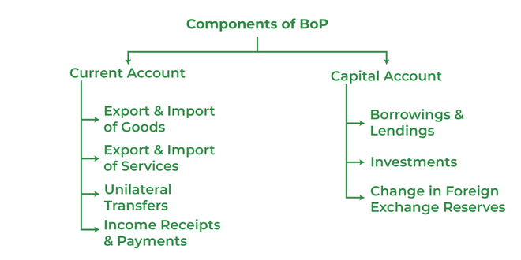

## Table of Contents

## What is a country's balance of payments?

A country's balance of payments is like a big financial report that shows all the money coming in and going out of a country over a certain time, usually a year. It includes money from things like exports and imports, investments, and even money sent home by people working abroad. It's important because it helps us understand how well a country is doing financially in the global market.

The balance of payments is divided into two main parts: the current account and the capital account. The current account tracks everyday transactions, like buying and selling goods and services, and also includes income from investments and transfers like foreign aid. The capital account, on the other hand, looks at investments flowing in and out of the country, such as buying property or stocks. If a country has more money coming in than going out, it has a surplus; if more money is going out, it has a deficit.

## What are the main components of the balance of payments?

The balance of payments is split into two main parts: the current account and the capital account. The current account is all about the everyday stuff. It includes money from selling things like cars or food to other countries (exports) and money spent on buying things from other countries (imports). It also covers money from services, like tourism or banking, and income from investments, like dividends from stocks. Lastly, it includes transfers, which are payments that don't involve buying anything, like sending money to family abroad or foreign aid.

The capital account, on the other hand, focuses on investments and big financial moves. This includes money coming into the country when foreigners buy property or invest in businesses here, and money going out when locals invest in other countries. It also covers things like debt forgiveness or the transfer of non-financial assets, though these are less common. Together, these two accounts give a full picture of a country's financial interactions with the rest of the world, showing whether the country is bringing in more money than it's sending out, or vice versa.

## How is the current account different from the capital account?

The current account and the capital account are two main parts of a country's balance of payments. The current account is like a record of everyday financial activities. It includes money from selling things like cars or food to other countries, which we call exports, and money spent on buying things from other countries, known as imports. It also covers money from services, like when tourists visit or when banks do business with other countries. Plus, it includes income from investments, like dividends from stocks, and transfers, which are payments that don't involve buying anything, like sending money to family abroad or foreign aid.

The capital account, on the other hand, focuses on big financial moves and investments. It tracks money coming into the country when foreigners buy property or invest in businesses here, and money going out when locals invest in other countries. It also includes less common transactions like debt forgiveness or the transfer of non-financial assets. While the current account shows the day-to-day financial flow, the capital account shows the bigger picture of investment and financial shifts between countries. Together, these two accounts give a complete view of a country's financial interactions with the rest of the world.

## What types of transactions are included in the current account?

The current account is all about the everyday money stuff. It includes money from selling things like cars or food to other countries, which we call exports. It also includes money spent on buying things from other countries, known as imports. For example, if a country sells a lot of cars to another country, that money goes into the current account.

The current account also covers money from services, like when tourists visit or when banks do business with other countries. Plus, it includes income from investments, like the money you get from owning stocks in another country. Lastly, it has transfers, which are payments that don't involve buying anything, like sending money to family abroad or foreign aid.

In simple terms, the current account is like a big diary of all the regular financial activities a country has with the rest of the world. It helps us see if a country is making more money from these activities than it's spending.

## Can you explain the subcomponents of the current account, such as goods, services, income, and current transfers?

The current account has four main parts: goods, services, income, and current transfers. The goods part is all about the things a country buys and sells, like cars, food, and clothes. When a country sells more stuff to other countries than it buys, it has a trade surplus in goods. If it buys more than it sells, it has a trade deficit. This part is super important because it shows how much a country relies on trade with other countries.

The services part includes money from things you can't touch, like tourism, banking, and shipping. When tourists visit a country, they spend money there, which counts as a service export for that country. The income part covers money from investments, like dividends from stocks or interest from loans. If a country owns a lot of stocks or bonds in other countries, it might get a lot of income from those investments. Finally, the current transfers part includes money that's sent without expecting anything back, like foreign aid or money sent home by workers living abroad. These transfers can be really important for some countries, especially if they receive a lot of money from their citizens working overseas.

## What is the significance of the trade balance within the current account?

The trade balance is a big part of the current account. It's all about the money a country makes from selling things like cars, food, and clothes to other countries (exports) and the money it spends on buying things from other countries (imports). If a country sells more than it buys, it has a trade surplus. That means more money is coming into the country than going out. If it buys more than it sells, it has a trade deficit, which means more money is going out than coming in. The trade balance is important because it shows how much a country depends on trading with other countries.

The trade balance can tell us a lot about a country's economy. If a country has a big trade surplus, it might mean that other countries really like what it's selling. This can be good for the economy because it brings in money. But if a country has a big trade deficit, it might need to borrow money from other countries or use its savings to pay for the stuff it's buying. Over time, this can be a problem if it keeps happening. So, the trade balance is a key part of understanding if a country's economy is doing well or if it might face challenges.

## How does the capital account differ from the financial account?

The capital account and the financial account are two parts of a country's balance of payments, but they focus on different things. The capital account is all about big financial moves that don't involve buying and selling things every day. It includes money coming into the country when foreigners buy property or invest in businesses here, and money going out when locals invest in other countries. It also covers less common things like debt forgiveness or the transfer of non-financial assets, like when a country gives land to another country.

The financial account, on the other hand, is more about the flow of money related to investments. It tracks money moving in and out of the country through things like buying and selling stocks, bonds, and other financial assets. For example, if a foreign company buys shares in a local business, that money goes into the financial account. The financial account helps us understand how much money is coming in and going out because of investments, which is different from the capital account's focus on broader financial transactions. Together, these accounts give us a complete picture of a country's financial interactions with the rest of the world.

## What types of investments are recorded in the financial account?

The financial account keeps track of all the money moving in and out of a country because of investments. It includes money from buying and selling things like stocks, bonds, and other financial assets. For example, if a foreign company buys shares in a local business, that money goes into the financial account. It also tracks money from loans and other types of investments, like when a country's citizens buy property or businesses in other countries.

This account is important because it shows how much money is coming into the country from other countries wanting to invest here, and how much money is leaving the country when locals invest abroad. It helps us understand if the country is attracting more investment from other countries or if it's sending more money out to invest elsewhere. By looking at the financial account, we can see the big picture of how investment money is flowing in and out of the country.

## How do changes in foreign exchange reserves affect the balance of payments?

Changes in foreign exchange reserves can have a big impact on a country's balance of payments. Foreign exchange reserves are like a country's savings account in different currencies, usually held by its central bank. When a country uses these reserves to buy things from other countries or to support its own currency, it affects the balance of payments. For example, if a country uses its reserves to pay for imports, this shows up as an increase in the current account deficit because more money is going out than coming in.

On the other hand, if a country adds to its foreign exchange reserves, it means it's getting more money from other countries than it's spending. This can show up as a surplus in the financial account because the country is accumulating more foreign currency. So, changes in foreign exchange reserves can help balance out deficits or surpluses in other parts of the balance of payments, giving us a clearer picture of the country's overall financial health.

## What is the role of the errors and omissions account in the balance of payments?

The errors and omissions account is like a catch-all part of the balance of payments. It's there to make sure everything adds up correctly. Sometimes, when a country is keeping track of all its money coming in and going out, they might miss some transactions or make mistakes. The errors and omissions account helps fix these problems by showing the difference between what the country thought it had and what it actually has.

Think of it like balancing your checkbook. If you add up all your income and spending and the numbers don't match, you might have forgotten to write down a purchase or an income. The errors and omissions account does the same thing for a country's money. It makes sure the balance of payments is accurate, even if some transactions were missed or recorded wrongly. This way, economists can have a more reliable picture of the country's financial situation.

## How can a country's balance of payments influence its currency value?

A country's balance of payments can affect its currency value in a big way. If a country has a lot more money coming in than going out, which we call a surplus, it usually means its currency will get stronger. This is because other countries need more of that currency to buy the things or investments they want from the country with the surplus. For example, if a country sells a lot of cars to other countries, those countries will need more of the car-selling country's currency to pay for those cars, which can make the currency more valuable.

On the other hand, if a country is spending more money than it's bringing in, which we call a deficit, its currency might get weaker. This happens because the country needs to buy things from other countries, and it might have to sell its own currency to get the foreign currency it needs. If a lot of people want to sell the currency, its value can go down. So, the balance of payments is like a report card that shows if a country's currency is likely to go up or down in value.

## What are the implications of a persistent deficit or surplus in the balance of payments for a country's economy?

A persistent deficit in a country's balance of payments means that the country is spending more money on imports, investments, and transfers than it is [earning](/wiki/earning-announcement) from exports and other sources. This can lead to problems over time. The country might need to borrow money from other countries or use its savings to cover the deficit. If this keeps happening, the country's debt can grow, and it might have to pay more interest on that debt. This can make the country's economy weaker because it has less money to spend on things like schools and hospitals. Also, a persistent deficit can make the country's currency weaker, which can make imports more expensive and lead to higher prices for things people need every day.

On the other hand, a persistent surplus in the balance of payments means the country is earning more money than it's spending. This can be good for the economy because the country can save more money or invest in other countries. A surplus can also make the country's currency stronger, which can make imports cheaper and help keep prices stable. But having a big surplus all the time can also have downsides. Other countries might start to worry about trade imbalances and put up barriers to stop the surplus country from selling so much to them. Also, if the country's currency gets too strong, it might make the country's exports more expensive and less competitive in the global market.

## References & Further Reading

[1]: Krugman, P. R., & Obstfeld, M. (2003). ["International Economics: Theory and Policy."](https://archive.org/details/internationaleco0008krug) Addison Wesley.

[2]: Mishkin, F. S. (2015). ["The Economics of Money, Banking, and Financial Markets."](https://www.pearsonhighered.com/assets/preface/0/1/3/4/0134855388.pdf) Pearson.

[3]: Hull, J. C. (2018). ["Options, Futures, and Other Derivatives."](https://www.semanticscholar.org/paper/Options%2C-Futures%2C-and-Other-Derivatives-Hull/89bdee500c8623864fc9eb7a471546aa713acc44) Pearson.

[4]: Lopez de Prado, M. (2018). ["Advances in Financial Machine Learning."](https://www.amazon.com/Advances-Financial-Machine-Learning-Marcos/dp/1119482089) Wiley.

[5]: Bank for International Settlements. (2019). ["BIS Quarterly Review, March 2019."](https://www.bis.org/publ/qtrpdf/r_qt1903.htm) Bank for International Settlements.

[6]: Goolsbee, A., & Levitt, S. (2020). ["Microeconomics."](https://www.macmillanlearning.com/college/us/product/Microeconomics/p/1319330576) Worth Publishers.

[7]: Harris, L. (2003). ["Trading and Exchanges: Market Microstructure for Practitioners."](https://academic.oup.com/book/52292) Oxford University Press.

[8]: Dacorogna, M. M., Gençay, R., Müller, U. A., Olsen, R. B., & Pictet, O. V. (2001). ["An Introduction to High-Frequency Finance."](https://www.sciencedirect.com/book/9780122796715/an-introduction-to-high-frequency-finance) Academic Press.