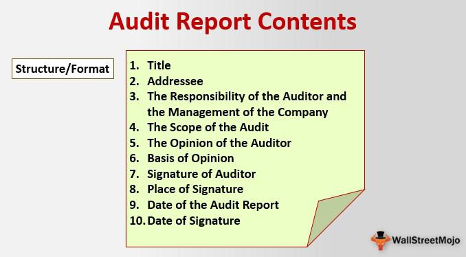

## Table of Contents

## What is an auditor's report?

An auditor's report is a document prepared by a professional auditor after examining a company's financial records. The report tells if the financial statements of the company are correct and follow the rules. It helps people like investors and shareholders understand if they can trust the financial information provided by the company.

The report usually includes an opinion from the auditor. This opinion can be "unqualified" which means the financial statements are fine, or "qualified" which means there are some issues but the statements are mostly okay. Sometimes, the opinion can be "adverse" if the financial statements are seriously wrong, or "disclaimer" if the auditor couldn't get enough information to form an opinion. This helps everyone know how reliable the company's financial information is.

## What are the main components of an auditor's report?

An auditor's report has several important parts that help people understand a company's financial health. The first part is the introductory section, which explains what the auditor did and what financial statements they looked at. It also mentions the time period covered by the audit and states that the company's management is responsible for the financial statements, while the auditor's job is to give an opinion on them.

The next part is the management's responsibility section, which talks about how the company's management is in charge of preparing the financial statements and making sure they follow the right rules. This part also explains that the management needs to set up good internal controls to prevent mistakes or fraud. The auditor's responsibility section follows, where the auditor explains their job, which includes following auditing standards, planning and performing the audit to get enough evidence to form an opinion, and being independent and objective.

The final part is the auditor's opinion, which is the most important part of the report. Here, the auditor gives their opinion on whether the financial statements are fair and follow the accounting rules. The opinion can be unqualified (meaning everything looks good), qualified (meaning there are some issues but overall it's okay), adverse (meaning there are serious problems), or a disclaimer (meaning the auditor couldn't get enough information to form an opinion). This helps investors and others decide if they can trust the company's financial information.

## Who are the typical users of an auditor's report?

The typical users of an auditor's report are people who have an interest in the company's financial health. This includes investors who want to know if they should buy, sell, or hold the company's stock. They look at the auditor's report to see if the financial statements are accurate and trustworthy. Shareholders also use the report to understand how well the company is doing and if it is managing its money properly. They rely on the auditor's opinion to make decisions about their investment in the company.

Another group of users is the company's creditors, like banks or suppliers, who need to know if the company can pay back its loans or bills. They use the auditor's report to assess the company's financial stability and decide whether to lend money or extend credit. Regulatory bodies, like the Securities and Exchange Commission (SEC), also use the report to make sure the company is following the law and reporting its finances correctly. Overall, the auditor's report helps many different people make informed decisions about the company.

## What is the purpose of the opinion section in an auditor's report?

The opinion section in an auditor's report is very important because it tells readers what the auditor thinks about the company's financial statements. This section is where the auditor says if the financial statements are correct and follow the rules. The opinion can be "unqualified," which means the financial statements are fine and the auditor agrees with them. Or it can be "qualified," which means there are some problems but the statements are mostly okay. Sometimes, the opinion can be "adverse," which means the financial statements have big problems and can't be trusted. And there's also a "disclaimer," which means the auditor couldn't get enough information to make a decision.

The purpose of the opinion section is to help people like investors, shareholders, and creditors understand if they can trust the company's financial information. If the opinion is unqualified, it gives confidence that the financial statements are accurate. But if the opinion is qualified, adverse, or a disclaimer, it tells users to be careful because there might be issues with the financial statements. This helps everyone make better decisions about whether to invest in, lend to, or do business with the company.

## How does the management's responsibility section contribute to an auditor's report?

The management's responsibility section in an auditor's report explains that the company's leaders are in charge of making the financial statements. They need to make sure these statements are correct and follow the rules. This part also says that the management should set up good systems inside the company to stop mistakes or fraud. This helps everyone understand that the company's leaders have a big job to do and are responsible for the financial information they give out.

By including this section, the auditor's report makes it clear that the management has the main job of preparing the financial statements, while the auditor's job is to check them and give an opinion. This helps users of the report, like investors and creditors, know who to hold accountable for the financial information. It also shows that the auditor is independent and just there to give an honest opinion on what the management has done.

## What information is included in the basis for opinion section?

The basis for opinion section in an auditor's report explains how the auditor did their job. It says that the auditor followed certain rules and standards when they checked the company's financial statements. It also mentions that the auditor planned and did their work to get enough evidence to form an opinion. This section helps people understand that the auditor was careful and thorough in their work.

This part of the report also says that the auditor was independent and objective. It means they didn't let anything influence their opinion about the financial statements. By including this information, the basis for opinion section shows that the auditor's work was done properly and fairly. This helps users of the report trust the auditor's opinion more.

## What are the different types of audit opinions that can be issued?

There are four main types of audit opinions that auditors can give in their reports. The first type is an unqualified opinion, which means the auditor thinks the company's financial statements are correct and follow the rules. This is the best kind of opinion because it shows that everything looks good. The second type is a qualified opinion, which means there are some problems with the financial statements, but they are not too bad. This opinion tells people to be a bit careful because there might be some issues.

The third type of opinion is an adverse opinion, which is the worst kind. It means the financial statements have big problems and can't be trusted. This tells investors and others to be very careful because the company's financial information is seriously wrong. The last type is a disclaimer of opinion, which means the auditor couldn't get enough information to decide if the financial statements are right or wrong. This happens when the auditor can't do their job properly because they don't have all the facts they need.

## How does the key audit matters section enhance the transparency of an auditor's report?

The key audit matters section in an auditor's report makes the report more open and clear by talking about the most important things the auditor looked at during the audit. It explains the trickiest parts of the financial statements that needed a lot of attention and why they were important. This part helps people understand what the auditor focused on and what could affect the company's financial health.

By including key audit matters, the report gives more details about the audit process and the big issues the auditor found. This helps investors, shareholders, and others see the bigger picture and make better decisions. It also shows that the auditor did a thorough job and thought carefully about the most important parts of the company's finances.

## What role does the auditor's responsibility section play in the report?

The auditor's responsibility section in an auditor's report tells everyone what the auditor's job is. It explains that the auditor follows special rules and standards when they check the company's financial statements. The section says that the auditor plans and does their work to get enough proof to form an opinion on the financial statements. It also makes it clear that the auditor needs to be independent and fair, not letting anything influence their judgment.

This part of the report is important because it shows that the auditor did their job carefully and honestly. It helps people trust the auditor's opinion more because they know the auditor followed the right steps and was objective. By explaining the auditor's responsibility, this section helps everyone understand that the auditor's main job is to check the financial statements and give an honest opinion, while the company's management is in charge of making those statements.

## How should material uncertainty related to going concern be addressed in an auditor's report?

When there's a big uncertainty about whether a company can keep going, it's called a material uncertainty related to going concern. In an auditor's report, this needs to be clearly mentioned so everyone knows about it. The auditor will write about this in a special section called "Material Uncertainty Related to Going Concern." This section explains the problem and says that it might make the company unable to continue its business. This helps investors, shareholders, and others understand the risks and make better decisions.

The auditor's opinion section will also talk about this uncertainty. If the uncertainty is very serious, the auditor might give a qualified or adverse opinion. A qualified opinion means the financial statements are mostly okay, but there's this big issue to think about. An adverse opinion means the financial statements can't be trusted because of the going concern problem. By addressing the material uncertainty in these ways, the auditor's report makes sure everyone knows about the risks the company faces and can decide what to do next.

## What are some examples of other information that might be included in an auditor's report?

Sometimes, an auditor's report might have extra information that helps people understand more about the company. This can include details about any other reports or statements the company made during the year, like a management report or corporate governance statement. The auditor will say if they read these other documents and if they found any big differences between them and the financial statements. This helps make sure everything the company says matches up and is consistent.

Another thing that might be in the report is information about the company's internal controls. The auditor might talk about how well the company is doing at stopping mistakes or fraud. They could mention if they found any big problems with the company's systems and what the company is doing to fix them. This gives people a better idea of how safe the company's financial information is.

Sometimes, the report might also include a section on key audit matters. This part explains the most important things the auditor looked at during the audit, like tricky parts of the financial statements or big risks the company faces. By talking about these key points, the auditor helps everyone understand what was most important in their work and what could affect the company's future.

## How can the structure and content of an auditor's report vary internationally?

The way an auditor's report looks and what it says can be different in different countries. This is because each country might have its own rules about what should be in the report. For example, in the United States, auditors follow the rules set by the Public Company Accounting Oversight Board (PCAOB), while in the United Kingdom, they follow the International Standards on Auditing (ISA). These different rules can change how the report is set up and what information it includes. Some countries might need more details about the company's internal controls, while others might focus more on the financial statements themselves.

Another difference is how much detail the report gives. Some countries, like those following the ISA, might include a section on key audit matters, which explains the most important things the auditor looked at. This helps people understand what the auditor focused on and why. Other countries might not require this section, so their reports might be shorter and less detailed. Also, the language used in the report can vary; some reports might use simpler words to make it easier for everyone to understand, while others might use more technical terms. These differences make sure that the auditor's report fits the needs and expectations of the people in each country.

## References & Further Reading

[1]: Bergstra, J., Bardenet, R., Bengio, Y., & Kégl, B. (2011). ["Algorithms for Hyper-Parameter Optimization."](https://dl.acm.org/doi/10.5555/2986459.2986743) Advances in Neural Information Processing Systems 24.

[2]: ["Advances in Financial Machine Learning"](https://www.amazon.com/Advances-Financial-Machine-Learning-Marcos/dp/1119482089) by Marcos Lopez de Prado

[3]: ["Evidence-Based Technical Analysis: Applying the Scientific Method and Statistical Inference to Trading Signals"](https://www.amazon.com/Evidence-Based-Technical-Analysis-Scientific-Statistical/dp/0470008741) by David Aronson

[4]: ["Machine Learning for Algorithmic Trading"](https://github.com/stefan-jansen/machine-learning-for-trading) by Stefan Jansen

[5]: ["Quantitative Trading: How to Build Your Own Algorithmic Trading Business"](https://github.com/LucindaYa/quant-resources/blob/master/Quantitative%20Trading%20How%20to%20Build%20Your%20Own%20Algorithmic%20Trading%20Business.pdf) by Ernest P. Chan