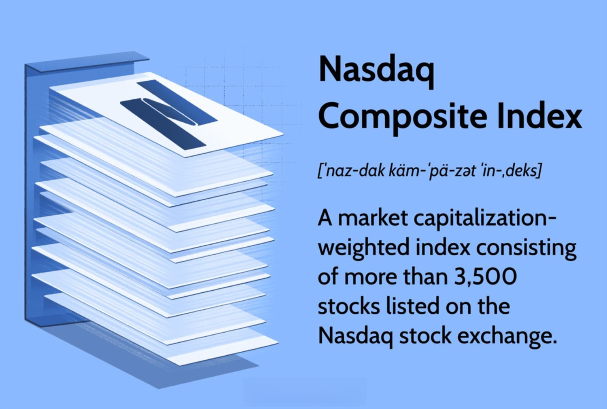

Financial markets rely on indices as critical indicators of market performance. Among the most notable stock market indices is the Nasdaq Composite, distinguished by its heavy concentration on technology and innovation. In recent years, algorithmic trading, commonly known as algo trading, has drastically transformed trading strategies and execution methods within modern financial markets. This article examines the relationship between the Nasdaq Composite and algo trading, highlighting the significant impact they have on investors and the broader market ecosystem. Understanding these concepts is essential for both experienced investors and newcomers seeking to navigate the ever-evolving landscape of stock markets.

## Table of Contents



## Understanding Financial and Stock Market Indices

Financial indices are essential tools in the financial markets, serving as benchmarks that assess the performance of specific market segments. These indices provide investors with a snapshot of market trends and are crucial for analyzing the performance and dynamics of various markets. Among financial indices, stock market indices hold particular importance as they track the performance of a selection of stocks within a market.

Stock market indices, such as the Nasdaq Composite, specifically track the performance of stocks listed on their respective exchanges, offering insights into market trajectories and investor sentiment. The Nasdaq Composite, for instance, tracks a wide array of companies primarily in the technology sector, thereby reflecting the health and trends of tech-related market segments. Other notable stock indices include the S&P 500 and the Dow Jones Industrial Average, each providing unique insights based on their specific selection of stocks.

Understanding the composition and calculation methodology of these indices is imperative for investors. Stock indices typically employ a weighted calculation method, where stocks are weighted either by market capitalization or by price. The market capitalization-weighted indices, such as the Nasdaq Composite, give more influence to larger companies, reflecting their substantial impact on the overall market movement. This means the price movement of larger companies within the index can significantly sway the index's performance.

The distinct characteristics of each index are influenced by the sectors they emphasize or the market capitalization they represent. For example, the Dow Jones Industrial Average, comprising 30 large publicly-owned companies in the United States, often reflects industrial and consumer goods trends. In contrast, the Nasdaq Composite is more technology-centered, thus providing insights heavily influenced by technological innovation and performance. 

These indices are indispensable instruments that help investors gauge economic conditions, understand market trends, and make informed investment decisions. By assessing the performance of sectors indicated by these indices, both individual and institutional investors can allocate resources more effectively and strategize their market positions considering current and anticipated market conditions.

In conclusion, financial and stock market indices are robust tools that measure and reflect market performance across various segments. Their composition and methodology offer crucial insights into market trends and influence investment decisions significantly, providing the necessary data to navigate the complexities of financial markets efficiently.

## Delving into the Nasdaq Composite

The Nasdaq Composite Index is a highly influential stock market index, recognized globally for its extensive lineup of technology and internet-based companies. Launched in 1971, the index captures all stocks listed on the Nasdaq Stock Market, amounting to over 3,000 companies. This comprehensive inclusion makes it one of the largest and most dynamic equity indices in the world. The index is capitalization-weighted, which means that companies with larger market capitalizations have a greater effect on the index's overall performance. This approach to weighting ensures that established tech behemoths have a pronounced influence, often shaping the index's movements and reflecting broader market trends.

The Nasdaq Composite is often regarded as a barometer for the health of the technology sector, due to the significant presence of tech companies within its composition. The heavy inclination towards technology stocks, including giants like Apple, Microsoft, and Amazon, means that the Nasdaq Composite serves as a valuable indicator of market sentiment towards the tech industry. These key components are pivotal in driving trends within the index, and their performance can influence investor confidence and market direction. The index's responsiveness to the performance of these companies often makes it a central focus for analysts and investors looking to understand and interpret the tech sector's trajectory within the broader market landscape.

## The Rise of Algorithmic Trading

Algorithmic trading, known as algo trading, employs sophisticated mathematical models and automated systems to conduct transactions at remarkable speeds. These systems utilize advanced algorithms to analyze market data, identify trading opportunities, and execute trades with minimal human intervention. The evolution of technology has accelerated the prominence of algo trading, primarily due to its ability to enhance speed, accuracy, and efficiency in executing trades.

Traders using algorithmic methods aim to exploit slight variations in price across markets and handle substantial order volumes with minimal disruption to market stability. This capability is particularly crucial in high-frequency trading ([HFT](/wiki/high-frequency-trading-strategies)), where the objective is to capitalize on fleeting price differentials. For instance, algo systems can swiftly react to market fluctuations within fractions of a second, far outpacing human capabilities.

Nasdaq and other major stock exchanges have seen significant trading volumes driven by algorithms. These systems reduce human error, a common [factor](/wiki/factor-investing) in traditional trading methods, thereby enhancing accuracy. Moreover, by automating trades, [algorithmic trading](/wiki/algorithmic-trading) boosts market [liquidity](/wiki/liquidity-risk-premium) — the ease with which assets can be bought or sold without affecting the asset's price. This liquidity injection can lead to tighter bid-ask spreads, benefiting the overall market.

The transparency introduced by algo trading also plays a pivotal role in modern financial markets. As trades are executed based on pre-defined criteria and logic rather than human bias or emotion, the rationale behind transactions becomes clearer and more predictable. This predictability is advantageous for both market participants and regulatory bodies, as it facilitates the monitoring and auditing of trading activities.

To summarize, the rise of algorithmic trading signifies a shift in how financial markets operate. By leveraging cutting-edge technology, algo trading ensures high-speed and precise execution, optimizes market operations, and contributes to the market's overall integrity and efficiency.

## The Symbiotic Relationship: Nasdaq Composite and Algo Trading

The Nasdaq Composite stands out as a prominent index given its concentration of technology and internet-based companies. Its characteristic technical nature and inherent dynamic [volatility](/wiki/volatility-trading-strategies) render it particularly suitable for algorithmic trading strategies. The rapid fluctuations typical of technology stocks present a fertile ground for algo trading, especially in the context of high-frequency trading (HFT) opportunities. These opportunities arise from the fast-paced movements of tech stock prices within the index.

Algo traders capitalize on these movements by deploying advanced algorithms designed to exploit minute price discrepancies. Such algorithms leverage sophisticated data analytics and real-time market data to execute trades with precision and speed. The creation of algorithms tailored for Nasdaq Composite trades often involves extensive data mining, statistical analysis, and predictive modeling. For instance, traders might employ [machine learning](/wiki/machine-learning) techniques to enhance predictive accuracy and trading outcomes. A basic example in Python demonstrating how to analyze stock movements using real-time data might look like the following:

```python
import pandas as pd
import numpy as np
from sklearn.linear_model import LinearRegression

# Assume we have market data loaded in a pandas dataframe
market_data = pd.read_csv('nasdaq_data.csv')
X = market_data[['feature1', 'feature2']]  # features based on market data
y = market_data['price_movement']  # target variable: price movement

# Linear regression model for simplicity
model = LinearRegression()
model.fit(X, y)

predicted_moves = model.predict(X)
trade_signals = np.where(predicted_moves > 0, 'buy', 'sell')
```

The interconnectedness of the Nasdaq Composite and algorithmic trading has notable implications for market dynamics. This interplay can sometimes contribute to rapid price changes, amplifying market volatility. The index's composition of technology-centric stocks, which are inherently more volatile, amplifies this effect when trades are executed at high speed and large volumes typical of algorithmic strategies. Additionally, the high liquidity associated with these trades can affect overall market conditions, impacting price formation and discoverability.

Investors must possess a comprehensive understanding of both volatility management and the distinct attributes of algo-driven trades within tech-heavy indices like the Nasdaq Composite. Effective risk management strategies are critical in navigating the complexities induced by this symbiotic relationship. Recognizing the nuances and intricacies involved allows investors to mitigate potential risks while capitalizing on the benefits that algorithmic trading offers in a fast-evolving market environment.

## Advantages and Challenges of Algo Trading on Nasdaq

Algorithmic trading, or algo trading, offers several notable advantages when applied to trading on the Nasdaq Composite. One of the primary benefits is the significant increase in trade execution speed. Automated systems can process large volumes of trades in milliseconds, a feat beyond human capability. This speed allows traders to capitalize on brief market inefficiencies, aligning with the fast-paced nature of tech stocks prevalent in the Nasdaq.

Another advantage is cost reduction. Algorithmic trading minimizes the transaction costs associated with traditional manual trading. By executing large orders in split seconds and at optimal prices, algo trading systems reduce the bid-ask spread and thus lower trading expenses. Additionally, automation reduces the need for a large workforce to manage trades, cutting operational costs.

Algo trading also enhances execution quality. Automated systems follow predetermined algorithms, allowing trades to be executed consistently in accordance with the specified criteria, resulting in precise and reliable outcomes. For investors, especially those dealing in high volumes, this precision improves the quality of their trading strategies.

Furthermore, algorithmic trading enables diversified trading strategies. Investors can deploy algorithms across different financial instruments and markets, optimizing for various conditions. This flexibility allows traders to hedge positions or take advantage of [arbitrage](/wiki/arbitrage) opportunities across related stocks, amplifying potential returns especially in a dynamic index like the Nasdaq Composite.

Despite these advantages, algorithmic trading presents several challenges. Technical glitches are a significant concern. A fault in the algorithm or a software failure can lead to substantial financial losses in a very short time. For instance, a malfunctioning trade execution algorithm can generate erroneous orders, leading to market disruption.

Regulatory scrutiny is another challenge. As algorithmic trading grows, so does the attention from regulatory bodies, which strive to ensure market fairness and transparency. Traders must stay informed about regulatory updates to remain compliant, demanding robust compliance protocols.

Additionally, there is the risk of exacerbating market volatility. High-frequency trading, a subset of algorithmic trading, can sometimes contribute to market swings, especially in tech-heavy indices like the Nasdaq. The rapid buying and selling by algorithms can amplify price movements, potentially leading to flash crashes.

To navigate these challenges, robust risk management protocols are essential. Traders must have contingency plans and fail-safes to mitigate the impacts of technological failures and market anomalies. Continuous monitoring and updating of algorithms are crucial to adapting to changing market conditions and regulatory requirements.

Technology's rapid advancement and changing regulatory landscapes continue to shape algorithmic trading on indices like the Nasdaq. As machine learning and [artificial intelligence](/wiki/ai-artificial-intelligence) evolve, they are expected to integrate further into algo trading, offering more sophisticated tools for analyzing and responding to market trends. This ongoing innovation promises to enhance the capabilities and resilience of algorithmic trading strategies, maintaining their relevance in the dynamic financial markets.

## Conclusion

The convergence of the Nasdaq Composite and algorithmic trading has significantly reshaped financial markets, marking a pivotal moment in the evolution of trading methodologies. Technology and innovation are at the core of this transformation, propelling both the index's influence and the sophisticated strategies employed by traders. The Nasdaq Composite, characterized by its tech-centric composition, aligns naturally with the rapid advancements in algorithmic trading. This synergy offers investors a notable competitive advantage by enabling precise, efficient trades that can capitalize on market opportunities swiftly.

Staying informed about the intricacies of the Nasdaq Composite's structure and the capabilities of algorithmic trading is vital for market participants. This knowledge enables investors to make informed decisions in an increasingly complex market environment. As the technology sector and stock markets evolve, continuous learning and adaptation are crucial to maintaining a competitive edge.

Looking ahead, future trends suggest the further integration of cutting-edge technologies, such as artificial intelligence and machine learning, with algorithmic trading. These innovations have the potential to refine trading strategies, enhance predictive accuracy, and offer deeper insights into market dynamics, particularly within the Nasdaq Composite. Embracing these advancements will likely define the next frontier in trading efficiency and strategy optimization, further solidifying the transformative impact of technology on financial markets.

## References & Further Reading

[1]: Bergstra, J., Bardenet, R., Bengio, Y., & Kégl, B. (2011). ["Algorithms for Hyper-Parameter Optimization."](https://papers.nips.cc/paper/4443-algorithms-for-hyper-parameter-optimization) Advances in Neural Information Processing Systems 24.

[2]: ["Advances in Financial Machine Learning"](https://www.amazon.com/Advances-Financial-Machine-Learning-Marcos/dp/1119482089) by Marcos Lopez de Prado

[3]: ["Evidence-Based Technical Analysis: Applying the Scientific Method and Statistical Inference to Trading Signals"](https://www.amazon.com/Evidence-Based-Technical-Analysis-Scientific-Statistical/dp/0470008741) by David Aronson

[4]: ["Machine Learning for Algorithmic Trading"](https://github.com/stefan-jansen/machine-learning-for-trading) by Stefan Jansen

[5]: ["Quantitative Trading: How to Build Your Own Algorithmic Trading Business"](https://www.amazon.com/Quantitative-Trading-Build-Algorithmic-Business/dp/1119800064) by Ernest P. Chan