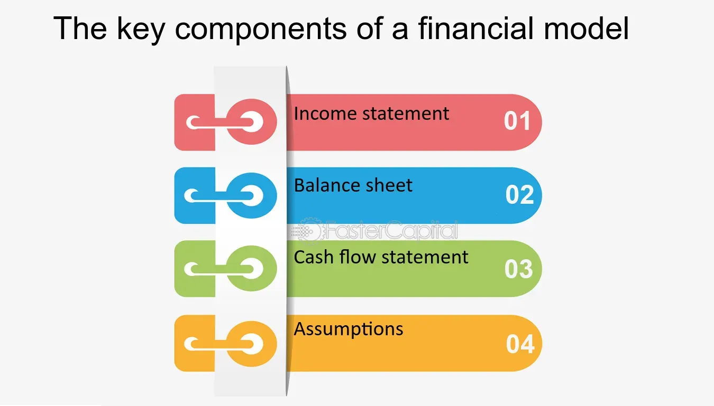

## Table of Contents

## What is financial modeling?

Financial modeling is a way to create a picture of a company's financial future using numbers and math. It's like making a detailed plan that shows how a business might do in the future based on what's happening now and what might happen later. People use computers and special programs to build these models, putting in lots of information about the company, like how much money it makes, how much it spends, and what it owns. The model helps people see how different choices could affect the company's money.

These models are really important for making big decisions in a business. For example, if a company wants to start a new project or buy another business, they can use a financial model to see if it's a good idea. The model can show if the new project will make money or if it might lose money. It's like a crystal ball that helps business people see into the future and make smart choices. But, it's important to remember that these models are just guesses based on the best information we have, so they're not always perfect.

## Why is financial modeling important for businesses?

Financial modeling is super important for businesses because it helps them make smart decisions. It's like a tool that lets business owners and managers see what might happen in the future. They can use it to figure out if starting a new project or buying something big is a good idea. By putting all the numbers into a model, they can see if they'll make money or if they might lose money. This helps them avoid making costly mistakes and plan for the future in a better way.

Also, financial models help businesses get money from banks or investors. When a business wants to borrow money or get people to invest in them, they need to show that they have a good plan. A financial model can show how the business will grow and make money, which makes it easier to convince others to give them money. It's like a report card that shows the business is doing well and has a bright future. So, financial modeling is really key for businesses to grow and succeed.

## What are the basic components of a financial model?

A financial model is made up of a few main parts that work together to show a picture of a company's future. The first part is the income statement, which shows how much money the company makes and spends. It tells us if the company is making a profit or a loss. The second part is the balance sheet, which lists everything the company owns and owes. This helps us see if the company is strong financially. The third part is the cash flow statement, which tracks the money coming in and going out of the business. It's important because it shows if the company has enough cash to keep running.

Another important part of a financial model is the assumptions section. This is where we put in our guesses about what might happen in the future, like how fast the company will grow or how much prices will go up. These guesses are based on what's happening now and what we think will happen later. The last part is the sensitivity analysis, which helps us see how changes in our guesses might affect the company's future. For example, if we guess wrong about how fast the company will grow, the sensitivity analysis can show us how that might change the company's profits. All these parts together help business people make better decisions.

## How do you structure an income statement in a financial model?

An income statement in a financial model shows how much money a business makes and spends over a certain time, like a year. It starts with the company's total revenue, which is all the money it earns from selling things or services. From the total revenue, you subtract the cost of goods sold, which is what it costs to make or buy the things the company sells. This gives you the gross profit, which is how much money the company makes before other costs.

Next, you take the gross profit and subtract operating expenses, which are costs like rent, salaries, and utilities. This gives you the operating income, which shows how much money the business makes from its main activities. After that, you add or subtract any other incomes or expenses, like interest or taxes, to get the net income. The net income is the final number that tells you if the company made a profit or a loss for the period.

In a financial model, you usually set up the income statement in a spreadsheet with rows for each part of the statement, like revenue, cost of goods sold, gross profit, operating expenses, operating income, and net income. Each column represents a different time period, like months or years, so you can see how the numbers change over time. This helps you predict how the company will do in the future based on what's happening now and what you think will happen later.

## What role does the balance sheet play in financial modeling?

The balance sheet is a key part of financial modeling because it shows what a company owns and what it owes at a certain time. It's like a snapshot that helps us see if the company is strong financially. The balance sheet has three main parts: assets, liabilities, and equity. Assets are things the company owns, like money in the bank, buildings, and equipment. Liabilities are what the company owes, like loans or bills it needs to pay. Equity is what's left over after you subtract liabilities from assets, and it shows the value of the company that belongs to the owners or shareholders.

In a financial model, the balance sheet helps us make sure everything adds up correctly. When we change things in the income statement or cash flow statement, the balance sheet changes too. This is important because it helps us see how different choices might affect the company's financial health. For example, if a company takes out a big loan to start a new project, we can see how that loan shows up as a liability on the balance sheet. By looking at the balance sheet, we can tell if the company has enough assets to cover its debts and if it's in a good position to grow or take on new projects.

## How can cash flow statements be integrated into financial models?

Cash flow statements are a key part of financial models because they show how money moves in and out of a business. They help us see if a company has enough cash to keep running and growing. In a financial model, the cash flow statement is linked to both the income statement and the balance sheet. For example, if the income statement shows a profit, that profit will show up as cash coming in on the cash flow statement. But if the company has to spend money on new equipment, that spending will show up as cash going out.

By putting the cash flow statement into the financial model, we can see how different choices might affect the company's cash. For example, if a company wants to start a new project, the cash flow statement can show if they have enough money to do it without running out of cash. It helps business people make sure they can pay their bills and keep the business going strong. So, the cash flow statement is really important for making good decisions and planning for the future.

## What are the key assumptions and drivers in financial modeling?

Key assumptions and drivers are like the guesses and important factors that make up a financial model. They help us figure out what might happen in the future. Assumptions are things we think will happen, like how fast the company will grow or how much prices will go up. For example, we might assume that sales will grow by 5% each year. Drivers are the big things that affect the company's money, like how many products it sells or how much it costs to make them. These drivers can change the company's profits a lot, so we need to pay close attention to them.

In a financial model, these assumptions and drivers are really important because they help us see different possible futures for the company. If we change our assumptions, like thinking sales will grow faster or slower, the whole model changes. This helps us understand how sensitive the company's future is to these guesses. By playing around with different assumptions and drivers, we can make better plans and be ready for different things that might happen. It's like trying to predict the weather by looking at different possible scenarios.

## How do sensitivity analysis and scenario planning enhance financial models?

Sensitivity analysis and scenario planning make financial models better by helping us see how different guesses and situations might change a company's future. Sensitivity analysis lets us change one thing at a time, like the price of what the company sells or how fast it grows, and see how that affects the company's profits. It's like testing how strong the company is by seeing if small changes can make a big difference. This helps us find the most important things to watch out for and plan better.

Scenario planning goes a step further by looking at different big pictures of what might happen. We can make a few different stories about the future, like what if the economy gets better or worse, or what if a new competitor comes along. By putting these stories into the financial model, we can see how the company might do in each one. This helps us get ready for different possibilities and make smarter choices. Both sensitivity analysis and scenario planning make the financial model a stronger tool for understanding and planning the company's future.

## What advanced techniques can be used to improve the accuracy of financial models?

To make financial models more accurate, one advanced technique is using Monte Carlo simulations. This method lets us run the model many times with different random guesses for things like sales growth or costs. By doing this, we can see a range of possible outcomes instead of just one guess. It helps us understand how likely different results are and plan for the best and worst cases. This way, we can make better decisions because we have a clearer picture of what might happen.

Another technique is using [machine learning](/wiki/machine-learning) and [artificial intelligence](/wiki/ai-artificial-intelligence). These tools can look at a lot of data and find patterns that we might miss. For example, they can help us predict how customers will act or how the market will change. By adding these predictions into our financial models, we can make them more accurate. It's like having a smart helper that can see things we can't and make our guesses about the future better.

## How do you incorporate risk analysis into financial modeling?

Risk analysis is important in financial modeling because it helps us see what could go wrong and how bad it might be. We can use different methods to do this. One way is to use something called a risk matrix, which is like a chart that shows how likely different bad things are to happen and how much they could hurt the company. For example, we might look at the risk of losing a big customer or having a new law change how we do business. By putting these risks into our financial model, we can see how they might change our numbers and plan for them.

Another way to include risk analysis is by using something called a sensitivity analysis. This means we change one thing at a time in our model, like the price of what we sell or how much it costs to make it, and see how that affects our profits. It helps us find the most important things to watch out for. We can also use scenario planning, where we make up different stories about the future, like what if the economy gets worse or a new competitor comes along. By putting these stories into our financial model, we can see how the company might do in each one and be ready for different possibilities. This way, we can make our financial model more accurate and useful for making decisions.

## What are the best practices for validating and testing financial models?

To make sure a financial model is good and works right, it's important to check it carefully. One way to do this is by testing the model with different numbers to see if it gives the right answers. This is called stress testing. You can change things like how much the company sells or how much it costs to make things, and see if the model still makes sense. Another way is to have someone else look at the model. This person can check if the numbers and guesses in the model are reasonable and if everything adds up correctly. It's like having a second pair of eyes to catch any mistakes.

Another important thing to do is to compare the model's guesses with what really happens. This is called [backtesting](/wiki/backtesting). If the model's guesses are close to what actually happens, then it's probably a good model. If not, you might need to change some of the guesses or the way the model works. It's also a good idea to keep updating the model with new information as things change. This way, the model stays useful and helps make better decisions. By doing these things, you can trust that your financial model is as accurate and helpful as possible.

## How can financial models be used for strategic decision-making and forecasting?

Financial models help businesses make big choices and plan for the future. They show a picture of what might happen with the company's money if it does different things, like starting a new project or buying another business. By putting all the numbers into the model, business owners can see if these choices will make money or if they might lose money. This helps them decide what to do next. For example, if a company wants to open a new store, the financial model can show if it's a good idea by looking at how much money the store might make and how much it will cost.

Financial models also help with forecasting, which means guessing what will happen in the future. They use numbers from the past and guesses about what might happen to show how the company might do in the next few years. This is important for planning things like how much to spend on new projects or how much money to save. By looking at different possibilities in the model, business people can be ready for what might happen and make smart plans. It's like having a map that helps them see where the company is going and how to get there safely.

## What is the Role of Financial Analysis in Modeling?

Financial analysis serves as an essential mechanism in evaluating the viability, stability, and profitability of a business or project, utilizing robust financial models for informed assessments. These models are not mere aggregations of financial data; they are structured frameworks that reveal insights into an entity's financial health, thereby guiding stakeholders in making strategic decisions. For instance, by analyzing financial statements through these models, analysts can offer a detailed examination of [liquidity](/wiki/liquidity-risk-premium) ratios, profitability metrics, and solvency positions, which can directly influence management strategies and investor confidence.

The precision of financial analysis can significantly refine and enhance the quality of financial models. The iterative process of financial analysis improves model assumptions by incorporating feedback from historical performance and market conditions. This cyclical refinement can be depicted mathematically by constantly updating a forecast function $F(t)$ with newly available data:

$$
F(t+1) = F(t) + \Delta Data
$$

where $\Delta Data$ represents the incremental adjustments based on new data inputs. Such updates are crucial in maintaining the relevance and accuracy of predictions.

Financial analysts utilize these models to dissect cash flow patterns, assess inherent risks, and facilitate strategic decision-making. For example, cash flow modeling helps in understanding the timing and magnitude of expected cash inflows and outflows, enabling businesses to strategize effectively around their working capital needs. Risk assessment is another critical application, where scenarios are modeled to predict how various risk factors might affect potential outcomes, allowing businesses to hedge against unfavorable market movements.

Integrating financial analysis with modeling processes ensures that the financial landscape is viewed holistically rather than in isolated segments. This integration enables a deeper understanding of interdependencies between different financial components. For example, by consolidating financial statement analysis with market data and economic forecasts, analysts can derive a multidimensional view of potential business challenges and opportunities, thus paving the way for comprehensive strategic insights.

In summary, financial analysis is indispensable in the creation and refinement of financial models, as it enhances model reliability and offers comprehensive perspectives necessary for making informed business decisions.

## References & Further Reading

[1]: ["Advances in Financial Machine Learning"](https://www.amazon.com/Advances-Financial-Machine-Learning-Marcos/dp/1119482089) by Marcos Lopez de Prado

[2]: Bergstra, J., Bardenet, R., Bengio, Y., & Kégl, B. (2011). ["Algorithms for Hyper-Parameter Optimization."](https://dl.acm.org/doi/10.5555/2986459.2986743) Advances in Neural Information Processing Systems 24.

[3]: ["Quantitative Trading: How to Build Your Own Algorithmic Trading Business"](https://github.com/LucindaYa/quant-resources/blob/master/Quantitative%20Trading%20How%20to%20Build%20Your%20Own%20Algorithmic%20Trading%20Business.pdf) by Ernest P. Chan

[4]: ["Evidence-Based Technical Analysis: Applying the Scientific Method and Statistical Inference to Trading Signals"](https://www.amazon.com/Evidence-Based-Technical-Analysis-Scientific-Statistical/dp/0470008741) by David Aronson

[5]: ["Machine Learning for Algorithmic Trading"](https://github.com/PacktPublishing/Machine-Learning-for-Algorithmic-Trading-Second-Edition) by Stefan Jansen