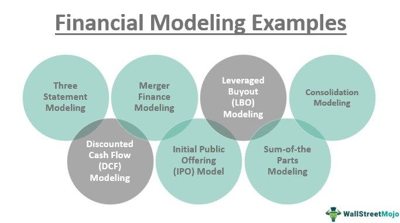

In the rapidly evolving world of finance, technological advancements have transformed the landscape with sophisticated tools and methodologies. Among these, financial modeling stands out as a crucial component in financial analysis and algorithmic trading. It provides a structured framework for evaluating and forecasting financial performance, essential for making informed decisions in an increasingly complex market environment. Financial models are indispensable for professionals and traders, enabling them to assess potential investment opportunities, predict financial outcomes, and formulate strategic responses to economic shifts.

The integration of financial modeling into both traditional financial practices and innovative trading strategies denotes its significance in the finance industry. As technology continues to advance, the complexity and accuracy of financial models also improve, enhancing their utility in diverse scenarios. Robust models allow for precise simulations and assessments, influencing decision-making processes profoundly. 



This article seeks to explore the fundamental components of financial modeling and highlight their significance in both financial analysis and algorithmic trading. Understanding these elements is key for finance professionals and traders who aim to optimize their strategies and outcomes. By examining the intricate processes and tools involved in financial modeling, we can appreciate its pivotal role in shaping the future of finance.

## Table of Contents

## Overview of Financial Modeling

Financial modeling is a quantitative technique used to create a mathematical abstraction representing a financial situation or system. It is essential in various sectors, including investment banking, corporate finance, and market analysis. The models constructed through financial modeling serve several critical purposes, with the most fundamental being forecasting future financial performance. These projections are based on the analysis of historical data and assumptions about future conditions.

The scope of financial models varies significantly. At the simpler end of the spectrum, financial models may consist merely of basic spreadsheets that organize data and apply straightforward calculations. Conversely, more complex models might involve detailed simulations executed using sophisticated software tools. These intricate models often incorporate advanced analytical techniques, including statistical analysis and financial theory, to mimic market conditions or specific financial scenarios as accurately as possible.

Understanding the foundational aspects of financial modeling is crucial for anyone involved in financial decision-making. A firm grasp of these basics facilitates the development of more sophisticated analyses and strategic planning. For instance, a basic model may take the form of a discounted cash flow (DCF) analysis, where future cash flows are estimated and discounted back to their present value using a rate that reflects the risk of those cash flows. The resulting figure serves as a theoretical value for the investment.

Here is a simple representation of a DCF model in Python:

```python
def discounted_cash_flow(cash_flows, discount_rate):
    present_value = 0
    for t, cash_flow in enumerate(cash_flows):
        present_value += cash_flow / ((1 + discount_rate) ** t)
    return present_value

# Example usage
cash_flows = [100, 200, 300]  # Future cash flows for years 1, 2, and 3
discount_rate = 0.1  # 10% discount rate
print(discounted_cash_flow(cash_flows, discount_rate))
```

Financial modeling is not simply about calculations; it encompasses understanding the assumptions and variables that underpin these models. These can range from macroeconomic indicators like GDP growth rates to micro-level elements such as company-specific data and industry-wide trends. By accurately capturing and interpreting these factors, financial models provide a dynamic framework for understanding potential financial outcomes and guiding strategic decisions.

## Key Components of Financial Modeling

Financial modeling is a crucial aspect of financial analysis and decision-making, providing essential insights into potential future outcomes based on various financial factors. Among the core components of financial modeling, assumptions and drivers play a foundational role. These assumptions pertain to variables such as revenue growth, cost estimates, and interest rates. They serve as the inputs upon which a model hinges, dictating the trajectory of projected financial performance. Assumptions must be realistic and backed by historical data and market trends to ensure the model's reliability.

Accurate representation of financial statements is another cornerstone of effective financial modeling. This involves meticulous construction of income statements, balance sheets, and cash flow statements. These documents offer a comprehensive view of an entity’s financial health, highlighting areas of profitability and potential weakness. A robust model would accurately reflect the interconnections among these financial statements, such as how changes in revenue affect net income and impact cash flow.

Risk analysis is integral to financial modeling, focusing on identifying, quantifying, and incorporating potential risks and uncertainties. This step is crucial to build models that reflect realistic scenarios, considering factors like market [volatility](/wiki/volatility-trading-strategies), credit risks, and operational uncertainties. Techniques like scenario analysis and Monte Carlo simulation are often used to capture the range of outcomes and assess the probabilities of different risk scenarios.

Valuation and sensitivity analysis are essential to determine the intrinsic value of a company or investment and evaluate how sensitive outcomes are to changes in key assumptions. Discounted Cash Flow (DCF) analysis is a widely used valuation method, discounting expected future cash flows to their present value. Sensitivity analysis, on the other hand, examines how the output of a model is affected by variations in input variables, allowing analysts to identify key drivers that impact financial projections most significantly.

Proficiency in Excel or specific financial software is vital for constructing, interpreting, and adjusting models. Excel remains the industry-standard tool, valued for its versatility and comprehensive set of functions that support complex calculations and data manipulation. Advanced skills in Excel, such as the use of pivot tables, data visualization, and VBA scripting, can significantly enhance one's ability to develop sophisticated financial models. Additionally, familiarity with specialized software like MATLAB, R, or Python can offer further advantages, supporting more complex computations and simulations, thereby augmenting the analytical power of financial models. Python, with its libraries such as Pandas for data manipulation and NumPy for numerical computations, is particularly effective for creating automated and scalable financial models.

In summary, financial modeling's key components involve not only precise inputs and calculations but also a profound understanding of financial dynamics and proficiency in computational tools. These elements together form an essential toolkit for finance professionals tasked with navigating the complexities of financial analysis and investment decision-making.

## The Role of Financial Analysis in Modeling

Financial analysis serves as an essential mechanism in evaluating the viability, stability, and profitability of a business or project, utilizing robust financial models for informed assessments. These models are not mere aggregations of financial data; they are structured frameworks that reveal insights into an entity's financial health, thereby guiding stakeholders in making strategic decisions. For instance, by analyzing financial statements through these models, analysts can offer a detailed examination of [liquidity](/wiki/liquidity-risk-premium) ratios, profitability metrics, and solvency positions, which can directly influence management strategies and investor confidence.

The precision of financial analysis can significantly refine and enhance the quality of financial models. The iterative process of financial analysis improves model assumptions by incorporating feedback from historical performance and market conditions. This cyclical refinement can be depicted mathematically by constantly updating a forecast function $F(t)$ with newly available data:

$$
F(t+1) = F(t) + \Delta Data
$$

where $\Delta Data$ represents the incremental adjustments based on new data inputs. Such updates are crucial in maintaining the relevance and accuracy of predictions.

Financial analysts utilize these models to dissect cash flow patterns, assess inherent risks, and facilitate strategic decision-making. For example, cash flow modeling helps in understanding the timing and magnitude of expected cash inflows and outflows, enabling businesses to strategize effectively around their working capital needs. Risk assessment is another critical application, where scenarios are modeled to predict how various risk factors might affect potential outcomes, allowing businesses to hedge against unfavorable market movements.

Integrating financial analysis with modeling processes ensures that the financial landscape is viewed holistically rather than in isolated segments. This integration enables a deeper understanding of interdependencies between different financial components. For example, by consolidating financial statement analysis with market data and economic forecasts, analysts can derive a multidimensional view of potential business challenges and opportunities, thus paving the way for comprehensive strategic insights.

In summary, financial analysis is indispensable in the creation and refinement of financial models, as it enhances model reliability and offers comprehensive perspectives necessary for making informed business decisions.

## Connecting Financial Modeling to Algo Trading

Algorithmic trading, commonly referred to as algo trading, leverages computer algorithms to execute trading decisions with minimal human intervention. Central to this strategy is the integration of financial models, which offer a structured dataset and predictive insights essential for guiding algorithmic trades. Financial models transform vast quantities of historical and real-time data, forecasting price movements and market trends that algorithms utilize for making rapid and informed trading decisions.

The efficacy of algorithmic strategies is intrinsically linked to the robustness and precision of the financial models employed. Models serve as the backbone for various trading strategies, providing the quantitative foundation upon which algorithms build decision-making logic. A model's predictions concerning asset prices, volatility, interest rates, and other relevant financial indicators significantly influence the success rate and profitability of executed trades.

A critical aspect of integrating financial modeling with algo trading is the practice of [backtesting](/wiki/backtesting). This involves applying a trading algorithm to historical data to evaluate its potential performance before deploying it in live markets. Backtesting helps traders refine strategies, improve model accuracy, and mitigate potential risks. By simulating different market conditions and scenarios, backtesting can uncover flaws and enhance the robustness of both the financial models and the underlying algorithms.

Moreover, the integration of financial modeling into algo trading frameworks can markedly improve prediction accuracy. Enhanced financial models allow for optimized trading algorithms that can better interpret market signals, potentially leading to more profitable trades. Consider a simple moving average strategy—an algorithm might use a financial model to forecast moving averages based on historical data, adapting trade signals accordingly as new data comes in.

```python
import numpy as np
import pandas as pd

# Example: Simple Moving Average Crossover Strategy
def moving_average_strategy(prices, short_window, long_window):
    signals = pd.DataFrame(index=prices.index)
    signals['price'] = prices
    signals['short_ma'] = prices.rolling(window=short_window, min_periods=1, center=False).mean()
    signals['long_ma'] = prices.rolling(window=long_window, min_periods=1, center=False).mean()
    signals['signal'] = 0.0
    signals['signal'][short_window:] = np.where(signals['short_ma'][short_window:] 
                                                > signals['long_ma'][short_window:], 1.0, 0.0)
    signals['positions'] = signals['signal'].diff()
    return signals

# Assume `data` is a pandas DataFrame with datetime index and price column
# signals = moving_average_strategy(data['price'], short_window=40, long_window=100)
```

Incorporating these models into algo trading systems necessitates continuous evaluation and adjustment. Emerging technologies and updated market data require models to evolve continuously. Adaptive models that respond to new information ensure that trading strategies remain viable and competitive.

In summary, financial modeling is a key component of [algorithmic trading](/wiki/algorithmic-trading), offering the analytical depth and forecast precision required to develop successful trading strategies. By ensuring financial models are robust and accurate, and by rigorously testing algorithms against historical performance data, professionals can maximize the potential of algorithmic trading in financial markets.

## Challenges and Best Practices in Financial Modeling

Financial modeling presents several challenges that require careful attention to detail and a robust understanding of financial principles to overcome. One of the primary challenges is ensuring the accuracy of data used in the models, as financial models rely heavily on historical data to predict future performance. Handling complex datasets, often sourced from various databases and articles, can introduce errors if not meticulously managed. To address data accuracy issues, it is crucial to establish rigorous data validation processes to detect and correct errors before they impact the model's outcomes.

Another important aspect of financial modeling is flexibility. Models must be able to adjust to evolving market conditions and incorporate new information. This adaptability allows for more accurate predictions and strategic adjustments. For instance, constructing models with modular structures—where individual components can be updated or replaced independently—enables smoother integration of changing variables.

Transparency and documentation are essential for the credibility and usability of financial models. Each model should be fully understandable and replicable, allowing stakeholders to trace the model's assumptions and calculations. Clear documentation of assumptions, formulas, and methodologies employed in the model is necessary. Annotations within spreadsheets or code can help elucidate complex logic and calculations, ensuring transparency.

Regular validation and updating of financial models are imperative to maintain their relevance and accuracy. This involves revisiting assumptions and recalibrating models against the actual outcomes. Continual validation can involve backtesting, wherein historical data that was not part of the model's original dataset is used to test the model's predictive power. This process helps identify discrepancies and refine model parameters.

Best practices in financial modeling encompass techniques such as sensitivity testing and scenario analysis. Sensitivity testing evaluates how changes in one or two key assumptions affect the model's outcomes, allowing analysts to identify critical risk factors and prepare for various contingencies. In Excel, this can be achieved using data tables or the 'Goal Seek' tool. Scenario analysis, on the other hand, involves constructing different scenarios based on various assumptions (e.g., best-case, worst-case, and expected scenarios) to understand potential financial impacts and devise strategic responses.

Moreover, regularly revising key assumptions is crucial, especially in volatile markets. Financial practitioners often update their models by replacing outdated economic indicators, interest rates, or growth estimates with more recent figures that reflect current market realities. 

Continuous learning and staying abreast of new modeling techniques and software advancements further bolster the efficacy and sophistication of financial models. Leveraging modern technologies and financial software that offer advanced data analysis features can significantly enhance model precision and decision-making capabilities.

## Conclusion

The synergy between financial modeling, financial analysis, and algorithmic trading constitutes a powerful combination in modern finance. By understanding and utilizing the core components of financial models, professionals can enhance decision-making processes significantly. Financial models provide a structured approach to quantify variables, forecast outcomes, and assess risks, essential for crafting informed strategies and mitigating uncertainties.

Through effective integration of financial models, analysts can lay the foundation for innovative algorithmic trading strategies. These models supply the necessary quantitative framework and predictions that algorithms utilize to execute trades, ensuring both precision and efficiency. Algorithmic trading thrives on the accuracy of these models, which influences the success of trading strategies by optimizing trade execution and managing risks effectively.

As market trends continue to evolve, robust financial modeling remains vital in strategic planning and performance prediction. The capacity to anticipate shifts and interpret complex data feeds into proactive decision-making, rendering financial modeling indispensable for stakeholders who wish to maintain a competitive edge.

To ensure continued success in finance, staying abreast of best practices and technological advancements is crucial. This involves continual learning and adaptation, as well as embracing innovations in modeling techniques and computational tools. By aligning modern technology with well-founded financial principles, professionals can navigate the complexities of finance with foresight and precision, reinforcing the dynamism and resilience of financial strategies.

## References & Further Reading

[1]: ["Advances in Financial Machine Learning"](https://www.amazon.com/Advances-Financial-Machine-Learning-Marcos/dp/1119482089) by Marcos Lopez de Prado

[2]: Bergstra, J., Bardenet, R., Bengio, Y., & Kégl, B. (2011). ["Algorithms for Hyper-Parameter Optimization."](https://dl.acm.org/doi/10.5555/2986459.2986743) Advances in Neural Information Processing Systems 24.

[3]: ["Quantitative Trading: How to Build Your Own Algorithmic Trading Business"](https://github.com/LucindaYa/quant-resources/blob/master/Quantitative%20Trading%20How%20to%20Build%20Your%20Own%20Algorithmic%20Trading%20Business.pdf) by Ernest P. Chan

[4]: ["Evidence-Based Technical Analysis: Applying the Scientific Method and Statistical Inference to Trading Signals"](https://www.amazon.com/Evidence-Based-Technical-Analysis-Scientific-Statistical/dp/0470008741) by David Aronson

[5]: ["Machine Learning for Algorithmic Trading"](https://github.com/PacktPublishing/Machine-Learning-for-Algorithmic-Trading-Second-Edition) by Stefan Jansen