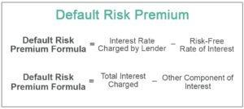

In the rapidly evolving world of finance, understanding the risks associated with investments is crucial for any investor. This article explores the intricate components of investment risk, including the risk premium and its role in financial investments. The risk premium represents the additional return an investor expects over a risk-free rate as compensation for the potential risks involved. It plays a pivotal role in shaping investment decisions by balancing potential returns against associated risks.

In recent years, the landscape of financial trading has been profoundly transformed by the advent of algorithmic trading. This approach leverages complex algorithms to automate trading decisions, allowing for the rapid execution of trades and enhanced management of large investment portfolios. Algorithmic trading minimizes human error and emotional bias, offering a more systematic way to handle the risks inherent in financial markets. The integration of statistical models and data analytics in these algorithms further enables traders to respond swiftly to market changes, thus optimizing investment strategies.



Understanding these key concepts provides insight into navigating risks in modern financial markets. With a foundation in both traditional investment risks and contemporary trading methods, investors are better equipped to make informed decisions. By weighing potential risks against expected returns, one can achieve a more balanced investment approach.

This article aims to equip investors with the knowledge necessary to engage with today's dynamic market environment effectively. By thoroughly examining the components of investment risk and the tools available for its management, investors can enhance their ability to secure their financial objectives.

## Table of Contents

## Understanding Investment Risk

Investment risk refers to the likelihood of experiencing financial losses or gains from an investment. This concept is pivotal in shaping investor decisions and portfolio management. Several types of investment risks must be considered, each affecting investments in unique ways:

1. **Business Risk**: This pertains to the uncertainties and potential losses associated with a company’s operational activities. Factors such as poor management decisions, operational inefficiencies, and market competition can contribute to business risk. Investors must evaluate a company's business model, leadership, and competitive landscape to assess this risk.

2. **Financial Risk**: This is related to a company’s financial structure and the use of debt financing. Companies that rely heavily on debt may face increased financial obligations, leading to potential insolvency or bankruptcy. Measures such as the debt-to-equity ratio are commonly used to gauge financial risk, offering insights into a firm's leverage.

3. **Liquidity Risk**: Liquidity risk arises when an investor cannot quickly sell an asset at market value due to an insufficient market. Assets with low trading volumes, such as certain real estate properties or collectibles, are prone to liquidity risk, which can lead to significant price discounts in urgent sale situations.

4. **Exchange-Rate Risk**: This risk is especially relevant for investments involving foreign currencies. Fluctuations in exchange rates can impact the value of investments and affect returns when converting back to the investor’s home currency. Hedging strategies, such as currency forwards or options, are employed to mitigate exchange-rate risk.

5. **Country-Specific Risk**: Also known as political or sovereign risk, this involves changes in a country’s political, economic, or regulatory environment that may adversely affect investments. This includes risks arising from changes in government policies, political instability, or economic crises. Assessing country-specific risk requires comprehensive analysis of the geopolitical landscape and economic indicators.

It is essential to assess each type of risk individually to implement comprehensive risk management strategies effectively. Understanding these risks forms the foundation for evaluating the risk premiums that investors demand as compensation for bearing additional uncertainties. The level of investment risk an investor is willing to accept is typically correlated with their expected rate of return, creating a trade-off between risk and potential reward. By thoroughly evaluating these risks, investors can make informed decisions aligning with their financial objectives and risk tolerance.

## Deciphering Risk Premium

The risk premium represents the additional return that investors require for taking on the risks associated with an investment beyond the risk-free rate. The risk-free rate is typically represented by government securities that have minimal default risk, such as U.S. Treasury bonds. The risk premium is a pivotal concept in capital markets because it serves as a key determinant in the risk-reward analysis that investors conduct when selecting investments across various asset classes.

In the context of financial investments, risk premiums account for the uncertainties that may impact investment returns. These uncertainties are linked to several types of risks, including business risk, [liquidity](/wiki/liquidity-risk-premium) risk, and more. Business risk refers to uncertainties arising from operational failures, competition, or economic changes, while liquidity risk involves the potential difficulty in quickly converting an investment into cash without significant loss of value. The risk premium compensates investors for the exposure to these uncertainties, serving as a buffer for the unpredictable nature of returns.

Investors use the concept of risk premium as part of their investment strategy to align potential investments with their financial goals. This involves analyzing whether the additional expected return justifies the level of risk being taken. For example, equity investments often [carry](/wiki/carry-trading) higher risk premiums compared to government bonds because the former is subject to greater [volatility](/wiki/volatility-trading-strategies) and market fluctuations.

The calculation of risk premiums involves evaluating the expected return of an investment and subtracting the risk-free rate. Mathematically, this can be expressed as:

$$
\text{Risk Premium} = \text{Expected Return} - \text{Risk-Free Rate}
$$

High-risk investments generally offer higher risk premiums to attract investors given the increased likelihood of fluctuation in returns. This relationship highlights the investor's demand for compensation proportionate to the risk undertaken. However, there is a delicate balance; excessively high risk premiums might indicate heightened risk levels that could outweigh potential benefits.

In applying these principles, investors often employ tools such as the Capital Asset Pricing Model (CAPM), which helps in estimating expected returns of assets by considering the risk premium associated with market risk. Understanding and accurately assessing risk premiums can aid investors in crafting diversified portfolios that strategically manage risk while aiming for optimal returns.

## The Advent of Algorithmic Trading

Algorithmic trading, or algo trading, marks a significant shift in the function of financial markets by automating trading decisions through advanced algorithms. This method facilitates the rapid execution of trades, enabling the efficient management of significant investment volumes and reducing the emotional influences commonly present in manual trading.

At the core of algo trading is the deployment of various strategies that are tailored to different market conditions. The fundamental aim of these strategies is to optimize trade execution, ensuring transactions occur at the best possible prices. For instance, strategies such as trend-following, [arbitrage](/wiki/arbitrage), and [market making](/wiki/market-making) are frequently employed. Trend-following strategies capitalize on the continuation of existing market trends, while arbitrage strategies exploit price discrepancies between related assets. Market making involves providing liquidity by simultaneously offering buy and sell quotes to profit from the bid-ask spread.

Data-driven models play a pivotal role in mitigating risks within [algorithmic trading](/wiki/algorithmic-trading). These models analyze large datasets to uncover patterns and trends, providing traders with timely insights that help reduce exposure to abrupt market changes. By leveraging these insights, traders can make informed decisions that align with their financial objectives and risk tolerance.

One method to assess risk within algorithmic trading involves employing quantitative models like the Capital Asset Pricing Model (CAPM), which calculates expected return based on risk and the time value of money. The model is represented as:

$$
\text{E}(R_i) = R_f + \beta_i ( \text{E}(R_m) - R_f )
$$

where:
- $\text{E}(R_i)$ is the expected return of investment,
- $R_f$ is the risk-free rate,
- $\beta_i$ is the beta of the investment (measuring its volatility relative to the market),
- $\text{E}(R_m)$ is the expected return of the market.

This integration of quantitative analysis with algorithmic approaches provides a comprehensive framework for risk management and maximizes trading returns. By continuously refining these strategies through technological advancements and adapting them to new market data, traders can enhance the robustness and profitability of their algorithmic trading systems.

## Risk Management in Algo Trading

Effective risk management is paramount in algorithmic trading to ensure investments are protected against potential market volatility and unforeseen adverse events. Traders employ a variety of strategies and tools to manage risks effectively and maintain the stability and profitability of their trading systems.

One primary approach is the establishment of clear investment goals and risk tolerance levels. Traders must align their algorithmic trading strategies with these objectives, tailoring their algorithms to execute trades that conform to predefined risk parameters. By doing so, traders can operate within a risk boundary that matches their financial goals.

Diversification is another critical technique utilized in risk management. By spreading investments across various asset classes or financial instruments, traders reduce the impact of a poor performance in any single investment. This strategy mitigates concentration risk and helps to stabilize returns over time.

Stop-loss orders and trailing stops are widely used to minimize potential losses. A stop-loss order is an instruction to sell a security when it reaches a certain price, thereby limiting the trader's losses on a position. Conversely, a trailing stop adjusts the stop-loss level as the price moves in a favorable direction, allowing traders to secure profits while capping potential losses.

Quantitative tools such as stress testing and Value at Risk (VaR) are employed to assess and manage risk exposure within trading algorithms. Stress testing involves simulating adverse market conditions to evaluate the algorithm's performance under extreme scenarios. It helps traders identify vulnerabilities and adjust their strategies accordingly. VaR, on the other hand, estimates the maximum potential loss over a specified period with a given confidence level, providing traders with valuable insights into their risk exposure.

```python
import numpy as np

def calculate_var(portfolio_returns, confidence_level=0.95):
    """
    Calculate the Value at Risk (VaR) of a portfolio using historical simulation.

    :param portfolio_returns: Array of historical portfolio returns
    :param confidence_level: Confidence level for VaR calculation (default is 95%)
    :return: Calculated VaR
    """
    sorted_returns = np.sort(portfolio_returns)
    var_index = int((1 - confidence_level) * len(sorted_returns))
    return abs(sorted_returns[var_index])

# Example usage with hypothetical returns data
portfolio_returns = np.random.normal(0, 0.1, 1000)  # Simulated returns
var_95 = calculate_var(portfolio_returns)
print(f"95% VaR: {var_95}")

```

These strategies and tools form a comprehensive framework for controlling risk in algorithmic trading. By employing a combination of goal setting, diversification, protective orders, and quantitative risk assessments, traders can enhance the stability and profitability of their algo trading systems. This proactive approach enables traders to navigate the complexities of modern financial markets with a greater level of confidence.

## Conclusion

Understanding and managing risk is critical for financial investors aiming to optimize their portfolios. Accurately calculating risk premiums and applying advanced algorithmic trading strategies allows investors to remain vigilant in a volatile market. By skillfully managing risk, investors can find a balance between risk and return, thereby securing their financial objectives. 

The concepts covered in this guide form a strong foundation for comprehending and navigating the complexities of investment risks in today’s rapidly changing markets. Continuous education and adaptation to changing market conditions will be essential for investors looking to succeed in a dynamic investment arena. For those using algorithmic trading, staying updated with technological innovations and continually refining risk management strategies is vital for maintaining success. 

Investors who can intelligently assess and manage risk are better positioned to achieve their investment goals while minimizing potential losses. As financial markets evolve, the ability to adapt and respond to new risks and opportunities will be a key [factor](/wiki/factor-investing) in investing success.

## References & Further Reading

[1]: Damodaran, A. (2008). ["Equity Risk Premiums (ERP): Determinants, Estimation and Implications."](https://people.stern.nyu.edu/adamodar/pdfiles/papers/ERPfull.pdf) NYU Stern School of Business.

[2]: Ulrich, S. (2007). ["Risk Parity - A New Investment Approach," CFA Institute.](https://www.callan.com/blog-archive/risk-parity-primer/)

[3]: López de Prado, M. (2018). ["Advances in Financial Machine Learning."](https://www.amazon.com/Advances-Financial-Machine-Learning-Marcos/dp/1119482089) Wiley.

[4]: Black, F., & Scholes, M. (1973). ["The Pricing of Options and Corporate Liabilities."](https://www.cs.princeton.edu/courses/archive/fall09/cos323/papers/black_scholes73.pdf) Journal of Political Economy.

[5]: Aronson, D. (2006). ["Evidence-Based Technical Analysis: Applying the Scientific Method and Statistical Inference to Trading Signals."](https://www.amazon.com/Evidence-Based-Technical-Analysis-Scientific-Statistical/dp/0470008741) Wiley.