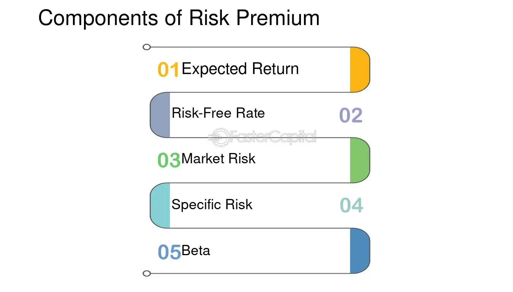

## Table of Contents

## What is a risk premium?

A risk premium is the extra return an investor expects to get for taking on more risk. Imagine you have two choices: a safe investment like a government bond, and a riskier investment like a stock. The risk premium is the additional amount you would expect to earn from the stock compared to the bond, to make it worth the extra risk.

In simple terms, it's like a reward for being brave enough to invest in something that might go up or down a lot. For example, if a government bond gives you a 2% return, but a stock might give you a 7% return, the risk premium would be 5%. This extra 5% is what you get for choosing the riskier option.

## Why is understanding risk premium important for investors?

Understanding risk premium is important for investors because it helps them make better choices about where to put their money. When you know the risk premium, you can see if the extra return you might get from a risky investment is worth the risk. For example, if a stock has a high risk premium, it means you could earn a lot more money than from a safer investment like a bond. But you also need to think about how comfortable you are with the chance of losing money.

Also, knowing about risk premiums helps investors compare different investments. If two investments have the same risk but one has a higher risk premium, you might choose the one with the higher premium because it could give you more reward for the same level of risk. This way, understanding risk premiums can help you build a smarter investment plan that matches your goals and how much risk you're willing to take.

## What are the main components of risk premium?

The risk premium is made up of a few important parts. The first part is the expected return of the investment. This is how much money you think you might make from it. The second part is the risk-free rate. This is the return you can get from a very safe investment, like a government bond. The difference between these two is what we call the risk premium. It shows how much extra return you expect for taking on more risk.

Another part that affects the risk premium is the investor's own view of risk. Some people might see an investment as very risky, while others might think it's not so bad. This personal view can change how big the risk premium seems to be. Also, the overall market conditions can change the risk premium. In tough times, people might want a bigger reward for taking risks, so the risk premium goes up. In good times, they might be okay with a smaller reward, so the risk premium could go down.

## How does market risk contribute to the risk premium?

Market risk, or the chance that the whole market might go down, plays a big role in deciding the risk premium. When people think the market is risky, they want a bigger reward for putting their money into it. This means the risk premium goes up. For example, if everyone is worried about an economic downturn, they might need a lot more return to feel okay about investing in stocks instead of safe bonds.

On the other hand, when the market feels stable and safe, people might be happy with a smaller extra return. This makes the risk premium go down. So, the level of market risk can change how much extra return investors expect, and this affects the risk premium. Understanding this helps investors make smarter choices about where to put their money based on how risky they think the market is.

## What role does liquidity risk play in determining risk premium?

Liquidity risk is about how easy or hard it is to sell an investment quickly without losing a lot of money. If an investment is hard to sell, it's said to have high liquidity risk. This risk makes people want more reward for their money because they might not be able to get their cash back when they need it. So, if an investment has high liquidity risk, investors will expect a bigger risk premium. They want to be paid more for the chance that they might not be able to turn their investment into cash easily.

For example, imagine you have a choice between a stock that you can sell anytime and a rare piece of art that might take months to find a buyer for. The art has higher liquidity risk. To make up for this, investors might want a higher return from the art than from the stock. This extra return they expect is part of the risk premium. So, liquidity risk is a big part of what makes the risk premium bigger or smaller, depending on how hard it is to turn an investment into cash.

## How can credit risk affect the risk premium of an investment?

Credit risk is about the chance that someone who owes you money won't pay it back. When you invest in something like a bond, the company or government that issued it promises to pay you back with interest. If there's a high chance they might not be able to do that, it's called high credit risk. This risk makes people want more reward for their money because they're taking a bigger chance. So, if an investment has high credit risk, investors will expect a bigger risk premium. They want to be paid more for the chance that they might not get their money back.

For example, think about two bonds: one from a big, stable company and another from a small company that's struggling. The small company's bond has a higher credit risk because there's a bigger chance they might not pay you back. To make up for this, investors might want a higher return from the small company's bond than from the big company's bond. This extra return they expect is part of the risk premium. So, credit risk plays a big role in deciding how much extra reward investors want, and it can make the risk premium go up or down based on how likely it is that they'll get their money back.

## What is the impact of operational risk on risk premium?

Operational risk is about the chance that a company might mess up because of how it runs its business. This could be because of mistakes by employees, problems with the company's systems, or even things like fraud or natural disasters. When a company has a lot of operational risk, it makes investors worried. They start thinking about all the ways the company might not do well because of these problems. So, to feel okay about putting their money into this company, investors want a bigger reward. This extra reward they expect is part of the risk premium.

For example, imagine you're thinking about buying stock in two companies. One company has a great record of running smoothly, while the other has had a lot of problems with its operations. The second company has more operational risk. To make up for this, investors might want a higher return from the second company's stock than from the first one's. This higher return they expect is the risk premium, and it goes up because of the extra worry about the company's operational risks.

## How do macroeconomic factors influence the risk premium?

Macroeconomic factors like inflation, interest rates, and economic growth can change how much extra return investors want for taking risks. When the economy is doing well and growing, people might feel more confident and be okay with smaller extra rewards for their investments. But if there's high inflation or the economy is doing badly, people get worried. They start wanting a bigger reward to make up for the risk because they're not sure if their money will be worth as much in the future.

For example, if interest rates go up, the returns from safe investments like government bonds also go up. This makes the risk-free rate higher, so investors will want even more return from riskier investments to make it worth it. On the other hand, if the economy is booming and everyone feels good about the future, they might be happy with a smaller extra return because they think the market will keep doing well. So, these big economic changes can make the risk premium go up or down depending on how they make people feel about the future.

## Can you explain the relationship between risk premium and expected return?

The risk premium and expected return are closely linked. The expected return is how much money you think you might make from an investment. The risk premium is the extra return you want on top of a safe investment's return, like a government bond, to make it worth taking on more risk. So, the risk premium is part of the expected return. If you expect to get a 7% return from a stock and the safe investment gives you 2%, the risk premium is the difference, which is 5%.

When you're thinking about investing, you look at the expected return to see if it's worth the risk. The risk premium helps you decide if the extra return is enough to make up for the chance that you might lose money. If the risk premium is high, it means the investment could give you a lot more money than a safe one, but it's also riskier. If the risk premium is low, the extra return might not be worth the risk. So, understanding the risk premium helps you figure out if the expected return is good enough to take the chance.

## How do different asset classes exhibit varying levels of risk premium?

Different types of investments, or asset classes, show different levels of risk premium because they come with different levels of risk. For example, stocks usually have a higher risk premium than bonds. This is because stocks can go up and down a lot more than bonds, so investors want a bigger reward for putting their money into them. On the other hand, government bonds are seen as very safe, so they have a low risk premium. People don't need as much extra return to invest in them because they're not as risky.

Real estate can also have a high risk premium because it's hard to sell quickly and can be affected by things like the economy or local market conditions. This makes it riskier than some other investments, so people expect a bigger reward. Meanwhile, cash or money market funds have very little risk premium because they're very safe and easy to get your money out of. So, the risk premium changes a lot depending on what kind of investment you're looking at, based on how risky it is and how much extra return people want for that risk.

## What advanced quantitative methods are used to estimate risk premium?

To estimate risk premium, people use some fancy math called advanced quantitative methods. One popular way is something called the Capital Asset Pricing Model (CAPM). This model helps figure out the extra return you should expect from a risky investment. It does this by looking at how the investment moves with the whole market. If an investment goes up and down a lot more than the market, it's riskier, so you'd want a bigger reward. The CAPM uses a thing called beta to measure this. A higher beta means more risk, so a bigger risk premium.

Another method is the Arbitrage Pricing Theory (APT). This one looks at more than just how an investment moves with the market. It also considers other things that can affect an investment, like inflation or interest rates. By looking at these different factors, APT can give a more detailed picture of what the risk premium might be. Both of these methods use math to help investors understand how much extra return they should expect for taking on more risk, and they're really helpful for making smart investment choices.

## How do global events and geopolitical risks alter the components of risk premium?

Global events and geopolitical risks can make the risk premium go up because they make the world feel more uncertain. When there's a big event like a war or a political change in another country, people start to worry about how it might affect their investments. For example, if there's a war in a country that produces a lot of oil, it might make oil prices go up and down a lot. This can make investors want a bigger reward for putting their money into oil companies because they see it as riskier now. So, the risk premium gets bigger because people want more return to make up for the extra worry.

Also, these big events can change how much risk people think there is in the whole market. If everyone is worried about a global crisis, they might want a bigger reward for any investment, not just the ones directly affected by the event. This makes the risk-free rate seem smaller compared to what people want from riskier investments, so the risk premium goes up. Understanding how these global events and risks can change the risk premium helps investors decide if the extra return they might get is worth the added worry and risk.

## What is Deciphering Risk Premium?

The risk premium represents the additional return that investors require for taking on the risks associated with an investment beyond the risk-free rate. The risk-free rate is typically represented by government securities that have minimal default risk, such as U.S. Treasury bonds. The risk premium is a pivotal concept in capital markets because it serves as a key determinant in the risk-reward analysis that investors conduct when selecting investments across various asset classes.

In the context of financial investments, risk premiums account for the uncertainties that may impact investment returns. These uncertainties are linked to several types of risks, including business risk, [liquidity](/wiki/liquidity-risk-premium) risk, and more. Business risk refers to uncertainties arising from operational failures, competition, or economic changes, while liquidity risk involves the potential difficulty in quickly converting an investment into cash without significant loss of value. The risk premium compensates investors for the exposure to these uncertainties, serving as a buffer for the unpredictable nature of returns.

Investors use the concept of risk premium as part of their investment strategy to align potential investments with their financial goals. This involves analyzing whether the additional expected return justifies the level of risk being taken. For example, equity investments often [carry](/wiki/carry-trading) higher risk premiums compared to government bonds because the former is subject to greater [volatility](/wiki/volatility-trading-strategies) and market fluctuations.

The calculation of risk premiums involves evaluating the expected return of an investment and subtracting the risk-free rate. Mathematically, this can be expressed as:

$$
\text{Risk Premium} = \text{Expected Return} - \text{Risk-Free Rate}
$$

High-risk investments generally offer higher risk premiums to attract investors given the increased likelihood of fluctuation in returns. This relationship highlights the investor's demand for compensation proportionate to the risk undertaken. However, there is a delicate balance; excessively high risk premiums might indicate heightened risk levels that could outweigh potential benefits.

In applying these principles, investors often employ tools such as the Capital Asset Pricing Model (CAPM), which helps in estimating expected returns of assets by considering the risk premium associated with market risk. Understanding and accurately assessing risk premiums can aid investors in crafting diversified portfolios that strategically manage risk while aiming for optimal returns.

## What marks the advent of algorithmic trading?

Algorithmic trading, or algo trading, marks a significant shift in the function of financial markets by automating trading decisions through advanced algorithms. This method facilitates the rapid execution of trades, enabling the efficient management of significant investment volumes and reducing the emotional influences commonly present in manual trading.

At the core of algo trading is the deployment of various strategies that are tailored to different market conditions. The fundamental aim of these strategies is to optimize trade execution, ensuring transactions occur at the best possible prices. For instance, strategies such as trend-following, [arbitrage](/wiki/arbitrage), and [market making](/wiki/market-making) are frequently employed. Trend-following strategies capitalize on the continuation of existing market trends, while arbitrage strategies exploit price discrepancies between related assets. Market making involves providing liquidity by simultaneously offering buy and sell quotes to profit from the bid-ask spread.

Data-driven models play a pivotal role in mitigating risks within [algorithmic trading](/wiki/algorithmic-trading). These models analyze large datasets to uncover patterns and trends, providing traders with timely insights that help reduce exposure to abrupt market changes. By leveraging these insights, traders can make informed decisions that align with their financial objectives and risk tolerance.

One method to assess risk within algorithmic trading involves employing quantitative models like the Capital Asset Pricing Model (CAPM), which calculates expected return based on risk and the time value of money. The model is represented as:

$$
\text{E}(R_i) = R_f + \beta_i ( \text{E}(R_m) - R_f )
$$

where:
- $\text{E}(R_i)$ is the expected return of investment,
- $R_f$ is the risk-free rate,
- $\beta_i$ is the beta of the investment (measuring its volatility relative to the market),
- $\text{E}(R_m)$ is the expected return of the market.

This integration of quantitative analysis with algorithmic approaches provides a comprehensive framework for risk management and maximizes trading returns. By continuously refining these strategies through technological advancements and adapting them to new market data, traders can enhance the robustness and profitability of their algorithmic trading systems.

## References & Further Reading

[1]: Damodaran, A. (2008). ["Equity Risk Premiums (ERP): Determinants, Estimation and Implications."](https://people.stern.nyu.edu/adamodar/pdfiles/papers/ERPfull.pdf) NYU Stern School of Business.

[2]: Ulrich, S. (2007). ["Risk Parity - A New Investment Approach," CFA Institute.](https://www.callan.com/blog-archive/risk-parity-primer/)

[3]: López de Prado, M. (2018). ["Advances in Financial Machine Learning."](https://www.amazon.com/Advances-Financial-Machine-Learning-Marcos/dp/1119482089) Wiley.

[4]: Black, F., & Scholes, M. (1973). ["The Pricing of Options and Corporate Liabilities."](https://www.cs.princeton.edu/courses/archive/fall09/cos323/papers/black_scholes73.pdf) Journal of Political Economy.

[5]: Aronson, D. (2006). ["Evidence-Based Technical Analysis: Applying the Scientific Method and Statistical Inference to Trading Signals."](https://www.amazon.com/Evidence-Based-Technical-Analysis-Scientific-Statistical/dp/0470008741) Wiley.