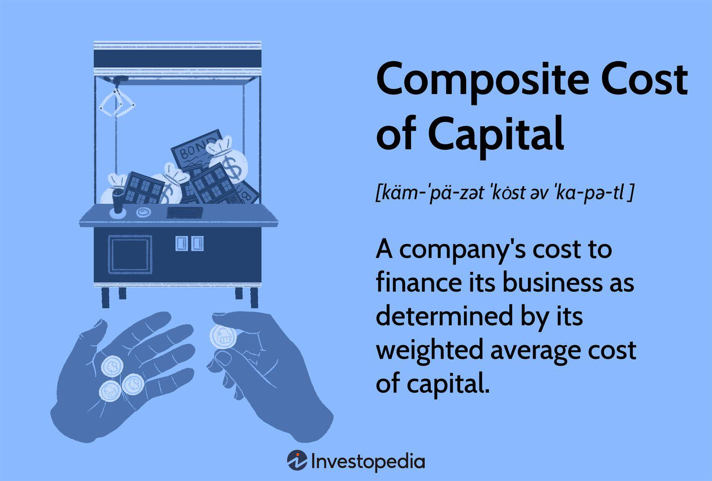

The cost of capital is a critical component of financial analysis as it sets the benchmark for the minimum return a company must earn to justify an investment. It serves as a foundation for evaluating the viability of projects by determining if the expected returns align with the inherent risks. This financial metric influences a company's strategic decisions, including investment evaluation, funding choices, and capital budgeting. Capital structure, comprising debt and equity, and algorithmic trading, which utilizes sophisticated models to automate trading processes, represent distinct yet interconnected areas highly influential in modern financial practices.

Capital structure choices dictate the blend of debt and equity used to finance a company's operations and growth, impacting the overall cost of capital. The balance between these components affects a company's risk profile and potential return on investments. For instance, leveraging debt can lower the cost of capital due to tax advantages, but it also increases financial risk. Meanwhile, algorithmic trading strategies rely heavily on precise capital calculations to automate and optimize trading decisions. Algorithms must factor in the cost of capital to ensure alignment with a firm's risk management and capital structure goals.



This article explores how the cost of capital influences financial analysis, capital structure choices, and algorithmic trading strategies. By understanding these interactions, companies can enhance their strategic planning and financial sustainability. Readers will gain insights into each concept, their intersections, and practical applications through case studies. This comprehensive exploration aims to demonstrate how integrating cost of capital considerations with capital structure and trading strategies can yield a competitive edge, driving long-term growth and profitability in today's fast-paced financial landscapes.

## Table of Contents

## Understanding Cost of Capital

The cost of capital is a pivotal concept in financial management and investment evaluation, acting as a benchmark for determining the viability of potential investment opportunities. It essentially represents the minimum return that a company must achieve on its investment projects to maintain the value of its existing capital and satisfy its investors. The cost of capital is composed of two primary components: the cost of debt and the cost of equity, each contributing uniquely to a company’s financial strategy and risk profile.

### Key Components

**Cost of Debt:** This is the effective rate that a company pays on its borrowed funds, encompassing various forms of borrowing such as bonds, loans, and other debt instruments. Typically, the cost of debt is lower than the cost of equity due to tax advantages, since interest expenses are tax-deductible. To calculate the cost of debt, one can use the following formula:

$$
\text{Cost of Debt} = \text{Interest Rate} \times (1 - \text{Tax Rate})
$$

This formula accounts for the tax shield that debt interest payments provide, effectively reducing the company's taxable income.

**Cost of Equity:** This represents the return that equity investors require on their investment in the company. Unlike debt, equity does not offer a tax shield, and it usually demands a higher return due to its riskier nature. The Capital Asset Pricing Model (CAPM) is often used to estimate the cost of equity, described by:

$$
\text{Cost of Equity} = R_f + \beta \times (R_m - R_f)
$$

Where $R_f$ is the risk-free rate, $\beta$ is the beta coefficient representing the [volatility](/wiki/volatility-trading-strategies) relative to the market, and $R_m$ is the expected market return.

### Calculation Methods

One widespread calculation method integrating both the cost of debt and equity is the Weighted Average Cost of Capital (WACC). It provides an average representing the expected return that each component of capital—debt and equity—demands. WACC is crucial for evaluating new projects, mergers, and acquisitions. The formula for WACC is:

$$
\text{WACC} = \left( \frac{E}{V} \right) \times Re + \left( \frac{D}{V} \right) \times Rd \times (1 - T)
$$

Where $E$ represents the market value of equity, $D$ the market value of debt, $V$ is the total market value of the company’s financing (equity and debt), $Re$ is the cost of equity, $Rd$ the cost of debt, and $T$ the tax rate.

### Strategic Planning and Financial Sustainability

Understanding and applying these calculations are crucial for strategic planning and ensuring long-term financial sustainability. By accurately assessing the cost of capital, companies can make informed decisions regarding project acceptance, capital budgeting, and resource allocation. It also aids in optimizing financial structures by determining the ideal mix of debt and equity to minimize the cost of capital, thus enhancing shareholder value.

In conclusion, a comprehensive grasp of the cost of capital and its components empowers companies to navigate investment decisions with clearer foresight and alignment with broader financial goals.

## The Role of Cost of Capital in Financial Analysis

Cost of capital is a crucial aspect of financial analysis, essential in assessing project feasibility and evaluating a company’s worth. At its core, the cost of capital helps determine the minimum acceptable return on investment that justifies potential undertakings. By setting hurdle rates, companies can effectively guide investment decisions, weighing expected returns against associated risks. 

The calculation of the Weighted Average Cost of Capital (WACC) is particularly significant in this context. WACC combines the cost of equity and the cost of debt to evaluate a firm’s overall cost of financing. This metric enables investors and analysts to align projects with strategic goals, ensuring that only value-accretive opportunities are pursued. The formula for WACC is:

$$

\text{WACC} = \left( \frac{E}{V} \times R_e \right) + \left( \frac{D}{V} \times R_d \times (1 - T) \right) 
$$

where:
- $E$ represents the market value of equity,
- $V$ is the total market value of equity and debt,
- $R_e$ indicates the cost of equity,
- $D$ denotes the market value of debt,
- $R_d$ reflects the cost of debt, and
- $T$ is the corporate tax rate.

This formula enables decision-makers to integrate their capital costs into a coherent financial strategy, facilitating informed decisions that reflect a balance of risk and reward. By utilizing WACC in valuations, investors can assess a company's investment risk, analyzing whether projected cash flows would exceed the financing costs. This alignment is vital for sustainable growth and long-term objectives.

Furthermore, WACC serves as a tool for comparing the financial health and potential of different companies, providing insights into how various businesses manage their cost structures. Through this evaluation, stakeholders can pinpoint strategic advantages and vulnerabilities, ensuring that capital allocation aligns with the broader goals of financial sustainability and strategic growth.

## Algorithmic Trading and Capital Calculation

Algorithmic trading employs sophisticated algorithms to automate and enhance the efficiency of trading processes. These algorithms are designed to analyze a vast array of market variables, capitalizing on speed and precision to execute trades. A crucial aspect of [algorithmic trading](/wiki/algorithmic-trading) is the reliance on meticulous capital calculations to align trading strategies with overarching financial goals.

The integration of capital calculations, particularly the cost of capital, into algorithmic trading ensures that trading strategies are not only profitable but also sustainable and in line with the company’s risk parameters and capital structure goals. The cost of capital represents the minimum expected return necessary to satisfy a company's debt and equity stakeholders. Therefore, precise calculations are essential for making informed trading decisions and managing financial risk, as these metrics influence risk adjustments and expected returns.

The assessment of the cost of capital involves key financial metrics such as the Weighted Average Cost of Capital (WACC). The formula for WACC is:

$$

\text{WACC} = \left( \frac{E}{V} \times \text{Re} \right) + \left( \frac{D}{V} \times \text{Rd} \times (1 - \text{Tc}) \right)
$$

where:
- $E$ is the market value of equity,
- $D$ is the market value of debt,
- $V$ is the total market value of the firm’s financing (E + D),
- $\text{Re}$ is the cost of equity,
- $\text{Rd}$ is the cost of debt,
- $\text{Tc}$ is the corporate tax rate.

By incorporating WACC into algorithmic frameworks, algorithms can be programmed to take into account not only the immediate profitability of trades but also their alignment with long-term financial objectives and capital availability. This process involves utilizing historical and real-time financial data to dynamically adjust trading strategies, thereby optimizing returns while minimizing exposure to risk.

Python is a widely-used language for implementing such financial algorithms due to its simplicity and robust libraries, such as NumPy and Pandas, which facilitate efficient data manipulation and analysis. Here is an example of a simple Python function to calculate WACC:

```python
def calculate_wacc(equity, debt, cost_of_equity, cost_of_debt, tax_rate):
    total_value = equity + debt
    equ_weight = equity / total_value
    debt_weight = debt / total_value
    wacc = (equ_weight * cost_of_equity) + (debt_weight * cost_of_debt * (1 - tax_rate))
    return wacc

# Example usage
equity = 500000
debt = 300000
cost_of_equity = 0.08  # 8%
cost_of_debt = 0.05    # 5%
tax_rate = 0.3         # 30%

wacc = calculate_wacc(equity, debt, cost_of_equity, cost_of_debt, tax_rate)
print(f"The WACC is: {wacc:.2%}")
```

Algorithmic trading strategies that incorporate WACC calculations are better positioned to optimize capital allocation, effectively manage risk, and align with financial strategies. These techniques are not only crucial for enhancing trading operations but also for achieving sustainable growth and profitability within financial markets.

## Integrating Cost of Capital with Algo Trading Strategies

Integrating the cost of capital into algorithmic trading strategies serves to refine investment decisions and enhance portfolio management by aligning them with the financial objectives of minimizing costs and maximizing returns. A key aspect of this integration involves understanding how trading costs, such as bid-ask spreads and price impacts, interact with the cost of capital. These interactions influence the development and execution of algorithmic strategies, as trading costs can significantly affect the net profit of executed trades.

The bid-ask spread is the difference between the price at which a market maker is willing to buy (bid) and sell (ask). For traders, especially those employing high-frequency or algorithmic strategies, minimizing this spread is essential to ensure profitability. When combined with the cost of capital considerations, such spreads affect the decision on how aggressively to pursue market [liquidity](/wiki/liquidity-risk-premium) and at what frequency trades should be executed.

Price impact, another crucial consideration, refers to the influence that a large order can have on the market price of an asset. A well-designed algorithmic trading model will take into account the expected price impact when calculating potential returns. Algorithms must be sophisticated enough to [factor](/wiki/factor-investing) in both the direct effects of placing sizable trades and the associated cost of capital needed to fund these trades. By integrating Weighted Average Cost of Capital (WACC) calculations, traders can better quantify the minimum acceptable rate of return on these investment activities.

Advanced algorithmic systems can implement precise calculations of cost of capital directly into their decision-making processes. For example, Python can be used to model WACC calculations:

```python
def calculate_wacc(debt, equity, cost_of_debt, cost_of_equity, tax_rate):
    """Calculate the Weighted Average Cost of Capital (WACC)"""
    total_capital = debt + equity
    weight_of_debt = debt / total_capital
    weight_of_equity = equity / total_capital
    wacc = (weight_of_debt * cost_of_debt * (1 - tax_rate)) + (weight_of_equity * cost_of_equity)
    return wacc

# Example usage
debt = 500000
equity = 1000000
cost_of_debt = 0.05
cost_of_equity = 0.08
tax_rate = 0.3

wacc = calculate_wacc(debt, equity, cost_of_debt, cost_of_equity, tax_rate)
print(f"WACC: {wacc:.2%}")
```

By incorporating algorithms that account for WACC and other cost-of-capital metrics, portfolio managers can better optimize capital allocation across different assets and positions, ensuring alignment with overall financial goals and constraints. This not only enhances risk management but also aids in determining the appropriate leverage levels within the portfolio to maximize returns without exacerbating risk. Ultimately, the strategic integration of costs of capital into algorithmic trading forms a comprehensive approach to financial decision-making, driving efficiency and performance in trading practices.

## Case Studies and Practical Applications

The integration of cost of capital assessments with algorithmic trading strategies offers a sophisticated approach to financial decision-making. Industry leaders like Goldman Sachs and Renaissance Technologies exemplify how this combination can drive success.

Goldman Sachs, a powerhouse in global investment banking, utilizes algorithmic trading systems that incorporate comprehensive cost of capital evaluations. By integrating cost of capital metrics, such as the Weighted Average Cost of Capital (WACC), into their trading algorithms, Goldman Sachs optimizes investment decisions in real-time. This strategic alignment enables them to manage risks efficiently and enhance returns by aligning their trading strategies with underlying financial requirements. The sophistication of these algorithms lies in their ability to adjust dynamically to changing market conditions and firm-specific financial metrics.

Renaissance Technologies, renowned for its Medallion Fund, showcases another successful application of cost of capital integration. The [hedge fund](/wiki/hedge-fund-trading-strategies) employs quantitative models that rigorously factor in cost of capital to maximize profits. Renaissance’s algorithmic strategies incorporate complex mathematical models to estimate expected returns, benchmarked against the firm’s cost of capital. This approach ensures that trades are executed within a framework that considers both market opportunities and financial sustainability, ultimately leading to superior performance and risk-adjusted returns.

These case studies highlight several key lessons. First, aligning financial analytics and trading models is vital for sustained profitability. By embedding cost of capital considerations within algorithmic strategies, firms can ensure that their investment decisions are economically justified and conducive to long-term growth. Second, the need for advanced technologies and quantitative models is emphasized. Firms must leverage sophisticated tools that can process large datasets and integrate multiple financial variables to optimize trading outcomes.

Furthermore, the practical application of these concepts can be enhanced through Python programming, which allows the development of custom trading algorithms. For instance, incorporating a WACC calculation function into a trading model can provide real-time insights. An example Python snippet to compute WACC may look as follows:

```python
def calculate_wacc(equity_market_value, debt_market_value, cost_of_equity, cost_of_debt, tax_rate):
    total_value = equity_market_value + debt_market_value
    weight_equity = equity_market_value / total_value
    weight_debt = debt_market_value / total_value

    wacc = (weight_equity * cost_of_equity) + (weight_debt * cost_of_debt * (1 - tax_rate))
    return wacc

# Example variables
equity_value = 1000000  # Example equity market value in dollars
debt_value = 500000  # Example debt market value in dollars
equity_cost = 0.08  # Example cost of equity rate
debt_cost = 0.05  # Example cost of debt rate
corporate_tax_rate = 0.21  # Example corporate tax rate

# Calculate WACC
wacc = calculate_wacc(equity_value, debt_value, equity_cost, debt_cost, corporate_tax_rate)
print(f"The WACC is {wacc:.2%}")
```

This calculation provides a critical input for trading algorithms, influencing buy/sell decisions by comparing expected trade returns against the WACC benchmark. In conclusion, these industry examples and practical implementations underscore the valuable synergy between cost of capital assessments and algorithmic trading, highlighting pathways to strategic efficiency and enhanced financial performance.

## Conclusion

The cost of capital is a cornerstone of financial analysis that significantly influences investment decisions and corporate strategies. Understanding and calculating the cost of capital enables companies to set accurate hurdle rates, ensuring that investments meet minimum return thresholds essential for sustaining financial health. It informs decisions on whether to undertake specific projects, guiding firms toward opportunities that promise value generation.

When integrated effectively with capital structure decisions, the cost of capital ensures that companies maintain an optimal balance between debt and equity. This balance helps minimize overall financing costs and reduces the risk profile of the company, paving the way for stable growth. The strategic alignment of capital allocation with business objectives also enhances shareholder value.

In algorithmic trading, the precise evaluation and incorporation of the cost of capital can significantly enhance the effectiveness of trading strategies. By incorporating algorithms with robust financial analytics that consider the cost of capital, companies can optimize their trading operations. This integration allows for more informed decision-making, balancing market opportunities with potential risks associated with each trade.

Moreover, the synergy between the cost of capital, capital structure management, and algorithmic trading offers a competitive advantage. Organizations that leverage this integration can optimize operations, efficiently allocate resources, and strategically manage risks, ultimately fostering long-term growth and profitability. These approaches not only improve operational performance but also provide the flexibility needed to adapt to changing market conditions and maintain a leadership position in the industry.

## References & Further Reading

Peer-reviewed articles and authoritative [books](/wiki/algo-trading-books) on finance provide substantial knowledge for those looking to explore the intricate aspects of cost of capital, financial analysis, and algorithmic trading. Such resources offer detailed methodologies, empirical studies, and advanced theories that enrich understanding beyond basic concepts.

**Books:**

1. **"The Cost of Capital: Estimating the Rate of Return for Publicly Traded Entities" by Shannon P. Pratt and Roger J. Grabowski**  
   This book is a comprehensive resource on estimating the cost of capital, detailing various methodologies such as the Capital Asset Pricing Model (CAPM) and building up model. It includes case studies and examples that illustrate practical applications.

2. **"Financial Statement Analysis and Security Valuation" by Stephen Penman**  
   Penman's work offers insights into how financial statement analysis informs valuation and investment decisions, which are critically influenced by cost of capital considerations.

3. **"Inside the Black Box: A Simple Guide to Quantitative and High Frequency Trading" by Rishi K. Narang**  
   This book provides an accessible introduction to algorithmic trading. It demystifies complex trading strategies and explores the importance of integrating robust financial analysis, including cost of capital, into trading algorithms.

**Articles:**

1. **"The Weighted Average Cost of Capital is Not Quite Right" by Pablo Fernandez (Journal of Financial Economics)**  
   Fernandez critiques traditional WACC computations and provides insightful alternatives. This paper is valuable for those looking to understand nuanced considerations in cost of capital estimation.

2. **"The Cost of Capital for Real Investment: A Research Review" by Edwin J. Elton and Martin J. Gruber (Financial Management Journal)**  
   This article reviews empirical research on cost of capital applications in real investment, providing a foundation for applying these concepts to both corporate finance and trading strategies.

3. **"Algorithmic Trading and the Market for Liquidity" by Thierry Foucault, Johan Hombert, and Ioanid Rosu (Review of Financial Studies)**  
   This paper explores the integration of algorithmic trading strategies and liquidity, offering insights into how cost of capital considerations can optimize trading efficiency and effectiveness.

These resources encourage further exploration into how cost of capital and advanced financial analysis intersect with cutting-edge trading strategies. They provide tools and frameworks essential for practitioners aiming to achieve a competitive edge in financial markets. Advanced learners and professionals can benefit from the depth and breadth of information available in these texts and studies, facilitating improved decision-making and strategic planning in finance.