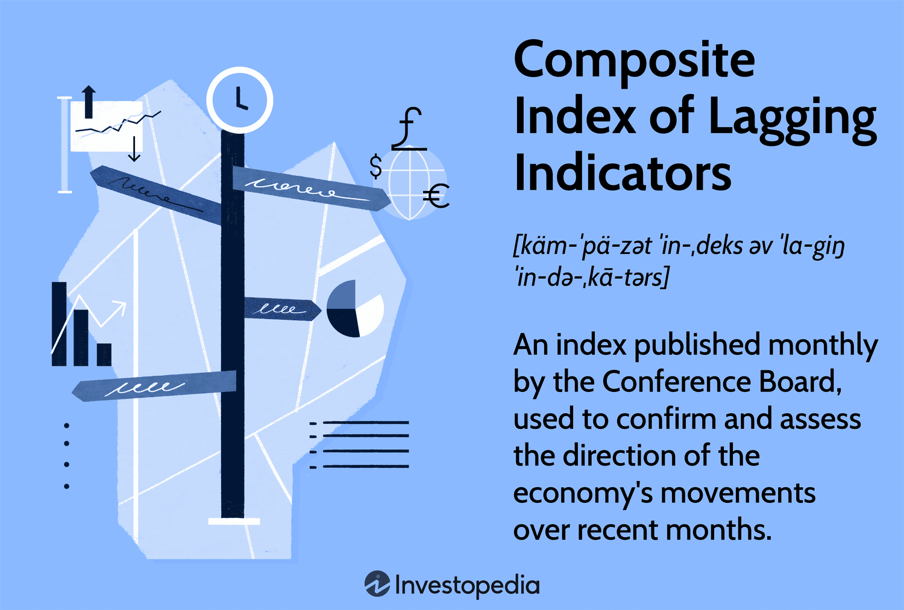

## Table of Contents

## What is a Composite Index of Coincident Indicators?

A Composite Index of Coincident Indicators is a tool used to measure the current state of the economy. It combines several different economic indicators that change at the same time as the overall economy. These indicators might include things like employment levels, personal income, and industrial production. By looking at these indicators together, economists can get a better sense of how the economy is doing right now.

This index is useful because it helps economists and policymakers understand the present economic situation without having to wait for more delayed reports. For example, if the Composite Index of Coincident Indicators shows that employment and personal income are both rising, it suggests that the economy is doing well at that moment. On the other hand, if the indicators are falling, it might mean the economy is struggling. This information can help guide decisions on things like interest rates and government spending.

## What are the main components of the Composite Index of Coincident Indicators?

The Composite Index of Coincident Indicators includes several key parts that help show how the economy is doing right now. One important part is employment levels, which measures how many people have jobs. If more people are working, it usually means the economy is doing well. Another part is personal income, which looks at how much money people are earning. When personal income goes up, it often means people are spending more, which is good for the economy.

Another key component is industrial production, which tracks how much factories and other industries are making. If industrial production is high, it suggests that businesses are busy and the economy is strong. Sometimes, the index also includes other indicators like manufacturing and trade sales, which show how much businesses are selling. By putting all these pieces together, the Composite Index of Coincident Indicators gives a clear picture of the economy's current health.

## How is the Composite Index of Coincident Indicators calculated?

The Composite Index of Coincident Indicators is calculated by combining several different economic indicators that change at the same time as the overall economy. These indicators are usually things like employment levels, personal income, and industrial production. Each of these indicators is given a certain weight, which means some might be considered more important than others when calculating the index. The weights are decided by experts who study how much each indicator affects the economy.

To calculate the index, the values of each indicator are first adjusted to remove any seasonal patterns, like more people shopping during the holidays. Then, these adjusted values are combined using the weights. The result is a single number that shows how the economy is doing right now. If the number is going up, it means the economy is getting stronger. If it's going down, it might mean the economy is weakening. This helps economists and policymakers understand the current state of the economy and make better decisions.

## What is the purpose of using the Composite Index of Coincident Indicators?

The purpose of using the Composite Index of Coincident Indicators is to help people understand how the economy is doing right now. It combines different pieces of information like how many people have jobs, how much money people are [earning](/wiki/earning-announcement), and how much factories are making. By putting all these pieces together, the index gives a clear picture of the economy's current health. This helps economists and people who make decisions for the government see if the economy is strong or if it's struggling.

Using the Composite Index of Coincident Indicators is important because it gives a quick look at the economy without having to wait for slower reports. If the index shows that employment and personal income are going up, it suggests that the economy is doing well at that moment. On the other hand, if the index shows that these numbers are going down, it might mean the economy is having problems. This information can help guide decisions about things like interest rates and government spending, making sure they are based on what's happening in the economy right now.

## How does the Composite Index of Coincident Indicators differ from leading and lagging indicators?

The Composite Index of Coincident Indicators is different from leading and lagging indicators because it shows what is happening in the economy right now. Coincident indicators, like employment levels and personal income, change at the same time as the overall economy. They help people see the current state of the economy without having to wait for more delayed reports. This is useful for making quick decisions based on the present situation.

Leading indicators, on the other hand, are used to predict what might happen in the economy in the future. Things like stock market performance and new orders for goods can signal that the economy might grow or shrink before it actually happens. Lagging indicators, like the unemployment rate or changes in the money supply, show what has already happened in the economy. They confirm trends after they have started, which can be helpful for understanding long-term patterns but aren't as useful for immediate decision-making. By understanding the differences between these types of indicators, people can use them together to get a full picture of the economy's past, present, and future.

## Can you provide examples of economic indicators included in the Composite Index of Coincident Indicators?

The Composite Index of Coincident Indicators includes several key economic indicators that help show how the economy is doing right now. One important indicator is employment levels, which measures how many people have jobs. If more people are working, it usually means the economy is doing well. Another key part is personal income, which looks at how much money people are earning. When personal income goes up, it often means people are spending more, which is good for the economy.

Another indicator that might be included is industrial production, which tracks how much factories and other industries are making. If industrial production is high, it suggests that businesses are busy and the economy is strong. Sometimes, the index also includes other indicators like manufacturing and trade sales, which show how much businesses are selling. By putting all these pieces together, the Composite Index of Coincident Indicators gives a clear picture of the economy's current health.

## How frequently is the Composite Index of Coincident Indicators updated?

The Composite Index of Coincident Indicators is usually updated every month. This means that every month, new data about things like employment levels, personal income, and industrial production is collected and added to the index. By updating it monthly, people can keep track of how the economy is doing right now and see if it's getting better or worse.

Having monthly updates is important because it helps economists and people who make decisions for the government understand the current state of the economy quickly. If they see that the numbers are going up, it might mean the economy is doing well. If the numbers are going down, it could mean the economy is struggling. This information can help them make better choices about things like interest rates and government spending.

## What are some common uses of the Composite Index of Coincident Indicators in economic analysis?

The Composite Index of Coincident Indicators is often used by economists and policymakers to get a quick and clear picture of how the economy is doing right now. They look at the index to see if employment levels, personal income, and other important parts of the economy are going up or down. If the index shows that these numbers are increasing, it suggests that the economy is strong and growing. On the other hand, if the numbers are falling, it might mean the economy is struggling. This information helps them make decisions about things like interest rates and government spending, making sure these decisions are based on what's happening in the economy at the moment.

Another common use of the Composite Index of Coincident Indicators is in business planning. Companies use the index to understand the current economic environment and adjust their strategies accordingly. For example, if the index shows that the economy is doing well, a business might decide to expand, hire more workers, or invest in new projects. If the index indicates that the economy is weakening, a business might choose to be more cautious, maybe by cutting costs or delaying big investments. By using the index, businesses can make better decisions that help them stay successful no matter what's happening in the economy.

## How can the Composite Index of Coincident Indicators be used to predict economic trends?

The Composite Index of Coincident Indicators can help predict economic trends by showing what's happening in the economy right now. When the index goes up, it often means that the economy is getting stronger. This can be a sign that good times are coming, because things like employment and personal income are improving. On the other hand, if the index starts to go down, it might mean that the economy is weakening. This could be a warning that tough times might be ahead, because fewer people are working and earning less money.

Economists and businesses use this information to make guesses about what will happen next. For example, if the Composite Index of Coincident Indicators has been going up for a few months, economists might predict that the economy will keep growing. This could lead to decisions like lowering interest rates to encourage more spending and investment. If the index is going down, businesses might decide to hold off on big projects or hiring new workers, expecting that the economy might get worse. By watching the index closely, people can get a better idea of where the economy is headed and plan accordingly.

## What are the limitations or criticisms of the Composite Index of Coincident Indicators?

One limitation of the Composite Index of Coincident Indicators is that it only shows what's happening in the economy right now. It doesn't tell us what will happen in the future or what has happened in the past. This means that while it's helpful for understanding the present, it can't predict big changes or confirm long-term trends. Also, the index depends on the data it uses, and if some of that data is wrong or late, the whole index might not be as accurate as it should be.

Another criticism is that the weights given to different indicators in the index can be a problem. Experts decide how important each part of the index is, but different people might have different opinions on this. If the weights are not right, the index might not show the real state of the economy. Plus, the index might not include every important piece of information about the economy. There could be other things happening that the index doesn't see, which means it might miss some important details.

## How does the Composite Index of Coincident Indicators correlate with other economic indicators?

The Composite Index of Coincident Indicators often moves in the same way as other economic indicators that show the current state of the economy. For example, when the index goes up, it usually means that employment levels and personal income are also going up. This makes sense because these things are part of the index. Other indicators like retail sales and industrial production might also go up at the same time, showing that the economy is strong. If the index goes down, these other indicators might go down too, suggesting that the economy is not doing well.

Sometimes, the Composite Index of Coincident Indicators can also give clues about leading and lagging indicators. When the index starts to change, it can be a sign that leading indicators like stock market performance or new orders for goods might change soon. This is because a strong economy now might lead to more growth in the future. On the other hand, lagging indicators like the unemployment rate or changes in the money supply might confirm what the coincident indicators have already shown. By looking at how the Composite Index of Coincident Indicators correlates with other indicators, people can get a fuller picture of what's happening in the economy and what might happen next.

## What advanced statistical methods are used to refine the Composite Index of Coincident Indicators?

To make the Composite Index of Coincident Indicators more accurate, experts use advanced statistical methods like time series analysis. This helps them understand how the different parts of the index, like employment levels and personal income, change over time. They use these methods to remove seasonal patterns, which are regular changes that happen at certain times of the year, like more shopping during the holidays. By taking out these patterns, the index can show a clearer picture of what's really happening in the economy.

Another method they use is called principal component analysis. This helps them figure out which parts of the index are most important for showing how the economy is doing right now. By using this method, they can make sure that the index focuses on the most useful information and doesn't get distracted by less important details. These advanced statistical methods help make the Composite Index of Coincident Indicators a better tool for understanding the economy's current health.

## References & Further Reading

[1]: "The Conference Board Coincident Economic Index." [The Conference Board](https://www.conference-board.org/topics/us-leading-indicators/).

[2]: Bordo, M. D., & Haubrich, J. G. (2010). ["Credit Crises, Money and Contractions: An Historical View."](https://www.nber.org/system/files/working_papers/w15389/w15389.pdf) National Bureau of Economic Research Working Paper No. 15389.

[3]: "The Leading Economic Index: A Predictive Tool for Economic Analysis." [U.S. Chamber of Commerce Foundation](https://fundsforcompanies.fundsforngos.org/grant/small-business-hurricane-recovery-grant-program-united-states/).

[4]: Lopez de Prado, M. (2018). ["Advances in Financial Machine Learning."](https://www.amazon.com/Advances-Financial-Machine-Learning-Marcos/dp/1119482089) Wiley.

[5]: National Bureau of Economic Research (NBER). ["Business Cycle Dating."](https://www.nber.org/research/business-cycle-dating) 

[6]: Chan, E. P. (2009). ["Quantitative Trading: How to Build Your Own Algorithmic Trading Business."](https://github.com/ftvision/quant_trading_echan_book) John Wiley & Sons.

[7]: Jansen, S. (2020). ["Machine Learning for Algorithmic Trading."](https://github.com/stefan-jansen/machine-learning-for-trading) Packt Publishing.

[8]: "Economic Indicators: A Laboratory in a Book." [Federal Reserve Bank of St. Louis](https://fred.stlouisfed.org/graph/?g=1Ck8b).