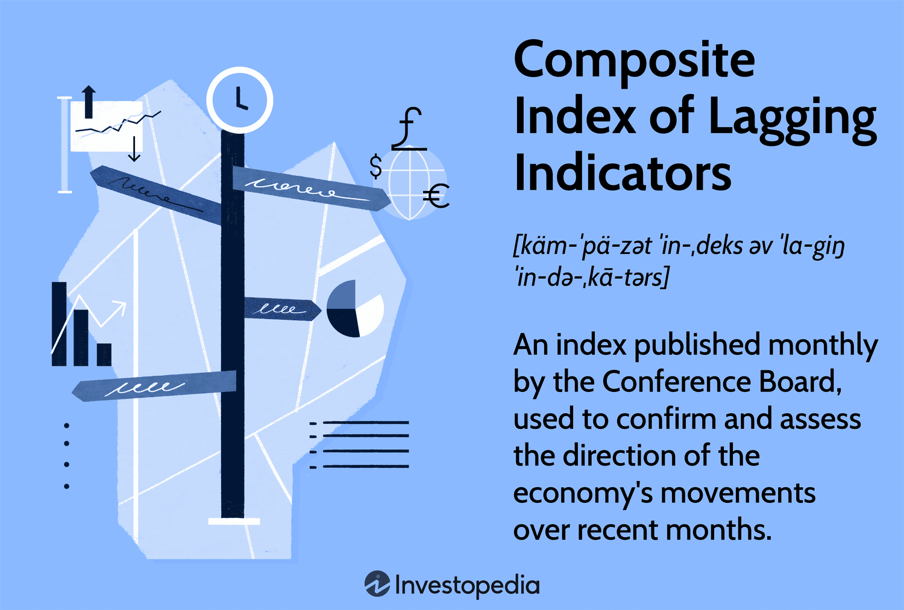

Economic indicators are fundamental tools in economic analysis, offering critical insights that guide fiscal policy decisions and shape investment strategies. These indicators are divided into three categories: leading, lagging, and coincident indicators. Each type provides a distinct perspective on economic activity. Leading indicators are predictive, offering a glimpse into future economic movements, while coincident indicators provide a real-time snapshot of economic health. Lagging indicators, on the other hand, confirm trends that have already begun, offering retrospective validation of economic shifts.

Lagging indicators hold particular importance for policymakers and analysts as they substantiate the effectiveness of economic policies and guide future decisions. By examining data such as unemployment rates and corporate profits, these indicators offer crucial validation that can influence long-term strategies.



In this article, we focus on lagging economic indicators and their integration into broader economic analyses. We will explore the Composite Index of Lagging Indicators, a tool provided by the Conference Board that aggregates several lagging indicators to reflect economic trends over previous months. We also examine the role these indicators play in algorithmic trading, where they are used to confirm established market trends and optimize trading strategies.

By understanding the nuances of lagging indicators, investors and policymakers can better assess the robustness of economic trends and make informed decisions that capitalize on market opportunities, while simultaneously mitigating risks.

## Table of Contents

## What Are Lagging Economic Indicators?

Lagging economic indicators are critical analytical tools used to confirm the direction of an economy after trends have developed. Unlike leading indicators, which provide forecasts or advance warnings of economic shifts, lagging indicators serve as a confirmation post the occurrence of economic activities. This quality makes them reliable for validating trends, thereby assisting investors, economists, and policymakers in decision-making processes.

Lagging indicators are retrospective in nature; they change only after the economy as a whole begins to follow a particular trend. This attribute ensures that they provide a dependable assessment of the economic situation by offering evidence of enduring economic patterns. These indicators are essential in supporting the formulation of policies and investment strategies, as they reflect the outcomes of decisions previously made based on other economic indicators.

Common examples of lagging indicators include unemployment rates and corporate profits. The unemployment rate, for instance, tends to increase following a downturn because businesses delay laying off employees until the economy is already in a recession. Conversely, unemployment rates fall when businesses become more confident in the economic recovery and begin hiring. Corporate profits also serve as a lagging indicator; they often increase after a period of economic growth because it takes time for profits to materialize from previous financial activities and consumer expenditures.

The utility of lagging indicators lies in their ability to substantiate the existence of certain economic trends. This makes them indispensable tools for validating forecasts made by leading indicators and for confirming broader economic analyses. In sum, while lagging indicators might not provide predictive capabilities, their strength lies in the validation of ongoing economic activities, offering necessary corroboration for robust economic assessments and strategic planning.

## Understanding the Composite Index of Lagging Indicators

The Composite Index of Lagging Indicators, developed by the Conference Board, plays a critical role in economic analysis by offering insights into the economic activities of prior months. This index acts as a tool to validate and confirm the economic trends that have already been set in motion. Unlike leading indicators, which are predictive, lagging indicators offer a retrospective view, consolidating the existing economic data to support assessments made by economists and policy makers.

This composite index is integral because it includes several components—each chosen for its ability to signify past economic performance. Among the most prominent components are the average duration of unemployment and variations in labor cost per unit of output. The average duration of unemployment is a vital measure that reflects the length of time people are typically out of work. A longer duration suggests potential structural issues in the labor market, whereas a shorter duration may indicate a vibrant economy with abundant opportunities.

Changes in labor cost per unit of output, another significant component, offer insights regarding productivity and wage dynamics. Specifically, if the cost of labor per unit rises, it may suggest increasing production costs, which can impact profitability and, consequently, economic growth. This metric helps analysts understand the balance between labor expenses and output efficiency—a key aspect of economic health.

The Composite Index of Lagging Indicators is often used alongside coincident and leading indicators. This complementary approach allows economists to construct a fuller picture of the economic climate. While leading indicators might suggest where the economy is heading, and coincident indicators show the current state, lagging indicators confirm these insights and highlight shifts that have already materialized. This comprehensive analysis supports informed decisions and strategic planning, providing stakeholders with a robust toolkit for navigating the complexities of economic dynamics.

By establishing a retrospective validation of economic conditions, the Composite Index of Lagging Indicators assists in confirming economic trajectories. This makes it an invaluable asset for fiscal authorities, market analysts, and investors, each relying on accurate historical data to devise strategies and policies that respond appropriately to the cyclical nature of economic growth and recession. Through its meticulous construction and application, the index enhances understanding of economic conditions and supports well-grounded decision-making processes.

## Role of Lagging Indicators in Economic Analysis

Lagging indicators offer a retrospective view on economic developments, often serving as a validation of shifts in economic [momentum](/wiki/momentum) that have already occurred. These indicators play a crucial role in economic analysis by confirming patterns and trends. Their retrospective nature allows analysts and policymakers to comprehend and interpret long-term economic health. This is crucial when making informed decisions regarding fiscal policies and investment strategies.

By examining historical data, lagging indicators enable analysts to validate the reality of economic trends that coincident or leading indicators might suggest. For instance, if leading indicators suggest an economic slowdown, a rise in unemployment rates—a common lagging indicator—can confirm this declining trend as it materializes. While unemployment is often viewed as a lagging indicator because it increases after economic downturns have begun, it provides crucial insight into the depth and duration of economic challenges.

Despite their features of observing past events, lagging indicators can also signal future economic conditions to some extent. A consistent increase in corporate profits, for instance, can hint at improving economic situations, possibly signaling future growth investment opportunities. Observing these trends helps analysts project future economic conditions more accurately, despite the indicators reflecting past data.

Ultimately, lagging indicators are indispensable in constructing a full picture of economic health. They validate the assessments made based on more proactive indicators and help shape more precise economic forecasts. Their insights inform policy adjustments and strategic planning, focusing on sustaining economic stability and growth.

## Application of Economic Indicators in Algo Trading

Algorithmic trading systems integrate economic indicators to enhance their predictive capabilities, allowing for more informed and effective decision-making in financial markets. These systems rely on both leading and lagging indicators to construct a comprehensive view of market conditions and potential future movements.

Leading indicators, such as manufacturing indexes and new orders for goods, serve as predictors of future economic activity. They are instrumental in anticipating market movements by providing early signals about the direction of an economy. Algorithmic trading systems use these indicators to identify potential entry and [exit](/wiki/exit-strategy) points in the market before trends become evident to the general market participants. For example, an algorithm might initiate a buy sequence if leading indicators suggest an upcoming economic uptick.

Lagging indicators, on the other hand, are employed to validate and confirm trends that have already been established. Indicators such as unemployment rates and corporate profits fall into this category. By confirming the existence of a trend, they help algorithms avoid premature actions that might result from anomalies or short-lived market conditions. This confirmation reduces the likelihood of false signals, increasing the reliability of trading decisions.

To ensure the effectiveness and reliability of trading algorithms, [backtesting](/wiki/backtesting) with historical data is a critical step. Backtesting involves running trading algorithms against historical market data to evaluate their performance under various conditions. This process helps identify potential weaknesses in the algorithms and provides a measure of their potential profitability. A simple Python script for backtesting might involve using libraries like pandas for data manipulation and matplotlib for visualizing results. For instance:

```python
import pandas as pd
import matplotlib.pyplot as plt

# Sample backtesting function
def backtest_strategy(prices, signals):
    capital = 10000
    positions = []

    for price, signal in zip(prices, signals):
        if signal == "buy":
            positions.append(capital / price)
            capital = 0
        elif signal == "sell" and positions:
            capital += positions.pop() * price

    return capital

# Sample data
prices = [101, 102, 103, 98, 97, 99, 104]
signals = ["buy", None, None, "sell", None, "buy", "sell"]

# Running backtest
final_capital = backtest_strategy(prices, signals)
print(f"Final capital after backtesting: ${final_capital:.2f}")
```

This example outlines a basic strategy that opens a position on a "buy" signal and closes it on a "sell" signal. The effectiveness of backtesting hinges on ensuring data accuracy and covering an extensive historical period to accommodate various market conditions.

Incorporating both leading and lagging economic indicators into [algorithmic trading](/wiki/algorithmic-trading) systems not only enhances predictive accuracy but also supports risk management by providing a balanced approach to market analysis. This dual application contributes to more robust trading strategies capable of capitalizing on both short-term opportunities and long-term trends.

## Challenges and Considerations in Using Economic Indicators for Trading

Accurate algorithmic trading decisions heavily rely on the quality and timeliness of economic data. High-quality data ensures that trading algorithms have precise inputs for systematic decision-making, minimizing errors that could lead to significant financial losses. The availability and promptness of data updates enable traders to react swiftly to market changes, thereby optimizing trading performance. Delays in data dissemination can erode the edge provided by real-time processing capabilities, undermining trading strategies that depend on the most current information.

Market reactions to economic indicators can be notably unpredictable, presenting significant challenges for traders. Economic indicators can trigger market [volatility](/wiki/volatility-trading-strategies), making robust risk management strategies paramount. For instance, unexpected reactions to indicators like unemployment rates or corporate profits may lead to rapid price swings. To mitigate such risks, traders often employ hedging techniques or stop-loss orders to protect their positions. Moreover, [machine learning](/wiki/machine-learning) models can be integrated into algorithmic systems to adapt to unforeseen market conditions, learning from past data to predict possible future market behaviors.

Compliance with regulatory standards is another critical consideration when utilizing economic indicators in trading strategies. Regulatory bodies impose strict guidelines to ensure transparency, fairness, and ethical practices within financial markets. Algorithmic traders must adhere to these standards to avoid regulatory penalties and maintain market integrity. This encompasses implementing comprehensive audit trails, ensuring algorithm testing and documentation are rigorously conducted, and adhering to data privacy regulations. For instance, the Markets in Financial Instruments Directive (MiFID II) in the European Union mandates pre-trade and post-trade transparency, impacting how data is handled and trades are executed. 

By acknowledging the challenges of data quality, market unpredictability, and regulatory compliance, traders can better position themselves to harness the potential of economic indicators effectively. Combining rigorous data verification processes with dynamic risk management frameworks and strict adherence to regulations facilitates a disciplined approach to algorithmic trading.

## Conclusion

Economic indicators are fundamental in crafting informed investment strategies and guiding economic policy decisions. They provide actionable insights that drive smarter, more effective decision-making processes. In the dynamic field of algorithmic trading, economic indicators integrate seamlessly to enhance decision-making capabilities and improve risk management. These indicators are crucial because they help traders build resilient trading algorithms capable of anticipating market conditions, thus optimizing trading outcomes.

Algorithmic trading systems utilize a range of economic indicators, incorporating them to refine prediction algorithms. By aligning leading, lagging, and coincident indicators, these systems can not only forecast potential market shifts but also confirm ongoing economic trends, offering a robust framework for trading decisions. This dual function of prediction and confirmation empowers traders to navigate complex market environments with greater confidence.

Remaining informed about economic trends is another pivotal aspect that enables traders and investors to seize market opportunities. Continuous monitoring of economic indicators allows for the timely identification of evolving market dynamics. This proactive approach enables practitioners to adjust strategies accordingly, leveraging newfound insights into competitive advantages.

As markets continue to evolve, the importance of economic indicators in shaping investment and trading decisions is certain to grow. Traders and investors who prioritize the integration of quality economic data into their strategies stand to benefit significantly, maximizing their chances for success in increasingly complex and volatile markets.

## References & Further Reading

[1]: ["The Conference Board Leading Economic Index® (LEI) for the United States"](https://www.conference-board.org/topics/us-leading-indicators/) - The Conference Board

[2]: ["Business Cycles, Indicators, and Forecasting"](https://www.nber.org/books-and-chapters/business-cycles-indicators-and-forecasting) by James H. Stock and Mark W. Watson (National Bureau of Economic Research)

[3]: ["Economic Indicators: An Analytical Guide"](https://books.google.com/books/about/Guide_to_Economic_Indicators_Making_Sens.html?id=pM1t-2wJACoC) Bank of England

[4]: ["Trading Economics: Economic Indicators"](https://tradingeconomics.com/) Trading Economics

[5]: ["Algorithmic Trading and the Art of AI"](https://www.researchgate.net/publication/378548435_Algorithmic_Trading_and_AI_A_Review_of_Strategies_and_Market_Impact) by Ernest Chan