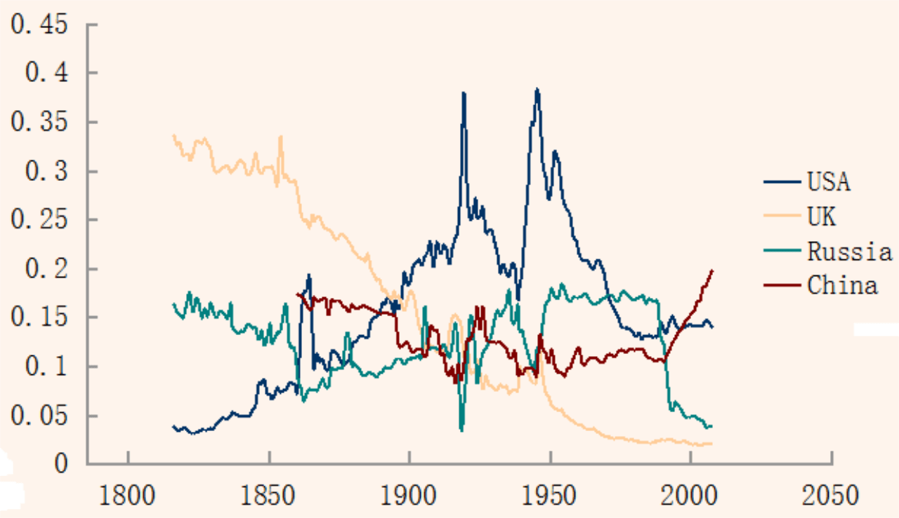

In the fast-paced world of finance, understanding economic movements and trends can significantly impact investors and policymakers. Economic forecasting, economic indicators, leading indexes, and algorithmic trading form a complex yet cohesive framework that shapes our comprehension of the economy and influences trading strategies.

Economic forecasting is the analytical process of predicting future economic conditions based on historical data and statistical models. This discipline relies heavily on economic indicators, which are key metrics that provide insights into the economy's health and direction. These metrics are categorized into leading, lagging, and coincident indicators, each serving its unique purpose in the economic analysis. For example, leading indicators such as stock market returns and business inventories can hint at future economic expansions or recessions, offering valuable foresight for strategic planning.



Leading indexes, which are aggregate measures derived from multiple leading indicators, play a crucial role in economic forecasting. They offer a consolidated view of potential future economic performance, allowing businesses and investors to anticipate market shifts and align their strategies accordingly. A well-known example is the Composite Index of Leading Indicators, which is instrumental in predicting overall economic trends and cycles.

The advent of algorithmic trading has revolutionized the financial markets by automating trade execution based on pre-defined criteria involving economic indicators. These algorithms incorporate leading, lagging, and coincident indicators to predict market movements and execute trades with speed and precision. The integration of real-time economic data enhances the effectiveness of these algorithms, offering a competitive edge in the market.

Understanding these interconnected elements is essential for making informed decisions in unpredictable economic environments. By decoding the relationships between economic forecasting, indicators, leading indexes, and algorithmic trading, traders and policymakers can enhance their decision-making processes and improve their risk management strategies. As technology continues to advance and the global market landscape evolves, mastering these concepts will be paramount for navigating future economic challenges successfully.

## Table of Contents

## Understanding Economic Indicators

Economic indicators are essential instruments used to assess the performance and potential future direction of an economy. They provide quantitative data that reflects economic activity, assisting investors, policymakers, and analysts in making well-informed decisions. These indicators are divided into three distinct categories: leading, lagging, and coincident, each serving a unique role in economic analysis.

Leading indicators are precursors to economic activity, offering insights into future economic performance. They typically change before the economy as a whole changes, making them valuable for predicting turning points in economic trends. Common examples include building permits, which can signal future construction activity, and consumer sentiment, which reflects the confidence of consumers in the economic situation and potential spending behavior. Monitoring these leading indicators allows analysts to anticipate shifts in the economic cycle, providing an opportunity for proactive decision-making.

Lagging indicators, conversely, are metrics that confirm trends after they have been established. They provide verification of economic patterns and are useful for ensuring the accuracy of an economic analysis. The unemployment rate is a classic example of a lagging indicator. It rises or falls in response to economic shifts, confirming trends identified by leading indicators. Because lagging indicators do not predict changes but rather validate them, they are essential for analyzing the long-term health and stability of an economy.

Coincident indicators represent the current state of the economy, offering a snapshot of economic performance at any given time. These indicators are crucial for understanding the immediate effects of economic policies and other influential factors. Gross Domestic Product (GDP) is a prime example of a coincident indicator, as it measures the total economic output and provides an overarching view of economic activity. By evaluating coincident indicators, analysts can assess the existing economic landscape, aiding in the development of responsive policy measures.

In summary, economic indicators, by providing insights into different temporal aspects of economic activity, form the backbone of economic analysis. Their categorization into leading, lagging, and coincident types ensures a comprehensive understanding of economic trends and assists in crafting informed economic strategies.

## The Role of Leading Indexes in Economic Forecasting

Leading indexes are essential tools in economic forecasting. They serve as composite measures derived from multiple leading indicators, which are pivotal in predicting future economic performance. These indexes help stakeholders anticipate changes in the economy, providing a valuable foresight that aids in decision-making.

The Composite Index of Leading Indicators is a quintessential example of a leading index used globally to predict economic trends. This index combines various leading indicators like average weekly hours worked in manufacturing, new orders for consumer goods and materials, and [interest rate](/wiki/interest-rate-trading-strategies) spreads, among others. The aggregation of these indicators offers a more comprehensive view of potential economic directions.

Businesses and investors rely heavily on analyzing these indexes to strategize for upcoming economic shifts and mitigate potential risks. For instance, an upward trend in a leading index might signal an increase in economic activity, prompting businesses to increase production or investment in anticipation of higher demand. Conversely, a downward trend could indicate a potential recession, prompting risk-averse strategies.

Understanding the components and methodology of leading indexes is crucial for accurate forecasting. Each component's weight within the index, the time frame of data collection, and the statistical methods used to aggregate data all play significant roles in determining the reliability of the forecasts. Analysts often employ advanced statistical techniques and models, such as time-series analysis and [machine learning](/wiki/machine-learning) algorithms, to refine these indexes and enhance their predictive power.

Python, a popular programming language for data analysis, can be utilized to analyze composite indexes. For instance, using libraries like Pandas and StatsModels, analysts can build and test models to evaluate the effectiveness of different indicators within a composite index. Here’s a simple example of how Python might be used:

```python
import pandas as pd
import statsmodels.api as sm

# Sample data: indicator values
data = {
    'hours_worked': [40, 42, 41, 43],
    'new_orders': [100, 110, 105, 115],
    'interest_spread': [2.5, 2.6, 2.4, 2.7]
}

# Create a DataFrame
df = pd.DataFrame(data)

# Add a constant for regression
df = sm.add_constant(df)

# Define a mock target variable (e.g., GDP growth)
gdp_growth = [2.0, 2.2, 2.1, 2.3]

# Fit a regression model
model = sm.OLS(gdp_growth, df).fit()

# Summary of the model
print(model.summary())
```

This code snippet demonstrates a basic regression analysis to understand the relationship between key economic indicators and GDP growth, providing insights into how these indicators collectively predict economic performance.

In summary, leading indexes play a pivotal role in economic forecasting, offering insights that are crucial for effective strategic planning and risk management by businesses and investors. Their accuracy and reliability, underpinned by robust statistical methodologies, are vital for anticipating future economic conditions and making informed decisions.

## Integrating Economic Indicators in Algorithmic Trading

Algorithmic trading leverages technology to exploit advantageous trading opportunities using automated strategies driven by pre-programmed software. This sophisticated methodology integrates various economic indicators, which are instrumental in formulating effective trading algorithms.

Economic indicators are systematically categorized into leading, lagging, and coincident indicators, each providing unique insights into market dynamics. Leading indicators, such as stock market returns, consumer sentiment, and building permits, forecast future economic activities and changes in market trends. These indicators are essential in developing anticipatory trading strategies aimed at capitalizing on expected economic shifts.

Lagging indicators, including unemployment rates and corporate profits, provide confirmation of existing trends. Although perceived as reactive, these indicators validate and strengthen the trading strategies initially guided by leading indicators. Coincident indicators, like the Gross Domestic Product (GDP) and industrial production, align closely with the current economic state, ensuring that trading strategies remain attuned to real-time market conditions.

The real-time integration of these economic indicators into [algorithmic trading](/wiki/algorithmic-trading) systems is crucial for achieving precision and reliability. By continuously feeding up-to-date data into trading algorithms, traders can minimize latency and enhance the responsiveness of their strategies to market changes.

Here's a simplified example of how Python can be used to integrate economic indicators into a basic trading algorithm:

```python
import pandas as pd
import numpy as np

# Assume 'economic_data' is a DataFrame containing columns like 'leading', 'lagging', 'coincident'
economic_data = pd.read_csv('economic_indicators.csv')

# Define a simple moving average strategy incorporating leading economic indicators
def trading_strategy(data):
    data['Signal'] = 0.0

    # Calculate moving averages
    data['Short_MA'] = data['leading'].rolling(window=40, min_periods=1).mean()
    data['Long_MA'] = data['leading'].rolling(window=100, min_periods=1).mean()

    # Signal generation
    data['Signal'][data['Short_MA'] > data['Long_MA']] = 1.0
    data['Signal'][data['Short_MA'] < data['Long_MA']] = -1.0

    return data

# Apply strategy
strategic_data = trading_strategy(economic_data)
print(strategic_data.tail())
```

This code outlines a rudimentary trading strategy that uses a leading economic indicator to guide buy or sell signals based on short-term and long-term moving averages. Such a model can be elaborated by integrating more complex data from lagging and coincident indicators to fine-tune trading decisions.

The reliability and accuracy of economic data are pivotal. Erroneous data can prompt missteps in strategy development, underscoring the necessity for robust datasets and thorough validation processes.

In summary, the incorporation of economic indicators into algorithmic trading strategies enhances decision-making processes by providing structured and insightful data-driven forecasts. This integration is vital for traders striving to exploit economic shifts efficiently, maintaining competitive advantages in fast-evolving financial markets.

## Challenges and Considerations

Accuracy and reliability of economic data are essential for making informed economic and financial decisions. Economic data forms the basis upon which trading algorithms operate, and any discrepancies or errors can lead to significant financial losses. Therefore, ensuring data quality by employing rigorous data validation and error-checking processes is crucial.

Market reactions to economic indicators often display a degree of unpredictability, influenced by a multitude of factors including investor sentiment, geopolitical events, and monetary policies. This inherent unpredictability emphasizes the importance of implementing robust risk management strategies. For instance, traders incorporate a variety of hedging techniques and diversify their portfolios to manage potential [volatility](/wiki/volatility-trading-strategies). Value at Risk (VaR) and Conditional Value at Risk (CVaR) are commonly used quantitative measures for assessing the risk of loss on investments.

Regulatory compliance plays an increasingly significant role in algorithmic trading. Algorithms must adhere to legal frameworks designed to ensure transparency and fairness in financial markets. Regulatory bodies such as the U.S. Securities and Exchange Commission (SEC) and the European Securities and Markets Authority (ESMA) enforce rules that govern trading activities. Compliance with these regulations involves maintaining trading logs, avoiding manipulative practices, and implementing safeguards against erroneous trades.

Adapting to sudden changes and iteratively refining algorithms is necessary to maintain a competitive edge in constantly evolving markets. This involves employing machine learning techniques that allow algorithms to learn from new market data and adjust their parameters accordingly. A Python snippet for algorithmic adjustment might involve updating parameters such as weights in a predictive model:

```python
import numpy as np
from sklearn.linear_model import LinearRegression

# Sample predictive model update
def update_model(X_train, y_train):
    model = LinearRegression()
    model.fit(X_train, y_train)
    return model

# Mock data for model update
X_train = np.array([[1.5, 2.3], [1.8, 2.8], [2.0, 3.0]])
y_train = np.array([1.6, 1.9, 2.1])

# Update model with new data
updated_model = update_model(X_train, y_train)

```

Continuous improvement and adaptation ensure that trading algorithms remain effective under varying market conditions, allowing traders to capitalize on emerging opportunities while minimizing potential risks.

## Conclusion

The convergence of economic forecasting, economic indicators, leading indexes, and algorithmic trading provides a comprehensive toolkit for market participants to navigate complex financial landscapes. Understanding these concepts enables traders to refine their decision-making processes and enhance risk management strategies. Economic indicators serve as vital signals, offering glimpses into potential market movements and guiding informed investment choices. By incorporating leading indexes, traders can anticipate economic shifts and strategize accordingly, mitigating risks associated with unforeseen market changes.

Algorithmic trading further enhances the ability to respond to real-time economic data, allowing for precision and speed that manual trading cannot match. Using sophisticated algorithms, traders can capitalize on fleeting market opportunities and optimize their portfolios based on the latest economic insights. As markets become increasingly globalized and interconnected, staying informed about economic conditions and continuously refining trading algorithms is paramount.

In a world driven by rapid technological advancement and globalization, embracing these tools is critical for successfully navigating future economic landscapes. The integration of these elements not only equips market participants with the necessary resources to adapt to the volatile market environment but also positions them to leverage emerging opportunities for sustainable growth and profitability.

## References & Further Reading

The Conference Board provides comprehensive insights into Leading Economic Indicators that are crucial for predicting future economic trends. Their detailed reports and analysis can be accessed through their official website, offering valuable resources for understanding economic dynamics and preparing for impending economic shifts. More information can be found at [The Conference Board](https://www.conference-board.org/).

Investopedia offers a thorough exploration of Economic Indicators, breaking down complex economic data into understandable concepts for investors, students, and professionals alike. Their articles and tutorials are invaluable for gaining a foundational understanding of how these indicators influence market movements. You can read more at [Investopedia](https://www.investopedia.com/).

The International Monetary Fund (IMF) provides an insightful publication titled "Forecasting Recessions: Challenges and Approaches," which examines the intricacies of predicting economic downturns. This resource is essential for understanding the challenges of economic forecasting and the methodologies that can be applied in different economic environments. The publication is available on the [IMF](https://www.imf.org/) website.

Books on Algorithmic Trading and Economic Analysis offer in-depth knowledge on integrating economic indicators into trading strategies and understanding market algorithms. Titles such as "Algorithmic Trading: Winning Strategies and Their Rationale" and "Econometrics for Financial Applications" provide readers with the frameworks and analytical skills necessary for effective algorithmic trading. These [books](/wiki/algo-trading-books) are available through major publishers and online retailers like Amazon and Wiley.