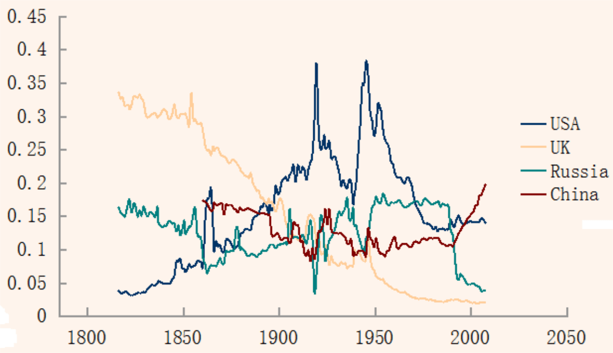

## Table of Contents

## What is a composite index?

A composite index is a type of database index that is made up of multiple columns. Instead of using just one column to organize and search data, a composite index uses several columns together. This can help make searching and sorting data faster, especially when you often need to look up information using more than one column at the same time.

For example, if you have a table with information about people, including their last name, first name, and age, you might create a composite index on these three columns. This way, when you want to find a person by their last name and first name, or even by their age as well, the database can use the composite index to find the information more quickly. It's like having a super-organized filing system that helps you find what you need more efficiently.

## How does a composite index differ from a single-column index?

A composite index and a single-column index are both used to speed up searches in a database, but they work a bit differently. A single-column index is created on just one column of a table. This means it helps you find data quickly when you're looking up information using that specific column. For example, if you have an index on a "last name" column, searching for people by their last name will be fast.

On the other hand, a composite index is created on multiple columns. This type of index is useful when you often need to search for data using more than one column at the same time. For instance, if you have a composite index on "last name" and "first name," you can quickly find a person using both their last and first names together. This can make your searches even faster and more efficient than using separate single-column indexes.

In summary, while a single-column index speeds up searches on one specific column, a composite index can speed up searches that involve multiple columns. This makes composite indexes particularly helpful for complex queries that involve several pieces of information.

## What are the benefits of using a composite index?

Using a composite index can really help speed up your searches in a database. When you have a lot of data and you often need to look up information using more than one column, a composite index can make this process much faster. It's like having a super-organized filing system that lets you find what you need quickly by using multiple pieces of information at once.

Another benefit is that composite indexes can help save space in your database. Instead of creating separate indexes for each column, you can use one composite index that covers several columns. This means you don't need as much space to store all those indexes, which can be really helpful if you're working with a large database.

Overall, composite indexes can make your database searches quicker and more efficient, and they can also help you manage your database space better. They're especially useful when you often need to search using multiple columns together, making them a great tool for handling complex queries.

## In what scenarios should a composite index be used?

A composite index is really helpful when you often need to search for information using more than one column at the same time. For example, if you have a big list of people and you often need to find them by their last name and first name together, a composite index on those two columns can make your searches much faster. It's like having a super-organized filing system that helps you find what you need quickly by using multiple pieces of information.

Another good time to use a composite index is when you want to save space in your database. Instead of making separate indexes for each column, you can use one composite index that covers several columns. This means you don't need as much space to store all those indexes, which can be really helpful if you're working with a large database. So, if you often do complex searches and want to keep your database organized and efficient, a composite index can be a great choice.

## How do you create a composite index in SQL?

To create a composite index in SQL, you use the CREATE INDEX command. You just need to list the columns you want to include in the index, separated by commas. For example, if you have a table called "People" and you want to create a composite index on the "LastName" and "FirstName" columns, you would write: `CREATE INDEX idx_lastname_firstname ON People (LastName, FirstName);`. This tells the database to make a new index called "idx_lastname_firstname" that uses both the "LastName" and "FirstName" columns to help find information faster.

When you create a composite index, you can choose the order of the columns. This can make a big difference in how fast your searches are. For example, if you often search by last name first and then by first name, putting "LastName" before "FirstName" in the index can make those searches quicker. Just remember, the order you list the columns in the CREATE INDEX command is the order they'll be used in the index.

## What is the order of columns in a composite index and why is it important?

The order of columns in a composite index is how you list the columns when you create the index. It's important because it can make your searches faster or slower. If you often search for information using one column first and then another, you should put that first column at the beginning of the index. For example, if you usually look up people by their last name and then their first name, you should put "LastName" before "FirstName" in the index.

This order matters because the database uses the columns in the order you list them to find the information. When you search, the database starts with the first column in the index and then moves to the next one. If the first column in your index matches what you're searching for, the database can quickly narrow down the results before looking at the next column. So, choosing the right order can help make your searches faster and more efficient.

## How does a composite index affect query performance?

A composite index can really help make your searches in a database faster. When you use a composite index, it's like having a super-organized filing system. If you often need to find information using more than one column at the same time, a composite index can speed up those searches. For example, if you have a list of people and you often look them up by their last name and then their first name, a composite index on those two columns can help the database find the information more quickly.

The order of the columns in a composite index is also important. It can make a big difference in how fast your searches are. If you usually search by one column first and then another, you should put that first column at the beginning of the index. For instance, if you often look up people by their last name first and then their first name, putting "LastName" before "FirstName" in the index can make those searches quicker. So, choosing the right order for your composite index can help your database work more efficiently.

## Can a composite index be used for queries that only reference some of its columns?

Yes, a composite index can be used for queries that only reference some of its columns. This is called a partial match. For example, if you have a composite index on "LastName" and "FirstName," you can still use it to search for people just by their last name. The database will use the part of the index that matches the column you're searching for, even if you're not using all the columns in the index.

However, the effectiveness of using a composite index for partial matches depends on the order of the columns in the index. If you're searching by the first column in the index, like "LastName" in our example, the database can use the index efficiently. But if you're searching by a column that comes later in the index, like "FirstName" without "LastName," the database might not be able to use the index as effectively. So, it's important to think about which columns you use most often in your searches when you create a composite index.

## What are the potential drawbacks or limitations of using composite indexes?

Using composite indexes can make your searches faster, but they also have some downsides. One big problem is that they can take up a lot of space in your database. When you create a composite index, it's like making a big, detailed map of your data. This map can help you find things quickly, but it also needs a lot of room to store all that information. If you have a lot of composite indexes or if your database is already very large, this can make your database slower and harder to manage.

Another issue is that composite indexes can be tricky to use correctly. The order of the columns in the index really matters. If you put the columns in the wrong order, your searches might not be as fast as you want them to be. Also, if you often need to search by just one of the columns in the index, you might not get the full benefit of the composite index. It's important to think carefully about which columns to include and in what order, or you might end up with an index that doesn't help as much as you hoped.

## How do you choose the right columns for a composite index?

Choosing the right columns for a composite index is important for making your database searches faster. You should pick columns that you often use together in your searches. For example, if you always look up people by their last name and then their first name, those two columns would be good choices for a composite index. Think about the queries you run most often and which columns you use in those queries. That way, you can create an index that really helps speed up the searches you do a lot.

Another thing to consider is the order of the columns in the index. The first column you list in the index should be the one you use most often to start your searches. If you usually search by last name first and then by first name, you should put "LastName" before "FirstName" in the index. This helps the database find the information more quickly because it can use the first column to narrow down the results before moving to the next one. So, think about the order of your searches and choose the column order in your composite index accordingly.

## What is the impact of composite indexes on data insertion and update operations?

When you use composite indexes, they can slow down the process of adding new data or updating existing data in your database. This is because every time you make a change, the database has to update the index too. If you have a lot of composite indexes, this can take more time and make your database work harder. So, while composite indexes can help make your searches faster, they might make adding or changing data a bit slower.

It's important to think about how often you need to add or update data when you decide to use composite indexes. If you're always adding new information or changing what's already there, having too many composite indexes might not be a good idea. You need to find a balance between making your searches quick and keeping your data operations smooth. This way, your database can work efficiently for both searching and updating.

## How can you monitor and optimize the performance of composite indexes in a database?

To keep an eye on how well your composite indexes are working, you can use tools that come with your database system. These tools can show you how often the indexes are used and how much they help speed up your searches. For example, you can look at something called the "query execution plan" to see if the database is using your composite indexes when it should. If you see that some indexes are not being used much, you might want to think about getting rid of them to save space and make your database run faster.

To make your composite indexes work better, you need to think about which columns to include and in what order. If you often search for information using certain columns together, those should be in your index. Also, the order of the columns matters a lot. Put the column you use most often to start your searches at the beginning of the index. If you find that your searches are still slow, you might need to try different combinations of columns or change the order until you find what works best. It's all about finding the right balance to make your database searches quick without slowing down other tasks like adding or updating data.

## What are some examples of composite indexes?

Composite indexes play a significant role in financial markets by providing a broad measure of market performance. Some of the most renowned composite indexes include the Nasdaq Composite, S&P 500, and Dow Jones Industrial Average (DJIA). Each of these indexes has unique characteristics that offer distinct insights into market trends.

The Nasdaq Composite index, which includes over 3,000 stocks listed on the Nasdaq stock exchange, is heavily weighted toward technology companies. Its calculation is based on market capitalization, meaning larger companies have a greater impact on the index's movement. Market capitalization is calculated using the formula:

$$
\text{Market Cap} = \text{Share Price} \times \text{Number of Outstanding Shares}
$$

The dominance of tech stocks in the Nasdaq Composite makes it a valuable indicator of the technology sector's performance and investor sentiment.

The S&P 500 Index comprises 500 of the largest companies listed on stock exchanges in the United States. It is also a market-capitalization-weighted index, but unlike the Nasdaq Composite, it represents a diverse range of sectors, providing a more comprehensive view of the U.S. stock market's overall health. Its methodology involves selecting companies primarily based on their [liquidity](/wiki/liquidity-risk-premium), industry group representation, and market size.

In contrast, the Dow Jones Industrial Average is a price-weighted index. It includes only 30 large, publicly-owned companies in the United States. The price-weighted nature means that stocks with higher prices [carry](/wiki/carry-trading) more weight in the index's calculation, irrespective of the company's overall market size. The Dow's calculation involves summing the price of all 30 stocks and dividing by a divisor, which is adjusted for stock splits and other changes:

$$
\text{DJIA} = \frac{\sum (\text{Price of Stock}_i)}{\text{Divisor}}
$$

The comparison between cap-weighted and price-weighted indexes highlights differing investment strategies and underlying assumptions. Cap-weighted indexes like the Nasdaq and S&P 500 emphasize market size, whereas price-weighted indexes like the DJIA focus on stock price changes.

Composite indexes are crucial tools for investors for several reasons. First, they offer a snapshot of market performance, helping investors gauge potential economic trends. They also serve as benchmarks against which individual or fund performance can be compared. Furthermore, these indexes facilitate diversification; by investing in an index fund or [ETF](/wiki/etf-trading-strategies) that tracks a composite index, investors can achieve broad market exposure, reducing unsystematic risk associated with holding individual stocks.

Overall, composite indexes like the Nasdaq Composite, S&P 500, and DJIA provide invaluable insights and benchmarks for assessing and navigating the dynamic landscape of financial markets.

## What is the role of composite indexes in investment strategies?

Composite indexes play a pivotal role in investment strategies by providing insights into market trends and performances. A composite index, compiled from multiple securities within a specific category, serves as an aggregated benchmark to assess the general movement and health of markets or sectors. One of the primary applications of composite indexes is their ability to gauge overall market trends. For instance, when the Nasdaq Composite rises, it signals an upward trend in the technology and internet industries, given the index's heavy weighting toward these sectors. This index-based evaluation helps investors make informed decisions about entering or exiting markets based on prevailing economic climates.

The importance of composite indexes extends to portfolio diversification and risk management. By investing in a composite index, investors achieve instant diversification across a wide array of companies and sectors. This diversification is crucial in mitigating the risks associated with individual security fluctuations. For instance, an index like the S&P 500 includes a mix of sectors such as technology, healthcare, and consumer goods, ensuring that poor performance in one area can be offset by gains in another. Diversification, as captured by the formula:

$$
\sigma_portfolio = \sqrt{\sum (w_i^2 \sigma_i^2) + \sum \sum (w_i w_j \sigma_i \sigma_j \rho_{ij})}
$$

where $\sigma_portfolio$ is the portfolio's standard deviation, $w_i$ and $w_j$ are the weights of individual assets, $\sigma_i$ and $\sigma_j$ are standard deviations of the assets, and $\rho_{ij}$ is the correlation between assets $i$ and $j$, underscores the reduction of overall risk when assets are not perfectly correlated.

When comparing direct investment in indexes to using index funds and ETFs (Exchange-Traded Funds), several distinctions arise. Direct index investing, where investors purchase a portfolio mirroring a specific index, can be preferable for achieving tailored exposure with potentially lower costs, especially when replicating the index through fractional shares. However, handling factors such as rebalancing or maintaining the exact composition can be cumbersome. Conversely, index funds and ETFs offer a more convenient approach, automatically managing these logistical aspects for investors. ETFs, in particular, provide liquidity and flexibility due to their ability to be traded throughout the day on stock exchanges, offering a dynamic alternative to static index fund investing.

In essence, composite indexes are indispensable in crafting robust investment strategies. By serving as indicators of market trends and facilitators of diversification, these indexes aid investors in optimizing portfolios while balancing risk and return. Furthermore, the choice between direct index investing and using ETFs or index funds hinges on individual investor needs, weighing factors such as convenience, cost, and investment objectives.

## References & Further Reading

[1]: Bergstra, J., Bardenet, R., Bengio, Y., & Kégl, B. (2011). ["Algorithms for Hyper-Parameter Optimization."](https://dl.acm.org/doi/10.5555/2986459.2986743) Advances in Neural Information Processing Systems 24.

[2]: ["Advances in Financial Machine Learning"](https://www.amazon.com/Advances-Financial-Machine-Learning-Marcos/dp/1119482089) by Marcos Lopez de Prado

[3]: ["Evidence-Based Technical Analysis: Applying the Scientific Method and Statistical Inference to Trading Signals"](https://books.google.com/books/about/Evidence_Based_Technical_Analysis.html?id=MeoJAQAAMAAJ) by David Aronson

[4]: ["Machine Learning for Algorithmic Trading"](https://github.com/stefan-jansen/machine-learning-for-trading) by Stefan Jansen

[5]: ["Quantitative Trading: How to Build Your Own Algorithmic Trading Business"](https://www.amazon.com/Quantitative-Trading-Build-Algorithmic-Business/dp/1119800064) by Ernest P. Chan