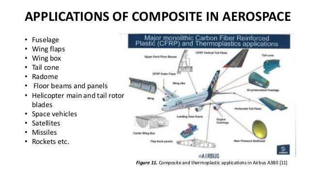

In today's fast-paced world, the integration of technology across various sectors is transforming industries at an unprecedented pace. Among the most impactful innovations are composite materials and algorithmic trading, both of which leverage technology to redefine their respective fields.

Composite materials have emerged as a cornerstone in material science, characterized by their customizable properties and broad range of applications. By combining two or more distinct materials, composites offer enhanced characteristics such as increased strength, reduced weight, and improved durability. These unique properties have made them indispensable in aerospace, automotive, and construction sectors, where performance and efficiency are paramount.



Simultaneously, algorithmic trading represents a technological leap in the financial domain. Utilizing the power of computation, algorithmic trading systems execute trades with high speed and volume, far surpassing human capabilities. By minimizing human intervention, these systems reduce time lags and enhance decision-making processes, thereby optimizing market opportunities.

This article examines the intersection of composite materials and algorithmic trading, focusing on their applications, the advancements driving material science, and the growing role of algorithms in shaping trading paradigms. By understanding these domains, we gain insight into the transformative power of technology and its potential to shape the future of both materials and finance.

## Table of Contents

## Understanding Composite Materials

Composite materials are engineered structures formed by combining two or more distinct constituent materials, each with its unique properties, to produce a composite with enhanced characteristics. The primary objective of creating composite materials is to capitalize on the strengths and mitigate the weaknesses of individual components. Typically, these constituents can be categorized into two phases: the matrix and the reinforcement. The matrix is usually a continuous phase that surrounds and supports the reinforcement phase, which provides strength and rigidity. Common examples include fiberglass (glass fibers in a polymer matrix) and carbon fiber-reinforced polymers.

Composite materials boast a wide array of applications due to their superior strength-to-weight ratio, corrosion resistance, and design flexibility. In aerospace engineering, composites are invaluable for constructing aircraft parts that demand high performance and low weight, such as wings, fuselages, and tail sections. In the automotive industry, they contribute to producing lightweight vehicles that improve fuel efficiency while maintaining safety and durability. Additionally, in the construction sector, composite materials are used for building bridges, panels, and other structures where strength and durability are crucial.

The field of composite materials is witnessing rapid advancements due, in part, to the application of [machine learning](/wiki/machine-learning) technologies. These advancements are primarily focused on the design, optimization, and production processes of composite materials. Machine learning algorithms can process vast amounts of data to predict the mechanical and thermal properties of new composites, which significantly reduces the time and costs associated with experimental testing. By utilizing techniques such as supervised learning, researchers can train models to identify optimal combinations of materials that yield desired properties. For instance, a [neural network](/wiki/neural-network) can be trained to predict the strength of a composite based on the properties of its constituents, enabling the rapid iteration and fine-tuning of material compositions.

Moreover, optimization algorithms can be used to enhance the manufacturing processes of composites, ensuring consistent quality and performance. These computational techniques help in solving complex problems of material behavior under various conditions, leading to the development of composites that are not only efficient but also tailor-made for specific applications. This acceleration in design and optimization is paving the way for the next generation of composite materials, with innovations that promise increased functionality and efficacy across industries. As technology continues to advance, the intersection of machine learning and composite material engineering is expected to grow, offering novel solutions to persistent challenges in material science.

## Revolutionizing Material Science with Algorithms

Machine learning algorithms are significantly advancing material science by facilitating the discovery and optimization of novel composite materials. This computational approach helps predict properties and performance, streamlining the experimental process and reducing the time needed for development. By employing data-driven strategies, researchers are leveraging large datasets to identify patterns and correlations that guide the design, testing, and production of composites.

One of the key advantages of using machine learning in materials science is the ability to simulate and evaluate a vast range of material compositions and structures without the need for exhaustive physical experiments. Algorithms such as neural networks, decision trees, and support vector machines can predict properties such as mechanical strength, thermal stability, and chemical resistance. For instance, a model might predict the tensile strength of a composite based on its constituent materials and processing conditions.

The integration of [artificial intelligence](/wiki/ai-artificial-intelligence) is particularly beneficial for developing materials tailored for specific industrial applications. By using generative models, such as generative adversarial networks (GANs) or variational autoencoders (VAEs), researchers can generate new material designs that meet predefined criteria. These algorithms can optimize multiple parameters simultaneously, leading to innovative solutions that might not be achievable through traditional methods.

To illustrate, consider a composite material designed for aerospace applications, where both weight and strength are critical. Machine learning models can analyze historical data and existing material knowledge to propose new combinations of fibers and matrices that achieve the necessary performance characteristics with reduced weight.

In practice, implementing such algorithms involves setting up a pipeline of data collection, model training, validation, and testing. The pipeline begins with gathering a comprehensive dataset that includes various material compositions and their corresponding properties. This data is then used to train a machine learning model, which can be validated using a validation set to ensure its accuracy. Finally, testing the model with new data or in practical scenarios helps refine it further and implement its predictions in real-world applications.

Overall, the application of machine learning in material science not only accelerates the discovery of advanced composites but also enhances their functionality, making significant contributions to industrial progress.

## Algorithmic Trading: The Technological Leap in Finance

Algorithmic trading represents a significant technological advancement within financial markets, integrating computer algorithms to execute trades at unparalleled speed and [volume](/wiki/volume-trading-strategy). These algorithms are designed to assess numerous market parameters, such as price, timing, and volume, to optimize trade execution. By reducing human intervention, [algorithmic trading](/wiki/algorithmic-trading) minimizes the associated time lags and emotion-driven biases inherent in manual trading, thereby enhancing efficiency.

At its core, algorithmic trading relies on the ability to quickly analyze market data and execute orders. The algorithms can be designed with various strategies: from simple rule-based systems to complex multi-[factor](/wiki/factor-investing) models. For instance, a basic algorithm might implement a moving average crossover strategy, where a buy (or sell) signal is generated when a short-term moving average crosses above (or below) a long-term moving average.

Python, with its extensive libraries like NumPy for numerical computation and pandas for data manipulation, offers a robust platform for developing these trading algorithms. A simple moving average crossover strategy can be illustrated using the following Python code snippet:

```python
import pandas as pd

def moving_average_crossover(data, short_window, long_window):
    signals = pd.DataFrame(index=data.index)
    signals['price'] = data['price']
    signals['short_mavg'] = data['price'].rolling(window=short_window).mean()
    signals['long_mavg'] = data['price'].rolling(window=long_window).mean()
    signals['signal'] = 0.0
    signals['signal'][short_window:] = np.where(signals['short_mavg'][short_window:] > 
                                                signals['long_mavg'][short_window:], 1.0, 0.0)   
    signals['positions'] = signals['signal'].diff()
    return signals

# Example usage
data = pd.DataFrame({'price': [your_price_data]})
signals = moving_average_crossover(data, 40, 100)
```

Machine learning plays a pivotal role in refining these strategies, pushing algorithmic trading beyond traditional methods. By employing techniques such as supervised learning, algorithms can be trained on historical data to identify patterns and predict future price movements. Reinforcement learning, an area within machine learning, allows algorithms to improve their performance through trial and error, learning the optimal sequence of trading actions to maximize returns.

Furthermore, advanced machine learning models, like neural networks, can process and interpret vast datasets, capturing complex relationships between different financial metrics that traditional statistical methods might overlook. This capability significantly enhances both investment strategy formulation and risk management. For example, using LSTM (Long Short-Term Memory) networks for predicting financial time series allows capturing temporal dependencies in data, enabling more accurate market forecasts.

The impact of these advancements is profound, reshaping how capital is allocated and managed across global financial markets. As algorithms continue evolving, they offer the potential to redefine trading paradigms, pushing the industry toward greater automation and optimization.

## Synergies and Future Prospects

The intersection of material science and finance is proving to be an intriguing area for innovation through the exchange of advanced methodologies between the two disciplines. At the heart of this synergy lies artificial intelligence, which is revolutionizing both the design of composite materials and the strategies employed in algorithmic trading. 

In material science, AI-driven methodologies are instrumental in the creation of composites with specific properties aimed at particular applications. These approaches utilize data analytics and machine learning to predict material behavior and optimize designs. For instance, predictive algorithms can assess a composite's strength, durability, or flexibility by analyzing existing data sets, significantly reducing the time needed for experimental testing.

Parallel to this, algorithmic trading in finance capitalizes on similar artificial intelligence techniques. Trading algorithms employ machine learning to analyze vast amounts of market data, identify patterns, and predict price movements to execute trades with higher precision and speed than traditional methods. These strategies aim to maximize returns while minimizing risks, a goal reminiscent of optimizing material properties in composites.

Given these similarities, the potential for cross-disciplinary innovation is significant. Methods used to optimize the design of composite materials can inspire new forms of financial algorithms that improve prediction accuracy and decision-making efficiency. Conversely, techniques honed in algorithmic trading such as rapid data processing and pattern recognition can be applied to material science, enhancing the ability to customize material characteristics at a granular level.

The convergence of these fields could revolutionize industry practices. In material science, leveraging financial methodologies might lead to the development of composites that are not only high-performing but also cost-effective, fostering sustainable industry growth. In finance, insights from material science could refine trading models, making them more adaptive and robust in dynamic markets.

Advances in technology facilitating this cross-pollination promise an era where industries not only benefit from technology-driven efficiencies but also contribute to each other's evolution, driving growth and innovation across sectors. By embracing these synergies, industries stand to gain unprecedented capabilities in material development and financial transactions.

## Conclusion

The evolution of composite materials and algorithmic trading highlights the significant impact of technology across diverse sectors. Composite materials have revolutionized industries such as aerospace and automotive by offering superior strength-to-weight ratios and improved performance characteristics. These materials are engineered through the precise combination of various elements, resulting in enhanced attributes that cater to specific industrial needs. Such advancements have been accelerated by artificial intelligence, which aids material scientists in predicting and optimizing material properties, thus pushing the boundaries of what these materials can achieve.

Simultaneously, algorithmic trading reshapes the financial sector by employing sophisticated algorithms to execute trades with speed and precision. The integration of machine learning provides the capability to analyze vast datasets, uncover patterns, and implement investment strategies that minimize risks and maximize returns. This technological leap empowers financial experts to make informed decisions swiftly, adapting to fluctuating market conditions and enhancing overall trading efficiency.

The synergy between material science and finance, driven by artificial intelligence, offers promising prospects for future innovations. By embracing AI-driven methodologies, these fields can achieve breakthroughs that not only improve their operational efficacy but also contribute to broader industrial advancements. It is essential for industries to recognize the transformative potential of these technologies and invest in their development to remain competitive and realize sustainable growth. A commitment to harnessing these innovations will pave the way for continued progress, unlocking new possibilities for engineering, finance, and beyond.

## References & Further Reading

[1]: Bergstra, J., Bardenet, R., Bengio, Y., & Kégl, B. (2011). ["Algorithms for Hyper-Parameter Optimization."](https://dl.acm.org/doi/10.5555/2986459.2986743) Advances in Neural Information Processing Systems 24.

[2]: ["Advances in Financial Machine Learning"](https://www.amazon.com/Advances-Financial-Machine-Learning-Marcos/dp/1119482089) by Marcos Lopez de Prado

[3]: ["Evidence-Based Technical Analysis: Applying the Scientific Method and Statistical Inference to Trading Signals"](https://www.amazon.com/Evidence-Based-Technical-Analysis-Scientific-Statistical/dp/0470008741) by David Aronson

[4]: ["Machine Learning for Algorithmic Trading"](https://github.com/stefan-jansen/machine-learning-for-trading) by Stefan Jansen

[5]: ["Quantitative Trading: How to Build Your Own Algorithmic Trading Business"](https://www.amazon.com/Quantitative-Trading-Build-Algorithmic-Business/dp/1119800064) by Ernest P. Chan