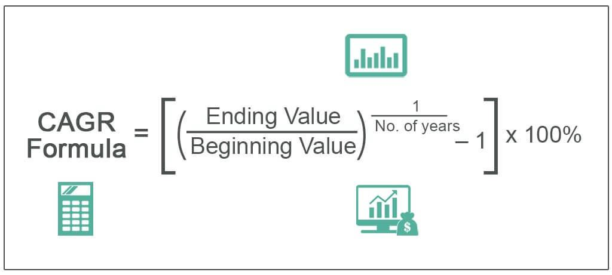

## Table of Contents

## What is Compound Accreted Value (CAV)?

Compound Accreted Value (CAV) is a way to measure the value of a bond over time, especially for bonds that do not pay interest regularly. Instead of getting interest payments, the value of these bonds grows over time until they mature. This growth happens because the interest that would have been paid is added to the bond's value, and then the next period's interest is calculated on this new, higher value. This process is called compounding.

CAV is important for zero-coupon bonds, which are bonds that don't pay interest until they mature. For these bonds, CAV helps investors understand how much the bond is worth at any point before it matures. By knowing the CAV, investors can see how the bond's value is increasing over time due to the compounding effect, even though they aren't receiving any actual payments until the bond reaches its maturity date.

## How does Compound Accreted Value differ from simple interest?

Compound Accreted Value (CAV) and simple interest are two different ways to calculate how much money grows over time. Simple interest is easy to understand. It's when you earn interest only on the original amount of money you invested or loaned, called the principal. For example, if you invest $100 at a 5% simple interest rate per year, you'll earn $5 every year, no matter how many years pass. The interest you earn stays the same each year because it's always calculated on the original $100.

On the other hand, Compound Accreted Value works differently. With CAV, the interest you earn gets added to the principal, and then the next period's interest is calculated on this new, higher amount. This is called compounding. So, if you start with $100 and it grows at a 5% rate compounded annually, after the first year, you'll have $105. In the second year, you'll earn interest on $105, not just the original $100. This means your money grows faster over time because you're earning interest on a bigger amount each time. CAV is often used for bonds that don't pay interest until they mature, like zero-coupon bonds, to show how their value increases over time.

## Can you explain the formula used to calculate Compound Accreted Value?

The formula for calculating Compound Accreted Value (CAV) is pretty straightforward. It's based on the idea of compound interest. The formula is: CAV = P x (1 + r/n)^(n x t). Here, P is the principal or the original amount of money you start with. The r is the annual interest rate, but it's written as a decimal. For example, if the interest rate is 5%, you use 0.05 in the formula. The n stands for how many times the interest is compounded in a year. If it's compounded annually, n is 1. If it's compounded monthly, n is 12. And t is the time the money is invested or loaned for, in years.

Let's break down how this works with an example. Suppose you invest $1,000 in a bond that has a 5% annual interest rate, and the interest is compounded annually. After 3 years, you want to know the CAV. You plug the numbers into the formula: CAV = 1000 x (1 + 0.05/1)^(1 x 3). That simplifies to CAV = 1000 x (1.05)^3. When you do the math, you find that the CAV after 3 years is about $1,157.63. This shows how the value of your bond grows over time because of the compounding effect, even though you're not getting any interest payments along the way.

## What are the key components needed to calculate CAV?

To calculate Compound Accreted Value (CAV), you need to know four main things: the principal amount, the annual interest rate, how often the interest is compounded, and the time the money is invested for. The principal amount is the starting amount of money you have. The annual interest rate is how much interest you earn each year, and it's usually shown as a percentage. How often the interest is compounded tells you if the interest is added to the principal yearly, monthly, or at some other interval. And the time is how many years the money will be growing.

Using these pieces of information, you can plug them into a formula to find out the CAV. The formula is CAV = P x (1 + r/n)^(n x t), where P is the principal, r is the annual interest rate as a decimal, n is how many times the interest is compounded each year, and t is the number of years. This formula helps you see how the value of your investment grows over time because the interest earned gets added back into the principal, and then you earn interest on the new total.

## How does the frequency of compounding affect the Compound Accreted Value?

The frequency of compounding can make a big difference in how fast your money grows with Compound Accreted Value (CAV). When interest is compounded more often, like monthly instead of yearly, you get to add the interest to the principal more times in a year. This means you start earning interest on a bigger amount sooner, which makes your money grow faster. For example, if you have $1,000 at a 5% annual interest rate, compounding monthly will make your money grow more than if it's compounded yearly.

Let's look at how this works with numbers. If you compound yearly, after one year, $1,000 at 5% interest becomes $1,050. But if you compound monthly, you'll get interest 12 times in that year. Each month, you'll earn interest on a slightly bigger amount. At the end of the year, your $1,000 will grow to about $1,051.16 instead of $1,050. Over many years, this difference gets bigger because you're always earning on a larger amount. So, the more often the interest is compounded, the higher the CAV will be.

## What are some real-world applications of Compound Accreted Value?

Compound Accreted Value (CAV) is often used in the world of finance, especially when dealing with bonds that don't pay interest until they mature, like zero-coupon bonds. These bonds are popular with investors who want to save for a specific future goal, like paying for a child's college education or planning for retirement. By understanding the CAV, investors can see how much their bond will be worth at any point before it matures. This helps them plan their finances better because they know exactly how much money they'll have at a certain time in the future.

CAV is also useful for companies that issue these kinds of bonds. When a company sells zero-coupon bonds, it doesn't have to make regular interest payments, which can help with cash flow management. The company can use the money it raises from selling the bonds for things like expanding the business or paying off other debts. By calculating the CAV, the company can figure out how much it will need to pay back to bondholders when the bonds mature, helping them plan their finances and make sure they have enough money when the time comes.

## How can Compound Accreted Value be used in financial planning?

Compound Accreted Value (CAV) can be a big help in financial planning, especially when you're saving for something important in the future. If you're buying a zero-coupon bond to save for your kid's college education or your retirement, knowing the CAV tells you how much money you'll have at a certain time. This makes it easier to plan because you can see exactly how your savings will grow over time without getting any interest payments along the way. You can use this information to figure out if you're saving enough or if you need to adjust your plan.

CAV also helps companies plan their finances when they issue zero-coupon bonds. When a company sells these bonds, it doesn't have to pay interest regularly, which can free up cash for other important things like growing the business or paying off debts. By calculating the CAV, the company can see how much it will need to pay back when the bonds mature. This helps them make sure they'll have enough money when the time comes, making it easier to plan for the future and manage their finances well.

## What are the advantages of using Compound Accreted Value over other valuation methods?

Using Compound Accreted Value (CAV) can be really helpful when you're looking at bonds that don't pay interest until they mature, like zero-coupon bonds. One big advantage of CAV is that it shows you exactly how much your bond is worth at any point before it matures. This is great for planning because you can see how your savings will grow over time without getting any interest payments along the way. It's like having a clear picture of your future money, which helps you make better decisions about saving for things like college or retirement.

Another advantage is that CAV is perfect for companies that issue zero-coupon bonds. When a company sells these bonds, it doesn't have to pay interest regularly, which can help with cash flow. By using CAV, the company can figure out how much it will need to pay back when the bonds mature. This makes it easier for the company to plan and make sure they'll have enough money when it's time to pay back the bondholders. So, CAV not only helps investors plan their finances but also helps companies manage theirs more effectively.

## Can you provide an example of how to calculate CAV for a specific investment?

Let's say you want to save for your kid's college education, so you buy a zero-coupon bond for $1,000. The bond has a 5% annual interest rate and will mature in 10 years. You want to know how much the bond will be worth at the end of those 10 years using Compound Accreted Value (CAV). The formula for CAV is CAV = P x (1 + r/n)^(n x t), where P is the principal (the $1,000 you paid for the bond), r is the annual interest rate (0.05), n is how many times the interest is compounded each year (let's say it's compounded annually, so n is 1), and t is the number of years (10).

Plugging the numbers into the formula, you get CAV = 1000 x (1 + 0.05/1)^(1 x 10). That simplifies to CAV = 1000 x (1.05)^10. When you do the math, you find that the CAV after 10 years is about $1,628.89. This means that by the time your kid goes to college, your $1,000 investment in the zero-coupon bond will have grown to about $1,628.89, even though you didn't get any interest payments along the way. Knowing the CAV helps you plan because you can see exactly how much money you'll have when you need it.

## How does inflation impact the Compound Accreted Value of an investment?

Inflation can affect the Compound Accreted Value (CAV) of an investment by changing the real value of the money you get back at the end. Imagine you invest in a zero-coupon bond that will be worth $1,628.89 in 10 years. If inflation is high during those years, the money you get back might not buy as much as you thought it would. For example, if inflation is 3% each year, things that cost $1 today might cost $1.34 in 10 years. So, even though your bond's CAV is $1,628.89, it might not feel like as much money because everything else is more expensive.

To deal with inflation, investors often look for investments that grow faster than inflation. If the interest rate on your bond is higher than the inflation rate, your money will still be worth more in the future. But if inflation is higher than the interest rate, the real value of your investment goes down. That's why it's important to think about inflation when you're planning with CAV. You want to make sure the growth of your investment keeps up with or beats inflation so your money keeps its value over time.

## What are the potential risks and limitations when using CAV for long-term investments?

When you use Compound Accreted Value (CAV) for long-term investments, one big risk is inflation. If inflation goes up a lot, the money you get back from your investment might not buy as much as you hoped. For example, if you invest in a zero-coupon bond and inflation is higher than the interest rate, the real value of your money goes down. This means even though your bond's CAV grows, it might not feel like you have more money because everything else costs more. So, it's important to make sure the interest rate on your investment is higher than inflation to keep your money's value.

Another limitation of using CAV is that it assumes the interest rate stays the same over the whole time of your investment. But in real life, interest rates can change. If the interest rate goes down, your bond won't grow as much as you planned. Also, CAV doesn't think about other risks like the company you invested in going bankrupt or changes in the market. These things can affect how safe your investment is. So, while CAV is a good way to see how your money will grow over time, it's important to think about these other factors too when you're planning for the long term.

## How can advanced mathematical models enhance the accuracy of Compound Accreted Value calculations?

Advanced mathematical models can make Compound Accreted Value (CAV) calculations more accurate by taking into account things that change over time, like inflation and interest rates. Instead of just using a simple formula that assumes everything stays the same, these models can predict how these changes might affect your investment. For example, they can use something called stochastic calculus to guess how interest rates might go up or down in the future. This helps you get a better idea of what your bond might be worth at different times, not just at the end.

These models also help by considering other risks that might affect your investment. They can look at how likely it is that the company you invested in might have trouble paying you back, or how the overall economy might change. By including these things in the calculations, advanced models give you a fuller picture of what could happen to your money. This makes it easier to plan for the future because you have a more realistic view of how your investment might grow over time.

## What is Understanding Compound Accreted Value (CAV)?

Compound Accreted Value (CAV) refers to the present calculated worth of a zero-coupon bond prior to its maturity. Zero-coupon bonds differ from traditional bonds in that they are sold at a discount and do not offer periodic interest payments. Instead, the bondholder receives the face value at the maturity date. This feature makes CAV crucial, as it represents the accrued interest summed with the bond's initial purchase price, embodying the bond's current value.

For instance, the calculation of CAV involves understanding the discount rate and the time remaining until maturity. The formula typically used to compute CAV is:

$$
CAV = P \times (1 + r)^n
$$

where $P$ is the original purchase price of the bond, $r$ is the annual interest rate, and $n$ is the number of years the bond is held. This formula reflects how the bond's value appreciates over time as interest accrues annually.

CAV provides an investor with insight into what the bond is currently worth, which is particularly useful in estimating potential returns. This metric is beneficial for strategies involving bonds with call provisions, which allow the issuer to repurchase the bond at a predetermined price before it reaches maturity. By assessing CAV, investors can make informed predictions on whether the issuer might exercise this option. If the CAV exceeds the call price, it is financially advantageous for the issuer to call the bond, impacting the investor's strategy regarding purchasing, holding, or selling the bond.

## How does CAV work?

Zero-coupon bonds are unique financial instruments that do not provide periodic interest payments like conventional bonds. Instead, they are issued at a price substantially lower than their face value. The difference between the purchase price and the face value represents the interest income that the investor will earn. This interest "accretes" over the life of the bond, culminating in the payment of the bond's face value at maturity.

Investors purchase zero-coupon bonds at a discount compared to their face value. For example, an investor might pay $750 for a zero-coupon bond with a face value of $1,000 and a maturity period of ten years. The $250 difference represents the total interest that will accrue over the bond's term.

The value of a zero-coupon bond increases over time as the interest accumulates. This growth in value reflects the accruing interest that will ultimately be paid at maturity, with the accrued interest and principal at any given time defined as the Compound Accreted Value (CAV) of the bond. Mathematically, the CAV can be calculated using the formula:

$$
\text{CAV} = P \times (1 + r)^t
$$

where $P$ is the initial purchase price of the bond, $r$ is the annual interest rate, and $t$ is the time in years since the bond was purchased. This compound interest formula helps investors understand the bond's current value prior to its maturity.

CAV assumes particular importance when assessing zero-coupon bonds with call provisions. These provisions allow the issuer to redeem the bond before maturity, usually at a predetermined price. By analyzing the CAV, investors can assess whether it is beneficial for the issuer to call the bond, depending on whether interest rates have decreased or other financial conditions have changed.

The insights provided by the CAV are critical in making informed decisions about whether to buy, sell, or hold these financial instruments. For instance, if the bond's CAV indicates that its current value is significantly lower than comparable financial offerings, an investor might decide to sell the bond. Conversely, if the bond's CAV significantly exceeds the market price or downplays upcoming [interest rate](/wiki/interest-rate-trading-strategies) increases, an investor could choose to continue holding the bond or purchase additional bonds to capitalize on potential gains.

## What are the real-world applications of CAV?

Consider a hypothetical scenario involving a 10-year zero-coupon bond with an annual interest rate of 10%. Such a bond, initially purchased for $1,000, will grow over the years due to the accruing interest, reaching a compound accreted value (CAV) of $2,593.74 at maturity. This calculation assumes that the interest is compounded annually.

To compute the CAV, the formula for the future value of a zero-coupon bond is utilized:

$$

CAV = P \times (1 + r)^n 
$$

where:
- $P$ is the initial principal (or purchase price), which is $1,000 in this case.
- $r$ is the annual interest rate, expressed as a decimal. Here, it is 0.10.
- $n$ is the number of years until maturity, which is 10.

Plugging in the values:

$$

CAV = 1000 \times (1 + 0.10)^{10} = 1000 \times 2.59374 = 2593.74 
$$

This CAV value provides investors with a reliable measure of the bond's current worth if they seek to sell the bond before it reaches maturity. It represents the amount that the bond will be worth at the time of its sale if the prevailing market conditions are taken into consideration.

Real-world trading strategies can effectively leverage the CAV to optimize the timing of bond sales. By analyzing the CAV alongside current market conditions and interest rate projections, investors can make informed decisions about whether to hold or sell the bond at any given point, allowing them to maximize potential returns and minimize risks. This strategic application emphasizes the importance of mastering CAV calculations, helping investors navigate bond investments with greater precision and insight.

## How can CAV be integrated with algorithmic trading?

Algorithmic trading has revolutionized the financial markets by utilizing mathematical models and computational resources to make informed trading decisions. By integrating Compound Accreted Value (CAV) metrics into [algorithmic trading](/wiki/algorithmic-trading) frameworks, traders can significantly enhance the precision and timing of trades involving zero-coupon bonds.

CAV represents the current worth of a zero-coupon bond by accumulating interest over time until maturity. Incorporating CAV into trading algorithms allows traders to continuously evaluate the bond's value and make decisions based on the most up-to-date financial analysis. This dynamic integration is especially critical for zero-coupon bonds since their value changes as they accrete interest, impacting their attractiveness compared to prevailing market rates.

Traders employing algorithmic strategies can use historical data and predictive models to forecast future bond values. This involves continuously calculating the CAV using the formula:

$$
\text{CAV} = P \times \left(1 + r\right)^t
$$

where $P$ is the initial purchase price of the bond, $r$ is the interest rate, and $t$ represents the time elapsed. By embedding such computations within algorithms, traders can automatically decide the optimal moments to buy or sell bonds, based on real-time changes in accrued interest values compared to market conditions.

Moreover, algorithmic models can incorporate various data inputs, including market interest rate forecasts and macroeconomic indicators, to assess potential shifts in bond values. Algorithmic trading platforms can simulate numerous scenarios to gauge the impact of different market conditions on the CAV, enabling traders to anticipate issuer actions, such as calling a bond, and adjust their strategies accordingly.

For example, consider a Python-based algorithm that monitors zero-coupon bonds:

```python
class ZeroCouponBond:
    def __init__(self, purchase_price, interest_rate, current_time):
        self.initial_price = purchase_price
        self.interest_rate = interest_rate
        self.current_time = current_time

    def current_cav(self):
        return self.initial_price * (1 + self.interest_rate) ** self.current_time

# Example usage
bond = ZeroCouponBond(1000, 0.10, 5)
print("Current CAV: $", bond.current_cav())
```

This simple algorithm demonstrates how integrating CAV calculations into trading systems can automate decision-making processes, contributing to increased efficiency and potentially higher profits. By ensuring that trading strategies remain adaptable and data-driven, this integration bridges financial acumen with technological capability, offering a competitive edge in the complex landscape of bond trading.

## References & Further Reading

[1]: ["Advances in Financial Machine Learning"](https://www.amazon.com/Advances-Financial-Machine-Learning-Marcos/dp/1119482089) by Marcos Lopez de Prado

[2]: ["Quantitative Trading: How to Build Your Own Algorithmic Trading Business"](https://www.amazon.com/Quantitative-Trading-Build-Algorithmic-Business/dp/1119800064) by Ernest P. Chan

[3]: ["Fixed Income Analysis"](https://en.wikipedia.org/wiki/Fixed_income_analysis) by Frank J. Fabozzi

[4]: Duffie, D., & Singleton, K. J. (1999). ["Modeling Term Structures of Defaultable Bonds."](https://academic.oup.com/rfs/article/12/4/687/1578719) The Review of Financial Studies, 12(4), 687-720.

[5]: ["Machine Learning for Algorithmic Trading"](https://www.amazon.com/Machine-Learning-Algorithmic-Trading-alternative/dp/1839217715) by Stefan Jansen