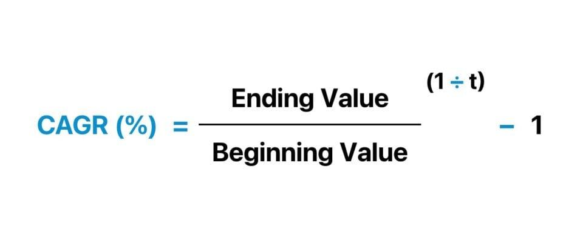

## Table of Contents

## What is the Compound Annual Growth Rate (CAGR)?

The Compound Annual Growth Rate, or CAGR, is a way to figure out how much something grows over time. It's like looking at how much bigger a plant gets each year if it grew at a steady pace. You use CAGR to see the average yearly growth rate of things like investments, businesses, or even populations. It smooths out the ups and downs that might happen from year to year, giving you a clearer picture of growth over several years.

To calculate CAGR, you need to know the starting value, the ending value, and how many years you're looking at. The formula might look a bit tricky, but it's just math that helps you understand growth in a simple way. For example, if you started with $100 and it grew to $200 over 5 years, the CAGR would show you the average yearly growth rate that got you from $100 to $200. It's a handy tool for anyone trying to understand and plan for future growth.

## Why is CAGR important in financial analysis?

CAGR is important in financial analysis because it helps people understand how well an investment or a business has grown over time. It takes all the ups and downs that happen year to year and turns them into a single number that shows the average yearly growth rate. This makes it easier for investors to compare different investments or for business owners to see how their company is doing compared to others. By using CAGR, you get a clearer picture of growth that isn't affected by short-term changes, which is really helpful for making long-term plans.

Another reason CAGR is useful is that it helps set realistic expectations for future growth. If you know the CAGR of an investment over the past few years, you can use that to guess how it might grow in the future. This is important for planning things like retirement savings or business expansion. It also helps in setting goals that are based on actual past performance, rather than just hoping for the best. So, CAGR is a key tool that makes financial analysis more straightforward and helps people make better decisions.

## How does CAGR differ from average annual growth rate?

CAGR and average annual growth rate both help you understand how much something grows each year, but they do it in different ways. CAGR looks at the whole period from start to finish and figures out what the average yearly growth rate would need to be to get from the starting point to the ending point. It smooths out all the ups and downs that might happen along the way, giving you a steady growth rate over the entire time.

On the other hand, the average annual growth rate is simpler. It adds up the growth rates for each year and then divides by the number of years. This means it doesn't smooth things out like CAGR does. If you have a year with a big jump or a big drop, it will affect the average more directly. So, while both methods tell you about yearly growth, CAGR gives you a more consistent picture over time, while the average annual growth rate shows you the average of what actually happened each year.

## What is the formula for calculating CAGR?

The formula for calculating the Compound Annual Growth Rate (CAGR) is: 

\[ \text{CAGR} = \left( \frac{\text{Ending Value}}{\text{Starting Value}} \right)^{\frac{1}{\text{Number of Years}}} - 1 \]

This formula might look complicated, but it's just a way to find out the average yearly growth rate that would take you from the starting value to the ending value over a certain number of years. You start by dividing the ending value by the starting value. Then, you raise that number to the power of one divided by the number of years. Finally, you subtract one from the result to get the CAGR. This helps smooth out any ups and downs that happened along the way, giving you a clear picture of the average growth rate over the whole period.

## Can you provide a step-by-step example of how to calculate CAGR?

Let's say you invested $10,000 in a company and after 5 years, your investment grew to $16,105. To find out the CAGR, you first need to divide the ending value by the starting value. So, you divide $16,105 by $10,000, which gives you 1.6105. Next, you need to raise this number to the power of one divided by the number of years. Since it's been 5 years, you raise 1.6105 to the power of 1/5. That calculation gives you about 1.11.

Now, to get the CAGR, you subtract 1 from this result. So, you take 1.11 and subtract 1, which gives you 0.11. This means the CAGR is 11%. In simple terms, if your investment grew at a steady rate of 11% each year for 5 years, it would go from $10,000 to $16,105. This helps you understand how well your investment did over time, smoothing out any ups and downs along the way.

## What are the key components needed to calculate CAGR?

To calculate the Compound Annual Growth Rate (CAGR), you need three main pieces of information: the starting value, the ending value, and the number of years over which the growth happened. The starting value is the amount you began with, like the initial investment or the value of a business at the start. The ending value is what that amount grew to after a certain period, such as the value of your investment or business at the end of the time you're looking at. The number of years is simply how long it took to go from the starting value to the ending value.

Once you have these three pieces of information, you can use them in the CAGR formula to find out the average yearly growth rate. The formula takes the ending value divided by the starting value, raises that to the power of one divided by the number of years, and then subtracts one from the result. This gives you a single number that shows the steady growth rate over the whole period, smoothing out any ups and downs that might have happened along the way.

## How can CAGR be used to compare investment performance?

CAGR is a helpful tool for comparing how well different investments are doing over time. It gives you a single number that shows the average yearly growth rate, which makes it easy to see which investment has grown more steadily. For example, if you have two investments, one with a CAGR of 8% and another with a CAGR of 5%, you can quickly see that the first investment has been growing faster on average. This helps you decide which investment might be better for your goals, whether you're saving for retirement, buying a house, or just trying to grow your money.

Using CAGR to compare investments also helps you look past short-term ups and downs. Sometimes, an investment might have a great year followed by a bad one, but the CAGR smooths this out and shows you the bigger picture. If you're trying to decide between a stock, a mutual fund, or even different business opportunities, knowing their CAGRs can give you a clearer idea of which one has been growing more consistently over time. This way, you can make choices based on steady growth rather than getting distracted by yearly fluctuations.

## What are the limitations of using CAGR as a performance metric?

Using CAGR to measure how well something is doing can be helpful, but it has some downsides. One big problem is that CAGR doesn't show the ups and downs that happen along the way. It just gives you a smooth average growth rate, which can hide times when things got a lot better or a lot worse. This means you might miss out on important details about how risky an investment is. If you only look at the CAGR, you might think an investment is safer than it really is because it doesn't show you the big drops that could happen.

Another limitation is that CAGR assumes the growth rate stays the same every year, which isn't always true in real life. Things like the economy, new laws, or changes in the market can make growth rates go up and down a lot. If you're using CAGR to guess how an investment will do in the future, you might be surprised if things change more than you expected. Also, CAGR doesn't take into account money you might add or take out of an investment over time, which can make a big difference in how much you end up with. So, while CAGR is a good starting point, it's smart to look at other numbers too to get the full picture.

## How does the frequency of compounding affect CAGR calculations?

The frequency of compounding can change how much your money grows over time, but it doesn't change the CAGR calculation itself. CAGR always looks at the total growth from start to finish and then figures out the average yearly growth rate. So, whether your investment compounds yearly, monthly, or even daily, the CAGR stays the same because it's based on the starting and ending values, not on how often the growth happens in between.

However, understanding how often compounding happens can help you see why an investment might grow to a certain amount. If an investment compounds more often, like monthly instead of yearly, it can lead to a bigger ending value because you're [earning](/wiki/earning-announcement) interest on interest more times each year. Even though the CAGR won't change based on this, knowing about compounding frequency can help you better understand and predict how your investments will grow over time.

## Can CAGR be applied to negative growth rates?

Yes, you can use CAGR to look at negative growth rates. Imagine you start with $100 and after a few years, it's down to $80. Even though your money went down, CAGR can still tell you the average yearly rate at which it dropped. It's like figuring out how much your money shrunk each year on average to get from $100 to $80.

When you calculate CAGR with negative growth, you might end up with a negative number. This just means your investment or whatever you're looking at got smaller over time. It's a helpful way to understand how fast something is losing value, which can be important for things like planning or making decisions about where to put your money.

## How can you adjust the CAGR formula for irregular time periods?

If you want to figure out the CAGR for time periods that aren't whole years, like 2 years and 3 months, you need to change the formula a bit. Instead of using whole years, you use the total time in years, even if it's not a round number. So, if you're looking at 2 years and 3 months, that's 2.25 years. You put this number into the formula where it asks for the number of years.

To do this, you start with the ending value divided by the starting value, just like before. Then, you raise that number to the power of one divided by the total time in years, which could be a number like 2.25 if you're looking at 2 years and 3 months. After that, you subtract one to get your CAGR. This way, you can still get a good idea of the average yearly growth rate, even if the time you're looking at isn't a whole number of years.

## What advanced techniques can be used to enhance the accuracy of CAGR calculations in complex scenarios?

When dealing with complex scenarios, one advanced technique to enhance the accuracy of CAGR calculations is to account for additional cash flows. If you're looking at an investment where you added or took out money over time, you need to adjust your starting and ending values to reflect these changes. For example, if you added more money to your investment halfway through, you'd need to calculate the CAGR in a way that considers this extra money. This can be done by breaking down the period into smaller parts, calculating the growth for each part, and then finding an overall CAGR that takes into account all the changes.

Another technique is to use more detailed data to calculate the CAGR. Instead of just using the starting and ending values, you can look at the value of your investment at multiple points in time. This can help you better understand the growth pattern and adjust your calculations to be more accurate. For example, if you have monthly data, you can calculate the monthly growth rates and then convert these into an annual rate. This approach can give you a clearer picture of how your investment is doing, especially if it has a lot of ups and downs. By using these advanced techniques, you can make your CAGR calculations more precise and useful for understanding growth in complex situations.

## What is the Understanding of Compound Annual Growth Rate (CAGR)?

The Compound Annual Growth Rate (CAGR) is a financial metric that provides a smoothed annual rate of growth over a specified time frame. This metric assumes that profits generated over the investment period are re-invested at the end of each interval, which presents a consistent rate of return. CAGR is particularly valuable because it allows for a normalized comparison of growth rates across different investments, regardless of their volatility over time.

Mathematically, the CAGR can be expressed with the formula:

$$

\text{CAGR} = \left( \frac{\text{Ending Value}}{\text{Beginning Value}} \right)^{\frac{1}{n}} - 1 
$$

where $n$ represents the number of years. This formula provides a geometric mean annual growth rate, which smooths out the effects of volatility during the period under consideration.

CAGR is preferred for its ability to distill a comprehensive portrayal of investment performance into a single annual growth metric. This single figure can be particularly helpful when comparing the historical performance of different investments, as it provides a consistent measure unaffected by the varying lengths of investment periods or erratic returns within those periods.

Though CAGR offers a simplified growth rate calculation, it is essential to recognize that it does not reflect interim [volatility](/wiki/volatility-trading-strategies) or potential risks associated with the investment. Therefore, while CAGR is widely used for its ease of interpretation and comparative power, investors often consider it alongside other metrics for a nuanced evaluation of an investment's performance.

## How do you calculate CAGR?

The Compound Annual Growth Rate (CAGR) is a widely utilized financial metric that provides the annual growth rate of an investment over a specified time frame, assuming that profits are reinvested at the end of each period. The formula for calculating CAGR is as follows:

$$
\text{CAGR} = \left( \frac{\text{Ending Value}}{\text{Beginning Value}} \right)^{\frac{1}{n}} - 1
$$

Where:
- **Ending Value** is the value of the investment at the end of the period.
- **Beginning Value** is the value at the beginning of the period.
- $n$ is the total number of years.

The process for calculating CAGR can be broken down into several clear steps:

1. **Determine the Values**: Identify the beginning and ending values of the investment for the period in question.

2. **Calculate the Growth Factor**: Divide the ending value by the beginning value. This yields the growth over the entire period.

3. **Annualize the Growth**: Raise the resulting growth factor to the power of $\frac{1}{n}$, where $n$ is the number of years. This step annualizes the growth factor, providing an average yearly growth rate.

4. **Convert to a Percentage**: Subtract one from the result obtained in the previous step to convert the growth factor into a growth rate. Finally, multiply by 100 to express this rate as a percentage.

The advantage of CAGR lies in its ability to smooth out the fluctuations and volatility in performance over several periods, providing a more straightforward interpretation of average growth. This simplification is beneficial for investors seeking a singular, clear metric to assess the historical performance of investments or to make comparisons across different investment opportunities.

For practical implementation, consider using Python to calculate CAGR:

```python
def calculate_cagr(beginning_value, ending_value, years):
    """Calculate the Compound Annual Growth Rate (CAGR)"""
    if beginning_value <= 0 or ending_value <= 0 or years <= 0:
        raise ValueError("Values must be positive and non-zero")
    growth_factor = ending_value / beginning_value
    cagr = (growth_factor ** (1 / years)) - 1
    return cagr * 100

# Example usage:
beginning_value = 1000
ending_value = 2000
years = 5
cagr = calculate_cagr(beginning_value, ending_value, years)
print(f"The CAGR is {cagr:.2f}%")
```

In this example, the function calculates the CAGR and outputs it as a percentage, efficiently handling the mathematical operations involved in the process.

## What is the role of CAGR in financial calculations?

The Compound Annual Growth Rate (CAGR) serves as a fundamental tool for investors seeking to evaluate the historical performance of investments and to forecast potential future profits. By calculating the average annual growth rate, CAGR provides investors with a clear and straightforward understanding of how an investment has performed over a specific period under the assumption of steady conditions.

CAGR is essential because it offers a smoothed rate of return that mitigates the effects of volatile annual performance. This is especially helpful when comparing multiple investments that ideally retain their growth over an extended period. The formula for CAGR is expressed as follows:

$$
\text{CAGR} = \left( \frac{\text{Ending Value}}{\text{Beginning Value}} \right)^{\frac{1}{n}} - 1
$$

Here, "Ending Value" represents the final value of the investment, "Beginning Value" is the initial investment amount, and $n$ is the number of years over which the investment is held. This formula assumes that any profits are reinvested, allowing CAGR to reflect a compounded growth scenario.

CAGR aids investors not only in evaluating past returns but also in making informed estimates about future earnings by extrapolating the average growth pattern. By translating this information into projected future growth, investors can set realistic profit expectations and development goals.

For example, if an investment grew from $10,000 to $20,000 over four years, the CAGR would be calculated as:

```python
beginning_value = 10000
ending_value = 20000
years = 4

cagr = (ending_value / beginning_value)**(1 / years) - 1
cagr_percentage = cagr * 100
cagr_percentage
```

This Python code snippet calculates a CAGR of approximately 18.92%, indicating that the investment grew on average by 18.92% per year over the four years.

While CAGR is extraordinarily useful, it is important for investors to consider it alongside other performance metrics. CAGR does not account for variations in currency exchange rates, risk factors, or annual volatility, and thus should be interpreted within the broader context of an investor's portfolio strategy. Nonetheless, as part of a holistic analytical approach, CAGR remains a pivotal component in financial calculations and strategic investment planning.

## What is Understanding Compound Growth?

Compound growth is a concept that refers to the increase in an investment's value over time, with the profits earned at each stage being reinvested to generate additional earnings. This method leverages the principle of compound interest, which allows the principal amount to grow exponentially rather than linearly. As a result, compound growth plays a critical role in wealth accumulation strategies, highlighting the potential for exponential growth when returns are consistently reinvested.

The formula to calculate compound growth can be expressed as:

$$

FV = PV \times (1 + r)^n 
$$

Where:
- $FV$ is the future value of the investment.
- $PV$ is the present value or initial investment amount.
- $r$ is the annual growth rate or return on investment.
- $n$ is the number of compounding periods (usually in years).

This formula illustrates how repeated reinvestment of returns leads to an acceleration in the growth of the initial investment over time. The essence of compound growth is aptly summarized by Albert Einstein's famous quote: "Compound interest is the eighth wonder of the world. He who understands it, earns it; he who doesn’t, pays it."

The Compound Annual Growth Rate (CAGR) is a metric closely linked to compound growth. It represents the mean annual growth rate of an investment over a specified time period, assuming that the investment grows at a constant rate. CAGR provides a smoothed annual growth rate, facilitating the comparison of growth rates across different investments by eliminating the effects of volatility and variability. 

To calculate CAGR, the following formula is used:

$$

CAGR = \left(\frac{EV}{BV}\right)^{\frac{1}{n}} - 1
$$

Where:
- $EV$ is the ending value of the investment.
- $BV$ is the beginning value of the investment.
- $n$ is the duration of the investment in years.

The close relationship between CAGR and compound growth highlights the utility of CAGR in offering a clear and concise view of how an investment's value may grow annually under stable conditions, thereby smoothing out the variations that come with market fluctuations. This makes CAGR an indispensable tool for investors looking to understand compound growth in a practical, real-world setting.

## What is the role of CAGR in Algorithmic Trading?

In [algorithmic trading](/wiki/algorithmic-trading), the Compound Annual Growth Rate (CAGR) is a pivotal metric for assessing and comparing the performance of diverse trading strategies. By providing an annualized growth rate, CAGR simplifies the evaluation of strategies over multiple periods, facilitating traders to establish realistic performance benchmarks. This metric helps in aligning trading strategies with historical data, ensuring that the growth observed is consistent over time and is not skewed by short-term fluctuations.

CAGR is particularly useful in algorithmic trading as it provides a smoothed depiction of returns, making it easier to compare the effectiveness of different algorithms over a specific period. Using CAGR, traders can precisely measure the average rate at which their capital has grown yearly, enabling them to make data-driven decisions about which strategies to enhance or discard. Moreover, CAGR serves as a gauge for [backtesting](/wiki/backtesting) performance, allowing traders to assess the viability of trading algorithms based on historical data.

For example, suppose a trader is analyzing two algorithmic trading strategies based on historical performance. By calculating the CAGR for each strategy, the trader can objectively determine which strategy yielded better long-term returns. The formula for CAGR is as follows:

$$
\text{CAGR} = \left( \frac{\text{Ending Value}}{\text{Beginning Value}} \right)^{\frac{1}{n}} - 1
$$

where $n$ is the number of years.

Integrating Python can further streamline the calculation of CAGR in algorithmic trading:

```python
def calculate_cagr(beginning_value, ending_value, years):
    return (ending_value / beginning_value) ** (1 / years) - 1

# Example usage
beginning_value = 1000
ending_value = 2500
years = 5

cagr = calculate_cagr(beginning_value, ending_value, years)
print(f"CAGR: {cagr * 100:.2f}%")
```

This code block efficiently calculates CAGR, offering traders an automated solution to incorporate this metric into their strategy evaluation toolkit. By utilizing CAGR, traders ensure that they are not misled by erratic short-term results but are instead focusing on strategies that have demonstrated sustainable growth over time.

## How can CAGR be integrated with other metrics?

To gauge a comprehensive view of an investment's performance, integrating CAGR (Compound Annual Growth Rate) with other financial metrics is critical. CAGR alone, while useful, does not capture the complexities of market dynamics, risk, or portfolio characteristics. By considering additional metrics such as volatility, maximum drawdown, and the Sharpe ratio, investors can better understand the risk-adjusted returns and stability of their investments.

Volatility is a statistical measure of the [dispersion](/wiki/dispersion-trading) of returns for a given security or market index, often measured by standard deviation. High volatility indicates a higher level of risk, as the investment's price can change dramatically over a short time in either direction. When combined with CAGR, volatility can provide insights into how reliably an investment achieves its growth. For instance, an investment with a high CAGR but also high volatility might not be as attractive to risk-averse investors.

Maximum drawdown represents the maximum observed loss from a peak to a trough of a portfolio, before a new peak is attained. This metric is essential for understanding the potential downside risk. Investors often look at both CAGR and maximum drawdown to ascertain not only the average annual return but also the worst-case scenario. A high CAGR paired with a significant maximum drawdown may indicate potential for high returns but also high risk.

The Sharpe ratio is a measure that indicates the average return earned in excess of the risk-free rate per unit of volatility or total risk. It provides a risk-adjusted measure of return. The formula for the Sharpe ratio is:

$$
\text{Sharpe Ratio} = \frac{E[R_a - R_f]}{\sigma_a}
$$

where $E[R_a - R_f]$ is the expected return of the investment minus the risk-free rate, and $\sigma_a$ is the standard deviation of the excess return. By using the Sharpe ratio alongside CAGR, investors can identify investments that provide the best return for the least amount of risk.

Python Example:

```python
import numpy as np

# Example returns of investment
returns = np.array([0.05, 0.10, 0.02, -0.03, 0.08])

# CAGR Calculation
beginning_value = 100
ending_value = beginning_value * np.prod(1 + returns)
years = len(returns)
cagr = (ending_value / beginning_value) ** (1 / years) - 1

# Volatility Calculation
volatility = np.std(returns)

# Maximum Drawdown Calculation
cumulative_returns = np.cumprod(1 + returns)
drawdown = cumulative_returns / np.maximum.accumulate(cumulative_returns) - 1
max_drawdown = np.min(drawdown)

# Sharpe Ratio Calculation (Assuming 2% risk-free rate)
risk_free_rate = 0.02
excess_returns = returns - risk_free_rate / 12  # converting annual rate to monthly
sharpe_ratio = np.mean(excess_returns) / np.std(excess_returns)

print(f"CAGR: {cagr:.2%}, Volatility: {volatility:.2%}, Maximum Drawdown: {max_drawdown:.2%}, Sharpe Ratio: {sharpe_ratio:.2f}")
```

Integrating these metrics allows investors to make more informed decisions by not only considering potential growth, as indicated by CAGR, but also evaluating the associated risk and volatility to align with their financial goals and risk tolerance.

## References & Further Reading

[1]: Damodaran, A. (2012). ["Investment Valuation: Tools and Techniques for Determining the Value of Any Asset"](https://books.google.com/books/about/Investment_Valuation.html?id=5SRHAAAAQBAJ). Wiley Finance.

[2]: Bodie, Z., Kane, A., & Marcus, A. J. (2013). ["Investments"](https://www.mheducation.com/highered/product/investments-bodie-kane/M9781264412662.html). McGraw-Hill Education.

[3]: Graham, B. (2003). ["The Intelligent Investor: The Definitive Book on Value Investing."](https://www.amazon.com/Intelligent-Investor-Definitive-Investing-Essentials/dp/0060555661) Harper Business.

[4]: Murphy, J. J. (1999). ["Technical Analysis of the Financial Markets: A Comprehensive Guide to Trading Methods and Applications"](https://archive.org/details/technicalanalysi0000murp). New York Institute of Finance.

[5]: DeFusco, R. A., McLeavey, D. W., Pinto, J. E., & Runkle, D. E. (2007). ["Quantitative Investment Analysis"](https://books.google.com/books/about/Quantitative_Investment_Analysis.html?id=0S_dCQAAQBAJ). CFA Institute Investment Series.

[6]: Lopez de Prado, M. (2018). ["Advances in Financial Machine Learning"](https://www.amazon.com/Advances-Financial-Machine-Learning-Marcos/dp/1119482089). Wiley.

[7]: Chan, E. P. (2009). ["Quantitative Trading: How to Build Your Own Algorithmic Trading Business"](https://github.com/ftvision/quant_trading_echan_book). Wiley Trading.

[8]: Fabozzi, F. J., Focardi, S. M., & Jonas, C. (2010). ["Quantitative Equity Investing: Techniques and Strategies"](https://www.semanticscholar.org/paper/Quantitative-Equity-Investing%3A-Techniques-and-Fabozzi-Focardi/1c49a2a53919f7e65cb96f16691b8ff726fd3cd7). Wiley.