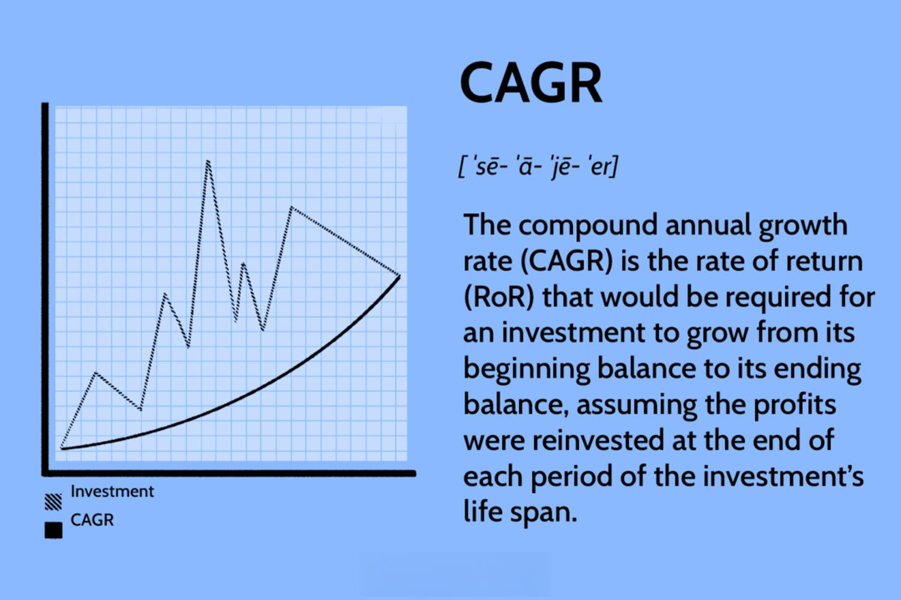

## Table of Contents

## What is the Compound Annual Growth Rate (CAGR)?

The Compound Annual Growth Rate, or CAGR, is a way to measure how much an investment grows over time. It shows the average rate of return per year, as if the investment grew at a steady pace. This helps people understand the growth of their money over several years in a simple way. Instead of looking at the ups and downs of the investment each year, CAGR gives a single number that makes it easier to compare different investments.

To calculate CAGR, you need to know the starting value of the investment, the ending value, and the number of years the investment was held. The formula for CAGR is a bit tricky, but it basically works out the steady rate that would get you from the starting value to the ending value over the given time. For example, if you invested $1,000 and it grew to $1,200 in two years, the CAGR would tell you the average yearly growth rate that made that happen. This is useful for planning and making decisions about future investments.

## How is CAGR calculated?

To find the Compound Annual Growth Rate (CAGR), you need to know three things: the starting value of your investment, the ending value, and how many years you held the investment. The formula to calculate CAGR looks a bit complicated, but it's really just a way to figure out the steady growth rate that would get you from your starting point to your ending point over those years. The formula is: CAGR = (Ending Value / Starting Value)^(1 / Number of Years) - 1. You raise the ratio of the ending value to the starting value to the power of one over the number of years, and then subtract one from the result.

Let's say you started with $1,000 and after 3 years, your investment grew to $1,331. To find the CAGR, you would do the following: First, divide the ending value ($1,331) by the starting value ($1,000), which gives you 1.331. Then, raise 1.331 to the power of one-third (because it's over 3 years), which equals about 1.1. Finally, subtract 1 from 1.1, and you get 0.1, or 10%. This means your investment grew at an average rate of 10% per year. Using CAGR helps you understand the overall growth of your investment in a simple, easy-to-understand way.

## Why is CAGR important for investors?

CAGR is important for investors because it helps them understand how well their investments are doing over time. It gives a single number that shows the average yearly growth rate of an investment, making it easier to see if the investment is doing well or not. Instead of looking at the ups and downs of the investment each year, investors can use CAGR to get a clear picture of the overall growth. This helps them compare different investments and make better decisions about where to put their money.

Another reason CAGR is helpful is that it takes out the confusion of yearly changes. Investments can go up and down a lot from year to year, which can make it hard to understand how they're doing overall. By using CAGR, investors can see the steady growth rate that would have gotten them from their starting point to their ending point. This makes it simpler to plan for the future and set realistic goals for their investments.

## Can you provide a simple example of how to calculate CAGR?

Imagine you invested $1,000 in a savings account, and after 2 years, your money grew to $1,200. To find the Compound Annual Growth Rate (CAGR), you need to use a special formula. First, you divide the ending value ($1,200) by the starting value ($1,000), which gives you 1.2. Then, you raise 1.2 to the power of one over the number of years, which is 1/2 because it's over 2 years. That calculation looks like this: 1.2^(1/2), which equals about 1.095. Finally, you subtract 1 from 1.095, and you get 0.095, or 9.5%. This means your investment grew at an average rate of 9.5% per year.

Using CAGR helps you understand how well your investment did over time in a simple way. It smooths out the ups and downs of the investment and gives you one number that shows the steady growth rate. This is useful because it makes it easier to compare different investments and plan for the future. If you know the CAGR, you can see if your investment is doing better or worse than other options and decide where to put your money next.

## How does CAGR differ from average annual growth rate?

CAGR and average annual growth rate both help you understand how an investment grows over time, but they do it in different ways. CAGR, or Compound Annual Growth Rate, shows the steady rate at which an investment would have grown to reach its ending value from its starting value. It takes into account the effect of compounding, which means the growth builds on itself each year. This makes CAGR a good way to see the overall growth of an investment, smoothing out the ups and downs that happen year to year.

On the other hand, the average annual growth rate is simpler. It's just the total growth of the investment divided by the number of years. This method doesn't consider compounding, so it treats each year's growth the same, no matter when it happened. Because of this, the average annual growth rate can be misleading if the investment had big changes from year to year. CAGR gives a more accurate picture of the investment's growth because it reflects the real effect of compounding over time.

## What are the limitations of using CAGR?

One limitation of using CAGR is that it doesn't show the ups and downs of an investment. It gives you a single number that makes it seem like the investment grew at a steady pace, but in real life, investments can go up and down a lot. This can be a problem if you want to know how risky an investment is. If you only look at the CAGR, you might think an investment is safer than it really is because it doesn't show those big changes.

Another limitation is that CAGR assumes you keep all your money in the investment the whole time. But sometimes, people might take money out or add more money to their investment. If you do this, the CAGR won't be accurate because it doesn't take these changes into account. It's like trying to measure how fast a car is going without knowing if it stopped or sped up along the way. So, while CAGR is helpful for understanding overall growth, it doesn't tell the whole story of an investment's journey.

## How can CAGR be used to compare investment options?

CAGR can help you compare different investments by giving you a single number that shows how well each one did over time. Imagine you have two savings accounts: one grew from $1,000 to $1,200 in two years, and the other grew from $1,000 to $1,300 in the same time. If you calculate the CAGR for both, you can see which one grew faster on average each year. This makes it easier to decide which investment was better because you can compare them using the same measure.

However, remember that CAGR has its limits. It doesn't show the ups and downs of the investments, so you might miss how risky they are. Also, if you added or took out money from your investments during that time, the CAGR might not give you the full picture. So while CAGR is a useful tool for comparing investments, it's important to look at other things too, like how much the investment went up and down and any changes you made to it.

## What role does time period play in calculating CAGR?

The time period is really important when you're calculating the Compound Annual Growth Rate (CAGR). It's one of the three things you need to know, along with the starting value and the ending value of your investment. The time period tells you how many years the investment was growing, which is used in the formula to figure out the average yearly growth rate. If you change the time period, the CAGR will be different, even if the starting and ending values stay the same. For example, if an investment grew from $1,000 to $1,200 in two years, the CAGR would be different than if it took four years to get to $1,200.

Using the right time period is important because it helps you understand how fast your investment is growing on average each year. If you use a shorter time period, the CAGR might look higher because the growth seems faster. But if you use a longer time period, the CAGR might look lower because the growth is spread out over more years. So, when you're comparing different investments or trying to plan for the future, make sure you're using the same time period for all of them. This way, you can get a fair comparison and make better decisions about where to put your money.

## How does compounding frequency affect CAGR?

Compounding frequency is how often the interest or earnings on an investment are added to the investment. This can happen yearly, monthly, daily, or even more often. When you calculate the Compound Annual Growth Rate (CAGR), you usually assume the compounding happens once a year. But if the compounding happens more often, like monthly or daily, the investment can grow faster because the earnings are added back into the investment more often. This means the actual growth rate could be higher than what the CAGR shows if you're using yearly compounding.

For example, if you have $1,000 and it grows to $1,200 in two years with monthly compounding, the real growth rate might be higher than if you calculated the CAGR assuming yearly compounding. The more often the compounding happens, the more the investment can grow because each time the earnings are added, they start earning more money too. So, when you're looking at investments, it's good to know how often the compounding happens because it can make a big difference in how much your money grows over time.

## Can CAGR be applied to negative growth rates?

Yes, you can use CAGR to figure out how much an investment shrank over time if it had negative growth. If your investment went down instead of up, you can still use the same formula to find out the average yearly rate at which it lost value. You just have to be careful because the numbers will be negative, which means the investment got smaller each year on average.

For example, if you started with $1,000 and it went down to $800 in two years, you can use the CAGR formula to see how much it shrank each year. Even though the numbers are negative, the formula still works the same way. It helps you understand how fast your investment was losing value, which can be useful if you want to compare it to other investments or figure out what went wrong.

## How do you interpret a high or low CAGR?

When you see a high CAGR, it means your investment grew a lot each year on average. This is good news because it shows your money was making more money at a fast rate. For example, if the CAGR is 20%, your investment was growing by about 20% every year. This could mean you picked a good investment or that the market was doing well. But remember, a high CAGR doesn't tell you everything. It doesn't show if the investment had big ups and downs along the way, so it's important to look at other things too.

On the other hand, a low CAGR means your investment didn't grow much each year. If the CAGR is only 2%, it means your money was growing very slowly. This might happen if the investment wasn't doing well or if the market was not doing great. A low CAGR can help you see that maybe you should look for a better place to put your money. But just like with a high CAGR, you need to think about the whole picture, not just this one number.

## What advanced applications of CAGR exist in financial analysis?

In financial analysis, CAGR can be used to look at how well a company is doing over time. Analysts might use it to see how much a company's revenue, earnings, or stock price grew each year. This helps them understand if the company is growing steadily or if it's having a hard time. By comparing the CAGR of different companies, analysts can figure out which ones are doing better and might be good investments. They can also use it to predict how much a company might grow in the future, which is helpful for making investment decisions.

Another advanced use of CAGR is in portfolio management. Investors and fund managers use it to see how their whole set of investments is doing over time. They might calculate the CAGR for different parts of their portfolio, like stocks, bonds, or real estate, to see which ones are growing the fastest. This helps them decide where to put more money or where to take it out. By looking at the CAGR, they can also see if their investment strategy is working well or if they need to change it to get better results.

## What is the Understanding of Compound Annual Growth Rate (CAGR)?

The Compound Annual Growth Rate (CAGR) is a vital financial metric used to measure the mean annual growth rate of an investment over a period longer than one year. It is particularly beneficial as it provides a smoothed rate of return, offering a clear picture of growth by mitigating the impact of volatility experienced in periodic gains and losses.

Mathematically, CAGR is expressed using the formula:

$$
\text{CAGR} = \left( \frac{\text{Ending Value}}{\text{Beginning Value}} \right)^{\frac{1}{n}} - 1
$$

where $n$ represents the number of years. This formula assists investors in discerning the amount gained or lost during the investment period by calculating what the rate would be if the investment grew steadily at the same rate each year. 

The significance of CAGR lies in its ability to accurately pinpoint the growth rate of different investments, making it a crucial tool for comparing the historical performance of various portfolios or projecting future growth rates. Unlike simple arithmetic methods that might exaggerate growth due to temporary spikes or declines, CAGR provides a consistent annual return rate. 

For individuals looking to assess the performance of equities, mutual funds, or other investment vehicles, CAGR serves as a reliable benchmark. By normalizing the growth rates over time, it enables investors to evaluate different avenues based on actual performance, bridging the gap between the initial and final investment values efficiently. 

Its simplicity ensures that even those new to financial markets can grasp the long-term growth trajectory of their investments without being misled by short-term market fluctuations. As such, understanding and utilizing CAGR becomes indispensable for optimizing an investment strategy tailored to personal or professional financial goals.

## References & Further Reading

[1]: ["Advances in Financial Machine Learning"](https://www.amazon.com/Advances-Financial-Machine-Learning-Marcos/dp/1119482089) by Marcos Lopez de Prado

[2]: ["Evidence-Based Technical Analysis: Applying the Scientific Method and Statistical Inference to Trading Signals"](https://www.amazon.com/Evidence-Based-Technical-Analysis-Scientific-Statistical/dp/0470008741) by David Aronson

[3]: ["Machine Learning for Algorithmic Trading"](https://github.com/stefan-jansen/machine-learning-for-trading) by Stefan Jansen

[4]: ["Quantitative Trading: How to Build Your Own Algorithmic Trading Business"](https://www.amazon.com/Quantitative-Trading-Build-Algorithmic-Business/dp/1119800064) by Ernest P. Chan

[5]: Bodie, Z., Kane, A., & Marcus, A. J. (2014). ["Investments"](https://www.mheducation.com/highered/product/Investments-Bodie.html). McGraw-Hill Education.

[6]: Fernholz, R. (2017). ["Stochastic Portfolio Theory"](https://www.academia.edu/109524444/Stochastic_Portfolio_Theory). Springer.