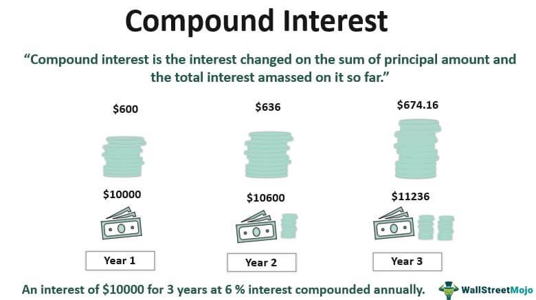

Understanding the mechanics of interest calculation is fundamental in personal finance and investment. Interest calculations, particularly compound interest, play a crucial role in determining the growth potential of savings and investments. This article will explore various financial formulas, with a specific focus on compound interest. Compound interest is a powerful concept whereby earned interest is reinvested to generate additional earnings. This process results in exponential financial growth as the accumulated interest from previous periods starts to earn interest on its own.

By leveraging compound interest, individuals can maximize the growth of their investments and savings over time. This is achieved through the reinvestment of earnings, allowing for exponential growth rather than merely linear increases. The concept can be illustrated with the formula for compound interest:



$$
A = P \left(1 + \frac{r}{n}\right)^{nt}
$$

Where:
- $A$ is the amount of money accumulated after n years, including interest.
- $P$ is the principal amount (initial investment).
- $r$ is the annual interest rate (decimal).
- $n$ is the number of times the interest is compounded per year.
- $t$ is the time the money is invested or borrowed for, in years.

In addition to its application in personal finance, compound interest principles are highly applicable to algorithmic trading, where reinvestment strategies are employed to amplify trading returns. Algorithmic trading utilizes computer algorithms to optimize trading strategies, and when combined with compound interest methods, it can significantly enhance portfolio growth.

The goal of this article is to equip both novice and experienced investors with a comprehensive guide to harness the power of compounding. Understanding these principles allows individuals to make informed financial decisions, maximize their savings potential, and optimize trading strategies for improved investment outcomes. By utilizing compound interest effectively, investors can unlock significant growth opportunities in their financial pursuits.

## Table of Contents

## What is Compounding?

Compounding is a fundamental financial principle whereby earnings from an investment are reinvested in order to generate additional income. This creates a virtuous cycle where not only the initial principal but also the accumulated interest or dividends earn more over time. This mechanism is described mathematically as exponential or geometric growth, distinguishing it from linear growth models which do not accumulate interest on the interest itself.

The essence of compounding can be captured through the contrast between simple and compound interest. Simple interest is calculated on the principal amount alone, using the formula:

$$
\text{Simple Interest} = P \times r \times t
$$

where $P$ is the principal, $r$ is the annual interest rate, and $t$ is the time in years.

In contrast, compound interest is calculated on the initial principal and also on the accumulated interest from previous periods, leading to an exponential growth pattern. The formula for compound interest is:

$$
A = P \left(1 + \frac{r}{n}\right)^{nt}
$$

where $A$ is the future value of the investment, $P$ is the principal investment amount, $r$ is the annual interest rate, $n$ is the number of times interest is compounded per year, and $t$ is the time the money is invested for in years. This compounding effect means that the more frequently interest is compounded, the greater the amount of compound interest will accrue.

To illustrate, consider an example where $1,000 is invested at a 5% annual [interest rate](/wiki/interest-rate-trading-strategies). With simple interest over 5 years, the total would be:

$$
\text{Simple Interest Total} = 1000 \times 0.05 \times 5 = \$250
$$
$$
\text{Final Amount} = 1000 + 250 = \$1250
$$

Conversely, if the interest is compounded annually, the calculation would be:

$$
A = 1000 \left(1 + \frac{0.05}{1}\right)^{1 \times 5} = 1000 \times 1.27628 = \$1276.28
$$

The additional $26.28 reflects the benefit of compounding. If compounded quarterly or monthly, the amount earned would be higher due to more frequent compounding.

The ability to magnify returns through compounding has vast implications in both wealth accumulation and debt management. For savings, reinvesting dividends or interest payments, and maintaining consistent contributions can significantly enhance growth over time. Conversely, in debt scenarios, failure to manage compounding interest can lead to mounting costs due to interest-on-interest effects, necessitating careful planning and periodic repayments to mitigate potential financial strain.

Compounding's ability to exponentially increase savings or costs underscores its critical importance in financial strategies, offering individuals and businesses alike powerful tools to optimize growth and manage liabilities efficiently.

## Compound Interest Financial Formulas

Compound interest is a cornerstone concept in finance, enabling investors and borrowers to predict future value growth or debt accumulation. The fundamental formula for calculating the future value (FV) of an investment or loan subject to compound interest can be represented mathematically as:

$$

FV = PV \times \left(1 + \frac{r}{n}\right)^{nt} 
$$

Where:
- $PV$ is the present value or initial amount of money.
- $r$ is the annual nominal interest rate (expressed as a decimal).
- $n$ is the number of compounding periods per year.
- $t$ is the time in years.

### Components Explanation

1. **Present Value (PV):** This is the initial principal or the current value of an amount that will grow over time through compounding.

2. **Interest Rate (r):** The nominal interest rate is the percentage at which the invested or borrowed sum grows annually. It is crucial to express this rate as a decimal when using the formula.

3. **Compounding Periods (n):** This refers to how often the compounding occurs within a year. Common compounding frequencies include annually ($n = 1$), semi-annually ($n = 2$), quarterly ($n = 4$), monthly ($n = 12$), and daily ($n = 365$).

4. **Time (t):** The duration over which the money is invested or borrowed, typically in years.

### Illustrative Examples

To demonstrate the impact of compounding frequencies, consider an investment of $1,000 at an annual interest rate of 5%.

- **Annual Compounding:** $n = 1$, for 5 years:
$$
  FV = 1000 \times \left(1 + \frac{0.05}{1}\right)^{1 \times 5} = 1000 \times 1.2763 = 1276.28

$$

- **Quarterly Compounding:** $n = 4$, for 5 years:
$$
  FV = 1000 \times \left(1 + \frac{0.05}{4}\right)^{4 \times 5} = 1000 \times 1.2837 = 1283.68

$$

- **Monthly Compounding:** $n = 12$, for 5 years:
$$
  FV = 1000 \times \left(1 + \frac{0.05}{12}\right)^{12 \times 5} = 1000 \times 1.2837 = 1283.68

$$

As shown, the more frequent the compounding, the greater the future value due to interest-on-interest effects.

### Continuous Compounding

Continuous compounding assumes interest is compounded an infinite number of times in a year, leading to the formula:

$$

FV = PV \times e^{rt} 
$$

Where $e$ is the base of the natural logarithm (approximately equal to 2.71828).

For the same investment example with continuous compounding:

$$

FV = 1000 \times e^{0.05 \times 5} = 1000 \times 1.2840 = 1284.03 
$$

Continuous compounding results in the highest future value, albeit by a small margin compared to frequent discrete compounding frequencies.

Understanding these formulas and their implications allows investors and borrowers to make informed decisions, optimizing strategies based on desired outcomes and compounding scenarios. The differences in future value calculations highlight the importance of factoring in the compounding frequency when assessing investment growth or debt accumulation strategies.

## Compounding in Savings and Debt Management

Compounding plays a critical role in accelerating the growth of savings by reinvesting earnings to generate additional income. This reinvestment can significantly augment the original capital over time. One prominent strategy is the use of dividend reinvestment plans (DRIPs). These plans allow investors to automatically use dividends to purchase additional shares, thereby increasing their investment's overall stock position without incurring transaction fees. Regular contributions further bolster savings accounts. By consistently adding funds, an investor benefits from compound growth on both the principal and the reinvested earnings.

In contrast, debt management can become challenging when compounding works against a borrower. Interest on debt compounds over time, potentially elevating the total repayment amount if not carefully managed. For instance, credit card debt, with its typically high interest rates, can grow rapidly due to frequent compounding periods, typically daily or monthly. To mitigate this, refinancing options may offer relief by reducing interest rates or extending payment terms, thus lowering periodic repayments. Additionally, making extra payments towards the principal can effectively curtail interest charges and accelerate the payoff schedule, minimizing the impact of compounding on the total cost of debt. 

In summary, harnessing the power of compounding can significantly benefit savings growth, while in debt management, it requires strategic handling to avoid increased financial burdens.

## Algorithmic Trading and Compound Interest

Algorithmic trading, often referred to as algo trading, employs sophisticated mathematical models and computer algorithms to execute trades based on defined criteria, removing emotional bias from the process. This technology-driven approach enables traders to capitalize on market opportunities efficiently. A key aspect of maximizing returns in [algorithmic trading](/wiki/algorithmic-trading) is the application of compound interest principles, where profits are reinvested to generate additional earnings, often compounding the growth of a portfolio.

### Incorporation of Compound Interest in Algorithmic Trading

Compounding in algorithmic trading can be effectively utilized through reinvestment strategies. By automatically reinvesting profits back into the portfolio, traders can achieve exponential growth over time. The formula for compound interest, $A = P \left(1 + \frac{r}{n}\right)^{nt}$, is central to these strategies, where:
- $A$ is the future value of the investment,
- $P$ is the principal amount (initial investment),
- $r$ is the annual interest rate (expressed as a decimal),
- $n$ is the number of times that interest is compounded per year,
- $t$ is the time in years.

Algorithmic systems can automate the reinvestment process, allowing for compounding to occur at optimal intervals based on trading results and prevailing market conditions.

### Leveraged Trading and Compounding

Leveraged trading, a strategy often employed in algorithmic trading, allows traders to open larger positions by borrowing additional funds. This approach can amplify the effects of compounding, as gains are magnified. For instance, if an algorithmically managed portfolio uses leverage to double its exposure, the potential returns—and risks—are also doubled. 

However, while leverage can enhance returns, it can also lead to significant losses if not managed properly. The combination of leverage with compounding necessitates robust risk management practices to ensure that potential losses do not outweigh the benefits of increased capital exposure.

### Risk Management in Algorithmic Trading

Risk management is paramount in algorithmic trading, especially when utilizing compound interest and leverage. Effective risk management strategies include setting stop-loss orders, diversifying trading portfolios, and establishing strict leverage limits. Algorithms can be designed to include these risk management protocols, enabling the system to automatically adjust trading behavior in response to market fluctuations.

For example, a Python implementation might involve setting a maximum permissible loss percentage, upon reaching which the algorithm automatically closes positions or reduces exposure:

```python
def risk_management(portfolio_value, max_loss_pct):
    for position in portfolio:
        if position.current_loss() / portfolio_value > max_loss_pct:
            close_position(position)

portfolio_value = calculate_portfolio_value()
max_loss_pct = 0.02  # Example: 2% maximum loss allowed
risk_management(portfolio_value, max_loss_pct)
```

By embedding such precautions within trading algorithms, traders can manage potential downsides and safeguard against excessive losses, allowing the benefits of compound growth to be realized over time. The integration of compound interest in algorithmic trading not only enhances potential returns but also underscores the importance of meticulous risk management to protect investment capital.

## Practical Tools for Interest Calculation and Algo Trading

Modern technologies have significantly transformed the landscape of interest calculation and algorithmic trading. Tools such as MetaTrader, Microsoft Excel, and programming languages like Python offer a range of capabilities that make it easier to implement sophisticated financial strategies.

MetaTrader is a widely-used platform that supports automated trading through its Expert Advisors (EA). EAs are programs that run within the MetaTrader environment and execute trades automatically based on pre-defined criteria. This automation is particularly useful for leveraging compound interest in trading by allowing earnings to be reinvested efficiently. By utilizing EAs, traders can optimize their strategies to compound profits over time without manual intervention. MetaTrader's platform supports [backtesting](/wiki/backtesting), enabling traders to test their EAs using historical data, thereby refining strategies to maximize growth.

Microsoft Excel is another powerful tool for financial calculations. It comes equipped with numerous financial functions that facilitate the computation of compound interest. For example, the formula to calculate the future value of an investment with compound interest, given by:

$$
FV = PV \times (1 + \frac{r}{n})^{n \times t}
$$

can be easily set up in Excel. Here, $FV$ is the future value, $PV$ is the present value, $r$ is the annual interest rate, $n$ is the number of compounding periods per year, and $t$ is the time in years. Excel’s capability to handle large datasets and perform complex calculations makes it invaluable for financial analysts and traders adjusting their portfolios based on compound interest dynamics.

Programming in Python provides the flexibility to create custom simulations and develop proprietary trading algorithms that incorporate compound interest. Python libraries such as NumPy and pandas allow users to handle data efficiently and perform extensive numerical computations. A simple Python script to calculate compound interest might look like this:

```python
def calculate_compound_interest(principal, rate, times_per_year, years):
    return principal * (1 + rate / times_per_year) ** (times_per_year * years)

# Example usage
principal = 10000  # Initial investment
rate = 0.05  # Annual interest rate
times_per_year = 4  # Quarterly compounding
years = 10  # Investment period
future_value = calculate_compound_interest(principal, rate, times_per_year, years)

print(f"Future value of the investment: ${future_value:.2f}")
```

In addition to calculation, Python’s extensive libraries such as `TA-Lib` for technical analysis and `zipline` for backtesting trading algorithms make it a versatile choice for algorithmic traders. The ability to simulate various scenarios and visualize outcomes allows investors to strategize effectively, incorporating the power of compounding into their trading activities.

In summary, MetaTrader facilitates automated reinvestment strategies, Excel simplifies complex financial computations, and Python offers robust frameworks for simulation and algorithm development. These tools collectively empower users to harness compound interest effectively, enhancing both personal finance management and professional trading strategies.

## Conclusion

Understanding compound interest is vital for making informed financial decisions as it serves as a backbone for both personal finance and investment strategies. In the domain of personal finance, compound interest functions as a powerful [accelerator](/wiki/accelerator) for savings growth. By reinvesting earnings over time, individuals can achieve exponential growth in their savings accounts, retirement funds, or other investment vehicles. For example, let’s consider an initial investment of $1,000 with an annual interest rate of 5% compounded annually. Over 30 years, this investment grows to approximately $4,321, illustrating the power of compound growth as opposed to the linear progression seen in simple interest scenarios.

Furthermore, compound interest significantly impacts loan costs. Unmanaged, compounding interest on debt can lead to mounting financial burdens. Therefore, understanding this principle allows individuals to explore refinancing options or make strategic additional payments to mitigate the cost of borrowing. By making extra payments toward the principal of a loan, borrowers can reduce the compounding effect of interest, thereby saving money in the long term.

In trading, the strategy of reinvesting profits through the lens of compound interest can exponentially grow investment portfolios. By allowing profits to generate additional returns, traders can harness potential market opportunities for amplified gains. However, increased returns also introduce amplified risks, highlighting the necessity for robust risk management strategies. For instance, algorithmic trading systems often employ stop-loss and take-profit features to help manage potential downsides. Ensuring the risk is commensurate with expected returns is vital in leveraged trading scenarios where compound effects can escalate both gains and losses.

Overall, the insights provided in understanding compound interest aim to empower readers to unlock the full potential of compounded growth in their financial pursuits. Whether through savings or trading, a solid grasp of how compounding works enables investors and savers to make strategic financial decisions, fostering both growth and security in their financial endeavors.

## References & Further Reading

For further understanding of compound interest and algorithmic trading, several authoritative sources provide in-depth knowledge and practical insights. 

1. **Investopedia**: Investopedia offers a comprehensive explanation of compound interest, detailing how it works, its benefits, and how it compares to simple interest. The platform also provides valuable insights into algorithmic trading strategies, covering various techniques and best practices. These articles are a great starting point for anyone looking to deepen their understanding of financial concepts. [Investopedia](https://www.investopedia.com/)

2. **Financial Textbooks**: Books such as "The Mathematics of Money: Math for Business and Personal Finance Decisions" by Timothy Biehler provide a thorough exploration of financial mathematics, including detailed discussions on compound interest and decision-making strategies in personal finance. These resources are beneficial for students and professionals seeking a solid mathematical foundation.

3. **Trading Manuals**: Manuals like "Algorithmic Trading: Winning Strategies and Their Rationale" by Ernest P. Chan offer a practical approach to algorithmic trading. They provide algorithms, coding examples, and strategies for implementing successful trading systems that leverage compound interest principles to enhance returns.

4. **Python for Finance**: Python is a powerful tool for financial analysis and modeling. Books such as "Python for Finance: Analyze Big Financial Data" by Yves Hilpisch serve as excellent guides for building and testing financial models, including those based on compound interest calculations. Python’s libraries such as NumPy and pandas can be used to implement complex financial formulas.

5. **Online Courses and MOOCs**: Platforms like Coursera and edX offer courses on finance and trading that often include modules on compound interest and algorithmic trading. These courses, taught by industry experts and professors, provide a structured learning experience with hands-on projects and case studies.

6. **Research Papers**: Academic journals often publish the latest research on financial mathematics and trading algorithms. Accessing platforms like JSTOR or Google Scholar can provide valuable case studies and empirical analyses that contribute significantly to a deep understanding of these topics.

These resources can provide valuable guidance and help develop both the theoretical and practical skills necessary to master compound interest and algorithmic trading.

