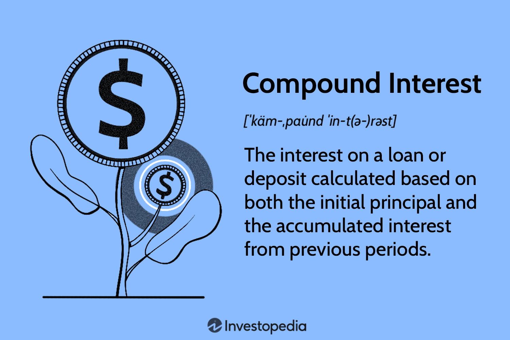

## Table of Contents

## What is compound interest?

Compound interest is when you earn interest on both the money you save and the interest you've already earned. It's like your money grows faster because you keep earning interest on a bigger amount over time. Imagine you put money in a bank, and every year, the bank gives you a little more money based on what you have. The next year, they give you interest on the new, larger amount, and this keeps happening.

For example, if you start with $100 and the bank gives you 10% interest each year, after the first year, you'll have $110. The next year, you'll earn 10% on $110, so you'll get $11 more, making your total $121. This process continues, and your money grows more quickly than if you just earned interest on the original $100 each year. That's why compound interest is a powerful way to make your savings grow over time.

## How does compound interest differ from simple interest?

Compound interest and simple interest are two ways to earn money on your savings, but they work differently. Simple interest is when you earn money only on the original amount you saved. For example, if you put $100 in a bank that gives you 10% simple interest each year, you'll get $10 every year, no matter how much money you have in the bank. The interest stays the same because it's based only on your starting amount.

Compound interest, on the other hand, is when you earn interest on both your original money and the interest you've already earned. Using the same example, if you start with $100 and the bank gives you 10% compound interest each year, after the first year, you'll have $110. The next year, you'll earn 10% on $110, so you'll get $11 more, making your total $121. This means your money grows faster because the interest you earn keeps getting bigger.

The main difference is that with simple interest, your interest stays the same every year, but with compound interest, your interest grows because it's calculated on a bigger amount each time. Over many years, compound interest can make a big difference in how much money you end up with.

## What are the key components needed to calculate compound interest?

To calculate compound interest, you need to know four main things: the starting amount of money, the interest rate, how often the interest is added, and how long the money will be saved. The starting amount is called the principal. The interest rate is the percentage of the principal that you earn each time the interest is calculated. How often the interest is added is called the compounding frequency, and it could be yearly, monthly, or even daily. The length of time is how many years, or other periods, you plan to keep your money in the account.

Once you have these pieces of information, you can use a formula to figure out how much money you'll have in the end. The formula takes into account that the interest is added to the principal and then you earn interest on the new, larger amount. This process repeats every time the interest is compounded. Over time, this can make your savings grow much faster than if you were [earning](/wiki/earning-announcement) simple interest, where you only earn interest on the original amount you saved.

## Can you provide the formula for calculating compound interest?

The formula for calculating compound interest is A = P (1 + r/n)^(nt). In this formula, 'A' is the amount of money you'll have at the end, 'P' is the starting amount or principal, 'r' is the interest rate (as a decimal), 'n' is the number of times the interest is compounded per year, and 't' is the number of years the money is saved. This formula shows how your money grows over time because the interest is added to the principal and then you earn more interest on the new total.

For example, if you start with $1,000 and the bank gives you 5% interest compounded yearly for 10 years, you can use the formula to find out how much you'll have. You plug in P = 1000, r = 0.05, n = 1 (because it's compounded yearly), and t = 10. The calculation would be A = 1000 (1 + 0.05/1)^(1*10), which comes out to about $1,628.89. This means that after 10 years, your $1,000 will have grown to $1,628.89 thanks to compound interest.

## How often can interest be compounded?

Interest can be compounded at different times, like yearly, monthly, or even daily. When it's compounded yearly, the interest is added to your money once a year. If it's compounded monthly, the interest is added every month, which means your money grows a little bit each month. Daily compounding means the interest is added every day, making your savings grow a tiny bit every single day.

The more often the interest is compounded, the faster your money will grow. For example, if you have $100 and the interest rate is 5%, compounding it daily will make your money grow faster than if it's compounded yearly. This is because with daily compounding, you're earning interest on a slightly bigger amount every day, instead of waiting a whole year to add the interest.

## What is the effect of different compounding frequencies on the total interest earned?

Different compounding frequencies can make a big difference in how much money you earn from interest. If the interest is compounded more often, like monthly or daily, your money will grow faster than if it's compounded less often, like yearly. This happens because when interest is added more frequently, you start earning interest on a slightly bigger amount sooner. For example, if you have $100 and the interest rate is 5%, with daily compounding, you'll earn a tiny bit of interest every day, and that interest will start earning more interest the very next day.

On the other hand, if the interest is compounded yearly, you'll only get the interest added once a year, and you won't start earning interest on that new amount until the next year. Over time, this difference can add up. If you leave your money in the account for many years, choosing an account with more frequent compounding, like monthly or daily, can lead to earning a lot more interest than if you chose an account that compounds yearly. This is why it's important to pay attention to how often the interest is compounded when you're deciding where to save your money.

## How can I use a compound interest calculator?

Using a compound interest calculator is easy and can help you see how your money will grow over time. First, you need to find a compound interest calculator online. There are many free ones available. Once you find one, you'll need to enter some information. You'll need to put in the starting amount of money you have, which is called the principal. Then, you'll enter the interest rate, which is the percentage of the principal you'll earn each year. Next, you'll need to tell the calculator how often the interest is compounded, like yearly, monthly, or daily. Finally, you'll enter how many years you plan to keep your money in the account.

After you've entered all the information, the calculator will do the math for you. It will show you the total amount of money you'll have at the end of the time period you chose. This can help you see how different interest rates or compounding frequencies can affect your savings. For example, you might see that saving money with daily compounding can make your money grow faster than if it's compounded yearly. Using a compound interest calculator can help you make better choices about where to save your money and how long to leave it there.

## What are some real-life examples of compound interest in savings accounts?

Imagine you save $1,000 in a savings account that gives you 2% interest compounded yearly. After one year, you'll have $1,020 because you earned $20 in interest. The next year, you'll earn 2% on $1,020, so you'll get $20.40 more, making your total $1,040.40. This keeps happening every year, and over time, your money grows faster because you're earning interest on a bigger amount each year. If you leave the money in the account for 10 years, you'll end up with about $1,219. This shows how compound interest can help your savings grow over time.

Another example is if you save $500 in an account with 3% interest compounded monthly. Each month, you'll earn a little bit of interest, and that interest will start earning more interest the next month. After one year, you'll have about $515.22. If you keep the money in the account for 5 years, you'll have around $580.26. This example shows how monthly compounding can make your money grow even faster than yearly compounding because you're earning interest more often. Both examples show how compound interest works in real life and how it can help your savings grow over time.

## How does compound interest apply to investments like stocks or mutual funds?

Compound interest can also work with investments like stocks or mutual funds, but it's a bit different from savings accounts. When you invest in stocks or mutual funds, you might get money back in two ways: dividends and capital gains. Dividends are like little payments the company gives you for owning their stock. If you take those dividends and buy more stocks or add them to your mutual fund, you're using compound interest. Your investment grows because you're earning more from a bigger amount of stocks or funds.

Capital gains happen when the price of your stocks or mutual funds goes up. If you sell some of your investment and use that money to buy more stocks or add to your mutual fund, you're also using compound interest. Over time, this can make your investment grow much faster. Just like with savings accounts, the more often you reinvest your earnings, the faster your investment can grow. This is why many people choose to reinvest their dividends and capital gains to take advantage of compound interest in their investments.

## What is the rule of 72 and how is it related to compound interest?

The rule of 72 is a simple way to guess how long it will take for your money to double with compound interest. You just take the number 72 and divide it by the interest rate you're getting. For example, if you're earning 6% interest, you divide 72 by 6, which gives you 12 years. That means it will take about 12 years for your money to double if you're earning 6% interest each year.

This rule is related to compound interest because it helps you see how powerful compound interest can be over time. It's a quick way to understand how quickly your savings or investments can grow without doing a lot of complicated math. The rule of 72 is a handy tool for planning your finances and figuring out how long you need to save or invest to reach your goals.

## How can compound interest be used in debt reduction strategies?

Compound interest can be used to help pay off debts faster. When you make extra payments on your debt, you reduce the amount of interest you owe. This is because interest is usually calculated on the remaining balance of your debt. If you pay more than the minimum, the balance goes down faster, so the interest you owe each month gets smaller. Over time, this means you'll pay less in interest and get out of debt quicker. It's like using compound interest in reverse to save money on interest and pay off your debt.

For example, if you have a credit card with a $5,000 balance and an interest rate of 18%, making extra payments can make a big difference. If you only pay the minimum, it might take you many years to pay off the card because of the high interest. But if you pay more each month, you'll lower the balance faster, and the interest you owe each month will be less. This way, you can pay off the card much sooner and save a lot of money on interest. Using compound interest to reduce debt is all about paying more than you have to, so the interest doesn't keep piling up.

## What are the advanced strategies for maximizing returns through compound interest?

One advanced strategy for maximizing returns through compound interest is to start saving or investing as early as possible. The earlier you begin, the more time your money has to grow. For example, if you start saving $100 a month at age 25 with an interest rate of 5% compounded yearly, by the time you're 65, you'll have about $104,000. But if you wait until you're 35 to start saving the same amount at the same interest rate, you'll only have about $60,000 by age 65. Starting early gives your money more time to benefit from compound interest, which can make a big difference in the long run.

Another strategy is to reinvest any earnings you get from your investments. This means taking any interest, dividends, or capital gains and putting them back into your savings or investment account instead of spending them. When you reinvest, you're letting compound interest work its magic by earning interest on a bigger amount of money. For example, if you invest in a stock that pays dividends, instead of taking the cash, you can use those dividends to buy more shares of the stock. Over time, this can lead to much larger returns because you're constantly increasing the amount of money that's earning interest or growing through investments.

## What is Compounding?

Compounding is a fundamental financial principle whereby earnings from an investment are reinvested in order to generate additional income. This creates a virtuous cycle where not only the initial principal but also the accumulated interest or dividends earn more over time. This mechanism is described mathematically as exponential or geometric growth, distinguishing it from linear growth models which do not accumulate interest on the interest itself.

The essence of compounding can be captured through the contrast between simple and compound interest. Simple interest is calculated on the principal amount alone, using the formula:

$$
\text{Simple Interest} = P \times r \times t
$$

where $P$ is the principal, $r$ is the annual interest rate, and $t$ is the time in years.

In contrast, compound interest is calculated on the initial principal and also on the accumulated interest from previous periods, leading to an exponential growth pattern. The formula for compound interest is:

$$
A = P \left(1 + \frac{r}{n}\right)^{nt}
$$

where $A$ is the future value of the investment, $P$ is the principal investment amount, $r$ is the annual interest rate, $n$ is the number of times interest is compounded per year, and $t$ is the time the money is invested for in years. This compounding effect means that the more frequently interest is compounded, the greater the amount of compound interest will accrue.

To illustrate, consider an example where $1,000 is invested at a 5% annual [interest rate](/wiki/interest-rate-trading-strategies). With simple interest over 5 years, the total would be:

$$
\text{Simple Interest Total} = 1000 \times 0.05 \times 5 = \$250
$$
$$
\text{Final Amount} = 1000 + 250 = \$1250
$$

Conversely, if the interest is compounded annually, the calculation would be:

$$
A = 1000 \left(1 + \frac{0.05}{1}\right)^{1 \times 5} = 1000 \times 1.27628 = \$1276.28
$$

The additional $26.28 reflects the benefit of compounding. If compounded quarterly or monthly, the amount earned would be higher due to more frequent compounding.

The ability to magnify returns through compounding has vast implications in both wealth accumulation and debt management. For savings, reinvesting dividends or interest payments, and maintaining consistent contributions can significantly enhance growth over time. Conversely, in debt scenarios, failure to manage compounding interest can lead to mounting costs due to interest-on-interest effects, necessitating careful planning and periodic repayments to mitigate potential financial strain.

Compounding's ability to exponentially increase savings or costs underscores its critical importance in financial strategies, offering individuals and businesses alike powerful tools to optimize growth and manage liabilities efficiently.

## What are the financial formulas for compound interest?

Compound interest is a cornerstone concept in finance, enabling investors and borrowers to predict future value growth or debt accumulation. The fundamental formula for calculating the future value (FV) of an investment or loan subject to compound interest can be represented mathematically as:

$$

FV = PV \times \left(1 + \frac{r}{n}\right)^{nt} 
$$

Where:
- $PV$ is the present value or initial amount of money.
- $r$ is the annual nominal interest rate (expressed as a decimal).
- $n$ is the number of compounding periods per year.
- $t$ is the time in years.

### Components Explanation

1. **Present Value (PV):** This is the initial principal or the current value of an amount that will grow over time through compounding.

2. **Interest Rate (r):** The nominal interest rate is the percentage at which the invested or borrowed sum grows annually. It is crucial to express this rate as a decimal when using the formula.

3. **Compounding Periods (n):** This refers to how often the compounding occurs within a year. Common compounding frequencies include annually ($n = 1$), semi-annually ($n = 2$), quarterly ($n = 4$), monthly ($n = 12$), and daily ($n = 365$).

4. **Time (t):** The duration over which the money is invested or borrowed, typically in years.

### Illustrative Examples

To demonstrate the impact of compounding frequencies, consider an investment of $1,000 at an annual interest rate of 5%.

- **Annual Compounding:** $n = 1$, for 5 years:
$$
  FV = 1000 \times \left(1 + \frac{0.05}{1}\right)^{1 \times 5} = 1000 \times 1.2763 = 1276.28

$$

- **Quarterly Compounding:** $n = 4$, for 5 years:
$$
  FV = 1000 \times \left(1 + \frac{0.05}{4}\right)^{4 \times 5} = 1000 \times 1.2837 = 1283.68

$$

- **Monthly Compounding:** $n = 12$, for 5 years:
$$
  FV = 1000 \times \left(1 + \frac{0.05}{12}\right)^{12 \times 5} = 1000 \times 1.2837 = 1283.68

$$

As shown, the more frequent the compounding, the greater the future value due to interest-on-interest effects.

### Continuous Compounding

Continuous compounding assumes interest is compounded an infinite number of times in a year, leading to the formula:

$$

FV = PV \times e^{rt} 
$$

Where $e$ is the base of the natural logarithm (approximately equal to 2.71828).

For the same investment example with continuous compounding:

$$

FV = 1000 \times e^{0.05 \times 5} = 1000 \times 1.2840 = 1284.03 
$$

Continuous compounding results in the highest future value, albeit by a small margin compared to frequent discrete compounding frequencies.

Understanding these formulas and their implications allows investors and borrowers to make informed decisions, optimizing strategies based on desired outcomes and compounding scenarios. The differences in future value calculations highlight the importance of factoring in the compounding frequency when assessing investment growth or debt accumulation strategies.

## What are Practical Tools for Interest Calculation and Algo Trading?

Modern technologies have significantly transformed the landscape of interest calculation and [algorithmic trading](/wiki/algorithmic-trading). Tools such as MetaTrader, Microsoft Excel, and programming languages like Python offer a range of capabilities that make it easier to implement sophisticated financial strategies.

MetaTrader is a widely-used platform that supports automated trading through its Expert Advisors (EA). EAs are programs that run within the MetaTrader environment and execute trades automatically based on pre-defined criteria. This automation is particularly useful for leveraging compound interest in trading by allowing earnings to be reinvested efficiently. By utilizing EAs, traders can optimize their strategies to compound profits over time without manual intervention. MetaTrader's platform supports [backtesting](/wiki/backtesting), enabling traders to test their EAs using historical data, thereby refining strategies to maximize growth.

Microsoft Excel is another powerful tool for financial calculations. It comes equipped with numerous financial functions that facilitate the computation of compound interest. For example, the formula to calculate the future value of an investment with compound interest, given by:

$$
FV = PV \times (1 + \frac{r}{n})^{n \times t}
$$

can be easily set up in Excel. Here, $FV$ is the future value, $PV$ is the present value, $r$ is the annual interest rate, $n$ is the number of compounding periods per year, and $t$ is the time in years. Excel’s capability to handle large datasets and perform complex calculations makes it invaluable for financial analysts and traders adjusting their portfolios based on compound interest dynamics.

Programming in Python provides the flexibility to create custom simulations and develop proprietary trading algorithms that incorporate compound interest. Python libraries such as NumPy and pandas allow users to handle data efficiently and perform extensive numerical computations. A simple Python script to calculate compound interest might look like this:

```python
def calculate_compound_interest(principal, rate, times_per_year, years):
    return principal * (1 + rate / times_per_year) ** (times_per_year * years)

# Example usage
principal = 10000  # Initial investment
rate = 0.05  # Annual interest rate
times_per_year = 4  # Quarterly compounding
years = 10  # Investment period
future_value = calculate_compound_interest(principal, rate, times_per_year, years)

print(f"Future value of the investment: ${future_value:.2f}")
```

In addition to calculation, Python’s extensive libraries such as `TA-Lib` for technical analysis and `zipline` for backtesting trading algorithms make it a versatile choice for algorithmic traders. The ability to simulate various scenarios and visualize outcomes allows investors to strategize effectively, incorporating the power of compounding into their trading activities.

In summary, MetaTrader facilitates automated reinvestment strategies, Excel simplifies complex financial computations, and Python offers robust frameworks for simulation and algorithm development. These tools collectively empower users to harness compound interest effectively, enhancing both personal finance management and professional trading strategies.

## References & Further Reading

For further understanding of compound interest and algorithmic trading, several authoritative sources provide in-depth knowledge and practical insights. 

1. **Investopedia**: Investopedia offers a comprehensive explanation of compound interest, detailing how it works, its benefits, and how it compares to simple interest. The platform also provides valuable insights into algorithmic trading strategies, covering various techniques and best practices. These articles are a great starting point for anyone looking to deepen their understanding of financial concepts. [Investopedia](https://www.investopedia.com/)

2. **Financial Textbooks**: Books such as "The Mathematics of Money: Math for Business and Personal Finance Decisions" by Timothy Biehler provide a thorough exploration of financial mathematics, including detailed discussions on compound interest and decision-making strategies in personal finance. These resources are beneficial for students and professionals seeking a solid mathematical foundation.

3. **Trading Manuals**: Manuals like "Algorithmic Trading: Winning Strategies and Their Rationale" by Ernest P. Chan offer a practical approach to algorithmic trading. They provide algorithms, coding examples, and strategies for implementing successful trading systems that leverage compound interest principles to enhance returns.

4. **Python for Finance**: Python is a powerful tool for financial analysis and modeling. Books such as "Python for Finance: Analyze Big Financial Data" by Yves Hilpisch serve as excellent guides for building and testing financial models, including those based on compound interest calculations. Python’s libraries such as NumPy and pandas can be used to implement complex financial formulas.

5. **Online Courses and MOOCs**: Platforms like Coursera and edX offer courses on finance and trading that often include modules on compound interest and algorithmic trading. These courses, taught by industry experts and professors, provide a structured learning experience with hands-on projects and case studies.

6. **Research Papers**: Academic journals often publish the latest research on financial mathematics and trading algorithms. Accessing platforms like JSTOR or Google Scholar can provide valuable case studies and empirical analyses that contribute significantly to a deep understanding of these topics.

These resources can provide valuable guidance and help develop both the theoretical and practical skills necessary to master compound interest and algorithmic trading.

