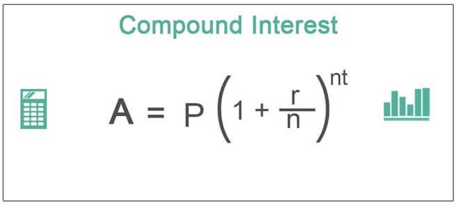

Understanding the mechanics of interest calculation is fundamental in personal finance and investment. This article aims to explore various financial formulas used for interest calculation, with a special focus on compound interest. Compound interest is a powerful concept that allows earnings on an investment to generate their own earnings when they are reinvested. This exponential growth has profound implications for both savings and investment strategies.

Additionally, the article will explore how algorithmic trading can leverage compound interest principles to amplify trading returns. Algorithmic trading utilizes computer algorithms to automate trading strategies, which can significantly enhance trading outcomes when these strategies incorporate the principles of compounding.



Our goal is to provide a comprehensive guide catering to both novice and experienced investors, helping them harness the power of compounding to achieve financial growth. We will cover essential topics, including a detailed definition of compounding, its advantages, and various formulas for calculation. This foundational understanding will equip investors to maximize their investment returns and traders to optimize their portfolio growth.

Further, algorithmic trading strategies that utilize compound interest principles will be discussed, illustrating how traders can maximize their returns by reinvesting gains or employing leveraged trading scenarios. This article will serve as a resource for readers to understand how compound growth can be strategically utilized in their financial pursuits.

## Table of Contents

## What is Compounding?

Compounding is a fundamental financial principle that plays a significant role in investment growth. It involves the reinvestment of earnings, such as interest or dividends, back into the principal amount, leading to exponential growth over time. This process is commonly referred to as earning 'interest on interest,' which is distinct from linear growth where earnings are not reinvested and growth remains constant.

To understand compounding in detail, consider the concept of exponential growth versus linear growth. In linear growth, the principal amount generates a fixed amount of earnings over each period. For instance, with a simple interest model at a fixed rate, the growth of an investment is additive. Suppose an investor places $1,000 at a simple interest rate of 5% per annum. At the end of ten years, the total interest earned is calculated as:

$$
\text{Simple Interest} = \text{Principal} \times \text{Rate} \times \text{Time} = 1000 \times 0.05 \times 10 = 500
$$

Thus, the total value of the investment is $1,500.

In contrast, compounding assumes that the interest earned each period is reinvested to generate additional earnings in subsequent periods. The formula for compound interest is represented as:

$$
\text{Future Value} (FV) = \text{Principal} (PV) \times \left(1 + \frac{i}{n}\right)^{nt}
$$

Where:
- $FV$ is the future value of the investment.
- $PV$ is the present value or principal investment amount.
- $i$ is the annual interest rate.
- $n$ is the number of compounding periods per year.
- $t$ is the number of years.

Using the example above, if the $1,000 were invested at a compound [interest rate](/wiki/interest-rate-trading-strategies) of 5% compounded annually, the value in ten years would be:

$$
FV = 1000 \times (1 + 0.05)^{10} \approx 1628.89
$$

This results in a total value of $1,628.89, clearly demonstrating the compounding effect and the additional earnings as compared to simple interest.

The power of compounding can magnify returns over extended periods, making it highly advantageous for savings and investments. This principle is also applicable in debt management; interest compounding on loans can lead to dramatic increases in the amount owed over time if not managed carefully.

Key takeaways from compounding include its ability to magnify returns significantly over long periods, making it an essential concept for both savings and investing. Its application can be advantageous in savings through vehicles like dividend reinvestment plans, or it can act adversely in debts where compounded interest can increase the total repayment significantly.

In summary, understanding and utilizing the principle of compounding can result in more informed financial decisions, maximizing potential returns in investments and minimizing the cost of loans through strategic debt management.

## Compound Interest Financial Formulas

The formula for calculating the future value (FV) of an investment using compound interest is essential for understanding how investments grow over time. The formula is given by:

$$
FV = PV \times \left(1 + \frac{i}{n}\right)^{nt}
$$

Where:
- $FV$ is the future value of the investment after time $t$.
- $PV$ represents the present value or the initial amount of the investment.
- $i$ is the nominal annual interest rate expressed as a decimal.
- $n$ is the number of compounding periods per year.
- $t$ is the number of years the money is invested or borrowed for.

### Component Breakdown:
1. **Present Value (PV)**: This is the initial sum of money that is being invested or loaned. It serves as the starting point for calculating future gains or costs.

2. **Interest Rate (i)**: This is the nominal annual interest rate. It's often provided as a percentage and needs to be converted into a decimal for use in the formula.

3. **Number of Compounding Periods (n)**: This indicates how often the interest is applied to the investment within a single year. Common compounding periods include annually, semi-annually, quarterly, and monthly.

4. **Time (t)**: Time refers to the total duration the money is left to grow through compound interest. It's measured in years.

### Real-life Examples and Scenarios
Consider a simple investment where you place $1,000 in a savings account with an annual interest rate of 5% compounded annually. Using the formula, the future value after 5 years would be:

$$
FV = 1000 \times \left(1 + \frac{0.05}{1}\right)^{1 \times 5} = 1000 \times 1.27628 \approx 1276.28
$$

In contrast, for a loan scenario with the same interest rate and compounding frequency, the borrower would owe $1,276.28 after 5 years.

### Continuous Compounding
Continuous compounding provides a scenario where the compounding occurs infinitely within the specified time period. The formula for continuous compounding is:

$$
FV = PV \times e^{(i \times t)}
$$

Where $e$ is the base of the natural logarithm, approximately equal to 2.71828.

For the above example with continuous compounding:

$$
FV = 1000 \times e^{(0.05 \times 5)} \approx 1000 \times e^{0.25} \approx 1000 \times 1.28403 \approx 1284.03
$$

This shows that continuous compounding yields a slightly higher return compared to annual compounding over the same period.

Understanding these formulas and concepts allows investors and borrowers to make informed decisions about their financial future and optimize their investment strategies or manage their debts more effectively.

## Compounding in Savings and Debt Management

Compounding plays a pivotal role in savings strategies and debt management. For savings, compounding significantly enhances the growth of savings over time. When interest is earned not only on the principal amount but also on any accumulated interest, the total savings experience exponential growth. This effect becomes more pronounced over longer time horizons. A practical approach to maximizing this growth is through dividend reinvestment plans (DRPs). In DRPs, dividends paid by stocks are automatically reinvested in additional shares, thereby enhancing the power of compounding.

Consider the following simple Python code, which calculates future savings using compound interest:

```python
def calculate_future_value(principal, rate, times_compounded, years):
    return principal * (1 + rate / times_compounded) ** (times_compounded * years)

# Example: $10,000 principal at a 5% interest rate compounded quarterly over 10 years
principal = 10000
rate = 0.05
times_compounded = 4
years = 10

future_value = calculate_future_value(principal, rate, times_compounded, years)
print(f"The future value of the investment is ${future_value:.2f}")
```

For debts, the compounding principle can work against borrowers. Compound interest can substantially increase the overall cost of a loan if not managed properly. With each compounding period, interest is calculated not only on the initial principal but also on any previously accumulated interest, leading to a snowball effect that can inflate the total repayment amount over time. This increase is typically more noticeable with high-interest loans.

To mitigate the effects of compounding on debts, it is vital to focus on the following strategies:

1. **Make Greater Than Minimum Payments**: By paying more than the minimum required amount each period, borrowers can reduce the principal more quickly, minimizing the interest accrued on future compounding periods.

2. **Refinancing Options**: Explore options for consolidating or refinancing debt to secure a lower interest rate or move from a loan with compounding interest to one with simple interest, if possible.

3. **Frequent Payments**: Increasing the frequency of payments can also be effective. For instance, making bi-weekly instead of monthly payments can accelerate principal reduction, thereby reducing the interest accumulated over time.

Understanding and harnessing the power of compounding can be instrumental in growing savings and effectively managing debts, ultimately leading to more favorable financial outcomes.

## Algorithmic Trading and Compound Interest

Algorithmic trading utilizes computer-generated algorithms to execute trades at optimal times, often achieving efficiency and precision beyond human capabilities. Many such strategies leverage the principle of compound interest, essentially harnessing reinvestment to maximize returns over time. By consistently reinvesting earnings, traders can exponentially amplify their trading outcomes.

One common strategy is the use of reinvestment strategies in [algorithmic trading](/wiki/algorithmic-trading). These involve the reinvestment of profits made from successful trades to increase the capital base. For example, if an algorithm identifies and executes trades with a consistent rate of return, reinvesting the profits can lead to exponential growth of the trading account balance. This principle mirrors compound interest, where the reinvested earnings generate additional earnings in subsequent periods. A simple formula that captures this compounding effect is:

$$
A = P \times (1 + r)^n
$$

Where $A$ is the amount of money accumulated after n years, including interest, $P$ is the principal amount (initial capital), $r$ is the annual interest rate, and $n$ is the number of years the money is invested.

Leveraged trading scenarios, another form of algorithmic strategy, also benefit from compound interest principles. By using financial derivatives or margin accounts, traders can increase their exposure to a particular market beyond the bounds of their initial capital. This leverage amplifies both potential returns and risks, making it crucial to manage carefully. The compound growth effect in this context arises when profits from leveraged positions are reinvested to further increase trading stakes.

Risk management plays a pivotal role in the successful application of compound interest in algorithmic trading. Without prudent risk management, the amplified effects of losses in leveraged scenarios can quickly diminish trading capital. Traders often employ stop-loss orders, diversification, and [volatility](/wiki/volatility-trading-strategies) assessments to mitigate these risks while allowing for the positive effects of compounding to enhance portfolio growth. Advanced risk management algorithms further support this by dynamically adjusting trading parameters based on real-time data analysis.

Python, a preferred language for developing algorithmic trading strategies, offers numerous libraries and frameworks to facilitate compound interest computations and trading decisions. For instance, the `numpy` library can be employed to simulate compound growth and analyze historical data for pattern recognition. Here is an example of calculating compound growth using Python:

```python
import numpy as np

# Parameters
initial_capital = 10000  # Principal amount
annual_return_rate = 0.08  # Expected annual return
years = 5  # Investment period in years

# Compound interest formula
final_amount = initial_capital * (1 + annual_return_rate) ** years
print(f"Final amount after {years} years: ${final_amount:.2f}")
```

In conclusion, algorithmic trading, when combined with the strategic use of compound interest principles, offers a powerful approach to maximizing trading returns. However, it necessitates a thorough understanding of trading strategies and robust risk management practices to mitigate potential downsides.

## Practical Tools for Interest Calculation and Algo Trading

In contemporary finance, the integration of technology through various tools and software has revolutionized interest calculation and algorithmic trading. Two areas where this transformation is most evident include the use of trading platforms such as MetaTrader and spreadsheet software like Microsoft Excel.

MetaTrader, known for its robust features tailored for both novice and professional traders, plays a pivotal role in optimizing the compounding process. This platform supports algorithmic trading through the use of Expert Advisors (EAs), which are automated trading systems written in the MQL4 or MQL5 programming languages. These automated scripts allow for the execution of trades based on predefined criteria, enabling traders to efficiently compound their returns. For example, using an EA, a trader can automatically reinvest profits from successful trades, thus leveraging the principles of compound interest without manual intervention. MetaTrader's [backtesting](/wiki/backtesting) feature also allows traders to simulate trading strategies over historical data, assessing potential compounding effects before committing real capital.

In parallel, Microsoft Excel remains an invaluable tool for performing complex interest calculations and scenario analyses, essential for informed financial decision-making. Excel's powerful functions, such as FV (Future Value) and PMT (Payment), facilitate various financial calculations, including compound interest. For example, the formula for calculating future value using compound interest:

$$
FV = PV \times (1 + i/n)^{nt}
$$

can be easily implemented in Excel, allowing users to ascertain the growth of investments over time. Additionally, Excel's pivot tables and data visualization capabilities support comprehensive scenario analysis, illustrating the potential outcomes of different compounding strategies.

For individuals interested in programming custom solutions, Python offers extensive libraries like NumPy and Pandas for data manipulation and mathematical computations, including interest calculations. A simple Python code snippet for calculating compound interest could look like this:

```python
def compound_interest(principal, rate, time, comp_freq):
    return principal * (1 + rate/comp_freq)**(comp_freq*time)

principal_amount = 1000  # Initial investment
annual_rate = 0.05  # 5% annual interest
time_years = 10  # Investment period
compounding_frequency = 4  # Quarterly compounding

final_amount = compound_interest(principal_amount, annual_rate, time_years, compounding_frequency)
print(f"Future Value: ${final_amount:.2f}")
```

In conclusion, leveraging these modern tools and technologies, traders and investors can enhance their capabilities in both interest calculation and algorithmic trading. By understanding and utilizing these software solutions, one can harness the power of compounding to optimize financial outcomes effectively.

## Conclusion

Understanding compound interest and its applications in personal finance and trading can greatly influence financial outcomes. This article presents critical formulas and strategies enabling the effective use of compounding in investments and algorithmic trading. By focusing on the power of compound growth, individuals can enhance their decision-making process in both financial and trading contexts.

Compound interest operates on the principle of [earning](/wiki/earning-announcement) "interest on interest," leading to exponential growth of savings or investments over time. In personal finance, leveraging compound interest can accelerate the growth of savings and investments. Simple actions, like reinvesting dividends or opting for high-compound intervals, can significantly enhance long-term financial gains. In terms of debt management, understanding how compounding increases the total cost of loans underscores the importance of early payments and reducing principal amounts whenever possible.

In the arena of algorithmic trading, applying compound interest principles can transform trading strategies. By reinvesting profits systematically, traders can amplify their portfolio growth. This method requires a robust risk management strategy to safeguard against potential losses while exploiting the upside potential of compounded returns.

In conclusion, the insights and tools reviewed in this article offer a roadmap for leveraging compound growth effectively. Whether it involves personal savings, debt management, or algorithmic trading, understanding and applying compound interest principles can lead to more informed and strategic financial decisions. We encourage readers to engage with and apply these concepts as they navigate their financial journeys, unlocking the full potential of compounded growth.

## References & Further Reading

[1]: ["Compound Interest"](https://www.investor.gov/financial-tools-calculators/calculators/compound-interest-calculator) on Investopedia

[2]: ["Algorithmic Trading and DMA: An introduction to direct access trading strategies"](https://www.amazon.com/Algorithmic-Trading-DMA-introduction-strategies/dp/0956399207) by Barry Johnson

[3]: ["Mathematics of Investment and Credit"](https://archive.org/details/mathematicsofinv0000brov) by Samuel A. Broverman

[4]: ["Algorithmic Trading: Winning Strategies and Their Rationale"](https://www.wiley.com/en-us/Algorithmic+Trading%3A+Winning+Strategies+and+Their+Rationale-p-9781118460146) by Ernest P. Chan

[5]: ["Python for Finance: Analyze Big Financial Data"](https://books.google.com/books/about/Python_for_Finance.html?id=E93SBQAAQBAJ) by Yves Hilpisch