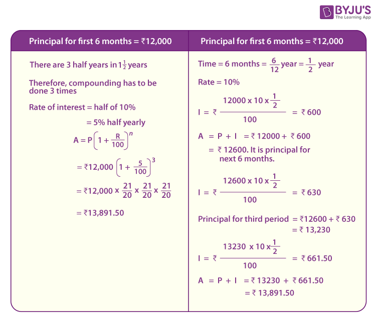

## Table of Contents

## What is compound interest?

Compound interest is when you earn interest on both the money you save and the interest you already earned. It's like a snowball that gets bigger as it rolls down a hill. The more time your money stays in the bank, the more interest it can earn. This is different from simple interest, where you only earn interest on the money you originally saved.

Let's say you put $100 in a bank account that gives you 10% interest every year. With compound interest, after the first year, you'll have $110. In the second year, you'll earn 10% interest on $110, so you'll have $121. As the years go by, the amount of money in your account grows faster and faster because you're earning interest on a bigger and bigger amount.

## How does compound interest differ from simple interest?

Compound interest and simple interest are two different ways to earn money from your savings. With simple interest, you earn money only on the amount you originally put into the bank. For example, if you save $100 and the bank gives you 5% simple interest each year, you'll earn $5 every year, no matter how long your money stays in the bank.

On the other hand, compound interest lets you earn money on both your original savings and the interest you've already earned. Using the same example, if you save $100 and the bank gives you 5% compound interest each year, after the first year you'll have $105. In the second year, you'll earn 5% on $105, so you'll have $110.25. Over time, the amount you earn with compound interest grows faster than with simple interest because you're earning interest on a bigger amount each time.

## What is the basic formula for calculating compound interest?

The basic formula for calculating compound interest is A = P(1 + r/n)^(nt). In this formula, A is the amount of money you'll have after the interest is added, P is the amount of money you start with, r is the interest rate (as a decimal), n is the number of times the interest is compounded per year, and t is the number of years.

Let's break it down with an example. If you start with $1000 (P), and the interest rate is 5% (r = 0.05), compounded yearly (n = 1), for 3 years (t = 3), you can plug these numbers into the formula. So, A = 1000(1 + 0.05/1)^(1*3) = 1000(1.05)^3 = 1000 * 1.157625 = $1157.63. This means after 3 years, with compound interest, you'll have $1157.63.

## Can you explain the variables used in the compound interest formula?

In the compound interest formula, A = P(1 + r/n)^(nt), each letter stands for something important. A is the total amount of money you will have after the interest is added. It's what you want to find out. P is the principal, which is the amount of money you start with. This is the money you put into the bank or investment at the beginning.

The other variables help figure out how the interest works. r is the interest rate, but you have to use it as a decimal. So, if the rate is 5%, you use 0.05. n is how many times the interest is added to your money each year. If it's added once a year, n is 1. If it's added every month, n is 12. t is the number of years you leave your money in the bank or investment. All these pieces together help you see how much your money can grow over time with compound interest.

## How often can interest be compounded?

Interest can be compounded at different times, like daily, monthly, quarterly, or yearly. It all depends on what the bank or the investment plan decides. When interest is compounded more often, like every day, your money can grow a bit faster because you're earning interest on a bigger amount more often.

For example, if you have money in a savings account that compounds interest daily, the interest is added to your account every single day. This means your money starts earning more interest right away, even if it's just a little bit. On the other hand, if the interest is compounded yearly, you have to wait a whole year before the interest is added to your account, so your money grows a bit slower.

## What is the effect of different compounding frequencies on the total interest earned?

When interest is compounded more often, like every day or every month, you end up earning more money over time than if it's compounded less often, like once a year. This happens because with more frequent compounding, the interest starts earning interest sooner. For example, if you have $1000 in a bank account with a 5% interest rate compounded daily, you'll earn a little bit of interest every day, and that interest will start earning more interest the next day. This means your money grows a bit faster than if the interest was only added once a year.

The difference in total interest earned can be pretty big over many years. Let's say you have $1000 at 5% interest for 10 years. If the interest is compounded yearly, you'll end up with about $1628.89. But if it's compounded daily, you'll have about $1647.01. That's almost $20 more just because the interest was added more often. So, the more often the interest is compounded, the more money you'll have at the end, but the difference gets bigger the longer your money stays in the account.

## How can you calculate the future value of an investment using compound interest?

To calculate the future value of an investment using compound interest, you can use a special formula: A = P(1 + r/n)^(nt). In this formula, A is the amount of money you'll have at the end, P is the money you start with, r is the interest rate as a decimal, n is how many times the interest is added each year, and t is the number of years you keep your money in the investment. 

Let's say you invest $1000 at an interest rate of 5% compounded yearly for 10 years. You can put these numbers into the formula to find out how much your investment will be worth. So, A = 1000(1 + 0.05/1)^(1*10) = 1000(1.05)^10 = 1000 * 1.62889 = $1628.89. This means after 10 years, your $1000 investment will grow to $1628.89 because of compound interest.

## What is the rule of 72 and how does it relate to compound interest?

The Rule of 72 is a quick way to figure out how long it will take for your money to double with compound interest. You just take the number 72 and divide it by the interest rate you're getting. For example, if you have an interest rate of 6%, you divide 72 by 6, and you get 12. This means it will take about 12 years for your money to double.

This rule is handy because it helps you see how fast your savings or investments can grow. It's not perfect, but it gives you a good guess without needing a calculator or a complicated formula. The Rule of 72 works best with interest rates that are not too high or too low, usually between 6% and 10%. It's a simple tool that can help you make better decisions about where to put your money.

## How can compound interest be used to compare different investment options?

Compound interest can help you compare different investment options by showing you how much your money could grow over time with each one. Let's say you're looking at two savings accounts. One gives you 3% interest compounded yearly, and the other gives you 4% interest compounded monthly. By using the compound interest formula, A = P(1 + r/n)^(nt), you can figure out how much money you'll have in each account after a certain number of years. This helps you see which account will make your money grow faster.

For example, if you start with $1000 and want to know how much you'll have after 5 years, you can plug the numbers into the formula for both accounts. The account with 3% interest compounded yearly will give you about $1159.27, while the account with 4% interest compounded monthly will give you about $1220.90. By comparing these amounts, you can see that the second account will help your money grow more, so it might be a better choice for your investment.

## What are some real-world examples of compound interest in savings accounts and investments?

Imagine you put $1000 into a savings account that gives you 2% interest every year. If the interest is compounded yearly, after one year you'll have $1020. In the second year, you'll earn interest on $1020, so you'll have about $1040.40. Over 10 years, your money will grow to about $1218.99. This shows how compound interest helps your savings grow faster over time because you're earning interest on a bigger amount each year.

Now think about investing $5000 in a mutual fund that earns 7% interest, compounded monthly. After the first month, you'll have about $5029.06. By the end of the first year, your investment will be around $5372.54. If you leave your money in the fund for 20 years, it will grow to about $19,388.44. This example shows how compound interest can make a big difference in investments, especially when the interest is added more often and over a long period of time.

## How do you solve for the initial principal or interest rate when given the future value in a compound interest problem?

When you know the future value of your money but want to find out the initial amount you started with, you can use the compound interest formula. The formula is A = P(1 + r/n)^(nt), where A is the future value, P is the initial principal, r is the interest rate as a decimal, n is the number of times the interest is compounded per year, and t is the number of years. To find P, you rearrange the formula to P = A / (1 + r/n)^(nt). For example, if you know you'll have $1500 after 5 years with a 4% interest rate compounded yearly, you can solve for P. Plug in A = 1500, r = 0.04, n = 1, and t = 5. So, P = 1500 / (1 + 0.04/1)^(1*5) = 1500 / 1.21665 = $1232.25. This means you started with about $1232.25.

If you want to find the interest rate when you know the future value, you use the same formula but solve for r. The formula becomes r = n * [(A/P)^(1/(n*t)) - 1]. For example, if you started with $1000 and it grew to $1200 after 3 years with interest compounded yearly, you can find r. Plug in A = 1200, P = 1000, n = 1, and t = 3. So, r = 1 * [(1200/1000)^(1/(1*3)) - 1] = 1 * [1.2^(1/3) - 1] = 1 * [1.0627 - 1] = 0.0627, which is about 6.27%. This means the interest rate was about 6.27%.

## What advanced techniques can be used to model compound interest in continuously compounded scenarios?

When you want to model compound interest that is added all the time, instead of just once a year or every month, you use something called continuous compounding. It's like the interest is being added every second, and it can make your money grow a bit faster. To figure out how much your money will be worth with continuous compounding, you use a special formula: A = Pe^(rt). Here, A is how much money you'll have at the end, P is the money you start with, r is the interest rate as a decimal, t is the number of years, and e is a special number that's about 2.71828. This formula is a bit different from the one for regular compound interest, but it helps you see how your money can grow when interest is added all the time.

For example, if you start with $1000 and the interest rate is 5% compounded continuously for 10 years, you can plug these numbers into the formula. So, A = 1000e^(0.05*10) = 1000e^(0.5) = 1000 * 1.64872 = $1648.72. This means after 10 years, with continuous compounding, your $1000 will grow to about $1648.72. This is a bit more than if the interest was compounded yearly, which would give you about $1628.89. So, continuous compounding can make a small but important difference in how fast your money grows.

## What is Compounding?

Compounding is a fundamental financial principle that plays a significant role in investment growth. It involves the reinvestment of earnings, such as interest or dividends, back into the principal amount, leading to exponential growth over time. This process is commonly referred to as earning 'interest on interest,' which is distinct from linear growth where earnings are not reinvested and growth remains constant.

To understand compounding in detail, consider the concept of exponential growth versus linear growth. In linear growth, the principal amount generates a fixed amount of earnings over each period. For instance, with a simple interest model at a fixed rate, the growth of an investment is additive. Suppose an investor places $1,000 at a simple interest rate of 5% per annum. At the end of ten years, the total interest earned is calculated as:

$$
\text{Simple Interest} = \text{Principal} \times \text{Rate} \times \text{Time} = 1000 \times 0.05 \times 10 = 500
$$

Thus, the total value of the investment is $1,500.

In contrast, compounding assumes that the interest earned each period is reinvested to generate additional earnings in subsequent periods. The formula for compound interest is represented as:

$$
\text{Future Value} (FV) = \text{Principal} (PV) \times \left(1 + \frac{i}{n}\right)^{nt}
$$

Where:
- $FV$ is the future value of the investment.
- $PV$ is the present value or principal investment amount.
- $i$ is the annual interest rate.
- $n$ is the number of compounding periods per year.
- $t$ is the number of years.

Using the example above, if the $1,000 were invested at a compound [interest rate](/wiki/interest-rate-trading-strategies) of 5% compounded annually, the value in ten years would be:

$$
FV = 1000 \times (1 + 0.05)^{10} \approx 1628.89
$$

This results in a total value of $1,628.89, clearly demonstrating the compounding effect and the additional earnings as compared to simple interest.

The power of compounding can magnify returns over extended periods, making it highly advantageous for savings and investments. This principle is also applicable in debt management; interest compounding on loans can lead to dramatic increases in the amount owed over time if not managed carefully.

Key takeaways from compounding include its ability to magnify returns significantly over long periods, making it an essential concept for both savings and investing. Its application can be advantageous in savings through vehicles like dividend reinvestment plans, or it can act adversely in debts where compounded interest can increase the total repayment significantly.

In summary, understanding and utilizing the principle of compounding can result in more informed financial decisions, maximizing potential returns in investments and minimizing the cost of loans through strategic debt management.

## What are the financial formulas for compound interest?

The formula for calculating the future value (FV) of an investment using compound interest is essential for understanding how investments grow over time. The formula is given by:

$$
FV = PV \times \left(1 + \frac{i}{n}\right)^{nt}
$$

Where:
- $FV$ is the future value of the investment after time $t$.
- $PV$ represents the present value or the initial amount of the investment.
- $i$ is the nominal annual interest rate expressed as a decimal.
- $n$ is the number of compounding periods per year.
- $t$ is the number of years the money is invested or borrowed for.

### Component Breakdown:
1. **Present Value (PV)**: This is the initial sum of money that is being invested or loaned. It serves as the starting point for calculating future gains or costs.

2. **Interest Rate (i)**: This is the nominal annual interest rate. It's often provided as a percentage and needs to be converted into a decimal for use in the formula.

3. **Number of Compounding Periods (n)**: This indicates how often the interest is applied to the investment within a single year. Common compounding periods include annually, semi-annually, quarterly, and monthly.

4. **Time (t)**: Time refers to the total duration the money is left to grow through compound interest. It's measured in years.

### Real-life Examples and Scenarios
Consider a simple investment where you place $1,000 in a savings account with an annual interest rate of 5% compounded annually. Using the formula, the future value after 5 years would be:

$$
FV = 1000 \times \left(1 + \frac{0.05}{1}\right)^{1 \times 5} = 1000 \times 1.27628 \approx 1276.28
$$

In contrast, for a loan scenario with the same interest rate and compounding frequency, the borrower would owe $1,276.28 after 5 years.

### Continuous Compounding
Continuous compounding provides a scenario where the compounding occurs infinitely within the specified time period. The formula for continuous compounding is:

$$
FV = PV \times e^{(i \times t)}
$$

Where $e$ is the base of the natural logarithm, approximately equal to 2.71828.

For the above example with continuous compounding:

$$
FV = 1000 \times e^{(0.05 \times 5)} \approx 1000 \times e^{0.25} \approx 1000 \times 1.28403 \approx 1284.03
$$

This shows that continuous compounding yields a slightly higher return compared to annual compounding over the same period.

Understanding these formulas and concepts allows investors and borrowers to make informed decisions about their financial future and optimize their investment strategies or manage their debts more effectively.

## What is the relationship between Algorithmic Trading and Compound Interest?

Algorithmic trading utilizes computer-generated algorithms to execute trades at optimal times, often achieving efficiency and precision beyond human capabilities. Many such strategies leverage the principle of compound interest, essentially harnessing reinvestment to maximize returns over time. By consistently reinvesting earnings, traders can exponentially amplify their trading outcomes.

One common strategy is the use of reinvestment strategies in [algorithmic trading](/wiki/algorithmic-trading). These involve the reinvestment of profits made from successful trades to increase the capital base. For example, if an algorithm identifies and executes trades with a consistent rate of return, reinvesting the profits can lead to exponential growth of the trading account balance. This principle mirrors compound interest, where the reinvested earnings generate additional earnings in subsequent periods. A simple formula that captures this compounding effect is:

$$
A = P \times (1 + r)^n
$$

Where $A$ is the amount of money accumulated after n years, including interest, $P$ is the principal amount (initial capital), $r$ is the annual interest rate, and $n$ is the number of years the money is invested.

Leveraged trading scenarios, another form of algorithmic strategy, also benefit from compound interest principles. By using financial derivatives or margin accounts, traders can increase their exposure to a particular market beyond the bounds of their initial capital. This leverage amplifies both potential returns and risks, making it crucial to manage carefully. The compound growth effect in this context arises when profits from leveraged positions are reinvested to further increase trading stakes.

Risk management plays a pivotal role in the successful application of compound interest in algorithmic trading. Without prudent risk management, the amplified effects of losses in leveraged scenarios can quickly diminish trading capital. Traders often employ stop-loss orders, diversification, and [volatility](/wiki/volatility-trading-strategies) assessments to mitigate these risks while allowing for the positive effects of compounding to enhance portfolio growth. Advanced risk management algorithms further support this by dynamically adjusting trading parameters based on real-time data analysis.

Python, a preferred language for developing algorithmic trading strategies, offers numerous libraries and frameworks to facilitate compound interest computations and trading decisions. For instance, the `numpy` library can be employed to simulate compound growth and analyze historical data for pattern recognition. Here is an example of calculating compound growth using Python:

```python
import numpy as np

# Parameters
initial_capital = 10000  # Principal amount
annual_return_rate = 0.08  # Expected annual return
years = 5  # Investment period in years

# Compound interest formula
final_amount = initial_capital * (1 + annual_return_rate) ** years
print(f"Final amount after {years} years: ${final_amount:.2f}")
```

In conclusion, algorithmic trading, when combined with the strategic use of compound interest principles, offers a powerful approach to maximizing trading returns. However, it necessitates a thorough understanding of trading strategies and robust risk management practices to mitigate potential downsides.

## What are Practical Tools for Interest Calculation and Algo Trading?

In contemporary finance, the integration of technology through various tools and software has revolutionized interest calculation and algorithmic trading. Two areas where this transformation is most evident include the use of trading platforms such as MetaTrader and spreadsheet software like Microsoft Excel.

MetaTrader, known for its robust features tailored for both novice and professional traders, plays a pivotal role in optimizing the compounding process. This platform supports algorithmic trading through the use of Expert Advisors (EAs), which are automated trading systems written in the MQL4 or MQL5 programming languages. These automated scripts allow for the execution of trades based on predefined criteria, enabling traders to efficiently compound their returns. For example, using an EA, a trader can automatically reinvest profits from successful trades, thus leveraging the principles of compound interest without manual intervention. MetaTrader's [backtesting](/wiki/backtesting) feature also allows traders to simulate trading strategies over historical data, assessing potential compounding effects before committing real capital.

In parallel, Microsoft Excel remains an invaluable tool for performing complex interest calculations and scenario analyses, essential for informed financial decision-making. Excel's powerful functions, such as FV (Future Value) and PMT (Payment), facilitate various financial calculations, including compound interest. For example, the formula for calculating future value using compound interest:

$$
FV = PV \times (1 + i/n)^{nt}
$$

can be easily implemented in Excel, allowing users to ascertain the growth of investments over time. Additionally, Excel's pivot tables and data visualization capabilities support comprehensive scenario analysis, illustrating the potential outcomes of different compounding strategies.

For individuals interested in programming custom solutions, Python offers extensive libraries like NumPy and Pandas for data manipulation and mathematical computations, including interest calculations. A simple Python code snippet for calculating compound interest could look like this:

```python
def compound_interest(principal, rate, time, comp_freq):
    return principal * (1 + rate/comp_freq)**(comp_freq*time)

principal_amount = 1000  # Initial investment
annual_rate = 0.05  # 5% annual interest
time_years = 10  # Investment period
compounding_frequency = 4  # Quarterly compounding

final_amount = compound_interest(principal_amount, annual_rate, time_years, compounding_frequency)
print(f"Future Value: ${final_amount:.2f}")
```

In conclusion, leveraging these modern tools and technologies, traders and investors can enhance their capabilities in both interest calculation and algorithmic trading. By understanding and utilizing these software solutions, one can harness the power of compounding to optimize financial outcomes effectively.

## References & Further Reading

[1]: ["Compound Interest"](https://www.investor.gov/financial-tools-calculators/calculators/compound-interest-calculator) on Investopedia

[2]: ["Algorithmic Trading and DMA: An introduction to direct access trading strategies"](https://www.amazon.com/Algorithmic-Trading-DMA-introduction-strategies/dp/0956399207) by Barry Johnson

[3]: ["Mathematics of Investment and Credit"](https://archive.org/details/mathematicsofinv0000brov) by Samuel A. Broverman

[4]: ["Algorithmic Trading: Winning Strategies and Their Rationale"](https://www.wiley.com/en-us/Algorithmic+Trading%3A+Winning+Strategies+and+Their+Rationale-p-9781118460146) by Ernest P. Chan

[5]: ["Python for Finance: Analyze Big Financial Data"](https://books.google.com/books/about/Python_for_Finance.html?id=E93SBQAAQBAJ) by Yves Hilpisch