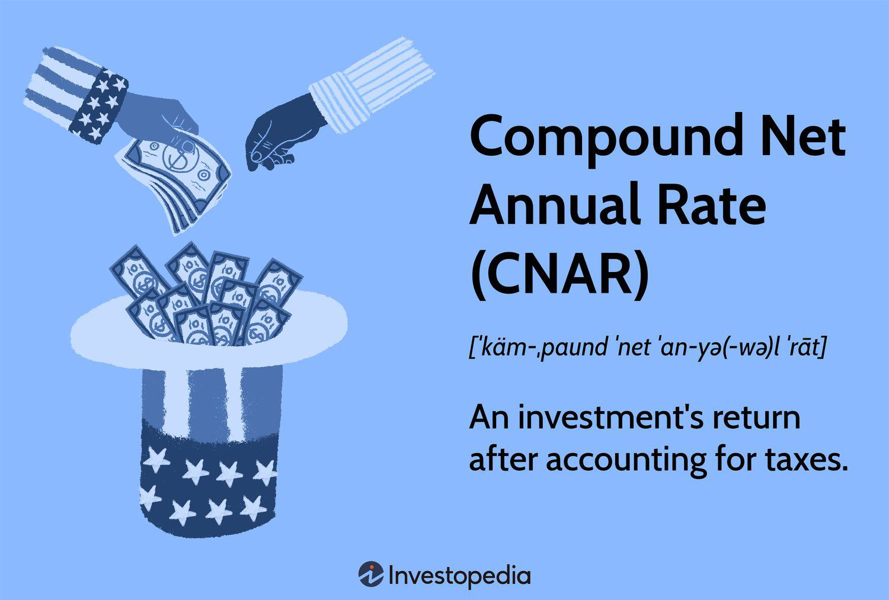

## Table of Contents

## What is the Compound Net Annual Rate (CNAR)?

The Compound Net Annual Rate (CNAR) is a way to measure how much money an investment grows each year, taking into account both the gains and losses. It's like looking at the average yearly increase in your investment, but it considers the effect of compounding, which means earning interest on interest over time. This makes CNAR a useful tool for understanding the true performance of an investment over several years.

To calculate CNAR, you start with the total value of your investment at the end of a period and compare it to the initial investment. You then figure out the rate that, if applied every year, would result in the same final value. This rate gives you a clear picture of the investment's growth, smoothing out the ups and downs that happen year to year. It's especially helpful for comparing different investments or understanding long-term growth potential.

## How is CNAR calculated?

To calculate the Compound Net Annual Rate (CNAR), you need to know the starting value of your investment, the ending value, and how many years you held the investment. You use a special formula that figures out the yearly growth rate that would make your starting amount grow to your ending amount over that time. The formula is: CNAR = (Ending Value / Starting Value)^(1 / Number of Years) - 1. This calculation gives you a number that shows the average yearly growth, including the effect of compounding.

Let's say you invested $1,000, and after 5 years, it grew to $1,400. To find the CNAR, you'd plug these numbers into the formula: CNAR = ($1,400 / $1,000)^(1 / 5) - 1. When you do the math, you get CNAR = 1.4^(0.2) - 1, which comes out to about 0.071 or 7.1%. This means your investment grew at an average rate of 7.1% each year, taking into account the compounding effect.

## What is the difference between CNAR and simple annual rate?

The Compound Net Annual Rate (CNAR) and the simple annual rate are two ways to measure how much an investment grows each year, but they work differently. CNAR takes into account the power of compounding, which means that the interest you earn also earns interest over time. For example, if you get 10% interest each year, with CNAR, the interest from the first year would also earn interest in the second year, and so on. This makes CNAR a more accurate measure of long-term growth because it reflects how investments actually grow over time.

On the other hand, the simple annual rate doesn't consider compounding. It just looks at the yearly increase without accounting for the interest earning more interest. If you have a simple annual rate of 10%, you'd get the same amount of interest every year, regardless of the growing balance. This makes the simple annual rate easier to calculate but less accurate for understanding the true growth of an investment over several years. So, CNAR is better for long-term investments, while the simple annual rate might be used for shorter periods or when you want a quick, straightforward calculation.

## Why is CNAR important in financial planning?

CNAR is important in financial planning because it helps you understand how well your investments are doing over time. It shows you the average yearly growth rate, including the effect of compounding. This means you can see how much your money is really growing each year, not just the simple interest. By using CNAR, you can compare different investments and see which ones are likely to give you the best returns over the long term. This helps you make smarter choices about where to put your money.

Knowing the CNAR also helps you plan for the future. If you know your investments are growing at a certain rate, you can figure out how much money you might have in the future. This is really useful for big goals like saving for retirement or buying a house. By understanding the CNAR, you can set realistic goals and make a plan to reach them. It gives you a clear picture of your financial growth, which is key to making good financial decisions.

## Can you provide an example of how CNAR is used in investment?

Imagine you want to invest in a mutual fund. You start with $5,000, and after 10 years, your investment grows to $10,000. To figure out how well your investment did, you can use the Compound Net Annual Rate (CNAR). You would calculate it like this: CNAR = ($10,000 / $5,000)^(1 / 10) - 1. That works out to be about 0.072 or 7.2%. This means your investment grew at an average rate of 7.2% each year, taking into account the compounding effect.

Knowing the CNAR helps you compare this mutual fund with other investments. For example, if another fund also started at $5,000 but grew to $12,000 over the same 10 years, its CNAR would be higher at about 9.6%. This tells you that the second fund performed better over time because it grew faster each year, considering the compounding effect. By understanding the CNAR, you can make better choices about where to put your money to reach your financial goals.

## How does CNAR affect long-term savings?

CNAR is really important for long-term savings because it shows you how much your money can grow over many years. When you save money, you want it to grow as much as possible. CNAR tells you the average yearly growth rate of your savings, including the effect of compounding. This means that not only does your money grow, but the growth itself grows over time. Knowing the CNAR helps you plan better because you can see how much your savings might be worth in the future. This is helpful for big goals like saving for retirement or buying a house.

For example, if you start saving $10,000 and after 20 years it grows to $30,000, the CNAR would tell you how well your savings did each year. If the CNAR is 5.5%, that means your savings grew at an average rate of 5.5% every year, taking into account the compounding effect. This helps you decide if you should keep saving in the same way or if you should look for other ways to save that might give you a higher CNAR. By understanding CNAR, you can make smarter choices about your long-term savings and reach your financial goals more effectively.

## What are the common misconceptions about CNAR?

One common misconception about CNAR is that it's the same as the simple annual rate. People sometimes think that if they see a 10% growth rate, it means their money will grow by 10% every year, no matter what. But CNAR is different because it includes compounding. This means the interest you earn also earns interest, making your money grow faster over time. So, a 10% CNAR is actually better than a 10% simple annual rate because it shows the true growth of your investment.

Another misconception is that CNAR gives you the exact growth rate every year. Some people think that if the CNAR is 7%, their investment will grow by exactly 7% each year. But CNAR is an average over a period of time. It smooths out the ups and downs that happen year to year. So, your investment might grow more in some years and less in others, but the CNAR shows you the overall average growth rate, including the effect of compounding.

## How does inflation impact CNAR?

Inflation can make the CNAR of your investment seem different than it really is. When prices go up because of inflation, the money you earn from your investment might not buy as much as it used to. So, even if your CNAR looks good on paper, the real value of your money could be going down if inflation is high. This means you need to think about inflation when you look at your CNAR to understand how much your money is really growing.

For example, if your investment has a CNAR of 5% but inflation is also 5%, your money isn't growing in real terms. You're just keeping up with the rising prices. To really see how well your investment is doing, you can take away the inflation rate from your CNAR. This gives you the real growth rate of your money, which is called the real rate of return. So, if your CNAR is 5% and inflation is 3%, your real rate of return would be about 2%. This helps you understand if your savings are actually growing over time.

## What role does CNAR play in retirement planning?

CNAR is super important when you're planning for retirement because it helps you figure out how much your savings will grow over time. When you're saving for retirement, you want your money to grow as much as possible so you can live comfortably when you stop working. CNAR shows you the average yearly growth rate of your savings, including the effect of compounding. This means that not only does your money grow, but the growth itself grows over time. By knowing the CNAR, you can see how much your savings might be worth when you retire and make sure you're saving enough.

For example, if you start saving $100,000 and it grows to $300,000 over 20 years, the CNAR would tell you how well your savings did each year. If the CNAR is 5.5%, that means your savings grew at an average rate of 5.5% every year, taking into account the compounding effect. This helps you decide if you should keep saving in the same way or if you should look for other ways to save that might give you a higher CNAR. By understanding CNAR, you can make smarter choices about your retirement savings and feel more confident about your future.

## How can one maximize returns using CNAR?

To maximize returns using CNAR, you need to find investments that have a high CNAR. This means looking for investments that grow quickly over time, taking into account the power of compounding. You can do this by comparing different investments and choosing the ones with the highest CNAR. For example, if you have two investments, one with a CNAR of 6% and another with a CNAR of 8%, you should put your money in the one with the 8% CNAR because it will grow faster over time.

Another way to maximize returns is to start investing early and keep your money in the investment for a long time. The longer your money stays invested, the more time it has to grow through compounding. Even if an investment has a lower CNAR, if you keep it for many years, it can still grow a lot. So, by starting early and being patient, you can make the most out of your investments and reach your financial goals more effectively.

## What are the limitations of using CNAR in financial analysis?

CNAR is a good tool for understanding how your investments grow over time, but it has some limits. One big limit is that CNAR is just an average. It doesn't show you the ups and downs that happen year to year. Your investment might grow a lot one year and not so much the next, but the CNAR smooths all that out into one number. This can make it hard to see the real risks and changes in your investment.

Another limit of CNAR is that it doesn't take into account things like inflation or taxes. If prices are going up because of inflation, the money you earn from your investment might not be worth as much as you think. And if you have to pay taxes on your earnings, that will also cut into your returns. So, even if your CNAR looks good, the real growth of your money might be different once you think about these other factors.

## How does CNAR compare to other compound rate metrics in advanced financial models?

CNAR is one way to measure how much your money grows each year, but there are other compound rate metrics used in advanced financial models. One of these is the Internal Rate of Return (IRR), which looks at the growth rate of an investment by considering all the cash flows over time. IRR is good for projects or investments where money comes in and goes out at different times. Unlike CNAR, which gives you a simple average yearly growth rate, IRR can handle more complex situations and give you a more detailed picture of how well an investment is doing.

Another metric is the Modified Dietz Method, which is used to find the rate of return on a portfolio over a certain period. It takes into account when money is added or taken out of the investment, which makes it more accurate than CNAR for portfolios that are not just left alone but are actively managed. While CNAR is easier to calculate and understand, these other metrics can give you a deeper look into the performance of your investments, especially when things get more complicated.

## What is the Compound Net Annual Rate (CNAR) and how can it be understood?

Compound Net Annual Rate (CNAR) is a key financial metric that reveals an investment's true return by considering the effect of taxes. Unlike the Compound Annual Growth Rate (CAGR), which provides a generalized growth measure without accounting for tax obligations, CNAR offers a nuanced perspective by integrating taxation into the calculation. This results in a more precise reflection of an investor’s actual earnings.

The formula to calculate CNAR is expressed as:

$$
\text{CNAR} = \text{RR} \times (1 - \text{Tax Rate})
$$

where $\text{RR}$ is the annual rate of return. This calculation allows investors to determine the effective return on an investment after accounting for taxes, which is critical for personal and strategic financial planning.

Understanding CNAR is crucial for investors aiming to evaluate how taxation impacts their overall investment returns. For instance, an investor with an annual return of 10% facing a tax rate of 20% will effectively have a CNAR of 8%. This outcome can significantly influence how investors assess their portfolio's performance and adjust strategies for future investments.

Furthermore, CNAR assists investors in aligning their strategies with reality by factoring in tax liabilities. By providing a net return measure, it helps investors make informed decisions on their investment choices, considering not just gross returns but the actual profitability once taxes are accounted for. This approach ensures that investment strategies are developed with a comprehensive understanding of financial implications, allowing for optimized investment decisions.

## What is the Role of CNAR in Algorithmic Trading?

Algorithmic trading employs a variety of metrics to optimize trading strategies and manage associated risks effectively. Within this framework, the Compound Net Annual Rate (CNAR) plays a crucial role by enabling traders to evaluate the net profitability of their investments after considering tax liabilities. This net measure is essential as it adjusts the Compound Annual Growth Rate (CAGR) by the applicable tax rate, providing a more precise indication of actual financial gains.

By comparing pre-tax returns, often indicated by the annual Rate of Return (RR), with post-tax results depicted by CNAR, traders can make well-informed decisions regarding strategy modifications and risk management. The CNAR formula is expressed as:

$$
\text{CNAR} = \text{RR} \times (1 - \text{Tax Rate})
$$

Where:
- RR is the annual rate of return.
- Tax Rate is the percentage of the return liable to tax.

Through this formula, algorithmic traders can discern the effect of taxation on their projected returns and adjust their strategies accordingly. For example, if a trading algorithm predicts an annual return of 20% and the tax rate is 25%, the net annual return or CNAR would calculate to 15%, thus potentially influencing decisions on asset reallocation or strategy tweaking.

Incorporating CNAR effectively bridges the gap between projected outcomes and actual returns post-taxation. This ensures that automated trading systems are finely tuned to reflect real-world financial environments, aligning trader expectations with the reality of market operations. Such an approach minimizes the risk of overestimating profitability, which could otherwise lead to unsustainable trading practices.

Utilizing CNAR in [algorithmic trading](/wiki/algorithmic-trading) not only enhances the realism of performance projections but also aids in strategic adjustments within trading algorithms. By accounting for tax implications, traders can maintain a competitive edge, ensuring their strategies are both profitable and sustainable in the constantly evolving financial landscape.

## How do you calculate CNAR: Example and Implementation?

Calculating the Compound Net Annual Rate (CNAR) involves understanding the post-tax return on an investment, providing a clearer picture of its actual profitability. For instance, consider an investor holding a stock that yields an 18.7% return. If the applicable tax rate is 20%, the CNAR can be computed as follows:

$$
\text{CNAR} = \text{Return Rate} \times (1 - \text{Tax Rate})
$$

Substituting the given values:

$$
\text{CNAR} = 18.7\% \times (1 - 0.20) = 18.7\% \times 0.80 = 15\%
$$

This calculation shows that after accounting for taxes, the effective annual return reduces to 15%.

To enhance efficiency in trading analyses, tools such as Python can be employed to automate CNAR calculations, especially when dealing with extensive datasets. Automating these computations not only saves time but also reduces human error, ensuring accuracy in financial analyses.

Here is a simple Python script to automate the CNAR calculation for an array of returns and corresponding tax rates:

```python
def calculate_cnar(returns, tax_rate):
    cnar = [r * (1 - tax_rate) for r in returns]
    return cnar

# Example usage
returns = [0.187, 0.15, 0.12]  # array of return rates
tax_rate = 0.20  # 20% tax rate
results = calculate_cnar(returns, tax_rate)

for i, cnar_value in enumerate(results):
    print(f"Investment {i+1}: Original Return = {returns[i]*100:.2f}%, CNAR = {cnar_value*100:.2f}%")
```

This script defines a function, `calculate_cnar`, that takes a list of return rates and a tax rate, applying the CNAR formula to each return rate in the list. The example usage calculates the CNAR for multiple investments, outputting the original and net returns.

Incorporating CNAR calculations into trading algorithms allows traders to adjust their strategies based on net returns, which optimizes overall performance by aligning them with real-world post-tax outcomes. Using Python and similar tools not only streamlines this process but also empowers traders to make more informed decisions, enhancing their ability to maximize returns while effectively managing risk.

## What are the differences between CNAR and Compound Annual Growth Rate (CAGR)?

Compound Net Annual Rate (CNAR) and Compound Annual Growth Rate (CAGR) are essential metrics for evaluating investment growth, yet they serve slightly different purposes. While CAGR is a straightforward calculation of an investment’s annualized growth rate over a specified period, CNAR provides a more realistic perspective by factoring in tax implications that affect net returns.

CAGR is defined mathematically as:

$$
\text{CAGR} = \left( \frac{\text{End Value}}{\text{Start Value}} \right)^{\frac{1}{n}} - 1
$$

where $n$ represents the number of years the investment is held. This formula offers a smoothed annual growth rate, ignoring volatility in year-to-year returns but focusing purely on the start and end values.

In contrast, CNAR adjusts this growth rate to account for taxes, which can significantly alter the net profitability of investments. The formula for CNAR can be expressed as:

$$
\text{CNAR} = \text{CAGR} \times (1 - \text{Tax Rate})
$$

This adjustment illustrates the importance of considering tax burdens when assessing investment performance, contributing to more accurate projections of real returns.

In tax-exempt investments, CNAR and CAGR would yield identical results, highlighting the discrepancy that taxes introduce in net returns. This equivalence serves as a benchmark to gauge the erosion of returns due to tax obligations.

For multi-year investments, understanding the nuances between CNAR and CAGR is critical for effective long-term financial planning and strategic development. While CAGR provides a consistent measure of growth useful for comparing potential investments, CNAR offers insight into what investors can actually expect to retain after fulfilling tax responsibilities. 

This understanding enables investors to develop strategies that optimize after-tax returns, aligning with personal financial goals and external fiscal environments. Armed with this knowledge, investors are better positioned to make informed decisions, adjusting portfolios in response to changing tax landscapes to maximize the efficiency of their investments.

## References & Further Reading

[1]: ["Quantitative Trading: How to Build Your Own Algorithmic Trading Business"](https://www.amazon.com/Quantitative-Trading-Build-Algorithmic-Business/dp/1119800064) by Ernest P. Chan

[2]: ["Advances in Financial Machine Learning"](https://www.amazon.com/Advances-Financial-Machine-Learning-Marcos/dp/1119482089) by Marcos Lopez de Prado

[3]: ["Machine Learning for Algorithmic Trading"](https://github.com/stefan-jansen/machine-learning-for-trading) by Stefan Jansen

[4]: ["Evidence-Based Technical Analysis: Applying the Scientific Method and Statistical Inference to Trading Signals"](https://www.amazon.com/Evidence-Based-Technical-Analysis-Scientific-Statistical/dp/0470008741) by David Aronson

[5]: Frazzini, A., & Pedersen, L. H. (2014). ["Betting Against Beta."](http://docs.lhpedersen.com/BettingAgainstBeta.pdf) The Quarterly Journal of Economics, 129(1), 1-49.