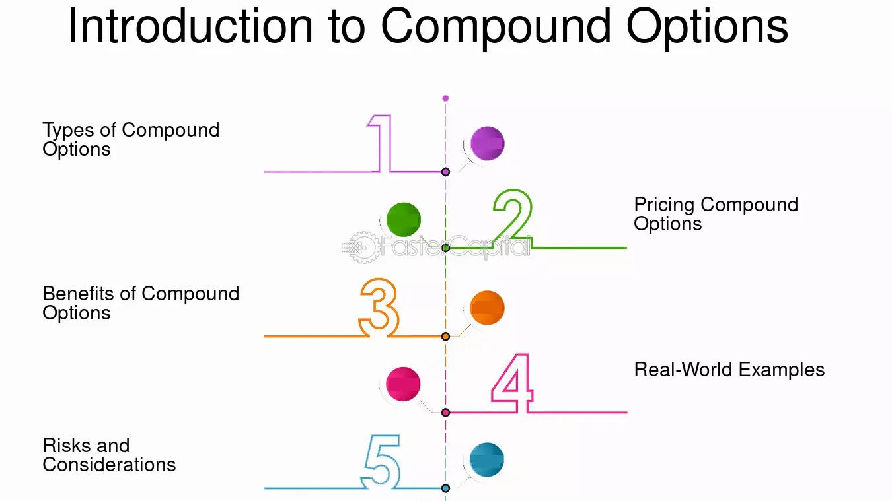

## Table of Contents

## What is a compound option?

A compound option is a type of option where the underlying asset is another option. This means you're buying the right, but not the obligation, to buy or sell another option at a later date. It's like having an option on an option. For example, you might buy a compound option that gives you the right to buy a call option on a stock in the future.

Compound options can be useful for investors who want to make a bet on future market conditions but aren't ready to commit right away. They are more complex than regular options and can be harder to understand and value. However, they offer flexibility and can be a strategic tool for managing risk and taking advantage of market opportunities.

## How does a compound option differ from a simple option?

A simple option gives you the right to buy or sell an asset, like a stock, at a set price before a certain date. It's straightforward: you pay a premium for this right, and if the asset's price moves in your favor, you can make a profit. For example, if you buy a call option on a stock, you can buy the stock at a lower price than it's trading at in the market.

A compound option is different because it's an option on another option. Instead of the underlying asset being a stock or commodity, it's another option. This means you're buying the right to buy or sell a different option in the future. It's more complex because you're dealing with two layers of options. For instance, you might buy a compound option that gives you the right to buy a call option on a stock later on. This can be useful if you want to bet on future market conditions but aren't ready to commit right away.

## What are the basic types of compound options?

There are four basic types of compound options, and they can be split into two main groups. The first group is about options on calls. This means you can have a call on a call or a put on a call. A call on a call gives you the right to buy a call option later. A put on a call lets you sell a call option later. 

The second group is about options on puts. This includes a call on a put and a put on a put. A call on a put gives you the right to buy a put option in the future. A put on a put allows you to sell a put option later. These types of compound options can help you make bets on future market moves without having to decide right away.

## Can you explain the concept of an option on an option?

An option on an option, also called a compound option, is a special type of option where the thing you're buying or selling is another option, not a stock or a commodity. It's like having a ticket that lets you buy another ticket later. For example, imagine you buy a ticket that gives you the right to buy a concert ticket in the future. That's similar to buying an option on an option.

This kind of option can be useful if you want to make a bet on what might happen in the future, but you're not ready to commit right away. It gives you more time to decide. For instance, if you think a stock might go up in a few months, you could buy an option that lets you buy a call option on that stock later. This way, you're not locking in your decision now, but you have the chance to do it later if things go the way you expect.

## What are the key components of a compound option?

A compound option has a few main parts that you need to know about. First, there's the underlying option. This is the option that you're buying the right to buy or sell later. It could be a call option or a put option on something like a stock. Then, there's the strike price of the compound option, which is the price you'll pay for the underlying option if you decide to use your compound option. Lastly, there's the expiration date of the compound option, which is when you have to decide if you want to buy or sell the underlying option.

Another important part is the premium, which is the price you pay for the compound option itself. This is like the cost of the ticket that gives you the right to buy another ticket later. The value of the compound option can change based on things like the price of the underlying asset, how much time is left until the compound option expires, and how much the price of the underlying asset might move around. Understanding these parts can help you see how compound options work and how they can be useful for making bets on future market moves.

## How is the pricing of compound options calculated?

Pricing compound options can be tricky because they're more complex than regular options. You need to think about the price of the underlying option, which itself depends on the price of the stock or whatever asset it's based on. You also have to consider how long you have until the compound option expires, and how much the price of the underlying asset might move around. All these things together help you figure out how much the compound option is worth.

A common way to price compound options is by using a model called the Black-Scholes model, but you have to adjust it for the extra layer of options. You start by figuring out the value of the underlying option using the Black-Scholes formula. Then, you use that value as the underlying asset in another Black-Scholes calculation to find the price of the compound option. It's like solving a puzzle where one piece depends on another piece, and you have to work backward to find the right price.

## What are some common strategies for using compound options?

One common strategy for using compound options is to hedge against future uncertainty. Imagine you think a stock might go up in a few months, but you're not sure yet. You can buy a compound option that gives you the right to buy a call option on that stock later. This way, you don't have to commit right away, but you can still make a bet on the stock's future price. If the stock does go up, you can use your compound option to buy the call option and then buy the stock at a lower price. If the stock goes down, you can just let the compound option expire without using it, and you only lose the small premium you paid for the compound option.

Another strategy is to use compound options to take advantage of market [volatility](/wiki/volatility-trading-strategies). If you think the market is going to be really unpredictable in the future, you can buy a compound option that gives you the right to buy or sell another option later. This lets you wait and see how things go before making a bigger move. For example, if you think a stock's price might swing a lot, you can buy a compound option that lets you buy a put option later. If the stock price drops a lot, you can use your compound option to buy the put option and then sell the stock at a higher price. If the stock price doesn't move much, you can just let the compound option expire and not lose much money.

## Can you provide an example of a real-world application of compound options?

Imagine you're a manager at a big company that's thinking about buying another company in the future. You're not sure if you'll go through with the purchase, but you want to be ready if you decide to do it. You can use a compound option to help with this. You buy a compound option that gives you the right to buy a call option on the other company's stock later. This way, you don't have to make a big decision right now, but you can still make a move if the deal looks good in the future. If the other company's stock price goes up and you decide to buy the company, you can use your compound option to buy the call option and then buy the stock at a lower price.

Another real-world example is a farmer who wants to protect against changes in crop prices. The farmer thinks the price of wheat might go up next year, but they're not sure yet. They can buy a compound option that gives them the right to buy a call option on wheat later. If the price of wheat does go up, the farmer can use their compound option to buy the call option and then buy wheat at a lower price. If the price of wheat stays the same or goes down, the farmer can just let the compound option expire without using it, and they only lose the small premium they paid for the compound option. This helps the farmer manage risk and plan for the future without making a big commitment right away.

## What are the risks associated with trading compound options?

Trading compound options can be risky because they're more complex than regular options. Since you're dealing with an option on another option, it's harder to figure out what they're worth. If you make a mistake in calculating the price, you could end up paying too much or selling for too little. Also, because they're more complicated, there might not be as many people trading them, which can make it harder to buy or sell them when you want to.

Another risk is that compound options can lose value quickly. If the price of the underlying asset doesn't move the way you expect, the value of your compound option can drop fast. Since you're betting on the future price of another option, there's a lot of uncertainty. If things don't go your way, you could lose the money you paid for the compound option. It's important to understand these risks and be careful when trading compound options.

## How do compound options fit into broader financial hedging strategies?

Compound options can be a helpful tool in financial hedging strategies because they let you make bets on the future without having to decide right away. Imagine you're a company that might want to buy another company in the future. You're not sure if you'll do it, but you want to be ready just in case. By buying a compound option, you can get the right to buy a call option on the other company's stock later. This way, if the deal looks good in the future, you can use your compound option to buy the call option and then buy the stock at a lower price. If the deal falls through, you can just let the compound option expire and not lose much money.

Another way compound options fit into hedging strategies is by helping to manage risk in uncertain markets. For example, a farmer might think the price of wheat will go up next year, but they're not sure. They can buy a compound option that gives them the right to buy a call option on wheat later. If the price of wheat does go up, the farmer can use their compound option to buy the call option and then buy wheat at a lower price. If the price stays the same or goes down, the farmer can let the compound option expire without using it, and they only lose the small premium they paid. This helps the farmer plan for the future and protect against price changes without making a big commitment right away.

## What advanced mathematical models are used to value compound options?

To value compound options, people often use the Black-Scholes model but with a twist. The Black-Scholes model is a common way to figure out the price of regular options. But for compound options, you need to use it twice. First, you calculate the value of the underlying option using the Black-Scholes formula. Then, you use that value as the underlying asset in another Black-Scholes calculation to find the price of the compound option. It's like solving a puzzle where one piece depends on another piece, and you have to work backward to find the right price.

Another model used for valuing compound options is the binomial model. This model breaks down the time until the option expires into smaller steps and looks at all the possible ways the price of the underlying asset could move. For compound options, you have to do this twice: once for the underlying option and then again for the compound option itself. The binomial model can be more accurate than the Black-Scholes model, especially for options that are close to their expiration date or for assets with prices that don't move smoothly. Both models help traders and investors understand how much a compound option is worth, but they need to be adjusted to account for the extra layer of complexity that comes with an option on an option.

## How do regulatory frameworks impact the trading of compound options?

Regulatory frameworks can have a big impact on how people trade compound options. Different countries have different rules about who can trade them and how they need to be reported. For example, in some places, only big investors or professional traders are allowed to buy and sell compound options because they're seen as too risky for regular people. Also, regulators might require that all trades be reported to keep the market fair and transparent. This can make it harder to trade compound options because you have to follow a lot of rules and fill out a lot of paperwork.

On top of that, regulatory changes can affect the value of compound options. If a new rule comes out that makes it harder to trade them, the price might go down because fewer people want to buy them. Or, if regulators decide to make it easier to trade compound options, more people might get interested, and the price could go up. It's important for traders to keep an eye on what the regulators are doing because it can change how they use compound options in their strategies.

## References & Further Reading

1. **Hull, J. C. (2017). Options, Futures, and Other Derivatives.** This book is a comprehensive resource on financial derivatives, offering detailed insights into the pricing and application of futures, options, and other derivative products. Hull's work is often used in academic settings and provides both theoretical and practical perspectives on derivatives.

2. **Black, F., & Scholes, M. (1973). The Pricing of Options and Corporate Liabilities. Journal of Political Economy, 81(3), 637–654.** This seminal paper introduced the Black-Scholes model, a foundational framework for pricing European-style options. It is a critical read for understanding the mathematical underpinnings of option pricing.

3. **Kolb, R. W., & Overdahl, J. A. (2010). Financial Derivatives: Pricing and Risk Management.** A practical guide covering the pricing and risk management of various derivative products, this book is suitable for both practitioners and academics.

4. **Narang, R. K. (2013). Inside the Black Box: A Simple Guide to Quantitative and High Frequency Trading.** Narang's work explains the mechanics behind algorithmic trading and the technological advances driving this field, offering insights into both quants and traditional finance professionals.

5. **Chan, E. (2009). Quantitative Trading: How to Build Your Own Algorithmic Trading Business.** This book provides a step-by-step guide to building a trading business using algorithmic strategies, addressing both the technical component and the business environment needed for successful trading.

6. **Official Website of the Commodity Futures Trading Commission (CFTC):** [cftc.gov](https://www.cftc.gov) The CFTC is responsible for regulating the U.S. derivatives markets. Their website provides information on regulatory updates, market data, and educational resources on derivatives trading.

7. **Library of Documents from the International Swaps and Derivatives Association (ISDA):** [isda.org](https://www.isda.org) ISDA's resources include research papers, industry standards, and regulatory updates focused on swaps and derivatives trading.

8. **Research Papers from the Journal of Financial Economics:** This journal publishes high-quality research papers in financial economics, including many articles focused on derivatives, options, and trading strategies. Access through academic libraries or [Journal of Financial Economics on Elsevier](https://www.journals.elsevier.com/journal-of-financial-economics).

9. **The World of Trading Algorithms: A Beginner's Guide to Algorithmic Trading:** Explore resources on platforms like [QuantInsti](https://www.quantinsti.com) and [Kaggle](https://www.kaggle.com) for tutorials and datasets that are useful in algorithmic trading.

These resources can aid in gaining a deeper understanding and provide practical insights into the world of financial derivatives, options, and [algorithmic trading](/wiki/algorithmic-trading), thereby enhancing one's knowledge and capability in modern financial markets.

