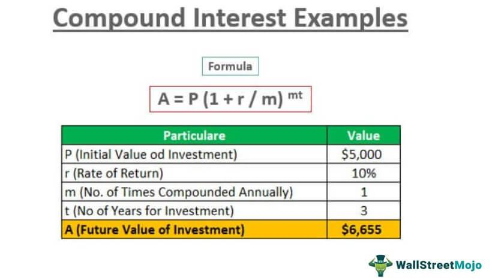

Financial derivatives are intricate financial instruments that derive their value from underlying assets such as stocks, bonds, commodities, or interest rates. They play a pivotal role in global financial markets by offering mechanisms for risk management, speculation, and price discovery. As financial markets have evolved, so too have the strategies and tools employed by market participants. This article focuses on options trading, compound options, and algorithmic trading, key components that have transformed trading strategies and amplified their potential benefits.

Options trading, one of the most prevalent methods of trading derivatives, involves contracts that provide the right, but not the obligation, to buy (call options) or sell (put options) an asset at a predetermined price before a specific date. Options allow traders to hedge against potential market downturns or to speculate on asset price movements with limited risk exposure. Within this domain, compound options—a type of option where the underlying asset is another option—further enhance strategic flexibility, enabling traders to craft complex positional structures and leverage opportunities in highly volatile markets.



Algorithmic trading has emerged as a cornerstone of modern trading strategies. By automating trade execution using predefined criteria and sophisticated statistical models, algorithmic trading enhances efficiency and accuracy, often executing trades at speeds beyond human capability. The integration of artificial intelligence and machine learning into these algorithms underscores a new frontier of trading, allowing for adaptive strategies that can respond to rapidly shifting market conditions.

This article will first provide a foundational understanding of financial derivatives, analyzing their roles, types, and the intrinsic benefits and risks they present. Following this, there will be an exploration of options trading, compound options, and how these are utilized in various market scenarios. We will then examine how algorithmic trading enhances the execution and strategic positioning in options trading, leveraging technology for optimal outcomes. The synthesis of derivatives, options, and algorithmic trading will be assessed, illustrating how these elements are collectively utilized by both institutional and individual investors. The final sections will address the associated risks, challenges, and regulatory frameworks, before exploring future trends and developments that could shape the landscape of financial trading.

This comprehensive analysis aims to equip readers with a nuanced understanding of these complex financial instruments and their integral roles in modern financial markets.

## Table of Contents

## Understanding Financial Derivatives

Financial derivatives are financial instruments whose value is derived from the performance of underlying assets, indices, or rate benchmarks. These instruments are pivotal in the financial system as they offer mechanisms for risk management, price discovery, and access to otherwise inaccessible markets. Derivatives are commonly used for hedging financial risks, engaging in speculative activities, and leveraging investment positions.

### Types of Financial Derivatives

The major types of financial derivatives include futures, options, and swaps.

1. **Futures**: These are standardized contracts obligating the buyer to purchase, or the seller to sell, a specific quantity of a commodity or financial instrument at a predetermined price and date. Traded on exchanges, futures offer transparency, liquidity, and minimization of counterparty risk through clearinghouse mechanisms.

2. **Options**: Options give the holder the right, but not the obligation, to buy (call options) or sell (put options) an underlying asset at a specified price before or at the expiration date. Options trading allows investors to benefit from market movements while limiting potential losses to the premium paid for the option.

3. **Swaps**: Swaps involve the exchange of cash flows or liabilities on differing financial instruments between two counter-parties. Common forms include interest rate swaps, where the parties exchange fixed-rate interest payments for floating-rate payments, and currency swaps, involving the exchange of principal and interest in one currency for the same in another currency.

### Benefits of Using Derivatives

Derivatives are instrumental tools in modern finance due to several key benefits:

- **Hedging**: Investors use derivatives to mitigate risks associated with price fluctuations in underlying assets. For instance, airlines often use fuel futures to hedge against volatile oil prices.

- **Speculation**: Traders seeking to profit from predicting asset price movements use derivatives to gain exposure to the market. This can be done with limited capital outlay compared to purchasing the assets outright.

- **Leverage**: Derivatives enable investors to amplify potential returns by controlling large positions with relatively small amounts of initial capital. Leverage, however, comes with amplified risk.

### Risks Associated with Derivatives

Despite their benefits, derivatives [carry](/wiki/carry-trading) significant risks that need consideration:

- **Market Risk**: The risk of losses due to changes in market prices. For instance, a drop in the value of the underlying asset can lead to losses in a derivative contract tied to that asset.

- **Counterparty Risk**: The risk that the other party to the derivative contract may default on their contractual obligations. This risk is more pronounced in over-the-counter (OTC) derivatives markets compared to exchange-traded markets where a clearinghouse often mitigates it.

- **Liquidity Risk**: Arises when a market participant cannot easily exit or enter positions without affecting the asset's price. This can be problematic in illiquid markets or during market stress periods.

In conclusion, financial derivatives are versatile instruments integral to modern financial markets. They provide significant benefits in terms of risk management and capital efficiency but require careful handling due to their inherent risks. Traders and investors must understand these dynamics when engaging in derivatives trading to effectively harness their potential while minimizing exposure to undue risks.

## Options Trading in Financial Markets

Options are financial instruments that derive their value from an underlying asset, typically stocks, indices, or commodities. These contracts grant the holder the right, but not the obligation, to buy or sell the underlying asset at a predetermined price before a specified expiration date. The two primary types of options are call options and put options. A call option gives the holder the right to purchase the asset, whereas a put option provides the right to sell the asset.

Options trading strategies are diverse and cater to various market conditions, risk appetites, and investment goals. Strategies can range from simple to complex. For example, buying a call option can be beneficial in anticipating a rise in the asset's price, while buying a put option can be advantageous in expecting a decline. More advanced strategies include the use of spreads and combinations, such as straddles, strangles, and iron condors. These strategies enable traders to profit from different [volatility](/wiki/volatility-trading-strategies) levels and market movements while managing risk.

Compound options are derivative instruments where the underlying security is another option. This complexity makes them an essential tool in trading strategies, especially in managing volatility and leveraging investment opportunities. Compound options can be categorized into two types: call on call, put on call, call on put, and put on put. For instance, a call on call option is an option to buy another call option.

To illustrate how compound options work, consider a scenario involving a European call on a call option. Suppose an investor expects significant volatility before the primary option's expiration. They might purchase a compound option that provides the right to acquire a standard call option at a later date, depending on the market's evolution. This layered approach allows traders to maintain flexibility and minimize upfront investment in highly uncertain environments. Compound options are particularly advantageous when dealing with volatile markets or assets since they enable postponing major investment decisions.

In summary, options and their trading strategies provide varied and flexible tools for investors looking to hedge risk, speculate on market directions, or leverage investments. Compound options, in particular, add an additional layer of complexity and potential, permitting adaptable and strategic decision-making in volatile trading landscapes.

## Algorithmic Trading: Enhancing Options Trading

Algorithmic trading, often referred to as algo-trading, involves the use of computer programs to trade financial securities based on predefined criteria. These criteria can include timing, pricing, or specific market conditions, enabling traders to execute large volumes of trades at speeds and frequencies that are often impossible for human traders. In the context of options trading, [algorithmic trading](/wiki/algorithmic-trading) is significant as it permits the automation of buying and selling options contracts, aiming to capitalize on short-lived market inefficiencies, optimize execution speeds, and improve overall trade accuracy.

Algorithmic trading automates complex strategies by employing a set of rules that are executed automatically. This removes the emotional and psychological aspects of trading, which can lead to errors, especially in volatile markets. For instance, a common strategy used in options trading is the "straddle," where the trader holds a position in both a call and a put with the same strike price and expiration date, betting on high market volatility. An algorithm can automatically adjust these positions based on real-time market data, thus enhancing efficiency and reducing the risk of manual errors.

Integration of options trading with algorithmic strategies can lead to improved market outcomes by enabling more sophisticated trading strategies, such as delta-neutral strategies or volatility [arbitrage](/wiki/arbitrage). These strategies benefit from the speed and precision of algorithmic execution. For example, in a delta-neutral strategy, the algorithm maintains a balance between a portfolio's delta and the market movements, adjusting the options positions dynamically to remain insensitive to small price changes in the underlying asset.

Artificial intelligence (AI) and [machine learning](/wiki/machine-learning) (ML) have further advanced algorithmic trading capabilities, allowing algorithms to learn from patterns in historical data and make predictions about future market movements. Machine learning models can analyze vast amounts of historical options data to predict the probability of specific price movements, thus enhancing decision-making in options trading. For instance, neural networks, a type of machine learning model, can be used to predict implied volatility or to time the optimal moments for buying or selling options.

The implementation of such AI-driven strategies can be seen in the following simplified Python code example, which utilizes a machine learning model to make trading decisions:

```python
# Import required libraries
import numpy as np
from sklearn.ensemble import RandomForestClassifier

# Historical options data for train and test sets
X_train, y_train = np.array([]), np.array([])  # placeholder for feature and label data
X_test = np.array([])  # placeholder for test features

# Training the model
model = RandomForestClassifier()
model.fit(X_train, y_train)

# Predicting market movements
predictions = model.predict(X_test)

# Placeholder function for executing trades based on predictions
def execute_trade(prediction):
    if prediction == 1:
        print("Execute buy option")
    elif prediction == -1:
        print("Execute sell option")

# Executing trades
for prediction in predictions:
    execute_trade(prediction)
```

Incorporating machine learning into algorithmic trading allows traders to not only automate but also continuously refine their trading strategies, adapting to new trends and data inputs. This synergy between options trading and advanced computational techniques is crucial for traders aiming to achieve consistent success in modern financial markets.

## Integrating Derivatives, Options, and Algorithmic Trading

Financial derivatives and options trading, when integrated with algorithmic trading, provide sophisticated and dynamic strategies that enable precise and efficient trade execution. Algorithmic trading, also known as algo trading, uses computer programs to execute trades based on pre-defined criteria and mathematical models. This integration leverages the strengths of each component to enhance the overall trading strategy.

**Examples of Integrated Strategies by Institutional Investors**

Institutional investors commonly employ integrated strategies where derivatives and options trading are optimized through algorithms. A popular strategy is the volatility arbitrage, which exploits pricing inefficiencies between options and their underlying assets. In this strategy, algorithms automatically identify mispriced options, enabling institutions to buy undervalued options while selling overvalued ones. This approach minimizes risk and maximizes returns by profiting from the convergence of actual volatility to implied volatility.

Another example is [statistical arbitrage](/wiki/statistical-arbitrage), where institutions utilize complex models to identify price patterns and relationships among multiple securities. For instance, pairs trading involves algorithmically buying undervalued securities and selling overvalued counterparts, capitalizing on the expectation that these securities will revert to their historical value relationship.

**Technological Democratization for Individual Investors**

Technological advancements have significantly democratized access to these strategies for individual investors. Online trading platforms now offer algorithmic trading tools that were once exclusive to institutional traders. Platforms such as MetaTrader and TradeStation provide retail investors with the ability to design and implement their own algorithms using scripting languages like Python.

Furthermore, robo-advisors have popularized algorithm-driven investment strategies, allowing individual investors to access diversified portfolios managed by sophisticated algorithms. These platforms assess investor preferences and risk tolerances to offer personalized investment plans, making advanced techniques like options trading and derivatives more accessible to the average trader.

**Potential Returns and Risks**

The integration of derivatives, options, and algorithmic trading presents significant potential returns by enabling rapid response to market conditions and exploiting profit opportunities that human traders might miss. For example, high-frequency trading ([HFT](/wiki/high-frequency-trading-strategies)) algorithms execute a large number of trades in fractions of a second, capturing minute price discrepancies across markets. This can lead to substantial cumulative gains over time.

However, these advanced strategies are not without their risks. The complexity intrinsic to derivatives and options can result in substantial losses if market conditions move unfavorably. Furthermore, algorithmic trading systems are susceptible to technical glitches, such as software bugs or system failures, which can lead to unintended trades and significant financial damage. The 2010 Flash Crash is a prime example of how algorithmic trades can exacerbate market volatility, highlighting the need for robust risk management protocols.

**Conclusion**

Integrating derivatives and options trading with algorithmic strategies offers a potent combination for achieving competitive advantages in the financial markets. The robustness of algorithmic systems allows traders to handle voluminous data and execute trades at speeds unattainable by humans. While opportunities for high returns exist, these methodologies demand careful handling of inherent risks. As technology continues to evolve and access broadens, both institutional and individual investors can harness these tools for potentially enhanced market performance.

## Risks and Challenges in Derivatives and Algorithmic Trading

Financial derivatives and algorithmic trading are pivotal components of modern financial markets, yet they carry inherent risks. Understanding and managing these risks is critical for both individual and institutional investors.

### Key Risks Associated with Derivatives and Algorithmic Trading

1. **Market Risk**: This is the risk of losses due to adverse movements in market prices. For derivatives, which are often leveraged, even small market fluctuations can lead to significant losses.

2. **Counterparty Risk**: This occurs if the counterparty to a derivative contract fails to fulfill their obligations. This risk is particularly relevant in over-the-counter (OTC) markets where there is no central clearinghouse.

3. **Liquidity Risk**: Derivatives and certain algorithmic strategies can suffer from liquidity shortages, making it difficult to enter or exit positions without affecting the market price significantly.

4. **Model Risk**: Algorithmic trading relies heavily on quantitative models which may be based on incorrect assumptions, leading to potential losses if the models fail to predict market movements accurately.

5. **Operational Risk**: The reliance on complex algorithms and computer systems introduces the possibility of technical failures, programming errors, or cyber-attacks, which could disrupt trading activities or lead to financial losses.

### Regulatory Frameworks for Risk Mitigation

Regulatory bodies, such as the Securities and Exchange Commission (SEC) in the United States, have implemented frameworks to help mitigate these risks. For instance, mandatory clearing of certain types of derivatives through central counterparties aims to reduce counterparty risk. Regulations such as the Markets in Financial Instruments Directive (MiFID II) in Europe ensure transparency and oversight in trading activities, aiding in the management of operational and market risks by mandating detailed reporting and record-keeping.

### Risk Management Techniques

Effective risk management is essential for trading derivatives and employing algorithmic strategies. Traders utilize various techniques such as:

- **Diversification**: Reducing exposure to any single asset or strategy by spreading investments across different markets and instruments.
- **Hedging**: Using derivatives to offset potential losses in a portfolio, such as buying put options to protect against downside risk.
- **Value at Risk (VaR)**: A statistical method used to estimate the potential loss in value of a portfolio under normal market conditions over a set time period.
- **Stress Testing**: Running simulations to assess how trading strategies perform under extreme market conditions or hypothetical scenarios.

### Continuous Monitoring and Adaptation

The rapid pace of technological advancements and market dynamics necessitates continuous monitoring and evolution of trading strategies. Algorithmic models should be frequently updated and validated against updated market data to remain effective. Additionally, employing techniques such as machine learning can enhance the adaptability of algorithms by enabling them to learn from new data and detect emerging patterns.

Traders and institutions must also remain vigilant of regulatory changes that can impact their trading operations and compliance requirements. Adapting trading strategies in accordance with these changes is crucial to maintaining profitability while adhering to legal standards. 

In conclusion, while derivatives and algorithmic trading offer lucrative opportunities, they require robust risk management frameworks and adaptive strategies to mitigate inherent risks, ensuring both stability and integrity in financial markets.

## Future Trends and Developments

Emerging trends in financial derivatives, options, and algorithmic trading are shaping the future of the financial markets. A prominent development is the increased integration of [artificial intelligence](/wiki/ai-artificial-intelligence) (AI) and machine learning into trading strategies. AI algorithms are now capable of processing vast datasets to identify trading patterns and predict market movements, enhancing decision-making processes. These technologies provide traders with a competitive edge by enabling real-time analysis and execution of trades, thus improving accuracy and reducing human error.

Machine learning, a subset of AI, plays a critical role by allowing systems to learn from historical data and adjust strategies accordingly. For instance, machine learning models can be used to optimize option pricing models, assess risk in portfolios by analyzing historical price movements, and determine the likelihood of future market scenarios. Implementing such advanced technologies requires sophisticated computational infrastructure and expertise, but the potential benefits in efficiency and performance are substantial.

Regulatory changes have a significant impact on trading strategies involving derivatives and options. As financial markets evolve, regulators constantly update frameworks to ensure market stability and protect investors. New regulations may address the transparency of algorithmic trading, the treatment of complex products such as compound options, and capital requirements for trading entities. These changes require market participants to adapt their strategies to remain compliant while optimizing performance. For traders, being proactive about understanding and responding to regulatory updates is essential to sustaining successful trading strategies.

Investors are increasingly adopting innovative approaches to keep pace with these technological and regulatory shifts. Many institutional investors are leveraging technology to implement more sophisticated and automated trading strategies, often integrating derivatives and options with algorithmic trading to optimize their portfolios. Individual investors, too, are gaining access to advanced tools and platforms that were once exclusive to large financial institutions, enabling them to participate in sophisticated trading strategies.

Looking ahead, the long-term outlook for derivatives, options, and algorithmic trading is promising, driven by technological advancements and evolving regulatory landscapes. The ongoing integration of AI and machine learning is likely to lead to even more refined trading algorithms, optimizing trade execution and risk management. Additionally, as the accessibility of technology improves, the barrier for entry into advanced trading strategies will decrease, democratizing access to financial innovations. This democratization, while beneficial, also necessitates heightened awareness of the associated risks and challenges. As such, both institutional and individual investors must continuously update their knowledge and adapt to changes, ensuring that they are well-positioned to leverage emerging trends for improved outcomes in the financial markets.

## Conclusion

The rapidly evolving landscape of financial markets has underscored the importance of integrating derivatives, options, and algorithmic trading to harness the full potential of modern trading strategies. Such integration offers a plethora of benefits, including improved [liquidity](/wiki/liquidity-risk-premium), precision in trading, and the ability to implement complex strategies with ease. Derivatives provide a mechanism for hedging risk, while options add flexibility and the possibility of leveraging positions in diverse market conditions. When combined with algorithmic trading, these financial instruments empower traders to execute strategies with greater speed, accuracy, and reduced transaction costs.

However, the intertwined nature of these strategies also presents significant challenges. The complexity inherent in derivatives and options can lead to substantial financial risks if not managed properly. Algorithmic trading, while efficient, can amplify these risks if algorithms malfunction or market conditions change unexpectedly. Consequently, it is critical for investors to deploy rigorous risk management protocols and remain vigilant in monitoring market dynamics.

Investors and traders are encouraged to deepen their understanding of these advanced strategies through continuous education and analysis. The intricate nature of derivatives, options, and algorithmic trading necessitates a strong foundation in financial theory and practical application. By doing so, traders can make informed decisions that optimize returns while mitigating risks.

Moreover, the financial landscape is dynamically shaped by technological advancements and regulatory transformations. As artificial intelligence and machine learning continue to integrate into trading systems, they hold the promise of further enhancing predictive capabilities and strategic execution. Nonetheless, staying abreast of regulatory developments is equally crucial, as compliance ensures sustainable practices and market integrity.

In summary, the convergence of derivatives, options, and algorithmic trading forms a cornerstone of modern financial markets. Their integration offers immense potential to achieve superior investment performance but requires a mindful approach to the inherent challenges. Embracing technological innovations and adapting to regulatory landscapes are imperative for success in the contemporary trading paradigm.

## References & Further Reading

1. **Hull, J. C. (2017). Options, Futures, and Other Derivatives.** This book is a comprehensive resource on financial derivatives, offering detailed insights into the pricing and application of futures, options, and other derivative products. Hull's work is often used in academic settings and provides both theoretical and practical perspectives on derivatives.

2. **Black, F., & Scholes, M. (1973). The Pricing of Options and Corporate Liabilities. Journal of Political Economy, 81(3), 637–654.** This seminal paper introduced the Black-Scholes model, a foundational framework for pricing European-style options. It is a critical read for understanding the mathematical underpinnings of option pricing.

3. **Kolb, R. W., & Overdahl, J. A. (2010). Financial Derivatives: Pricing and Risk Management.** A practical guide covering the pricing and risk management of various derivative products, this book is suitable for both practitioners and academics.

4. **Narang, R. K. (2013). Inside the Black Box: A Simple Guide to Quantitative and High Frequency Trading.** Narang's work explains the mechanics behind algorithmic trading and the technological advances driving this field, offering insights into both quants and traditional finance professionals.

5. **Chan, E. (2009). Quantitative Trading: How to Build Your Own Algorithmic Trading Business.** This book provides a step-by-step guide to building a trading business using algorithmic strategies, addressing both the technical component and the business environment needed for successful trading.

6. **Official Website of the Commodity Futures Trading Commission (CFTC):** [cftc.gov](https://www.cftc.gov) The CFTC is responsible for regulating the U.S. derivatives markets. Their website provides information on regulatory updates, market data, and educational resources on derivatives trading.

7. **Library of Documents from the International Swaps and Derivatives Association (ISDA):** [isda.org](https://www.isda.org) ISDA's resources include research papers, industry standards, and regulatory updates focused on swaps and derivatives trading.

8. **Research Papers from the Journal of Financial Economics:** This journal publishes high-quality research papers in financial economics, including many articles focused on derivatives, options, and trading strategies. Access through academic libraries or [Journal of Financial Economics on Elsevier](https://www.journals.elsevier.com/journal-of-financial-economics).

9. **The World of Trading Algorithms: A Beginner's Guide to Algorithmic Trading:** Explore resources on platforms like [QuantInsti](https://www.quantinsti.com) and [Kaggle](https://www.kaggle.com) for tutorials and datasets that are useful in algorithmic trading.

These resources can aid in gaining a deeper understanding and provide practical insights into the world of financial derivatives, options, and algorithmic trading, thereby enhancing one's knowledge and capability in modern financial markets.

