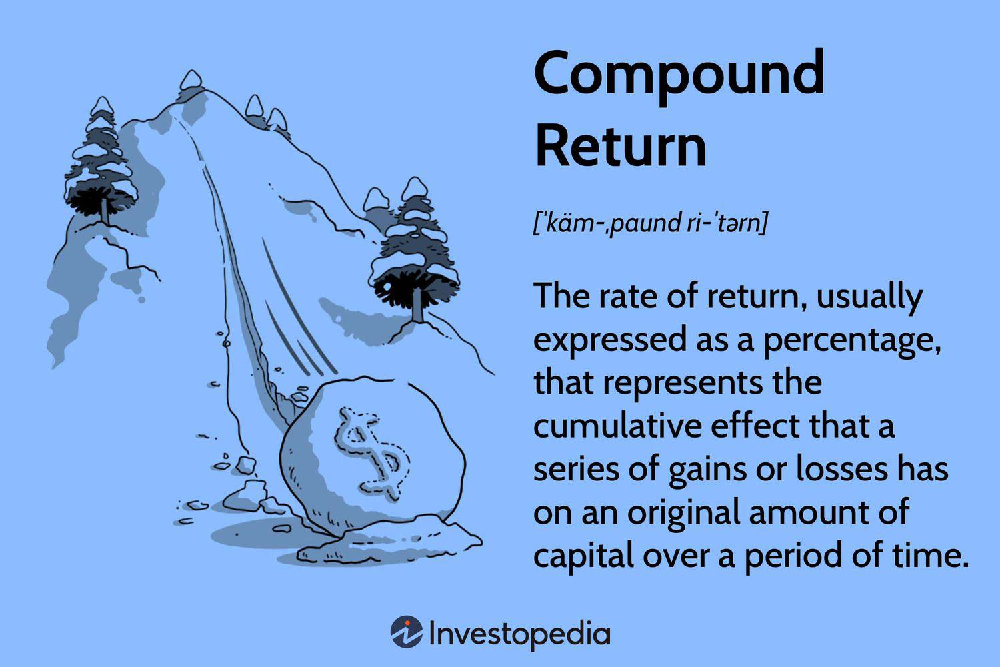

In the ever-evolving world of finance, understanding investment returns and market strategies plays a crucial role for investors. As financial landscapes change, gaining insight into the mechanics of compound returns—where reinvested earnings contribute to growth—becomes essential. Compound return offers a nuanced view of how investments can grow over time compared to straightforward metrics like simple or average returns.

This article explores compound return investment calculation, financial analysis, and algorithmic trading—a triad pivotal in crafting informed investment strategies. Compound returns, often quantified using the compound annual growth rate (CAGR), provide a smoothed representation of annual growth, revealing the potential trajectory of investments over extended periods.



Financial analysis complements compound return calculations by assessing investments' performance, risks, and returns. It employs various metrics to identify opportunities and mitigate risks, empowering investors with a deeper understanding of market dynamics. Furthermore, algorithmic trading leverages these insights by employing computer programs to execute trades based on predefined criteria, reducing human error and capitalizing on market inefficiencies.

Exploring each of these components, from the fundamentals of compound return calculations to the role of comprehensive financial analysis and algorithmic trading, offers investors a toolkit to optimize their investment strategies. By understanding and integrating these elements, investors can enhance their ability to make informed, strategic decisions in pursuit of long-term financial success. Join us as we analyze the metrics that empower investors to optimize their financial strategies.

## Table of Contents

## Understanding Compound Return

Compound return is a pivotal concept in the landscape of investing, influencing how the value of an investment accumulates over time through the reinvestment of earnings. Unlike simple interest, where earnings are solely based on the initial principal, compound interest leverages both the principal and previously accumulated earnings to generate returns. This exponential growth framework can significantly enhance the value of an investment, particularly over long time horizons.

A critical tool for understanding and interpreting compound returns is the Compound Annual Growth Rate (CAGR). CAGR provides a smoothed annual rate of growth over a specified time period, assuming the value of the investment grows at a constant rate each year. It is calculated using the formula:

$$
\text{CAGR} = \left( \frac{\text{End Value}}{\text{Start Value}} \right)^{\frac{1}{\text{n}}} - 1
$$

where "End Value" is the value of the investment at the end of the period, "Start Value" is the initial investment value, and "n" represents the number of years in the period. CAGR is invaluable for investors seeking to understand the growth trajectory of an investment in a clear and concise manner, free from the volatility of short-term fluctuations.

The importance of compound returns in investment strategies cannot be overstated. Compound returns enable investors to capitalize on the "snowball effect," whereby returns continually build upon one another. This effect is particularly pronounced in long-term investments, where minor differences in annual yields can lead to substantial variances in final outcomes.

Moreover, compound return is often considered a more accurate measure than average annual returns. The average annual return is a simple arithmetic mean that can be skewed by extreme values, failing to account for the effects of [volatility](/wiki/volatility-trading-strategies) and the reinvestment of returns, which are crucial factors in a true representation of investment performance.

Understanding compound return allows investors to make more informed decisions about the allocation of their resources. By recognizing the power of compounding, investors can identify opportunities where reinvesting earnings may yield significant benefits, ultimately enhancing portfolio performance and achieving long-term financial goals.

## Calculating Compound Returns: A Step-by-Step Guide

Calculating compound returns is a foundational skill in financial analysis, allowing investors to understand how their investments grow over time by reinvesting earnings. The compound return is typically calculated using the formula:

$$

CR = (FV / PV)^{1/n} - 1 
$$

where $CR$ represents the compound return, $FV$ is the future value of the investment, $PV$ is the present value (the initial investment), and $n$ is the number of periods (usually years).

### Example Calculation

Consider an investment where the initial amount is $10,000, and after 5 years, the investment grows to $16,105. The compound return can be calculated as follows:

$$

CR = (16,105 / 10,000)^{1/5} - 1 
$$

$$

CR = (1.6105)^{0.2} - 1 
$$

$$

CR \approx 0.10 \text{ or } 10\%
$$

This result implies the investment has grown at an average rate of 10% per year over the 5-year period.

### Utilizing Python for Compound Return Calculations

Python, with its intuitive syntax and powerful libraries, offers a straightforward approach for calculating compound returns. Below is a sample Python code snippet that demonstrates this calculation:

```python
def calculate_compound_return(initial_value, final_value, periods):
    return (final_value / initial_value)**(1 / periods) - 1

initial_investment = 10000
final_value = 16105
years = 5

compound_return = calculate_compound_return(initial_investment, final_value, years)
print(f"The Compound Return is: {compound_return:.2%}")
```

Running this code will output:

```
The Compound Return is: 10.00%
```

### Empowering Investors with Data-Driven Decisions

By mastering compound return calculations, investors gain insights into the true performance of their investments. This knowledge aids in making informed decisions backed by quantitative analysis. Equipped with programming skills like Python, investors have the tools to seamlessly perform these calculations, offering the flexibility to analyze various investment scenarios and assess potential growth accurately. Such analyses underpin evidence-based decision-making, fostering greater confidence in financial strategy development.

## Importance of Financial Analysis in Investment

Financial analysis is a critical component in investment decision-making, offering deep insights into the performance, risks, and returns of various financial products. It provides investors with the necessary tools to evaluate and compare investment opportunities, empowering them to make informed choices that align with their financial goals.

One of the primary roles of financial analysis is to assess the viability and potential profitability of investment opportunities. By employing various quantitative and qualitative techniques, investors can gauge the health of an asset or portfolio, identifying trends and patterns that may not be immediately apparent. This aspect of analysis often includes studying financial statements, understanding economic conditions, and evaluating market trends and company performance indicators.

Key tools and metrics used in financial analysis complement the calculation of compound returns. Among these, the price-to-earnings ratio (P/E ratio), return on equity (ROE), and debt-to-equity ratio are common. Each metric serves a distinct purpose: the P/E ratio helps assess stock value relative to earnings, ROE gauges how effectively management is using equity to generate profits, and the debt-to-equity ratio indicates financial leverage. Such metrics provide an additional layer of understanding, amplifying the insights gained from analyzing compound returns.

Financial analysis plays a pivotal role in strategic investment decisions. By systematically evaluating the potential outcomes and associated risks, investors can allocate their resources more effectively. This process often involves scenario analysis and stress testing to forecast different investment conditions. For instance, by using Python and libraries such as Pandas and NumPy, investors can simulate various market scenarios and observe potential impacts on investment portfolios. An example Python script to achieve this might involve modeling future cash flows or stock prices using Monte Carlo simulations, thus allowing investors to build robust and diversified portfolios:

```python
import numpy as np
import pandas as pd

def monte_carlo_simulation(start_price, days, mu, sigma, num_simulations):
    simulations = np.zeros((days, num_simulations))
    for sim in range(num_simulations):
        prices = [start_price]
        for day in range(days):
            daily_return = np.random.normal(loc=mu, scale=sigma)
            price = prices[-1] * (1 + daily_return)
            prices.append(price)
        simulations[:, sim] = prices
    return simulations

# Example parameters
start_price = 100
days = 252  # Number of trading days in a year
mu = 0.0002  # mean daily return
sigma = 0.01  # standard deviation of daily returns
num_simulations = 1000

simulation_results = monte_carlo_simulation(start_price, days, mu, sigma, num_simulations)
simulation_df = pd.DataFrame(simulation_results)

# Analyze results
expected_end_prices = simulation_df.iloc[-1].mean()
print("Expected end price:", expected_end_prices)
```

Ultimately, financial analysis aids investors by offering a comprehensive view that blends stability and growth potential, allowing for sophisticated risk assessment and strategic planning. By integrating metrics and simulating outcomes, investors can better navigate the complexities of financial markets, paving the way for long-term investment success.

## Algorithmic Trading and Its Role in Financial Markets

Algorithmic trading employs computer algorithms to automate the process of buying and selling securities in financial markets. These programs execute trades based on predefined criteria set by traders, such as timing, price, [volume](/wiki/volume-trading-strategy), or other mathematical models. The primary advantage of [algorithmic trading](/wiki/algorithmic-trading) is its ability to process vast amounts of data at speeds unattainable by humans, thereby enabling traders to capitalize on market inefficiencies promptly and with precision.

One significant benefit of algorithmic trading is the reduction of human-induced errors often associated with trading. By relying on rigorous, data-driven decision-making, these algorithms minimize emotional biases and inconsistencies. Moreover, algorithmic trading facilitates high-frequency trading ([HFT](/wiki/high-frequency-trading-strategies)), which involves executing a large number of orders across different markets and assets in a short time frame to capture small price discrepancies. This rapid execution capability can lead to improved [liquidity](/wiki/liquidity-risk-premium) and narrower bid-ask spreads in the market.

The Compound Annual Growth Rate (CAGR) is a pivotal metric used in evaluating the performance of algorithmic trading strategies. It provides an annualized rate of return, smoothed over a specified period, allowing traders to assess compounded returns of an algorithm accurately. By comparing CAGR values, traders can determine the effectiveness of different algorithms and make informed decisions about which strategies to deploy. The formula for CAGR is:

$$

\text{CAGR} = \left( \frac{\text{Ending Value}}{\text{Beginning Value}} \right)^{\frac{1}{n}} - 1 
$$

where $n$ is the number of years.

Despite its advantages, algorithmic trading is not without its drawbacks. One primary concern is the systemic risk introduced by the automation of trading processes, particularly when many algorithms operate based on similar strategies, potentially leading to market distortions. Additionally, technological failures and programming errors can result in unintended consequences, such as the infamous "flash crashes." Furthermore, while algorithmic trading can optimize investment returns through precise execution, it may also contribute to increased market volatility. This is particularly pronounced when trading algorithms trigger automatic selling based on market signals, potentially exacerbating downward price movements.

In conclusion, while algorithmic trading offers substantial benefits in terms of efficiency and data-driven precision, it also necessitates careful consideration of associated risks. Financial markets benefit from the liquidity and efficiency enhancements provided by such trading, but the need for robust risk management practices and oversight mechanisms remains critical to mitigate potential negative impacts.

## Evaluating Trading Strategies with CAGR

CAGR, or Compound Annual Growth Rate, is a critical tool for evaluating the performance of trading strategies. It represents the geometric progression ratio that transposes the initial investment value to the final investment value, assuming the investment has been compounding over the period. This metric is invaluable, as it enables investors to assess the average growth of their investments on an annual basis, accounting for compounding effects.

To understand the implications of CAGR for long-term investment success, consider its calculation:

$$
\text{CAGR} = \left( \frac{\text{Ending Value}}{\text{Beginning Value}} \right)^{\frac{1}{n}} - 1
$$

where $n$ represents the number of years the investment is held. The CAGR provides a normalized representation of an investment's growth, smoothing out volatility and giving a clear picture of the strategy's effectiveness.

When determining what constitutes a 'good' CAGR within different trading contexts, several factors come into play. A high CAGR might indicate strong performance, but it should always be evaluated against the backdrop of risk. For instance, a CAGR of 10% could be considered excellent if the associated volatility is low, but the same rate might be inadequate if it comes with high risk or during bullish market conditions. 

The balance between striving for a higher CAGR and managing the associated risks is essential. Investors must be cautious of strategies that emphasize high CAGR without adequately addressing risk management. High returns can sometimes mask underlying risks, leading to potential losses in adverse market conditions. Therefore, diversifying investments and employing risk-adjusted metrics alongside CAGR is advisable to ensure robust strategy evaluation.

Ultimately, while CAGR is a powerful indicator of past performance and growth potential, it should not be the sole metric guiding investment decisions. A comprehensive analysis considering other risk-adjusted performance metrics can provide a deeper understanding of a strategy's true efficacy and align it better with the investor's long-term goals.

## Integrating Diverse Metrics for Comprehensive Analysis

Relying solely on the Compound Annual Growth Rate (CAGR) for evaluating investment performance can be limiting as it provides a smoothed average return, potentially masking the true variability of returns over time. To obtain a comprehensive analysis, investors and traders often integrate additional metrics such as volatility, maximum drawdown, and the Sharpe ratio.

**Volatility** serves as an essential indicator of the degree of variation in an asset's trading price. It reflects the extent to which returns fluctuate over a particular period. High volatility suggests larger price swings and adds an extra layer of risk to the investment. By analyzing volatility alongside CAGR, investors can gauge not only potential returns but also understand the likelihood of those returns deviating from expectations. Python's `numpy` library can be used to calculate historical volatility as shown below:

```python
import numpy as np

# Example daily returns of an asset
daily_returns = np.array([-0.01, 0.02, 0.005, -0.002, 0.01])
# Calculate volatility
volatility = np.std(daily_returns)
print(volatility)
```

**Maximum drawdown** represents the largest peak-to-trough decline in the value of an investment portfolio before a new peak is achieved. This metric provides insight into the potential losses an investor can endure. While a high CAGR might be appealing, significant drawdowns can erode investment confidence and capital. An example of calculating maximum drawdown:

```python
def max_drawdown(returns):
    cumulative_returns = (1 + returns).cumprod()  # Calculate cumulative returns
    peak = np.maximum.accumulate(cumulative_returns)  # Identify peak values
    drawdown = (cumulative_returns - peak) / peak  # Calculate drawdown
    return drawdown.min()

# Example daily returns of an asset
daily_returns = np.array([-0.01, 0.02, 0.005, -0.002, 0.01])
# Calculate maximum drawdown
max_dd = max_drawdown(daily_returns)
print(max_dd)
```

**Sharpe ratio** quantifies the return of an investment compared to its risk. It is calculated by subtracting the risk-free rate from the investment return and dividing the result by the investment's standard deviation of returns. A higher Sharpe ratio indicates a more attractive risk-adjusted return. It helps in assessing how well the returns compensate for the risk undertaken. Calculation with `numpy`:

```python
risk_free_rate = 0.01  # Example risk-free rate
asset_returns = np.mean(daily_returns)
sharpe_ratio = (asset_returns - risk_free_rate) / volatility
print(sharpe_ratio)
```

Integrating these diverse metrics gives investors a multidimensional perspective of their portfolios, enhancing strategy refinement and informed decision-making. This holistic view is crucial for aligning investments with risk tolerance and financial goals, ensuring that strategies are not solely based on past returns but balanced with consideration for potential risks and consistency.

## Conclusion

The compound return, financial analysis, and algorithmic trading strategies are crucial elements for achieving success in today’s dynamic financial markets. Compound returns provide a more accurate depiction of an investment's growth potential by accounting for reinvested earnings, offering investors a deeper understanding than simple average returns. Integrating multiple metrics, such as the Compound Annual Growth Rate (CAGR), with other analytical tools like volatility and Sharpe ratio, ensures a comprehensive evaluation of investment performance. 

CAGR alone can provide insights, but a balanced evaluation requires a multi-metric approach. Investors need to adapt their strategies continually, taking into account both historical data and prevailing market conditions. Technological advancements in algorithmic trading further enable investors to automate and refine decision-making processes, maximizing efficiency and reducing the susceptibility to human error.

To achieve long-term growth and financial stability, staying informed about financial trends and implementing flexible strategies is essential. By continuously evaluating performance through a combination of metrics and incorporating automated solutions, investors can maintain a competitive edge in the constantly shifting economic landscape.

## FAQs

**What does CAGR stand for, and why is it important?**

CAGR stands for Compound Annual Growth Rate. It is a metric that provides a smoothed annual rate of return over a specified period, assuming that profits are reinvested at the end of each year. Mathematically, it is calculated using the formula:

$$
\text{CAGR} = \left( \frac{\text{Ending Value}}{\text{Beginning Value}} \right)^{\frac{1}{n}} - 1
$$

where $n$ represents the number of years.

CAGR is important because it offers a realistic measure of an investment’s return over time, which aids in comparing the performance of different investments. It smooths out volatile year-over-year growth rates, offering investors a concise tool to assess an investment's past performance or predict future growth.

**How is compound return different from simple return?**

Compound return involves reinvesting earnings at each period's end, leading to exponential growth over time. In contrast, simple return assumes that earnings are not reinvested, reflecting a linear growth pattern. The main difference lies in how interest or returns are accumulated; compound returns yield interest on both the initial principal and accumulated returns, effectively accelerating growth. Simple return, however, would be calculated as:

$$
\text{Simple Return} = \frac{\text{Ending Value} - \text{Beginning Value}}{\text{Beginning Value}}
$$

Compound returns more accurately reflect the impact of long-term growth strategies on investment due to reinvestment, whereas simple returns can understate the growth potential in such scenarios.

**What are the benefits and limitations of using algorithmic trading?**

Algorithmic trading leverages computational algorithms to automatically execute trades based on pre-set criteria. 

*Benefits:*
- **Speed and Efficiency:** Algorithms can process data and execute trades much faster than a human, capturing opportunities as they arise.
- **Minimized Human Emotion:** It removes emotional and psychological factors from trading decisions, thus reducing human error.
- **Market Exploration:** Algorithms can handle vast data sets, identifying patterns or inefficiencies humans may overlook.

*Limitations:*
- **Complexity and Maintenance:** Developing and maintaining effective algorithms requires expertise and can be resource-intensive.
- **System Failures:** Technical malfunctions or errors in the algorithm may lead to significant losses.
- **Market Impact:** High-frequency trading can exacerbate market volatility, impacting overall stability.

**How can investors reduce risks associated with high CAGR investments?**

While a high CAGR is attractive, it may also entail higher risk. To mitigate these risks, investors should:

1. **Diversify Investments:** Spread investments across various asset classes to minimize the impact of any single investment's poor performance.

2. **Risk Adjusted Metrics:** Utilize risk-adjusted return measures such as the Sharpe Ratio to assess the level of risk associated with the returns.

3. **Regular Portfolio Review:** Continuously monitor investment performance and market conditions to ensure alignment with risk tolerance and investment goals.

4. **Set Stop-Loss Orders:** Implement stop-loss strategies to protect against substantial losses by automatically selling off investments when they hit a predefined price.

By blending these strategies, investors can aim to achieve a balanced approach that captures potential growth while minimizing exposure to undue risk.

## References & Further Reading

[1]: Harvey, C. R., Liu, Y., & Zhu, H. (2016). ["… and the Cross-Section of Expected Returns."](https://people.duke.edu/~charvey/Research/Published_Papers/P118_and_the_cross.PDF) Journal of Finance, 71(1), 69–143.

[2]: Bodie, Z., Kane, A., & Marcus, A. J. (2014). ["Investments"](https://www.mheducation.com/highered/product/Investments-Bodie.html) (10th ed.). McGraw-Hill Education.

[3]: "Algorithmic Trading: Winning Strategies and Their Rationale" by Ernest P. Chan, 2013. This book offers insights into developing algorithmic trading strategies.

[4]: "Quantitative Momentum: A Practitioner's Guide to Building a Momentum-Based Stock Selection System" by Wesley R. Gray and Jack R. Vogel, 2016. This book discusses momentum trading strategies and their applications.

[5]: Dr. Kirk Borne, "Algorithmic Trading: Computational Challenges and Opportunities" in IEEE Workshop on Computational Intelligence for Financial Engineering & Economics (CIFEr), 2014.

[6]: Malkiel, B. G. (2019). ["A Random Walk Down Wall Street: The Time-Tested Strategy for Successful Investing"](https://yourknowledgedigest.org/wp-content/uploads/2020/04/a-random-walk-down-wall-street.pdf) (12th ed.). W. W. Norton & Company.

[7]: "Python for Finance: Analyze Big Financial Data" by Yves Hilpisch, 2018. This book provides resources for using Python in financial data analysis.