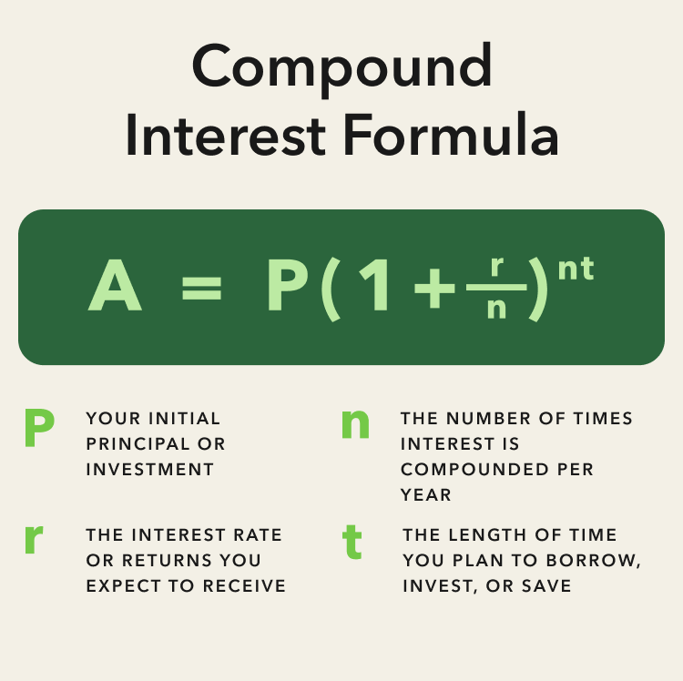

## Table of Contents

## What is compound return?

Compound return is the total growth of an investment over time, taking into account the effect of earning interest on both the initial amount and the interest that has been added to it. Imagine you put money in a savings account. Each year, you earn interest on your money. The next year, you earn interest not just on the money you originally put in, but also on the interest you earned the year before. This is compounding, and it makes your money grow faster over time.

To understand compound return better, think of it like a snowball rolling down a hill. As it rolls, it picks up more snow, getting bigger and bigger. The longer it rolls, the larger it becomes. Similarly, the longer you leave your money to compound, the more it grows. This is why starting to save or invest early can make a big difference in the long run, as the effects of compound return become more significant over time.

## How does compound return differ from simple return?

Compound return and simple return are two ways to measure how much your money grows over time, but they work differently. Simple return is easy to understand. It's when you earn interest only on the money you originally put in, not on any interest you've earned before. So, if you put $100 in a savings account that gives you 10% interest each year, with a simple return, you'll get $10 every year, no matter how long you keep the money in the account.

Compound return, on the other hand, is like a snowball effect. You earn interest not just on your original money, but also on the interest that gets added to your account. Using the same example, if you start with $100 and get 10% interest each year, after the first year, you'll have $110. The next year, you'll earn 10% on $110, so you'll get $11 more, making your total $121. This keeps happening, and your money grows faster than with simple return because you're [earning](/wiki/earning-announcement) interest on a bigger and bigger amount every year.

## Why is compound return important in investing?

Compound return is really important in investing because it makes your money grow faster over time. Imagine you put money in an investment that earns interest. With compound return, you don't just earn interest on the money you put in at the start. You also earn interest on the interest you've already earned. This means your money can grow a lot more than if you were just earning interest on the original amount. It's like a snowball rolling down a hill, getting bigger and bigger as it goes.

This is why starting to invest early can be a big advantage. The longer your money is invested, the more time it has to compound. Even small amounts can grow into much larger sums over many years because of compound return. It's a powerful way to build wealth over time, and it's why people say that time is one of the most important factors in investing. The earlier you start, the more you can benefit from the magic of compounding.

## What is the formula for calculating compound return?

The formula for calculating compound return is A = P(1 + r/n)^(nt). In this formula, A is the amount of money you end up with after compounding, P is the amount of money you start with, r is the yearly [interest rate](/wiki/interest-rate-trading-strategies) (as a decimal), n is the number of times the interest is compounded each year, and t is the number of years you keep the money invested.

To use this formula, let's say you start with $1000, the interest rate is 5% per year, and it's compounded monthly (which means 12 times a year). If you keep your money in for 10 years, you would plug in these numbers: P = 1000, r = 0.05, n = 12, and t = 10. The calculation would be A = 1000(1 + 0.05/12)^(12*10). This would give you the total amount after 10 years of compounding.

## Can you explain the concept of compounding periods?

Compounding periods are how often the interest on your money gets added to your account. If you have money in a savings account or an investment, the interest might be added every day, every month, or even just once a year. This is called the compounding period. The more often the interest is added, the faster your money grows because you start earning interest on the new, bigger amount sooner.

Think of it like watering a plant. If you water a plant every day, it grows faster than if you water it once a week. The same goes for your money. If the interest is added every day, your money grows a little bit every day. If it's added every month, you have to wait longer between each growth spurt. Over time, more frequent compounding periods can make a big difference in how much your money grows.

## How do you calculate the compound annual growth rate (CAGR)?

The compound annual growth rate (CAGR) is a way to figure out how much an investment grows each year on average over a certain period of time. It's like looking at the average speed of a car over a long trip. To calculate it, you need to know the starting value of your investment, the ending value, and how many years you held the investment. The formula for CAGR is: CAGR = (Ending Value / Starting Value)^(1 / Number of Years) - 1. This gives you a yearly growth rate that takes into account the effect of compounding.

For example, if you started with $1,000 and it grew to $1,728 over 3 years, you would plug these numbers into the formula. So, CAGR = ($1,728 / $1,000)^(1/3) - 1. This works out to be about 0.2 or 20% per year. This means your investment grew at an average rate of 20% each year, considering the compounding effect. It's a useful number because it helps you understand the true growth rate of your investment over time, smoothing out the ups and downs that might happen year to year.

## What are the effects of different compounding frequencies on returns?

Different compounding frequencies can make a big difference in how much your money grows over time. If interest is added to your account more often, like every day or every month, your money grows faster than if it's added less often, like once a year. This is because with more frequent compounding, you start earning interest on the new, bigger amount sooner. It's like watering a plant every day instead of once a week - the plant grows faster with more frequent watering.

For example, if you have $1,000 in an account with a 10% annual interest rate, the amount you end up with after one year depends on how often the interest is compounded. If it's compounded yearly, you'll have $1,100 at the end of the year. But if it's compounded monthly, you'll have a bit more, around $1,104.71, because you're earning interest on a slightly bigger amount each month. Over many years, these small differences can add up to a lot more money.

## How can compound return be used to compare investment options?

Compound return is a powerful tool for comparing different investment options because it shows you how much your money can grow over time, taking into account the magic of compounding. Imagine you're looking at two different savings accounts. One offers a 5% annual interest rate compounded yearly, while the other offers a 4.5% rate but compounds monthly. Even though the second account has a lower interest rate, the more frequent compounding might make it a better choice in the long run because your money grows a little bit every month instead of just once a year.

To compare these investments, you can use the formula for compound return to see which one will give you more money after a certain number of years. For example, if you start with $1,000 and plan to leave it in the account for 10 years, you can plug the numbers into the formula and see that the account with the 4.5% rate compounded monthly might end up giving you more money than the one with the 5% rate compounded yearly. This helps you make a smarter choice about where to put your money, based on how much it will grow over time.

## What are the limitations of using compound return for investment analysis?

While compound return is a great way to see how much your money can grow over time, it doesn't tell you everything about an investment. One big thing it doesn't show is risk. Some investments might promise high returns, but they can also be very risky. If you put your money in a risky investment, you might lose some or all of it. Compound return doesn't take into account these ups and downs, so it might make an investment look better than it really is.

Another limitation is that compound return assumes the interest rate stays the same over time. But in real life, interest rates can go up or down. If you're looking at a long-term investment, the rate might change a lot. Also, compound return doesn't consider things like taxes or fees that can eat into your returns. So, while it's useful for understanding how compounding works, you need to look at other things too to get the full picture of an investment.

## How do taxes and inflation impact compound returns?

Taxes and inflation can really change how much money you end up with from compound returns. When you earn interest on your money, you might have to pay taxes on that interest. This means you don't get to keep all the money you earn. If you're in a savings account that gives you 5% interest but you have to pay 20% tax on that interest, you're only keeping 4% of the interest. Over time, this can make a big difference in how much your money grows because you're compounding on a smaller amount after taxes.

Inflation is another thing that can eat into your compound returns. Inflation means that the price of things goes up over time, so the money you have today might not buy as much in the future. If your investment is growing at 3% a year but inflation is 2%, your real return is only 1%. This means your money isn't growing as fast as it seems because the value of each dollar is going down. Both taxes and inflation can make your compound returns look smaller than they do on paper, so it's important to think about them when you're planning your investments.

## Can you provide an example of calculating compound return over multiple periods?

Let's say you start with $1,000 and put it in a savings account that gives you 5% interest each year, compounded annually. After the first year, you'll have $1,050 because 5% of $1,000 is $50. In the second year, you'll earn 5% interest on the new amount of $1,050, which is $52.50. So, at the end of the second year, you'll have $1,102.50. This keeps going for as many years as you leave your money in the account. If you want to know how much you'll have after 5 years, you can use the compound return formula: A = P(1 + r/n)^(nt). Plugging in the numbers, A = 1000(1 + 0.05/1)^(1*5), which gives you about $1,276.28.

Now, let's see what happens if the interest is compounded more often, like monthly. If you start with the same $1,000 and the interest rate is still 5% a year, but it's compounded monthly, you'll have a different result. After the first month, you'll have $1,004.17 because 5% divided by 12 months is about 0.417%, and 0.417% of $1,000 is $4.17. In the second month, you'll earn interest on $1,004.17, and so on. After a year, you'll have about $1,051.16 instead of $1,050. Over 5 years, using the compound return formula with monthly compounding, A = 1000(1 + 0.05/12)^(12*5), you'll end up with about $1,283.36. That's a bit more than with annual compounding because you're earning interest more often.

## How do advanced investors use compound return in portfolio optimization?

Advanced investors use compound return to figure out the best way to grow their money over time. They look at different investments and use the compound return formula to see which ones will give them the most money in the future. This helps them decide where to put their money to get the best results. They might compare things like stocks, bonds, and savings accounts to see which ones will compound the best. By understanding how compound return works, they can make smarter choices and build a portfolio that grows as much as possible.

They also think about how often the interest is added, or compounded, because this can make a big difference in the long run. For example, they might choose an investment that compounds monthly instead of yearly because it can lead to more money over time. Advanced investors also consider things like taxes and inflation, which can eat into their returns. By taking all these things into account, they can use compound return to create a well-balanced portfolio that not only grows but also fits their risk level and financial goals.

## What is Understanding Compound Return?

Compound return is a pivotal concept in the landscape of investing, influencing how the value of an investment accumulates over time through the reinvestment of earnings. Unlike simple interest, where earnings are solely based on the initial principal, compound interest leverages both the principal and previously accumulated earnings to generate returns. This exponential growth framework can significantly enhance the value of an investment, particularly over long time horizons.

A critical tool for understanding and interpreting compound returns is the Compound Annual Growth Rate (CAGR). CAGR provides a smoothed annual rate of growth over a specified time period, assuming the value of the investment grows at a constant rate each year. It is calculated using the formula:

$$
\text{CAGR} = \left( \frac{\text{End Value}}{\text{Start Value}} \right)^{\frac{1}{\text{n}}} - 1
$$

where "End Value" is the value of the investment at the end of the period, "Start Value" is the initial investment value, and "n" represents the number of years in the period. CAGR is invaluable for investors seeking to understand the growth trajectory of an investment in a clear and concise manner, free from the volatility of short-term fluctuations.

The importance of compound returns in investment strategies cannot be overstated. Compound returns enable investors to capitalize on the "snowball effect," whereby returns continually build upon one another. This effect is particularly pronounced in long-term investments, where minor differences in annual yields can lead to substantial variances in final outcomes.

Moreover, compound return is often considered a more accurate measure than average annual returns. The average annual return is a simple arithmetic mean that can be skewed by extreme values, failing to account for the effects of [volatility](/wiki/volatility-trading-strategies) and the reinvestment of returns, which are crucial factors in a true representation of investment performance.

Understanding compound return allows investors to make more informed decisions about the allocation of their resources. By recognizing the power of compounding, investors can identify opportunities where reinvesting earnings may yield significant benefits, ultimately enhancing portfolio performance and achieving long-term financial goals.

## How do you calculate compound returns: A step-by-step guide?

Calculating compound returns is a foundational skill in financial analysis, allowing investors to understand how their investments grow over time by reinvesting earnings. The compound return is typically calculated using the formula:

$$

CR = (FV / PV)^{1/n} - 1 
$$

where $CR$ represents the compound return, $FV$ is the future value of the investment, $PV$ is the present value (the initial investment), and $n$ is the number of periods (usually years).

### Example Calculation

Consider an investment where the initial amount is $10,000, and after 5 years, the investment grows to $16,105. The compound return can be calculated as follows:

$$

CR = (16,105 / 10,000)^{1/5} - 1 
$$

$$

CR = (1.6105)^{0.2} - 1 
$$

$$

CR \approx 0.10 \text{ or } 10\%
$$

This result implies the investment has grown at an average rate of 10% per year over the 5-year period.

### Utilizing Python for Compound Return Calculations

Python, with its intuitive syntax and powerful libraries, offers a straightforward approach for calculating compound returns. Below is a sample Python code snippet that demonstrates this calculation:

```python
def calculate_compound_return(initial_value, final_value, periods):
    return (final_value / initial_value)**(1 / periods) - 1

initial_investment = 10000
final_value = 16105
years = 5

compound_return = calculate_compound_return(initial_investment, final_value, years)
print(f"The Compound Return is: {compound_return:.2%}")
```

Running this code will output:

```
The Compound Return is: 10.00%
```

### Empowering Investors with Data-Driven Decisions

By mastering compound return calculations, investors gain insights into the true performance of their investments. This knowledge aids in making informed decisions backed by quantitative analysis. Equipped with programming skills like Python, investors have the tools to seamlessly perform these calculations, offering the flexibility to analyze various investment scenarios and assess potential growth accurately. Such analyses underpin evidence-based decision-making, fostering greater confidence in financial strategy development.

## What is the role of algorithmic trading in financial markets?

Algorithmic trading employs computer algorithms to automate the process of buying and selling securities in financial markets. These programs execute trades based on predefined criteria set by traders, such as timing, price, [volume](/wiki/volume-trading-strategy), or other mathematical models. The primary advantage of [algorithmic trading](/wiki/algorithmic-trading) is its ability to process vast amounts of data at speeds unattainable by humans, thereby enabling traders to capitalize on market inefficiencies promptly and with precision.

One significant benefit of algorithmic trading is the reduction of human-induced errors often associated with trading. By relying on rigorous, data-driven decision-making, these algorithms minimize emotional biases and inconsistencies. Moreover, algorithmic trading facilitates high-frequency trading ([HFT](/wiki/high-frequency-trading-strategies)), which involves executing a large number of orders across different markets and assets in a short time frame to capture small price discrepancies. This rapid execution capability can lead to improved [liquidity](/wiki/liquidity-risk-premium) and narrower bid-ask spreads in the market.

The Compound Annual Growth Rate (CAGR) is a pivotal metric used in evaluating the performance of algorithmic trading strategies. It provides an annualized rate of return, smoothed over a specified period, allowing traders to assess compounded returns of an algorithm accurately. By comparing CAGR values, traders can determine the effectiveness of different algorithms and make informed decisions about which strategies to deploy. The formula for CAGR is:

$$

\text{CAGR} = \left( \frac{\text{Ending Value}}{\text{Beginning Value}} \right)^{\frac{1}{n}} - 1 
$$

where $n$ is the number of years.

Despite its advantages, algorithmic trading is not without its drawbacks. One primary concern is the systemic risk introduced by the automation of trading processes, particularly when many algorithms operate based on similar strategies, potentially leading to market distortions. Additionally, technological failures and programming errors can result in unintended consequences, such as the infamous "flash crashes." Furthermore, while algorithmic trading can optimize investment returns through precise execution, it may also contribute to increased market volatility. This is particularly pronounced when trading algorithms trigger automatic selling based on market signals, potentially exacerbating downward price movements.

In conclusion, while algorithmic trading offers substantial benefits in terms of efficiency and data-driven precision, it also necessitates careful consideration of associated risks. Financial markets benefit from the liquidity and efficiency enhancements provided by such trading, but the need for robust risk management practices and oversight mechanisms remains critical to mitigate potential negative impacts.

## How can trading strategies be evaluated using CAGR?

CAGR, or Compound Annual Growth Rate, is a critical tool for evaluating the performance of trading strategies. It represents the geometric progression ratio that transposes the initial investment value to the final investment value, assuming the investment has been compounding over the period. This metric is invaluable, as it enables investors to assess the average growth of their investments on an annual basis, accounting for compounding effects.

To understand the implications of CAGR for long-term investment success, consider its calculation:

$$
\text{CAGR} = \left( \frac{\text{Ending Value}}{\text{Beginning Value}} \right)^{\frac{1}{n}} - 1
$$

where $n$ represents the number of years the investment is held. The CAGR provides a normalized representation of an investment's growth, smoothing out volatility and giving a clear picture of the strategy's effectiveness.

When determining what constitutes a 'good' CAGR within different trading contexts, several factors come into play. A high CAGR might indicate strong performance, but it should always be evaluated against the backdrop of risk. For instance, a CAGR of 10% could be considered excellent if the associated volatility is low, but the same rate might be inadequate if it comes with high risk or during bullish market conditions. 

The balance between striving for a higher CAGR and managing the associated risks is essential. Investors must be cautious of strategies that emphasize high CAGR without adequately addressing risk management. High returns can sometimes mask underlying risks, leading to potential losses in adverse market conditions. Therefore, diversifying investments and employing risk-adjusted metrics alongside CAGR is advisable to ensure robust strategy evaluation.

Ultimately, while CAGR is a powerful indicator of past performance and growth potential, it should not be the sole metric guiding investment decisions. A comprehensive analysis considering other risk-adjusted performance metrics can provide a deeper understanding of a strategy's true efficacy and align it better with the investor's long-term goals.

## What are the frequently asked questions?

**What does CAGR stand for, and why is it important?**

CAGR stands for Compound Annual Growth Rate. It is a metric that provides a smoothed annual rate of return over a specified period, assuming that profits are reinvested at the end of each year. Mathematically, it is calculated using the formula:

$$
\text{CAGR} = \left( \frac{\text{Ending Value}}{\text{Beginning Value}} \right)^{\frac{1}{n}} - 1
$$

where $n$ represents the number of years.

CAGR is important because it offers a realistic measure of an investment’s return over time, which aids in comparing the performance of different investments. It smooths out volatile year-over-year growth rates, offering investors a concise tool to assess an investment's past performance or predict future growth.

**How is compound return different from simple return?**

Compound return involves reinvesting earnings at each period's end, leading to exponential growth over time. In contrast, simple return assumes that earnings are not reinvested, reflecting a linear growth pattern. The main difference lies in how interest or returns are accumulated; compound returns yield interest on both the initial principal and accumulated returns, effectively accelerating growth. Simple return, however, would be calculated as:

$$
\text{Simple Return} = \frac{\text{Ending Value} - \text{Beginning Value}}{\text{Beginning Value}}
$$

Compound returns more accurately reflect the impact of long-term growth strategies on investment due to reinvestment, whereas simple returns can understate the growth potential in such scenarios.

**What are the benefits and limitations of using algorithmic trading?**

Algorithmic trading leverages computational algorithms to automatically execute trades based on pre-set criteria. 

*Benefits:*
- **Speed and Efficiency:** Algorithms can process data and execute trades much faster than a human, capturing opportunities as they arise.
- **Minimized Human Emotion:** It removes emotional and psychological factors from trading decisions, thus reducing human error.
- **Market Exploration:** Algorithms can handle vast data sets, identifying patterns or inefficiencies humans may overlook.

*Limitations:*
- **Complexity and Maintenance:** Developing and maintaining effective algorithms requires expertise and can be resource-intensive.
- **System Failures:** Technical malfunctions or errors in the algorithm may lead to significant losses.
- **Market Impact:** High-frequency trading can exacerbate market volatility, impacting overall stability.

**How can investors reduce risks associated with high CAGR investments?**

While a high CAGR is attractive, it may also entail higher risk. To mitigate these risks, investors should:

1. **Diversify Investments:** Spread investments across various asset classes to minimize the impact of any single investment's poor performance.

2. **Risk Adjusted Metrics:** Utilize risk-adjusted return measures such as the Sharpe Ratio to assess the level of risk associated with the returns.

3. **Regular Portfolio Review:** Continuously monitor investment performance and market conditions to ensure alignment with risk tolerance and investment goals.

4. **Set Stop-Loss Orders:** Implement stop-loss strategies to protect against substantial losses by automatically selling off investments when they hit a predefined price.

By blending these strategies, investors can aim to achieve a balanced approach that captures potential growth while minimizing exposure to undue risk.

## References & Further Reading

[1]: Harvey, C. R., Liu, Y., & Zhu, H. (2016). ["… and the Cross-Section of Expected Returns."](https://people.duke.edu/~charvey/Research/Published_Papers/P118_and_the_cross.PDF) Journal of Finance, 71(1), 69–143.

[2]: Bodie, Z., Kane, A., & Marcus, A. J. (2014). ["Investments"](https://www.mheducation.com/highered/product/Investments-Bodie.html) (10th ed.). McGraw-Hill Education.

[3]: "Algorithmic Trading: Winning Strategies and Their Rationale" by Ernest P. Chan, 2013. This book offers insights into developing algorithmic trading strategies.

[4]: "Quantitative Momentum: A Practitioner's Guide to Building a Momentum-Based Stock Selection System" by Wesley R. Gray and Jack R. Vogel, 2016. This book discusses momentum trading strategies and their applications.

[5]: Dr. Kirk Borne, "Algorithmic Trading: Computational Challenges and Opportunities" in IEEE Workshop on Computational Intelligence for Financial Engineering & Economics (CIFEr), 2014.

[6]: Malkiel, B. G. (2019). ["A Random Walk Down Wall Street: The Time-Tested Strategy for Successful Investing"](https://yourknowledgedigest.org/wp-content/uploads/2020/04/a-random-walk-down-wall-street.pdf) (12th ed.). W. W. Norton & Company.

[7]: "Python for Finance: Analyze Big Financial Data" by Yves Hilpisch, 2018. This book provides resources for using Python in financial data analysis.