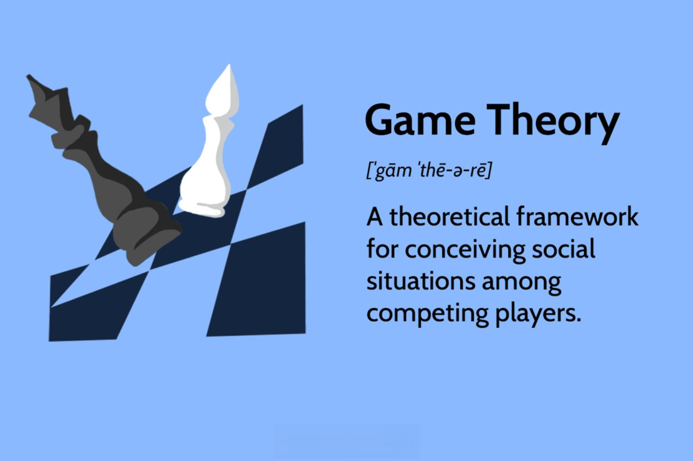

## Table of Contents

## What is game theory and why is it important?

Game theory is a way to study how people make choices when they are affected by what others do. It's like a set of rules and strategies used in games, but it applies to real-life situations too. Imagine playing a board game where your move depends on what your friend might do next. In real life, this could be businesses deciding prices or countries negotiating treaties. Game theory helps us understand these situations better by predicting what people might do based on their goals and the choices available to them.

Game theory is important because it helps us make better decisions in many areas of life. For example, it's used in economics to understand how companies compete, in politics to see how voters and politicians behave, and even in biology to study how animals interact. By using game theory, we can figure out the best strategies to use in different situations, which can lead to better outcomes for everyone involved. It's a powerful tool that helps us navigate the complex world of human interactions.

## Can you explain the basic components of a game in game theory?

In game theory, a game is made up of a few basic parts. First, there are the players. These are the people or groups who are making choices. Each player has different goals or things they want to achieve. Second, there are the strategies. These are the different choices or actions that players can take. Each player thinks about what the other players might do and picks their strategy based on that.

The next part of a game is the payoff. This is what each player gets at the end, based on the choices everyone made. Payoffs can be things like money, points, or any other reward or penalty. The last part is the rules of the game. These rules say what players can and can't do, and how they take turns or make choices. Together, these parts help us understand how people make decisions and what might happen as a result.

## What is the difference between cooperative and non-cooperative game theory?

Cooperative game theory is about how groups of players can work together to get the best outcome for everyone in the group. It focuses on how players can form coalitions or teams to share the rewards they get from playing the game. In cooperative games, players often talk to each other and make deals to help each other out. The main idea is to find ways to split up the rewards fairly so that everyone in the group is happy with what they get.

Non-cooperative game theory, on the other hand, is about what happens when players make their choices on their own, without working together. In these games, players think about what the other players might do and then pick their own strategy to get the best result for themselves. They don't make deals or form teams. Instead, they focus on their own goals and try to predict what others will do. This type of game theory is often used to study things like competition between businesses or how people behave in situations where they can't trust each other.

## How do zero-sum games differ from non-zero-sum games?

Zero-sum games are games where one player's gain is another player's loss. Imagine you and your friend are playing a game with a fixed amount of money. If you win some money, your friend loses the same amount. The total amount of money stays the same, so it's called zero-sum because the sum of all the gains and losses is zero. These games are all about competition, where one player's success means the other player's failure.

Non-zero-sum games are different because the total amount of rewards can change. In these games, players can work together to make the pie bigger, so everyone can get more. For example, if two companies work together on a project, they might both make more money than if they competed against each other. Non-zero-sum games show us that cooperation can lead to better outcomes for everyone involved, not just one player winning at the expense of others.

## What are Nash equilibria and how are they used in game theory?

Nash equilibria are a key idea in game theory that helps us understand what might happen when people make choices. It's named after John Nash, who came up with the idea. A Nash equilibrium happens when no player can do better by changing their strategy if everyone else keeps their strategy the same. Imagine you and your friend are playing a game. If you both pick a strategy where neither of you can do better by switching to a different move, you've reached a Nash equilibrium. It's like finding a balance where everyone is doing the best they can, given what others are doing.

In game theory, Nash equilibria are used to predict how people might act in different situations. They help us understand how players might settle into a stable situation where no one wants to change their strategy. For example, in business, companies might reach a Nash equilibrium in how they set prices or compete. It's not always the best outcome for everyone, but it's a point where no one can improve their situation by acting alone. By finding Nash equilibria, we can better understand and predict the outcomes of games and real-life situations where people's choices affect each other.

## Can you describe the prisoner's dilemma and its significance in game theory?

The prisoner's dilemma is a famous game in game theory where two people, let's call them prisoners, have to make a choice without talking to each other. They are both caught for a crime, but the police don't have enough evidence to convict them of the big crime. The police offer each prisoner a deal: if one prisoner betrays the other and the other stays silent, the betrayer goes free and the silent one gets a long sentence. If both stay silent, they get a short sentence. But if both betray each other, they both get a medium sentence. The tricky part is that betraying the other prisoner seems like the best choice for each person, but if they both do it, they end up worse off than if they had both stayed silent.

The prisoner's dilemma is important in game theory because it shows how people might not work together even when it would be better for everyone. It helps explain why people sometimes act in ways that hurt them in the long run, like countries starting arms races or companies cutting prices to hurt competitors. It also shows the value of trust and communication, because if the prisoners could talk and trust each other, they could both stay silent and get the best outcome. The prisoner's dilemma is used to study many real-life situations where people's choices affect each other, and it helps us understand how to make better decisions.

## What role does the concept of dominant strategies play in game theory?

In game theory, a dominant strategy is a choice that a player will always pick, no matter what the other players do. Imagine you're playing a game and you have two moves you can make. If one move is always better for you, no matter what your opponent does, that move is your dominant strategy. It's like having a secret weapon that works every time. Players like to find dominant strategies because it makes their choice easy and helps them do the best they can in the game.

Dominant strategies are important because they help us predict what people might do in real-life situations. For example, in business, if one company has a dominant strategy for setting prices, they'll always choose that strategy, and other companies can guess what they'll do. But not all games have dominant strategies. When there are no dominant strategies, players have to think harder about what others might do and pick their moves more carefully. This makes the game more complicated and interesting, showing how people's choices can depend on each other in many different ways.

## How can game theory be applied to real-world scenarios like business or politics?

Game theory can help businesses make better decisions by understanding how they compete with each other. Imagine two companies selling similar products. They need to decide on prices, and game theory can show them what might happen if they raise or lower their prices. If one company lowers its price, the other might do the same to stay competitive, leading to a price war. But if they both keep prices high, they might make more money. Game theory helps them see these possible outcomes and pick the best strategy. It also helps with things like deciding whether to cooperate on projects or enter new markets, showing how working together can sometimes lead to better results for everyone.

In politics, game theory is used to understand how countries or politicians make choices that affect each other. For example, when countries negotiate treaties, they have to think about what the other countries might do. If one country offers a good deal, the other might accept it, but if it's a bad deal, they might refuse. Game theory helps them predict these reactions and find the best way to reach an agreement. It's also used in elections, where candidates have to decide on their campaign strategies. If one candidate attacks the other, the other might fight back, or they might focus on their own positive messages. Game theory shows how these choices can lead to different outcomes, helping politicians make smarter moves.

## What are some advanced game theory concepts like Bayesian games and repeated games?

Bayesian games are a type of game where players don't know everything about the game, but they have some guesses or beliefs about what they don't know. Imagine you're playing a game and you're not sure what your friend likes to do, but you have some ideas based on what you've seen before. In a Bayesian game, you use these guesses to make your choices. For example, if you're a business and you're not sure what your competitor will do, but you have some guesses based on their past actions, you use those guesses to decide on your strategy. Bayesian games help us understand how people make choices when they're unsure about things and have to use their best guesses.

Repeated games are games where the same players play the same game over and over again. Think about playing a board game with your friend every weekend. In a repeated game, what you do today can affect what happens in future games. For example, if you and your friend are businesses that compete every month, you might decide to lower your prices this month to get more customers, but that might make your friend lower their prices next month. Repeated games show us how people can learn from each other over time and change their strategies based on what's happened before. They help us understand how long-term relationships and repeated interactions can lead to different outcomes than one-time games.

## How does evolutionary game theory differ from classical game theory?

Evolutionary game theory is different from classical game theory because it looks at how strategies change over time, especially in large groups like animals or people. In classical game theory, players are smart and think about what others might do before making their choices. But in evolutionary game theory, players might not think so much. Instead, they follow simple rules or instincts. Over time, the strategies that work best become more common in the group, kind of like how the strongest animals survive and have more babies.

For example, imagine a group of birds where some birds share food and others keep it all for themselves. In classical game theory, birds might think about whether to share or not based on what other birds do. But in evolutionary game theory, birds just do what feels right to them. If sharing food helps birds live longer and have more babies, then more birds will start sharing over time. This shows how evolutionary game theory helps us understand how behaviors can change in a group over many generations, without players needing to think a lot about their choices.

## Can you explain the use of game theory in auction design and mechanism design?

Game theory is really helpful when designing auctions and figuring out how to make them work well. In an auction, people bid to buy something, and game theory helps us understand how people decide what to bid. It shows us that bidders think about what others might do and try to guess the best amount to bid without paying too much. Auction designers use game theory to set rules that make sure the auction is fair and gets the best price for the thing being sold. For example, they might decide if the highest bidder wins or if there should be a secret reserve price. By using game theory, they can make auctions where people are happy to take part and the seller gets a good deal.

Mechanism design is another area where game theory is super useful. It's about creating rules or systems that make people do what we want them to do, even if they're just looking out for themselves. Imagine you want to make sure a group of people share information honestly. Game theory helps design a system where telling the truth is the best choice for everyone. For example, in a voting system, you might use game theory to make sure people vote honestly by setting up rules that reward truthful voting. By using game theory, mechanism designers can create systems that work well and make sure everyone plays by the rules, leading to better outcomes for everyone involved.

## What are the current challenges and future directions in the field of game theory?

One of the main challenges in game theory today is dealing with the complexity of real-world situations. Real life is often more complicated than the simple games that game theory usually studies. For example, in business or politics, there are many players with different goals and lots of information that keeps changing. It's hard to make models that capture all this complexity and still give useful predictions. Another challenge is figuring out how to use game theory when people don't always act rationally. In real life, people can make choices based on emotions or habits, which can be hard to predict with traditional game theory models.

Looking to the future, one direction for game theory is to use more advanced computer simulations. These simulations can help study more complex games and see how different strategies play out over time. Another direction is to combine game theory with other fields like psychology and neuroscience to better understand how people make decisions. This could help create more realistic models that take into account how people really think and feel. As game theory keeps growing, it will become even more useful for solving real-world problems in areas like economics, politics, and even everyday life.

## What are the Basics of Game Theory?

Game theory is a pivotal theoretical framework in economics, providing a mathematical basis for analyzing situations in which multiple players make decisions that affect each other's outcomes. It helps to model and predict interactions among rational decision-makers, offering insights into competitive and cooperative environments.

### Definition and Key Concepts

At its core, game theory examines the strategic interaction between players, who are individuals or entities making decisions. Each player has a set of possible strategies, which are plans of action available in different situations. The outcome or result of a game is determined by the combination of strategies chosen by all players involved. These outcomes are quantified using payoffs, which reflect the benefit or utility each player receives from a particular outcome.

### Players, Strategies, and Payoffs

In any game-theoretic scenario, players interact by selecting their strategies. A strategy defines a complete plan of action for every possible situation in the game. The payoff represents the benefit a player receives from the outcomes of these interactions. For instance, consider a simple game where two firms compete in a market by setting prices. The firms are the players, their pricing options are the strategies, and their profits based on these pricing decisions are the payoffs.

### Types of Games

Games can be categorized based on the nature of interactions among players:

1. **Cooperative vs. Non-Cooperative Games:**
   - **Cooperative Games:** Players can form coalitions and collaborate to achieve better outcomes. The focus is on how groups of players can work together and distribute payoffs.
   - **Non-Cooperative Games:** Each player acts independently without forming alliances. The analysis focuses on predicting individual strategies and outcomes.

2. **Zero-Sum vs. Non-Zero-Sum Games:**
   - **Zero-Sum Games:** One player’s gain is precisely equivalent to another's loss, indicating a competitive environment. The total payoff across all players remains constant. Classic examples include chess and poker, where one player’s victory equates to the other's defeat.
   - **Non-Zero-Sum Games:** Players can achieve mutual gains or losses, emphasizing that total payoffs can vary. This setup encourages the analysis of strategic alliances and mutual benefit, reflecting real-world negotiations and trade.

### Nash Equilibrium

Nash Equilibrium is a fundamental concept in game theory, named after mathematician John Nash. It occurs when each player chooses the optimal strategy, given the strategies chosen by other players. In this state, no player has an incentive to deviate unilaterally from their strategy, as it would not yield a better payoff. Formally, for a game with $n$ players, where $\sigma_i$ is the strategy selected by player $i$, a Nash Equilibrium is a strategy profile $(\sigma_1^*, \sigma_2^*, ..., \sigma_n^*)$ such that:

$$

u_i(\sigma_i^*, \sigma_{-i}^*) \geq u_i(\sigma_i, \sigma_{-i}^*) \quad \text{for all} \, \sigma_i \, \text{and all players} \, i 
$$

where $u_i$ is the payoff function for player $i$, and $\sigma_{-i}$ denotes the strategies of all players except player $i$. Nash Equilibrium is crucial as it helps predict the stable outcomes of strategic interactions.

### Real-World Examples

Several real-world scenarios can be explained using game theory:

- **Prisoner's Dilemma:** A classic example where two individuals, acting in their own self-interest without cooperation, can result in a worse outcome for both compared to if they had cooperated.

- **Cournot Competition:** Firms in an oligopoly choose output quantities rather than prices. Each firm's profit depends on its output decision and the decision of other firms, reflecting interaction through Nash Equilibrium concepts.

- **Public Goods and Common Resources:** Game theory elucidates how individuals can decide between contributing to a common resource or enjoying it without participating in its maintenance, often leading to concepts like the "tragedy of the commons."

By understanding these basic concepts of game theory and its applications, individuals can better anticipate and strategize within economic and competitive environments, forming the groundwork for exploring its use in areas like [algorithmic trading](/wiki/algorithmic-trading).

## References & Further Reading

[1]: Fudenberg, D., & Tirole, J. (1991). ["Game Theory."](https://archive.org/details/gametheory0000fude) MIT Press.

[2]: Lopez de Prado, M. (2018). ["Advances in Financial Machine Learning."](https://books.google.com/books/about/Advances_in_Financial_Machine_Learning.html?id=oU9KDwAAQBAJ) Wiley.

[3]: Jansen, S. (2018). ["Machine Learning for Algorithmic Trading."](https://github.com/stefan-jansen/machine-learning-for-trading) Packt Publishing.

[4]: Myerson, R. B. (1991). ["Game Theory: Analysis of Conflict."](https://www.jstor.org/stable/j.ctvjsf522) Harvard University Press.

[5]: Von Neumann, J., & Morgenstern, O. (1944). ["Theory of Games and Economic Behavior."](https://psycnet.apa.org/record/1945-00500-000) Princeton University Press.

[6]: Chan, E. P. (2009). ["Quantitative Trading: How to Build Your Own Algorithmic Trading Business."](https://github.com/ftvision/quant_trading_echan_book) Wiley.