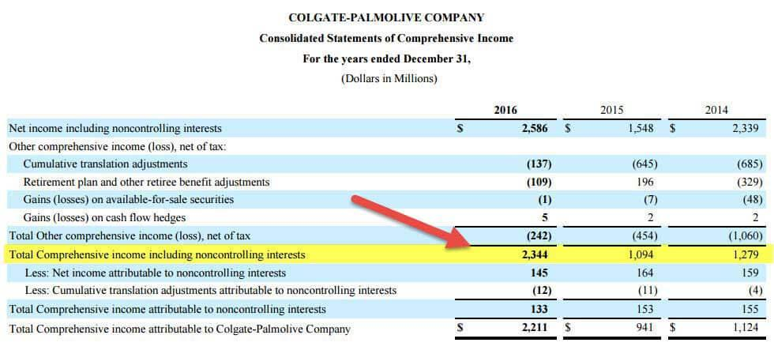

In the world of financial reporting and algorithmic trading, comprehensive income holds significant importance. Comprehensive income encompasses the total change in a company's equity due to transactions and events from non-owner sources, offering a full picture of the company's financial performance over a given period. This differs from net income, which only accounts for revenues and expenses directly related to normal operations. By including elements such as unrealized gains or losses on investments, foreign currency translation adjustments, and changes in pension liabilities, comprehensive income provides a broader view of financial health.

This article will explore the concept of comprehensive income and its components, including other comprehensive income, which contains crucial elements excluded from net income, such as unrealized gains and losses. These components are increasingly significant in understanding a company's future financial risks and opportunities. 



Algorithmic trading systems capitalize on this financial information, using data like comprehensive income and other comprehensive income to evaluate company performance and identify potential market movements. This allows traders to make well-informed investment decisions based on a holistic view of a company's financial standing.

Comprehensive income serves as an invaluable tool for shareholders, analysts, and investors by enhancing the transparency and depth of financial reporting. Decoding these concepts helps investors gain a clearer view of a company's financial health, enabling more accurate assessments and strategic financial decisions.

## Table of Contents

## Understanding Comprehensive Income

Comprehensive income provides a thorough representation of a company's financial performance over a particular period. It goes beyond the conventional net income reported in financial statements to encompass all changes in equity originating from non-owner sources. This means it takes into consideration elements like unrealized gains and losses, which are vital in presenting the full scope of a company’s financial standing.

The concept of comprehensive income is straightforward. It can be formally defined as the sum total of net income and other comprehensive income (OCI). Mathematically, it can be expressed as:

$$
\text{Comprehensive Income} = \text{Net Income} + \text{Other Comprehensive Income}
$$

Net income, often seen on the income statement, includes revenues, expenses, gains, and losses recognized under the standard accounting frameworks, such as the Generally Accepted Accounting Principles (GAAP) or International Financial Reporting Standards (IFRS). However, it does not provide the full picture, as it excludes certain types of gains and losses that impact shareholders' equity but do not meet the criteria for realization or recognition under these accounting standards.

Other comprehensive income addresses this gap by including items that affect equity but are not part of net income calculations. This includes adjustments for foreign currency translation, changes in the valuation of financial instruments designated as available-for-sale, adjustments for fair value changes related to hedging instruments, and changes in remeasurement of defined benefit plans.

Together, comprehensive income captures the total economic impact of all events that lead to increases or decreases in company value. By systematically including these additional components, comprehensive income provides investors and analysts with critical insights into potential [volatility](/wiki/volatility-trading-strategies), future financial performance, and macroeconomic impacts on a company's overall financial health.

## Decoding Other Comprehensive Income

Other Comprehensive Income (OCI) refers to specific revenue, expenses, gains, and losses that are excluded from net income calculations under Generally Accepted Accounting Principles (GAAP). These items are presented after net income in a company's financial statements and provide insight into potential risks and future gains that may not be immediately apparent from net income figures alone.

OCI primarily consists of the following key components:

1. **Unrealized Gains and Losses on Investment Securities**: These are gains or losses on securities classified as "available-for-sale" or "held-to-maturity" that have not yet been realized through a transaction. Unrealized gains or losses are recognized in OCI until they are realized, at which point they are reclassified into net income.

2. **Foreign Currency Translation Adjustments**: Companies with foreign subsidiaries often experience gains or losses due to fluctuations in exchange rates. These are recorded in OCI to reflect the currency translation adjustments arising from consolidating foreign operations into the parent company's financial statements. This component is crucial for multi-national corporations as it captures the impact of foreign exchange variations on consolidated financial results.

3. **Pension Plan Adjustments**: Changes in the funded status of a company's defined benefit pension plans, which occur due to actuarial gains or losses, prior service costs, or credits from plan amendments, are included in OCI. This allows companies to reflect pension plan liabilities' long-term nature and volatility without directly affecting net income in a given period.

Understanding OCI is vital for a comprehensive assessment of a company's financial health as it can signal underlying economic realities and latent financial positions that are not evident through net income alone. By monitoring these components, investors and analysts can gain insights into potential risks, long-term financial exposures, and the overall sustainability of a company's financial performance. 

For instance, persistent foreign currency translation losses might indicate exposure to adverse currency movements affecting profitability in the future. Similarly, significant unrealized losses on investment securities could suggest potential impairments or unfavorable market trends. By evaluating OCI, stakeholders can better understand the volatility and positioning of a company's financial status, aiding in informed decision-making and risk assessment.

## Financial Reporting Standards and Compliance

The Financial Accounting Standards Board (FASB) requires companies to report comprehensive income as part of their financial statements. This requirement aims to provide investors and stakeholders with a broader understanding of a company's financial condition by including all changes in equity from non-owner sources. Comprehensive income encompasses both net income and other comprehensive income (OCI), capturing revenues, expenses, gains, and losses that are traditionally excluded from net income under generally accepted accounting principles (GAAP).

Companies have the flexibility to present comprehensive income in one of two ways: either in a single continuous statement that includes both net income and comprehensive income or in two separate consecutive statements, one detailing net income followed by a statement of comprehensive income. This flexibility is intended to accommodate varying preferences and reporting capabilities among companies while ensuring that the comprehensive picture of financial performance is available to users of the financial statements.

Adhering to these reporting standards increases transparency, allowing for a uniform comparison across different companies within the same industry or market. When comprehensive income is consistently reported, it reduces information asymmetry in the marketplace, thus aiding investors in making more informed decisions. By mandating the disclosure of comprehensive income, the FASB aims to provide a consistent framework that reflects the economic reality of companies' financial performance, fostering confidence and integrity in financial reporting.

## Impact of Comprehensive Income on Algorithmic Trading

Algorithmic trading, an advanced trading technique utilizing computer algorithms to execute trades at high speed and [volume](/wiki/volume-trading-strategy), leverages comprehensive income data to enrich its decision-making processes. Comprehensive income, comprised of net income and other comprehensive income (OCI), provides a more nuanced picture of a company's financial status beyond mere earnings reports. For traders employing algorithmic strategies, this data becomes integral to evaluating company performance more accurately.

OCI is valuable in predicting market movements as it includes unrealized gains and losses on investments, foreign currency exchange fluctuations, and adjustments in pension plans. By analyzing OCI, algorithmic traders can anticipate potential risks and returns that aren't immediately evident in traditional net income figures. For instance, a sudden increase in unrealized gains might indicate potential upward price movements in securities, prompting algorithms to execute buy orders.

To leverage this data effectively, traders employ algorithms that parse financial reports, extracting comprehensive income statements and quantifying OCI impacts. The objective is to identify patterns or anomalies that might suggest profitable trading opportunities. This requires sophisticated programming and statistical models. Consider the following Python example that demonstrates how traders might use financial data to make decisions:

```python
import numpy as np

def evaluate_comprehensive_income(comprehensive_income, net_income):
    oci = comprehensive_income - net_income
    oci_ratio = oci / comprehensive_income
    return oci_ratio

# Hypothetical data
comprehensive_income = np.array([100000, 150000, 120000])
net_income = np.array([80000, 110000, 100000])

oci_ratios = evaluate_comprehensive_income(comprehensive_income, net_income)

trading_signals = ["buy" if ratio > 0.2 else "hold" for ratio in oci_ratios]
print(trading_signals)
```

In this example, the algorithm calculates the ratio between OCI and comprehensive income, subsequently generating trading signals based on predefined thresholds.

In addition to generating immediate trading signals, understanding comprehensive income allows traders to enhance portfolio risk management strategies. By comprehending the components of OCI, algorithmic models can better align investment strategies with anticipated market dynamics, minimizing exposure to adverse risk factors.

Ultimately, comprehensive income, particularly OCI, offers algorithmic traders a sophisticated toolset for crafting more informed investment strategies. The ability to dissect comprehensive income data empowers traders to uncover insights that drive better decision-making in an often volatile financial marketplace.

## Challenges and Considerations in Reporting

Comprehensive income reporting can significantly amplify the complexity and volatility of a company's financial statements. This complexity often arises from the nature of Other Comprehensive Income (OCI) items, which include unrealized gains and losses on financial instruments, foreign currency translation adjustments, and changes in pension plan assets and liabilities. Each of these components can derive from intricate and multifaceted financial arrangements that may not readily translate into straightforward figures.

Interpreting OCI items is challenging largely due to the complex financial instruments involved. For example, derivative instruments, which are often measured at fair value, can produce significant fluctuations in OCI due to changes in market conditions. The valuation of these instruments frequently depends on sophisticated modeling techniques and assumptions, including interest rates, volatility, and other market factors. These assumptions can change rapidly, making OCI figures highly volatile. Analysts and investors need to have a robust understanding of these instruments and the accounting principles that dictate their reporting to make sense of these OCI figures.

Given the subtleties involved in comprehensive income reporting, stakeholders, including investors, analysts, and even company management, must be thoroughly informed to fully grasp the potential implications. This requires a deep understanding of both the accounting standards that govern comprehensive income reporting and the economic realities underlying these financial instruments. 

For example, stakeholders should be aware of the Financial Accounting Standards Board (FASB) guidelines which stipulate how components of comprehensive income should be calculated and presented. A failure to comprehend these underlyings can result in misinterpreting a company’s financial health and decision-making capabilities.

Moreover, the volatility introduced by OCI can affect the assessment of a company's financial performance and position. Since OCI can fluctuate due to market conditions, stakeholders need to differentiate between short-term volatility and long-term financial viability. By doing so, they can better assess the enduring financial health and strategic prospects of a company.

Overall, while comprehensive income provides a fuller picture of a company's financial status, the intricacies associated with reporting OCI necessitate a level of financial sophistication and awareness from all involved parties. This understanding is critical for making informed and strategic financial decisions.

## Conclusion

Comprehensive income is essential for gaining a complete understanding of a company's financial health. It encompasses not just the traditional net income but also other comprehensive income (OCI), which includes items like unrealized gains and losses. This broader scope allows analysts and investors to assess both current earnings and potential impacts from future financial fluctuations, offering a more nuanced picture of overall performance.

In the context of financial reporting, comprehensive income ensures transparency and provides stakeholders with a uniform basis for evaluating company disclosures. This standardized reporting is crucial for comparing companies across industries and regions, thereby facilitating informed decision-making. The inclusion of comprehensive income in financial statements, as mandated by bodies such as the Financial Accounting Standards Board (FASB), aids in highlighting these otherwise obscured fiscal aspects.

Algorithmic trading systems benefit significantly from data on comprehensive income. With the ability to quickly analyze OCI data and related financial metrics, these systems can predict market trends and identify trading opportunities. A deep understanding of comprehensive income is thus instrumental for traders looking to optimize their strategies and maximize returns.

Despite the complexities involved in interpreting comprehensive income, particularly due to volatile OCI items, grasping its intricacies is vital. Investors and analysts equipped with this knowledge can better navigate the financial landscape, making decisions that are not only informed by present earnings but also by a spectrum of associated opportunities and risks. This informed approach is pivotal in making sound investment choices and maintaining a competitive edge in the market.

## References & Further Reading

[1]: ["Understanding Comprehensive Income"](https://www.investopedia.com/terms/c/comprehensiveincome.asp) - IFRS Standards: IAS 1 Presentation of Financial Statements

[2]: ["Statement of Comprehensive Income"](https://www.investopedia.com/terms/c/comprehensiveincome.asp) - Financial Accounting Standards Board (FASB) ASC 220-10

[3]: Penman, S. H. (2013). ["Financial Statement Analysis and Security Valuation"](https://vdoc.pub/documents/financial-statement-analysis-and-security-valuation-71q5td507pf0) (5th ed.). McGraw-Hill Education

[4]: ["Comprehensive Income and its Components"](https://www.investopedia.com/terms/c/comprehensiveincome.asp) - Journal of Accountancy

[5]: Fabozzi, F. J., Focardi, S. M., & Kolm, P. N. (2006). ["Financial Modeling of the Equity Market: From CAPM to Cointegration"](https://onlinelibrary.wiley.com/doi/book/10.1002/9781119201236) - Wiley Finance

[6]: ["Advanced Algorithmic Trading"](https://www.quantstart.com/advanced-algorithmic-trading-ebook/) by Howard B. Bandy

[7]: ["International Financial Reporting Standards (IFRS)"](https://www.investopedia.com/terms/i/ifrs.asp)- IFRS Foundation