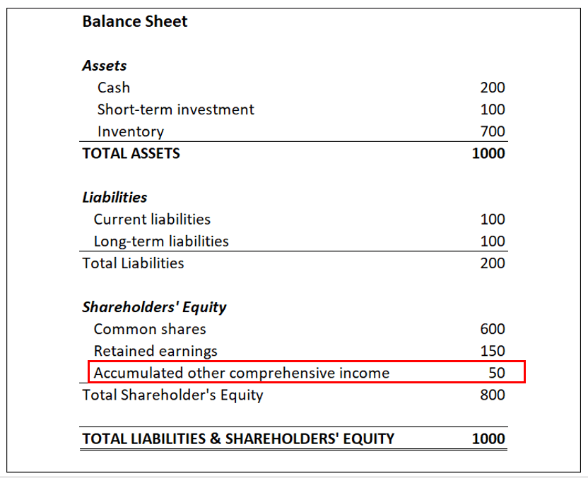

## Table of Contents

## What is comprehensive income?

Comprehensive income is a way to measure how well a company is doing financially by looking at all the changes in its net worth during a certain period. It includes not just the regular profits and losses you see on an income statement, but also other types of gains and losses that don't show up there. These other changes might come from things like foreign currency translations, unrealized gains or losses on certain investments, and adjustments for pension plans.

Think of it this way: while the income statement focuses on the day-to-day operations and sales, comprehensive income gives you a fuller picture. It helps investors and business owners understand all the different factors that can affect a company's financial health, not just the ones that directly impact the bottom line. By including these additional elements, comprehensive income provides a more complete view of a company's performance over time.

## How does comprehensive income differ from net income?

Comprehensive income and net income are both ways to measure a company's financial performance, but they look at different things. Net income is what you see on a company's income statement. It's the profit left after you subtract all the costs and expenses from the money the company made from selling its products or services. It's like the score at the end of a game, showing how much the company earned or lost from its regular business activities.

Comprehensive income, on the other hand, goes beyond the income statement. It includes net income but also adds other types of gains and losses that don't show up in the regular profit calculation. These can be things like changes in the value of foreign investments due to currency changes, or unrealized gains or losses on certain types of investments. So, comprehensive income gives you a fuller picture of all the factors that can affect a company's financial health, not just the ones from day-to-day business.

In simple terms, if net income is like looking at the money in your wallet after a day of work, comprehensive income is like checking your entire financial situation, including your savings account, investments, and any other changes that might affect your wealth.

## What are the components of other comprehensive income?

Other comprehensive income includes items that affect a company's financial health but don't show up on the regular income statement. These items are important because they give a fuller picture of the company's performance. Some common parts of other comprehensive income are unrealized gains and losses on certain investments, like available-for-sale securities. This means if a company owns stocks or bonds that have gone up or down in value but hasn't sold them yet, those changes in value are part of other comprehensive income.

Another part of other comprehensive income is foreign currency translation adjustments. If a company does business in different countries, changes in exchange rates can affect the value of its foreign investments. These changes are included in other comprehensive income to show how currency fluctuations impact the company's finances. Additionally, there are pension plan adjustments, where changes in the value of the company's pension obligations or assets are also included in other comprehensive income. This helps show how well the company is managing its long-term employee benefits.

Lastly, other comprehensive income can include any other gains or losses that are not realized yet or are specifically defined by accounting rules as part of this category. For example, certain types of hedging activities can fall into this category. By including all these different elements, other comprehensive income helps investors and business owners understand the full range of factors that can affect a company's financial position, beyond just the regular profits and losses.

## Why is it important to report other comprehensive income?

Reporting other comprehensive income is important because it gives a complete picture of a company's financial health. When you only look at the regular income statement, you see the profit or loss from day-to-day business activities. But there are other things that can affect a company's money, like changes in the value of investments or foreign currency rates. These things might not show up on the regular income statement, but they still matter. By including other comprehensive income, everyone can see how all these different factors impact the company's finances.

This helps investors and business owners make better decisions. If they only look at the regular income statement, they might miss important information. For example, if a company's investments have gone up in value but they haven't sold them yet, that's good news that should be considered. Or if changes in foreign currency rates are affecting the company's money, that's something investors need to know. By reporting other comprehensive income, companies give a fuller and more honest view of their financial situation, helping everyone understand the complete picture.

## Can you give examples of items included in other comprehensive income?

Other comprehensive income includes unrealized gains and losses on certain investments. Imagine a company owns stocks or bonds, and their value goes up or down, but the company hasn't sold them yet. Those changes in value are part of other comprehensive income. This helps show how well the company's investments are doing, even if they haven't turned them into cash yet.

Another part of other comprehensive income is foreign currency translation adjustments. If a company does business in different countries, the value of its foreign investments can change because of currency rates. For example, if the U.S. dollar gets stronger compared to another country's money, the value of the company's investments in that country might go down. Including these changes in other comprehensive income helps everyone see how currency rates affect the company's money.

Lastly, other comprehensive income can include pension plan adjustments. If a company has a pension plan for its employees, the value of the plan's assets or the company's obligations can change. These changes are also part of other comprehensive income. By including them, the company shows how well it's managing its long-term employee benefits, which is important for understanding its overall financial health.

## How is comprehensive income presented in financial statements?

Comprehensive income is shown in a company's financial statements to give a full picture of its financial health. It's usually presented in a separate statement called the "Statement of Comprehensive Income." This statement starts with the company's net income, which is the profit or loss from its regular business activities. Then, it adds or subtracts other comprehensive income items, like unrealized gains or losses on investments, foreign currency translation adjustments, and pension plan changes. By doing this, the statement shows how all these different things affect the company's money, not just the regular profits and losses.

Sometimes, instead of a separate statement, comprehensive income can be included in the Statement of Changes in Equity. This statement shows how the company's net worth changes over time. It starts with the beginning balance of equity, then adds the net income for the period, and finally includes other comprehensive income. This way, it shows how all the different factors, including those not in the regular income statement, change the company's overall financial position. Both methods help investors and business owners see the complete picture of the company's financial performance.

## What are the accounting standards that govern the reporting of comprehensive income?

The main accounting standards that govern the reporting of comprehensive income are the Generally Accepted Accounting Principles (GAAP) in the United States and the International Financial Reporting Standards (IFRS) used in many other countries. GAAP requires companies to report comprehensive income in a separate statement or as part of the statement of changes in equity. This helps make sure that all the different things that affect a company's money are shown clearly, not just the regular profits and losses. IFRS also requires companies to report comprehensive income, usually in a single statement that includes both the income statement and the other comprehensive income items. This way, everyone can see the full picture of the company's financial health.

Both GAAP and IFRS aim to make financial reporting clear and useful for investors and business owners. They want to make sure that all the important information about a company's money is shown, including unrealized gains or losses on investments, foreign currency translation adjustments, and pension plan changes. By following these standards, companies help everyone understand how all these different factors can affect their financial situation, beyond just the day-to-day business activities.

## How does the treatment of other comprehensive income vary under different accounting frameworks?

Under the Generally Accepted Accounting Principles (GAAP) used in the United States, companies can choose to show other comprehensive income in one of two ways. They can put it in a separate statement called the "Statement of Comprehensive Income," which starts with the net income and then adds or subtracts the other comprehensive income items. Or, they can include it in the "Statement of Changes in Equity," which shows how the company's net worth changes over time, including the net income and other comprehensive income. GAAP wants to make sure that all the things that affect a company's money are shown clearly, so everyone can see the full picture.

On the other hand, the International Financial Reporting Standards (IFRS), used in many countries outside the U.S., usually ask companies to show other comprehensive income in a single statement. This statement includes both the income statement and the other comprehensive income items all together. IFRS wants to make financial reporting clear and useful for everyone, so they think it's best to show all the important information about a company's money in one place. Both GAAP and IFRS want to help investors and business owners understand how all the different factors can affect a company's financial situation, but they do it in slightly different ways.

## What are the tax implications of items reported in other comprehensive income?

When items are reported in other comprehensive income, their tax implications can be a bit different from regular income. For example, unrealized gains or losses on investments, which are part of other comprehensive income, don't get taxed until the company actually sells those investments and turns those gains or losses into real money. This means that the tax impact of these items is delayed until they become realized.

Another thing to think about is foreign currency translation adjustments. These changes in the value of foreign investments due to currency rates don't usually get taxed right away either. They are only taxed when the company brings the money back home or sells the foreign assets. So, just like with unrealized gains or losses, the tax impact of these adjustments is put off until later.

Lastly, pension plan adjustments can also affect taxes, but it's a bit more complicated. Changes in the value of a company's pension obligations or assets can create deferred tax assets or liabilities. These are taxes that the company might have to pay or get back in the future, depending on how the pension plan changes over time. So, while these adjustments are part of other comprehensive income, their tax implications are based on what happens with the pension plan down the road.

## How does other comprehensive income affect a company's financial analysis and ratios?

When looking at a company's financial health, other comprehensive income plays a big role. It adds important details that aren't shown in the regular income statement. For example, if a company has unrealized gains or losses on investments, these changes can make the company look more or less profitable than it really is. This can affect financial ratios like return on equity (ROE), which measures how well a company is using its money to make profits. If other comprehensive income is high, it can make the ROE look better, even if the company hasn't actually made any money from selling those investments yet.

Other comprehensive income also changes how we see a company's financial stability. For instance, foreign currency translation adjustments can make a company's financial position look different if it does business in many countries. These adjustments can affect the company's total equity, which is used in ratios like the debt-to-equity ratio. This ratio shows how much a company is borrowing compared to its own money. If other comprehensive income includes big changes from foreign currency, it can make the company's debt-to-equity ratio look better or worse, depending on whether the adjustments are gains or losses. By including other comprehensive income in financial analysis, we get a fuller picture of the company's financial health, helping us make better decisions.

## What are the challenges and criticisms associated with reporting other comprehensive income?

One challenge with reporting other comprehensive income is that it can be hard to understand. Other comprehensive income includes things like unrealized gains or losses on investments, foreign currency changes, and pension adjustments. These are not as easy to grasp as regular profits and losses from selling products or services. People who look at a company's financial statements might not know how to use this information to make decisions. This can make it harder for investors and business owners to get a clear picture of the company's financial health.

Another criticism is that other comprehensive income can make a company's financial performance look different than it really is. For example, if a company has big unrealized gains on investments, it might look more profitable than it actually is because those gains haven't turned into real money yet. This can be confusing and might lead people to think the company is doing better than it really is. Some people argue that other comprehensive income should be shown in a way that makes it clear it's different from regular income, so everyone can understand its impact better.

## How can investors use information on comprehensive income to make better investment decisions?

Investors can use comprehensive income to get a fuller picture of a company's financial health. By looking at comprehensive income, they can see not just the regular profits and losses, but also other things like unrealized gains or losses on investments, changes in foreign currency values, and pension plan adjustments. This helps investors understand all the different factors that can affect a company's money, not just the day-to-day business activities. For example, if a company has big unrealized gains on its investments, it might look more profitable than it really is because those gains haven't turned into real money yet. Knowing this can help investors make more informed decisions about whether to buy, hold, or sell the company's stock.

Another way comprehensive income helps is by showing how stable a company's finances are. For instance, if a company does business in many countries, changes in foreign currency rates can affect its money. By looking at the foreign currency translation adjustments in other comprehensive income, investors can see how these changes impact the company's overall financial position. This can be important for understanding the company's debt and how much it's borrowing compared to its own money. By considering all these different parts of comprehensive income, investors can get a better sense of the company's true financial situation and make smarter investment choices.

## What is Comprehensive Income and How Can We Understand It?

Comprehensive income provides a thorough representation of a company's financial performance over a particular period. It goes beyond the conventional net income reported in financial statements to encompass all changes in equity originating from non-owner sources. This means it takes into consideration elements like unrealized gains and losses, which are vital in presenting the full scope of a company’s financial standing.

The concept of comprehensive income is straightforward. It can be formally defined as the sum total of net income and other comprehensive income (OCI). Mathematically, it can be expressed as:

$$
\text{Comprehensive Income} = \text{Net Income} + \text{Other Comprehensive Income}
$$

Net income, often seen on the income statement, includes revenues, expenses, gains, and losses recognized under the standard accounting frameworks, such as the Generally Accepted Accounting Principles (GAAP) or International Financial Reporting Standards (IFRS). However, it does not provide the full picture, as it excludes certain types of gains and losses that impact shareholders' equity but do not meet the criteria for realization or recognition under these accounting standards.

Other comprehensive income addresses this gap by including items that affect equity but are not part of net income calculations. This includes adjustments for foreign currency translation, changes in the valuation of financial instruments designated as available-for-sale, adjustments for fair value changes related to hedging instruments, and changes in remeasurement of defined benefit plans.

Together, comprehensive income captures the total economic impact of all events that lead to increases or decreases in company value. By systematically including these additional components, comprehensive income provides investors and analysts with critical insights into potential [volatility](/wiki/volatility-trading-strategies), future financial performance, and macroeconomic impacts on a company's overall financial health.

## References & Further Reading

[1]: ["Understanding Comprehensive Income"](https://www.investopedia.com/terms/c/comprehensiveincome.asp) - IFRS Standards: IAS 1 Presentation of Financial Statements

[2]: ["Statement of Comprehensive Income"](https://www.investopedia.com/terms/c/comprehensiveincome.asp) - Financial Accounting Standards Board (FASB) ASC 220-10

[3]: Penman, S. H. (2013). ["Financial Statement Analysis and Security Valuation"](https://vdoc.pub/documents/financial-statement-analysis-and-security-valuation-71q5td507pf0) (5th ed.). McGraw-Hill Education

[4]: ["Comprehensive Income and its Components"](https://www.investopedia.com/terms/c/comprehensiveincome.asp) - Journal of Accountancy

[5]: Fabozzi, F. J., Focardi, S. M., & Kolm, P. N. (2006). ["Financial Modeling of the Equity Market: From CAPM to Cointegration"](https://onlinelibrary.wiley.com/doi/book/10.1002/9781119201236) - Wiley Finance

[6]: ["Advanced Algorithmic Trading"](https://www.quantstart.com/advanced-algorithmic-trading-ebook/) by Howard B. Bandy

[7]: ["International Financial Reporting Standards (IFRS)"](https://www.investopedia.com/terms/i/ifrs.asp)- IFRS Foundation