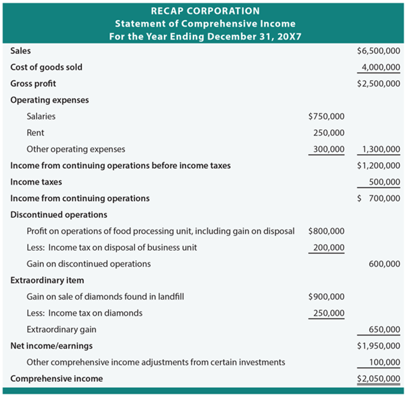

## Table of Contents

## What is a comprehensive income statement?

A comprehensive income statement is a financial report that shows a company's total income, including both the net income from the traditional income statement and other types of income that are not usually included in it. These other types of income are called "other comprehensive income" and can include things like unrealized gains or losses on certain investments, foreign currency translation adjustments, and pension plan gains or losses. By including these items, the comprehensive income statement gives a fuller picture of a company's financial performance over a period of time.

This statement is important because it helps investors and other stakeholders understand all the different ways a company can earn or lose money, not just the ones that are part of the regular business operations. For example, if a company has a lot of investments that go up in value but hasn't sold them yet, this won't show up on the traditional income statement but will be included in the comprehensive income statement. This can make a big difference in how people view the company's overall financial health and future prospects.

## How does a comprehensive income statement differ from a traditional income statement?

A comprehensive income statement and a traditional income statement both show how much money a company made or lost over a certain time. But they are different because the comprehensive income statement includes extra types of income that the traditional one doesn't. The traditional income statement only shows the money made from the company's main business activities, like selling products or services. This is called net income.

The comprehensive income statement adds other types of income that aren't part of the day-to-day business. These can be things like gains or losses from investments that haven't been sold yet, changes in the value of foreign money, or adjustments to pension plans. These are called "other comprehensive income." By including these, the comprehensive income statement gives a fuller picture of all the ways a company can make or lose money, which can be really helpful for people trying to understand the company's overall financial health.

## What are the main components of a comprehensive income statement?

A comprehensive income statement has two main parts: net income and other comprehensive income. Net income is the money a company makes from its main business activities, like selling products or services. It's what you see on a traditional income statement. This part shows how much the company earned after paying for things like salaries, rent, and other costs of running the business.

The other part, other comprehensive income, includes money the company makes or loses from things that aren't part of its everyday business. This can be things like gains or losses on investments that haven't been sold yet, changes in the value of foreign money, or adjustments to pension plans. These items don't show up on the traditional income statement but are important because they can affect the company's overall financial health.

By adding these two parts together, the comprehensive income statement gives a complete picture of all the ways a company can make or lose money. This helps investors and other people understand the company's total financial performance, not just what comes from its main business activities.

## Why is it important to include other comprehensive income in financial statements?

Including other comprehensive income in financial statements is important because it gives a fuller picture of a company's financial health. Other comprehensive income includes gains or losses that don't come from the company's main business activities, like changes in the value of investments or foreign money. If these weren't included, people looking at the financial statements might miss important information about how the company is doing.

For example, if a company has investments that go up in value but hasn't sold them yet, this won't show up on the traditional income statement. But it will be included in the comprehensive income statement. This can make a big difference in how people see the company's overall financial situation. By showing all types of income, the comprehensive income statement helps investors and others get a better understanding of the company's total performance and future prospects.

## How do you calculate comprehensive income?

To calculate comprehensive income, you start with the net income from the traditional income statement. Net income is the money a company makes from its main business activities, like selling products or services, after paying for things like salaries and rent. This is the first part of comprehensive income.

Next, you add or subtract other comprehensive income. This includes gains or losses that don't come from the company's everyday business, like changes in the value of investments that haven't been sold yet, changes in the value of foreign money, or adjustments to pension plans. You add these to the net income to get the total comprehensive income. This gives a complete picture of all the ways a company can make or lose money, helping people understand the company's overall financial health.

## What are examples of items reported in other comprehensive income?

Other comprehensive income includes gains or losses that don't come from a company's main business activities. For example, if a company has investments in stocks or bonds, and the value of those investments goes up or down, but the company hasn't sold them yet, these changes in value are reported in other comprehensive income. Another example is if a company does business in different countries and the value of the foreign money changes, these changes are also included in other comprehensive income.

Another type of item reported in other comprehensive income is adjustments to pension plans. If a company has a pension plan for its employees, and the value of the plan changes due to things like changes in interest rates, these changes are included in other comprehensive income. These items help give a full picture of a company's financial health by showing all the ways it can make or lose money, not just from its everyday business.

## How does comprehensive income affect a company's equity?

Comprehensive income affects a company's equity by changing the total amount of money the company has. When a company makes money, whether it's from its main business or from other things like investments, this money goes into the company's equity. If the comprehensive income is positive, it means the company made more money than it spent, and this extra money increases the equity. On the other hand, if the comprehensive income is negative, it means the company lost money, and this loss decreases the equity.

This change in equity happens because comprehensive income includes both the net income from the company's main business and other types of income or losses. For example, if a company's investments go up in value, this gain is part of the comprehensive income and adds to the company's equity. If the investments go down in value, this loss is part of the comprehensive income and reduces the company's equity. So, comprehensive income gives a complete picture of how all these different things affect the company's total worth.

## What are the accounting standards that govern the reporting of comprehensive income?

The main accounting standards that govern the reporting of comprehensive income are set by the International Accounting Standards Board (IASB) and the Financial Accounting Standards Board (FASB) in the United States. The IASB's standard is called International Financial Reporting Standard 1 (IFRS 1), and it requires companies to report comprehensive income in their financial statements. This standard makes sure that all the different ways a company can make or lose money are shown clearly, so people can see the full picture of the company's financial health.

In the United States, the FASB's standard is called Accounting Standards Codification (ASC) 220, which also requires companies to report comprehensive income. This standard is similar to the IASB's standard and helps make sure that financial statements are clear and complete. Both standards want to make sure that investors and other people who look at financial statements can understand all the different things that can affect a company's money, not just the money made from selling products or services.

## How can investors use comprehensive income to assess a company's financial health?

Investors can use comprehensive income to get a better idea of a company's overall financial health by looking at more than just the money the company makes from its main business. Comprehensive income includes other types of income or losses, like changes in the value of investments or foreign money, which can tell investors a lot about how the company is doing. For example, if a company's investments are going up in value, this can be a good sign that the company is doing well, even if it's not making a lot of money from selling products or services right now.

By looking at comprehensive income, investors can see the full picture of a company's financial situation. This helps them understand if the company is making or losing money in ways that aren't part of its everyday business. If a company has a lot of other comprehensive income, it might mean the company is taking smart risks with its money, which could lead to bigger profits in the future. On the other hand, if the company is losing money in these other areas, it might be a warning sign that the company's financial health isn't as strong as it seems.

## What are the challenges in reporting and interpreting comprehensive income?

One challenge in reporting and interpreting comprehensive income is that it can be hard to understand. Comprehensive income includes a lot of different things, like changes in the value of investments or foreign money. These things can be complicated and might not be easy for everyone to understand. People who look at the financial statements might not know what all these different numbers mean or how they affect the company's money. This can make it hard for them to see the full picture of the company's financial health.

Another challenge is that comprehensive income can change a lot from one time to another. The value of investments or foreign money can go up and down a lot, which can make the comprehensive income look very different from one year to the next. This can make it hard for people to figure out if the company is doing well or not. They might see a big change in comprehensive income and think the company is doing much better or worse than it really is. This can make it tricky to use comprehensive income to make decisions about investing in the company.

## How does comprehensive income impact tax reporting and planning?

Comprehensive income can affect how a company does its taxes. The net income part of comprehensive income, which comes from the company's main business, is usually what the company pays taxes on. But the other comprehensive income part, like changes in the value of investments or foreign money, might not be taxed right away. This is because some of these things, like unrealized gains on investments, aren't considered income until the company sells the investment. So, when a company is planning its taxes, it needs to think about how these different parts of comprehensive income will affect what it owes.

Understanding comprehensive income can also help a company with tax planning. If a company knows that some of its other comprehensive income might become taxable in the future, it can plan ahead. For example, if it knows it will have to pay taxes on gains from investments when it sells them, it can set aside money now to cover those future taxes. This can help the company manage its money better and avoid surprises when it comes time to pay taxes. By looking at comprehensive income, a company can get a better idea of its total financial situation and make smarter decisions about its taxes.

## What are the latest trends and debates surrounding the use of comprehensive income statements?

One of the latest trends in using comprehensive income statements is that more companies are starting to show them in their financial reports. This is because people who invest money or work with the company want to see a full picture of how the company is doing. They want to know about all the different ways the company can make or lose money, not just from selling things. So, companies are including comprehensive income to give a clearer view of their financial health.

There are also debates about how useful comprehensive income statements really are. Some people think they can be confusing because they include a lot of different numbers and things that might not be easy to understand. They worry that it might be hard for people to figure out what all these numbers mean and how they affect the company's money. On the other hand, others believe that comprehensive income statements are very important because they show the whole story of a company's financial situation. They think that even if it's a bit complicated, it's worth it to get a complete picture of how the company is doing.

## What is Understanding Financial Statements?

Financial statements are detailed reports that encapsulate a company's financial activities and present a clear snapshot of its financial standing at a given time. These documents are vital tools for assessing aspects such as profitability, debt levels, and revenue, and they serve multiple stakeholders, including investors, management, and regulators.

The primary financial statements include:

1. **Balance Sheet**: This presents a company's assets, liabilities, and shareholders' equity at a specific moment. It's structured around the accounting equation: 
$$
   \text{Assets} = \text{Liabilities} + \text{Shareholders' Equity}

$$
   This equation underscores how assets are financed either by borrowing money (liabilities) or by the company's owners (equity).

2. **Income Statement**: Also known as the profit and loss statement, it details revenues and expenses over a specific time period, culminating in net income. The structure typically follows:
$$
   \text{Net Income} = \text{Total Revenues} - \text{Total Expenses}

$$
   This statement provides insight into the operational efficiency and profitability of the company over the reporting period.

3. **Cash Flow Statement**: This document tracks the cash inflows and outflows, segregating them into operations, investing, and financing activities. It shows how a company generates and utilizes cash, crucial for understanding liquidity and long-term solvency.

4. **Statement of Comprehensive Income**: Beyond the net income presented in the income statement, this statement includes items that do not pass through the net income but affect shareholders' equity. These can include unrealized gains and losses on investments, foreign currency translation adjustments, or changes in pension obligations. By integrating these elements, it provides a more encompassing view of a company's financial performance.

Understanding these financial statements is imperative for making informed business and investment decisions. For instance, while the income statement and cash flow statement highlight current profitability and [liquidity](/wiki/liquidity-risk-premium), the statement of comprehensive income presents a holistic picture by capturing broader financial changes impacting equity. Recognizing the nuances of each statement enables stakeholders to gauge a company's financial trajectory accurately and align their strategies and expectations accordingly.

## What is the difference between Comprehensive Income and Net Income?

Comprehensive income represents a broader evaluation of a company's financial performance than net income, as it encompasses all changes in equity that are not transactions with owners. This includes net income and other comprehensive income (OCI) components, which capture unrealized gains and losses that do not immediately impact the net profit figure reported on the income statement. 

Other comprehensive income elements often consist of foreign currency translation adjustments, unrealized gains or losses from derivative instruments—which are measured at fair value—and adjustments for minimum pension liability, among others. These items reflect economic events that can influence a company's equity but are not included in the traditional net income as they are not realized. 

Net income, calculated as total revenues minus total expenses, is often highlighted in financial reports because it indicates the actual profitability of a company over a specified period. It provides a short-term view of performance by showing the results of the company’s operational efficiency, cost management, and revenue generation capability. The formula for net income can be expressed as:

$$
\text{Net Income} = \text{Total Revenue} - \text{Total Expenses}
$$

Focusing solely on net income might miss important aspects of a company's financial situation. For instance, a company might report a strong net income while experiencing significant unrealized losses in foreign investments or detrimental market conditions affecting the fair value of certain assets, which are captured only in the comprehensive income. Comprehensive income thus offers a more rounded financial narrative, integrating both realized income and potential adjustments stemming from various external factors.

The detailed distinctions between net income and comprehensive income become particularly useful when evaluating a company for long-term investments. A full grasp of these metrics can lead to more informed decisions by capturing potential risks and opportunities that affect the overall financial stability of a company. Investors can gain deeper insights by analyzing comprehensive income, as it signals potential future economic impacts from components not recognized in the immediate past performance depicted by net income.

## References & Further Reading

[1]: ["Financial Statements: A Step-by-Step Guide to Understanding and Creating Financial Reports"](https://books.google.com/books/about/Financial_Statements.html?id=V9tEDwAAQBAJ) by Thomas Ittelson

[2]: ["International Financial Statement Analysis"](https://www.amazon.com/International-Financial-Statement-Institute-Investment/dp/1119628059) by Thomas R. Robinson, Elaine Henry, Wendy L. Pirie, and Michael A. Broihahn

[3]: ["Advances in Financial Machine Learning"](https://www.amazon.com/Advances-Financial-Machine-Learning-Marcos/dp/1119482089) by Marcos Lopez de Prado

[4]: ["Understanding Financial Statements"](https://online.hbs.edu/blog/post/how-to-read-financial-statements) by Lyn M. Fraser and Aileen Ormiston

[5]: ["Machine Learning for Algorithmic Trading: Predictive Models to Extract Signals from Market and Alternative Data for Systematic Trading Strategies with Python"](https://github.com/stefan-jansen/machine-learning-for-trading) by Stefan Jansen

[6]: ["Quantitative Trading: How to Build Your Own Algorithmic Trading Business"](https://www.amazon.com/Quantitative-Trading-Build-Algorithmic-Business/dp/1119800064) by Ernest P. Chan